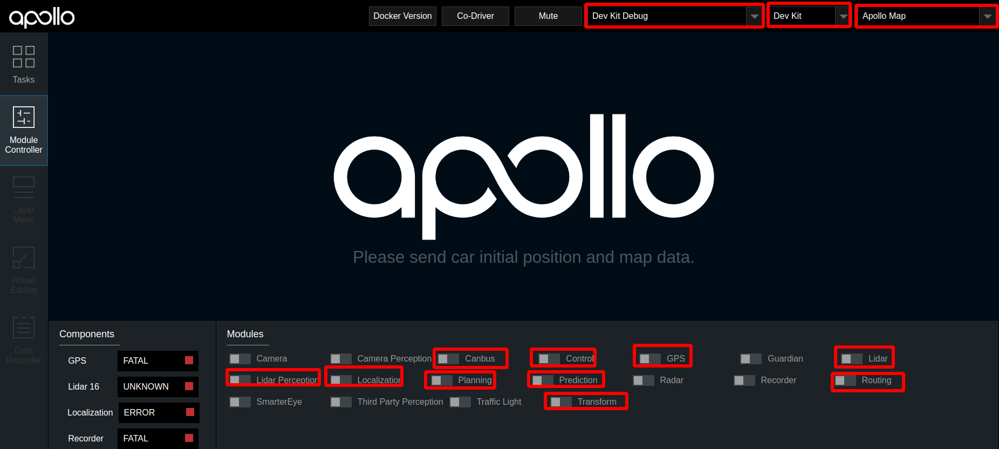
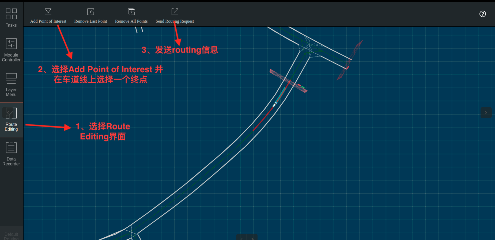
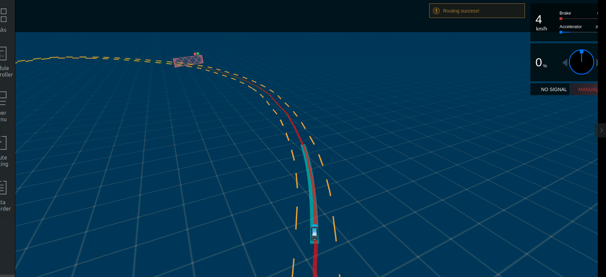
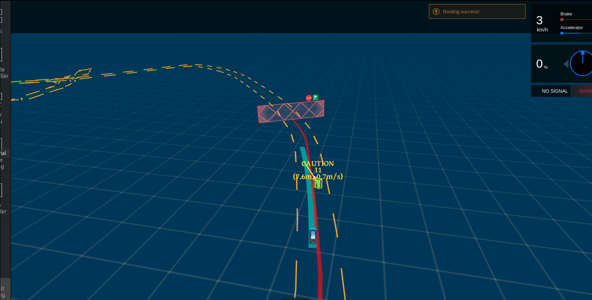
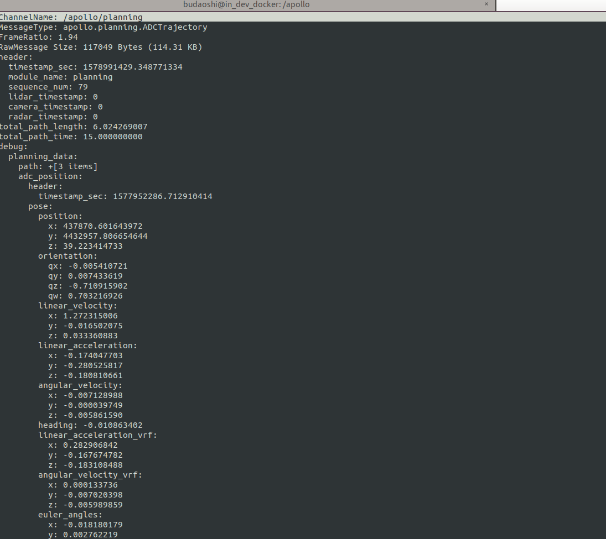

# 封闭园区自动驾驶搭建--规划适配

- [封闭园区自动驾驶搭建--规划适配](#封闭园区自动驾驶搭建--规划适配)
  - [概览](#概览)
  - [前提条件](#前提条件)
  - [配置文件的修改](#配置文件的修改)
  - [启动流程](#启动流程)
      - [1. 拍下车辆尾部的急停开关](#1-拍下车辆尾部的急停开关)
      - [2. 启动感知](#2-启动感知)
      - [3. 启动 Planning、Prediction、Routing、Control模块](#3-启动-planningpredictionroutingcontrol模块)
      - [4. 验证Planning、Prediction、Routing、Control模块是否启动成功](#4-验证planningpredictionroutingcontrol模块是否启动成功)
  - [NEXT](#next)

## 概览
该用户手册旨在帮助用户完成规划模块的配置和开环验证。规划模块需要上游的感知数据，目前有Lidar感知和Camera感知两种方案，用户可以选择其中任意一种感知方案。
## 前提条件

  - 完成了[基于激光雷达的封闭园区自动驾驶搭建--感知适配](perception_configuration_cn.md)或[基于摄像头的封闭园区自动驾驶搭建--感知适配](../Camera_Based_Auto_Driving/perception_configuration_cn.md)
  - 完成了[封闭园区自动驾驶搭建--虚拟车道线制作](virtual_lane_generation_cn.md)

## 配置文件的修改
对`/apollo/modules/planning/conf/planning.conf`和`/apollo/modules/planning/conf/planning_config.pb.txt`两个配置文件进行以下修改：

|修改文件名称 | 修改内容 | 对应的gflag参数 | 单位 | 作用 | 
|---|---|---|---|---|
|`planning.conf` | 修改`default_cruise_speed`数值| 比如1.5 |m/s | 默认巡航速度|
|`planning.conf` | 修改`planning_upper_speed_limit`数值| 比如1.5 |m/s |车planning最大速度 |
|`planning.conf` | 添加`planning_lower_speed_limit`数值| 比如0.5 |m/s |车planning最小速度 |
|`planning.conf` |添加`speed_upper_bound`数值| 比如1.5 | m/s |车最大速度|
|`planning.conf` |添加`max_stop_distance_obstacle`数值| 比如10 |m | 障碍物最大停止距离|
|`planning.conf` |添加`min_stop_distance_obstacle`数值| 比如5 |m| 障碍物最小停止距离|
|`planning.conf` |添加`destination_check_distance`数值| 比如1.0 |m | 认为车已经到达目的地时，车与目的地距离|
|`planning.conf` |添加`lon_collision_buffer`数值| 比如0.3 | m|车与障碍物的默认碰撞距离|
|`planning.conf` |添加`enable_scenario_park_and_go`配置项| false | | 使起步停车场景失效|
|`planning_config.pb.txt` |修改`total_time`数值| 比如15.0 |s | planning规划多长时间的路线|
|`planning_config.pb.txt` |修改`max_acceleration`数值| 比如1.0 |m/s^2 | 车辆最大加速度|
|`planning_config.pb.txt` |修改`lowest_speed`数值| 比如0.5 |m/s | planning时车的最低速度|
|`planning_config.pb.txt` |修改`max_speed_forward`数值| 比如1.5 |m/s | 车前进的最大速度|
|`planning_config.pb.txt` |修改`max_acceleration_forward`数值| 比如1.0 |m/s^2 | 车前进的最大加速度|

**注意**：这些配置重新启动planning模块即可生效。为了安全起见，车planning速度一定要设置得比较小，建议按照上面的给出的值来设置相应的配置参数。

## 启动流程

把车辆开到户外，手动控制车辆，在感知有障碍物信息显示的情况下添加routing点并查看是否有planning轨迹线信息。

#### 1. 拍下车辆尾部的急停开关
本文档目的是进行规划的适配，并完规划模块的开环验证，不需要车辆行驶，为了安全起见，将车开到室外调试场后，请全程确保急停开关处于按下状态

#### 2. 启动感知
- 如果用户使用Lidar感知方案，请参照[基于激光雷达的封闭园区自动驾驶搭建--感知适配](Perception_Configuration_cn.md)启动Lidar感知
- 如果用户使用Camera感知方案，请参照[基于摄像头的封闭园区自动驾驶搭建--感知适配](../Camera_Based_Auto_Driving/Perception_Configuration_cn.md)启动Camera感知

#### 3. 启动 Planning、Prediction、Routing、Control模块
确保感知模块启动成功后，在Module Controller标签页启动Planning、Prediction、Routing、Control模块。
- 对于Lidar感知方案，DreamView上显示启动的模块如下图所示：

- 对于Camera感知方案，DreamView上显示启动的模块如下图所示：

在Routing Editor标签中点击Add Point of Interest按钮添加一个point, 然后选择Send Routing Request按钮发送添加的routing点

####  4. 验证Planning、Prediction、Routing、Control模块是否启动成功
从DreamView中查看会出现一个蓝色的线 以及一个红色的stop标志。如下图所示：

在车前方存在人或者自行车（车上有人）时，在task标签页查看planning轨迹线，正常情况下planning会重新规划轨迹，如下图所示：

在docker环境中输入命令`cyber_monitor`并查看planning channel信息： 

 

如果出现上图所示轨迹线和topic信息，表示规划模块适配和开环测试通过，否则继续查看log信息进行调试。

## NEXT
现在，您已经完成规划适配，根据您适配的是Lidar感知方案还是Camera感知方案，接下来可以开始[基于激光雷达的封闭园区自动驾驶搭建--自动驾驶演示](Start_Auto_Driving_cn.md)或[基于摄像头的封闭园区自动驾驶搭建--自动驾驶演示](../Camera_Based_Auto_Driving/Start_Auto_Driving_cn.md)
