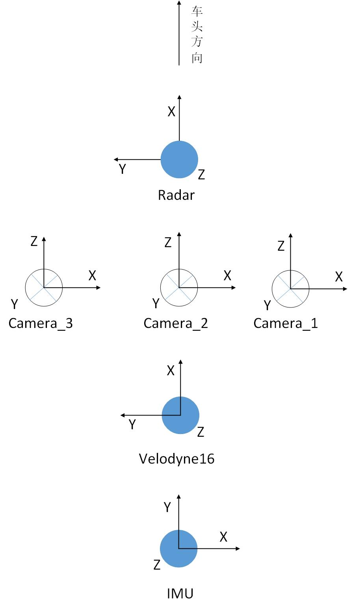
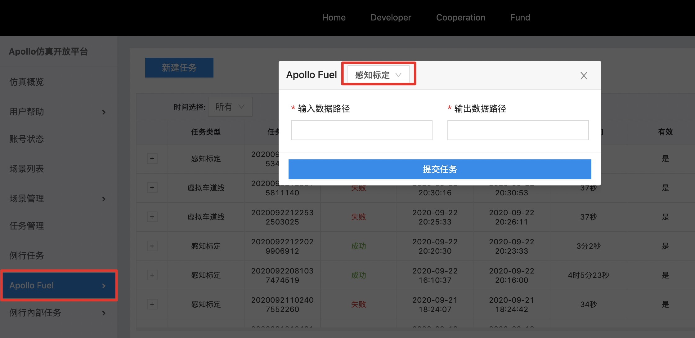
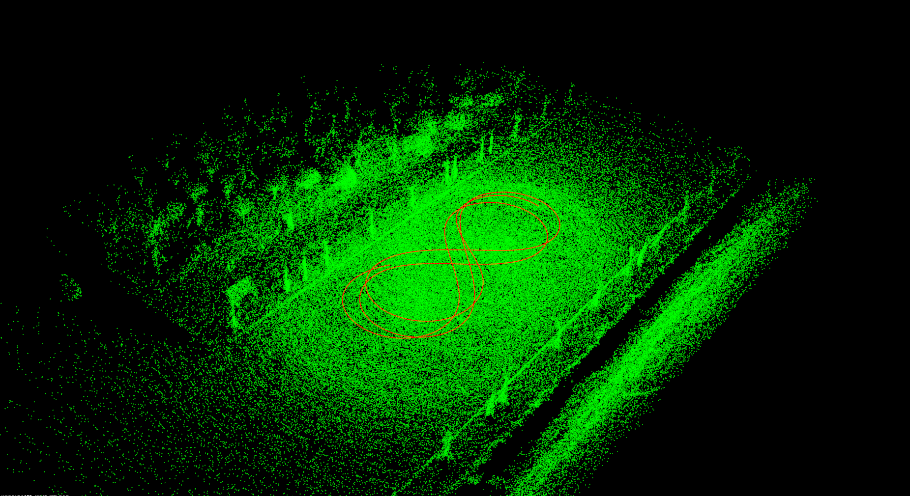

# 基于激光雷达的封闭园区自动驾驶搭建--感知设备标定

- [基于激光雷达的封闭园区自动驾驶搭建--感知设备标定](#基于激光雷达的封闭园区自动驾驶搭建--感知设备标定)
  - [概览](#概览)
  - [前提条件](#前提条件)
  - [修改配置文件](#修改配置文件)
  - [Lidar-GNSS标定初始外参测量](#lidar-gnss标定初始外参测量)
      - [1. IMU、Lidar的坐标系定义](#1-imulidar的坐标系定义)
      - [2. Lidar坐标系原点在传感器的位置](#2-lidar坐标系原点在传感器的位置)
      - [3. IMU坐标系原点在传感器的位置](#3-imu坐标系原点在传感器的位置)
      - [4. 手动测量Lidar-GNSS的初始化外参](#4-手动测量lidar-gnss的初始化外参)
  - [标定场地选择](#标定场地选择)
  - [Lidar-GNSS标定数据包录制](#lidar-gnss标定数据包录制)
      - [1. 标定所需channel](#1-标定所需channel)
      - [2. 使用Apollo录制数据包的方法](#2-使用apollo录制数据包的方法)
      - [3. 开始录制数据包](#3-开始录制数据包)
  - [Lidar-GNSS标定数据预处理](#lidar-gnss标定数据预处理)
      - [1. 修改抽取工具配置文件 lidar_to_gnss.config](#1-修改抽取工具配置文件-lidar_to_gnssconfig)
      - [2. 运行数据抽取工具](#2-运行数据抽取工具)
      - [3. 修改云标定配置文件 sample_config.yaml](#3-修改云标定配置文件-sample_configyaml)
  - [使用标定云服务生成外参文件](#使用标定云服务生成外参文件)
      - [1. 上传预处理后的数据至BOS](#1-上传预处理后的数据至bos)
      - [2. 提交云标定任务](#2-提交云标定任务)
      - [3. 获取标定结果验证及标定外参文件](#3-获取标定结果验证及标定外参文件)
  - [NEXT](#next)
  - [常见问题](#常见问题)
      - [1. 进行`Sensor Calibration`任务后，邮件显示任务失败](#1-进行sensor-calibration任务后邮件显示任务失败)
      - [2. 标定结果效果较差](#2-标定结果效果较差)

## 概览

该用户手册旨在帮助用户完成激光雷达的标定(Lidar-IMU)

## 前提条件

- 完成了[循迹搭建--车辆循迹演示](../Waypoint_Following/start_waypoint_following_cn.md)

- 完成了[基于激光雷达的封闭园区自动驾驶搭建--感知设备集成](sensor_integration_cn.md)

- 完成了[开通云服务账号向导](../../Apollo_Fuel/apply_fuel_account_cn.md)

## 修改配置文件

|修改文件名称 | 修改内容 |
|---|---|
| `modules/localization/conf/localization.conf`|`enable_lidar_localization`设置为`false`|


**注意**：所有传感器标定完成后，如果用户要使用msf定位，则需要再改为`true`。

## Lidar-GNSS标定初始外参测量

 各传感器坐标系的定义及初始化外参文件的配置

#### 1. IMU、Lidar的坐标系定义

 

#### 2. Lidar坐标系原点在传感器的位置

Lidar坐标系原点位于Lidar底部向上37.7mm的平面所在的中心点，如下图所示。


#### 3. IMU坐标系原点在传感器的位置

IMU坐标系原点位于IMU的几何中心上(中心点在Z轴方向上的位置为IMU高度的一半，在XY轴上的位置已在IMU上标出，如下图所示)

 

#### 4. 手动测量Lidar-GNSS的初始化外参

这里默认用户按照感知设备集成文档的要求正确安装了传感器，即传感器坐标系的定义与上文中的定义相同，且安装误差满足文档中的要求。

- rotation:在传感器的安装满足上述安装要求的情况下，用户无需测量该值，可直接使用如下的默认值即可

  ```txt
    rotation:
      w: 0.7071
      x: 0.0
      y: 0.0
      z: 0.7071
  ```

- translation:用户需要手动测量以IMU坐标系为基坐标系，以Velodyne16坐标系为目标坐标系的位移变换，一个IMU-Velodyne16位移变换的示例如下所示：

  ```txt
    translation:
      x: 0.0
      y: 0.38
      z: 1.33
  ```

## 标定场地选择

标定场地会直接影响到标定效果。对标定场地有如下要求

- 标定场地中心8米范围内需要有轮廓清晰的静态参照物，如电线杆、建筑物、车辆，避免过多动态障碍物。如果静态障碍物距离较远，会严重影响标定效果
- 确保路面平坦
- 能确保GNSS信号良好，不要有过多的干扰

## Lidar-GNSS标定数据包录制

#### 1. 标定所需channel

 进行Lidar-GNSS的标定，需要录制包含传感器信息的数据包作为数据输入，所需的`channel`及`channel频率`如下表所示：

| 模块       | channel名称                                  | channel频率（Hz） |
| --------- | ---------------------------------------- | ------------- |
| VLP-16    |  /apollo/sensor/lidar16/PointCloud2   | 10            |
| Localization       | /apollo/localization/pose             | 100           |

为获取上述`channel`，需要正确启动Apollo环境及dreamview，在dreamview中选择模式为`Dev Kit Debug`， 选择车型为`Dev Kit`，并在dreamview中启动启动`GPS`、`Localization`、`lidar`三个模块，可参考[基于激光雷达的封闭园区自动驾驶搭建--感知设备集成](../Lidar_Based_Auto_Driving/sensor_integration_cn.md)

**注意**：在正式开始录制前，务必确保以上channel能正常输出数据。

#### 2. 使用Apollo录制数据包的方法

- 在dreamview中，启动`recorder`模块即开始录制数据包，关闭`recorder`模块即停止录制数据包

  

- 如果工控机没有插入移动硬盘，则数据包会存储到工控机的`apollo/data/bag/`路径下(注意，apollo为代码目录);如果工控机插入了移动硬盘，则系统会将数据包存储到可用容量较大的硬盘中，如果移动硬盘可用容量较大，则存储路径为移动硬盘的`data/bag/`目录。

#### 3. 开始录制数据包

待channel数据正常输出后，可以开始录制数据包。录制期间，需要控制车辆以8字形轨迹缓慢行驶，并使转弯半径尽量小 ，包含2~3圈完整的8字轨迹数据。


## Lidar-GNSS标定数据预处理

该步骤将通过提取工具将record数据包中的点云和定位数据进行预处理，以方便通过云服务进行在线标定。

Lidar-GNSS标定数据包的相关文件位于[sensor_calibration目录](../../Apollo_Fuel/examples/)下(路径为 docs/Apollo_Fuel/examples/sensor_calibration/)，其目录结构如下：

```bash
.
└── sensor_calibration
  ├── camera_12mm_to_lidar
  │   ├── camera_12mm_to_lidar.config
  │   ├── extracted_data
  │   └── records
  ├── camera_6mm_to_lidar
  │   ├── camera_6mm_to_lidar.config
  │   ├── extracted_data
  │   └── records
  └── lidar_to_gnss
      ├── extracted_data
      ├── lidar_to_gnss.config
      └── records
```

本小节重点关注lidar_to_gnss目录。

#### 1. 修改抽取工具配置文件 lidar_to_gnss.config

根据实际情况，修改配置文件`lidar_to_gnss.config`中的channel信息，将`name`修改为Lidar传感器数据实际对应的channel名称。单激光雷达标定文件默认配置参考下图：


如果是多激光雷达标定，需要完善配置文件中的雷达点云channel信息，如下图所示(这里以3lidar标定为例)：


**注意**：其他配置无需修改

#### 2. 运行数据抽取工具

假设你在[Lidar-GNSS标定数据包录制](#lidar-gnss标定数据包录制)步骤生成的数据包位于`/apollo/data/bag/test`目录

**进入docker环境**，执行如下命令来运行数据抽取工具：

```bash
budaoshi@in_dev_docker:/apollo$ ./scripts/extract_data.sh -d data/bag/test/
```

**注意**：-d选项指定数据包所在的文件夹（相对路径或者绝对路径）。也可以通过-f选项指定具体的数据包，比如：

```bash
budaoshi@in_dev_docker:/apollo$ ./scripts/extract_data.sh -f data/bag/test/20190325185008.record.00001 -f data/bag/test/20190325185008.record.00002
```

 等待终端中显示`Data extraction is completed successfully!`的提示代表数据提取成功，提取出的数据默认被存储到`apollo`根目录下的`sensor_calibration/lidar_to_gnss`路径。运行数据抽取工具后的目录如下所示：

单激光雷达运行数据提取提供工具后生成的目录结构如下所示：

```bash
lidar_to_gnss/
├── extracted_data
│   ├── lidar_to_gnss-2020-10-27-20-26
│   │   ├── multi_lidar_to_gnss_calibration
│   │   │   ├── _apollo_localization_pose
│   │   │   ├── _apollo_sensor_velodyne16_PointCloud2
│   │   │   └── sample_config.yaml
│   │   └── tmp
│   │       ├── _apollo_localization_pose
│   │       ├── _apollo_sensor_velodyne16_PointCloud2
│   │       └── velodyne16_sample_config.yaml
│   └── readme.txt
├── lidar_to_gnss.config
└── records
```

多激光雷达运行数据提取提供工具后生成的目录结构示例如下所示(这里以3激光雷达标定为例)：

```bash
lidar_to_gnss/
├── extracted_data
│   ├── lidar_to_gnss-2020-10-27-20-26
│   │   ├── multi_lidar_to_gnss_calibration
│   │   │   ├── _apollo_localization_pose
│   │   │   ├── _apollo_sensor_lidar16_back_PointCloud2
│   │   │   ├── _apollo_sensor_lidar16_left_PointCloud2
│   │   │   ├── _apollo_sensor_lidar16_right_PointCloud2
│   │   │   └── sample_config.yaml
│   │   └── tmp
│   │       ├── _apollo_localization_pose
│   │   │   ├── _apollo_sensor_lidar16_back_PointCloud2
│   │   │   ├── _apollo_sensor_lidar16_left_PointCloud2
│   │   │   ├── _apollo_sensor_lidar16_right_PointCloud2
│   │       └── velodyne16_sample_config.yaml
│   └── readme.txt
├── lidar_to_gnss.config
└── records
```

#### 3. 修改云标定配置文件 sample_config.yaml

单激光雷达标定时`sample_config.yaml`文件的修改：

- 添加`main_sensor`字段信息：`main_sensor`字段需要填写激光雷达的名称(单激光雷达标定的情况下，main_sensor与source_sensor相同)，参考示例如下图所示

  

- 填写`transform`信息
把前面步骤手动测量的Lidar-GNSS标定初始外参信息填入，仅需要填写`translation`字段，`rotation`使用默认值即可
  

多激光雷达标定时`sample_config.yaml`文件的修改

- 添加`main_sensor`字段信息：
`main_sensor`字段需要填写主激光雷达的名称（一般默认车顶的激光雷达为主雷达,从`source_sensor`的雷达中将主激光雷达名称填入`main_sensor`字段），参考示例如下图所示

  

- 填写`transform`信息
需要分别测量3个激光雷达和IMU之间的初始位置，并填入`transform`字段,一个示例如下所示：

  

## 使用标定云服务生成外参文件

#### 1. 上传预处理后的数据至BOS

**注意：** 必须使用开通过权限的 bucket，确认`Bucket名称`、`所属地域`和提交商务注册时的Bucket名称和所属区域保持一致。

在BOS bucket中新建目录sensor_calibration，作为后续云标定服务读取数据的`Input Data Path`，把前面预处理生成的数据拷贝至该目录。目录结构如下：

BOS bucket中单激光雷达的目录结构：

```bash
sensor_calibration/
└── multi_lidar_to_gnss_calibration
    ├── _apollo_localization_pose
    ├── _apollo_sensor_velodyne16_PointCloud2
    └── sample_config.yaml
```

BOS bucket中多激光雷达的目录结构(以三激光雷达为例)：

```bash
sensor_calibration/
└── multi_lidar_to_gnss_calibration
│   │   ├── _apollo_localization_pose
│   │   ├── _apollo_sensor_lidar16_back_PointCloud2
│   │   ├── _apollo_sensor_lidar16_left_PointCloud2
│   │   ├── _apollo_sensor_lidar16_right_PointCloud2
│   │   └── sample_config.yaml
```

#### 2. 提交云标定任务

打开Apollo云服务页面，如下图：



点击`新建任务`，在下拉框中选择`感知标定`选项，根据实际情况填写输入数据路径(Input Data Path)、输出数据路径(Output Data Path),最后点击`提交任务`(Submit Job)按钮提交。

#### 3. 获取标定结果验证及标定外参文件

云标定任务完成后，将在注册的邮箱中收到一封标定结果邮件。如果标定任务成功，将包含标定外参文件。

**Lidar-GNSS标定结果验证**：

- BOS中用户指定的Output Data Path路径下包含了后缀名为.pcd的点云文件，使用点云查看工具检查pcd文件，如果点云文件中周围障碍物清晰、锐利，边缘整齐表示标定结果准确，否则请重新标定。



- 在ubuntu系统下，可以使用`pcl-tools`工具查看点云文件

```bash
  sudo apt-get update
  sudo apt-get install pcl-tools
  pcl_viewer xxx.pcd
```

**Lidar-GNSS标定外参文件**：

确认邮件得到的外参文件合理后，将邮件发送的外参文件的`rotation`、`translation`的值替换掉`modules/calibration/data/dev_kit/lidar_params/velodyne16_novatel_extrinsics.yaml`中对应的`rotation`、`translation`值。注意不要修改`frame_id`、不要直接替换文件。

## NEXT

现在，您已经完成激光雷达感知设备标定，接下来可以开始[封闭园区自动驾驶搭建--虚拟车道线制作](virtual_lane_generation_cn.md)

## 常见问题

#### 1. 进行`Sensor Calibration`任务后，邮件显示任务失败

建议检查一下输入路径是否正确

#### 2. 标定结果效果较差

- 标定时，确保GNSS信号状态良好，周围有轮廓清晰的静态障碍物
- 保证传感器的安装精度，安装误差超过要求精度时，标定结果不容易收敛
- 标定时，不要距离有效静态障碍物太远
