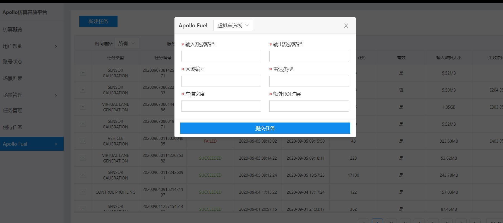
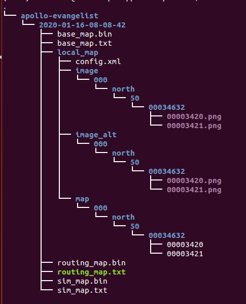

# 封闭园区自动驾驶搭建--虚拟车道线制作

- [封闭园区自动驾驶搭建--虚拟车道线制作](#封闭园区自动驾驶搭建--虚拟车道线制作)
  - [前提条件](#前提条件)
  - [主要步骤](#主要步骤)
    - [虚拟车道线数据包录制](#虚拟车道线数据包录制)
    - [使用虚拟车道线云服务生成虚拟车道线](#使用虚拟车道线云服务生成虚拟车道线)
      - [1. 上传数据至BOS](#1-上传数据至bos)
      - [2. 提交虚拟车道线生成任务](#2-提交虚拟车道线生成任务)
      - [3. 获取虚拟车道线并添加到apollo中](#3-获取虚拟车道线并添加到apollo中)
  - [NEXT](#next)
  - [常见问题](#常见问题)
    - [1. 在BOS中没有生成local_map文件夹](#1-在bos中没有生成local_map文件夹)
    - [2. 在BOS中生成的地图有问题](#2-在bos中生成的地图有问题)
    - [3. 在BOS没有生成任何地图数据](#3-在bos没有生成任何地图数据)

## 前提条件

 - 完成了[基于激光雷达的封闭园区自动驾驶搭建--感知设备标定](sensor_calibration_cn.md)
 - 完成了[开通云服务账号向导](../../Apollo_Fuel/apply_fuel_account_cn.md)
 
## 主要步骤

### 虚拟车道线数据包录制

将想要自动驾驶的区域提前按要求录制数据包，作为后面生成虚拟车道线的输入数据，注意目前限制数据包大小不要超过5G。

- 需要的channel信息如下所示：

|序号 | topic | 
|---|---|
|1|/apollo/localization/pose | 
|2|/apollo/sensor/gnss/odometry|
|3|/apollo/sensor/gnss/ins_stat|
|4|/apollo/sensor/lidar16/compensator/PointCloud2|

- 为获取上述`channel`，需要启动`GPS`、`Localization`、`Velodyne`三个模块，`GPS`、`Localization`模块的启动请参考定位模块配置文档，`Velodyne`模块的启动请参考感知传感器集成文档。由于GNSS设备的限制，`/apollo/sensor/gnss/odometry`、`/apollo/sensor/gnss/ins_stat`这两个`channel`不能由GNSS设备直接给出，需要借助`/apollo/modules/tools/sensor_calibration/`下的两个脚本工具。在`localization`模块正常启动且输出`/apollo/localization/pose`数据时，另外开启两个不同终端进入docker后在/apollo根目录下分别执行
```bash
  bazel build modules/tools/sensor_calibration:ins_stat_publisher
  bazel run modules/tools/sensor_calibration:ins_stat_publisher
```
```bash
  bazel build modules/tools/sensor_calibration:odom_publisher
  bazel run modules/tools/sensor_calibration:odom_publisher
```  
便可以分别产生`/apollo/sensor/gnss/ins_stat`、`/apollo/sensor/gnss/odometry`这两个`channel`。

- 为了节省数据空间，这里建议用户在docker环境使用命令行录制数据包，不要使用Recorder模块录制，录制命令如下
‘‘‘
cyber_recorder record -c /apollo/localization/pose /apollo/sensor/gnss/odometry /apollo/sensor/gnss/ins_stat /apollo/sensor/lidar16/compensator/PointCloud2
’’’

**注意**：在执行`sensor_calibration/ins_stat_publisher.py`脚本前，请务必检查`/apollo/sensor/gnss/best_pose`中GPS信号质量，确保GPS信号质量为`NARROW_INT`时，才可以使用`ins_stat_publisher.py`脚本。在录制数据前，应首先确保`modules/localization/conf/localization.conf`文件中的`enable_lidar_localization`设置为`false`，待地图制作完成后如果需要msf定位，再修改为true。

### 使用虚拟车道线云服务生成虚拟车道线

#### 1. 上传数据至BOS

**注意：** 必须使用在Dreamland中提交用户账号信息的 Bos bucket，确认`Bos容器名`、`Bos服务区域`、`Bos访问秘钥`、`Bos访问私钥`正确。

在BOS bucket中新建目录virtual_lane，作为后续云标定服务读取数据的`Input Data Path`，把前面录制的数据包以及lidar_GNSS外参文件拷贝至该目录。目录结构如图所示：


#### 2. 提交虚拟车道线生成任务

点击左侧菜单栏的「Apollo Fuel」里的「任务」菜单项，进入任务管理页面，点击新建任务按钮，在弹出的下拉框中选择虚拟车道线服务，如下图所示：



填写输入数据路径（在本例中为"virtual_lane"）、输出数据路径（地图生成路径此例中为"result"）、区域编号（根据当地实际情况填写，本例中所在地方为北京应填50）、雷达类型（是配置的/apollo/sensor/lidar16/compensator/PointCloud2这个channel的雷达类型，此例中是lidar16）、车道宽度(车道线的宽度，此例中为3.3)、额外ROI拓展(车道线的边界到真实道路边缘的距离，此例中为0.5)，最后点击提交任务按钮提交。
**注意**：bos需要有写权限,并且传入的区域编号应和录制数据包时localiztion.conf配置文件中的local_utm_zone_id配置项的值一致才行。

#### 3. 获取虚拟车道线并添加到apollo中

任务完成后，将在注册的邮箱中收到一封邮件：


如果邮件内容为上图所示则表示虚拟车道线成功生成，查看bos上的Output Data Path（此例中为result），此path的目录结构如下图所示：



将上图中的2020-01-16-08-08-42整个文件夹拷贝到/apollo/modules/map/data/下，重命名为自己的地图名字（例如gongyuan），重启DreamView即可在地图下拉框中看到自己刚添加的地图。
## NEXT
现在，您已经完成虚拟车道线制作，根据您使用的是基于Lidar的感知方案还是基于Camera的感知方案，接下来可以开始[基于激光雷达的封闭园区自动驾驶搭建--感知适配](perception_configuration_cn.md)或[基于摄像头的封闭园区自动驾驶搭建--感知适配](../Camera_Based_Auto_Driving/perception_configuration_cn.md)

## 常见问题
### 1. 在BOS中没有生成local_map文件夹
* 确认/apollo/modules/localization/conf/localization.conf文件中`--local_utm_zone_id` 选项和提交虚拟车道线云服务的时传入的zone_id一致。
### 2. 在BOS中生成的地图有问题
* 在虚拟车道线数据包录制过程中，车只能沿着预定道路走一遍且不能闭环。
### 3. 在BOS没有生成任何地图数据
* 确认提交账号时给的BOS信息正确。
