目录

[快速介绍](#快速介绍)

[1．车体结构简介](#1车体结构简介)

[2.电池](#2电池)

[2.1简介](#21简介)

[2.2电池拆装方式](#22电池拆装方式)

[2.3 充电方式及注意事项](#23-充电方式及注意事项)

[2.3.1充电方式](#231充电方式)

[2.3.2充电注意事项（需严格按照执行）](#232充电注意事项（需严格按照执行）)

[2.4 车辆上下电流程](#24-车辆上下电流程)

[3．遥控器及注意事项](#3遥控器及注意事项)

[3.1功能介绍及注意事项](#31功能介绍及注意事项)

[3.2键位说明](#32键位说明)

[3.3驱动控制](#33驱动控制)

[3.4遥控器安全操作提示](#34遥控器安全操作提示)

[4. 硬件软件安装与调试](#4-硬件软件安装与调试)

[5. 使用场景限制](#5-使用场景限制)

[6. 车辆安全机制](#6-车辆安全机制)

[6.1 AEB防碰撞系统](#61-AEB防碰撞系统)

[6.2 碰撞传感器](#62-碰撞传感器)

[6.3 急停按钮](#63-急停按钮)

[6.4 急停遥控器](#64-急停遥控器)

[6.5 车辆限速](#65-车辆限速)

[7.常见问题及解决方法](#7常见问题及解决方法)

[8.通过chassis_detail查看车辆故障信息](#8通过chassis_detail查看车辆故障信息)

[9. 注意事项](#9-注意事项)

[10. 底盘线束安装说明](#10-底盘线束安装说明)

[11. 免责声明](#11-免责声明)

# 快速介绍

欢迎您选择百度Apollo联合新石器推出的自动驾驶套件，一款为开发者而生的自动驾驶开发软硬件平台。该套件采用纯线控底盘+高扩展硬件结构平台的方式，搭载多传感器套件，参照多冗余安全机制设计并可提供持续的开发资源，帮助您轻松实现硬件集成，降低自动驾驶门槛，加速您的自动驾驶研发进程。此quick
start旨在帮助您快速了解Apollo套件的组成和使用注意事项，确保安全同时延长套件的使用寿命。如果您在使用过程中遇到问题或者有更好的建议给我们，欢迎在apollo开发者社区群一起讨论或者在Apollo开发者套件留下您的宝贵意见。

# 1．车体结构简介

**总观图：**

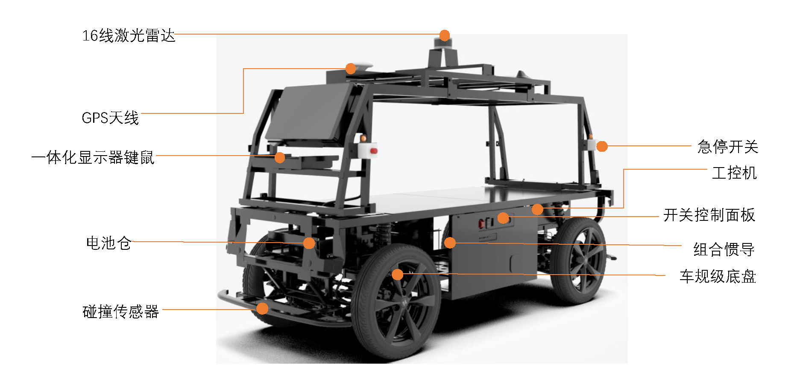

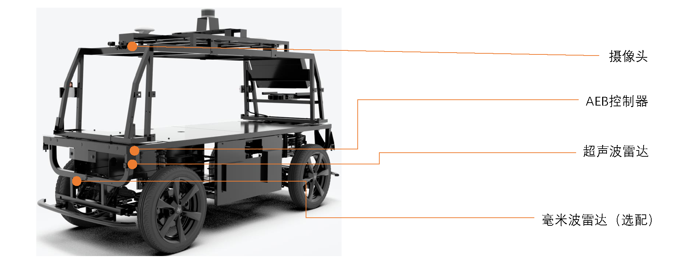

**底盘结构示意图如下：**

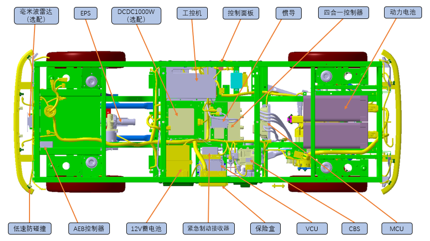

**整车基本参数表**

| 项目             | 参数                   |                        |      |
|------------------|------------------------|------------------------|------|
| 尺寸参数（mm）   | 外形尺寸               | 长                     | 2775 |
|                  |                        | 宽                     | 1010 |
|                  |                        | 高                     | 1672 |
|                  | 轴距                   | 1730                   |      |
|                  | 轮距                   | 前轮距                 | 888  |
|                  |                        | 后轮距                 | 892  |
| 质量参数（kg）   | 整车质量               | 420                    |      |
| 通过性参数（mm） | 最小转弯半径           | 3750                   |      |
|                  | 最小离地间隙（满载mm） | 117                    |      |
| 主要性能参数     | 最高车速（km/h）       | 遥控器及自动驾驶限速20 |      |
|                  | 最大爬坡度（%）        | 20                     |      |
| 悬架             | 前悬架                 | 麦弗逊式独立悬架       |      |
|                  | 后悬架                 | 麦弗逊式独立悬架       |      |
| 转向             | 转向器型式             | C-EPS电动助力转向      |      |
|                  | 转向操纵型式           | 线控                   |      |
| 制动             | 行车制动               | 前后盘式               |      |
|                  | 驻车制动               | EPB电子驻车            |      |
| 车轮             | 轮辋型号               | 铝轮辋16×3.5J          |      |
|                  | 轮胎型号               | 115/70R16              |      |
| 电器设备         | 动力电池               | 72V/6.45kWh            |      |

# 2.电池

## 2.1简介

本产品采用的是松下18650电芯，搭载BMS系统的模组电池，电池有AB组，其布置如下图

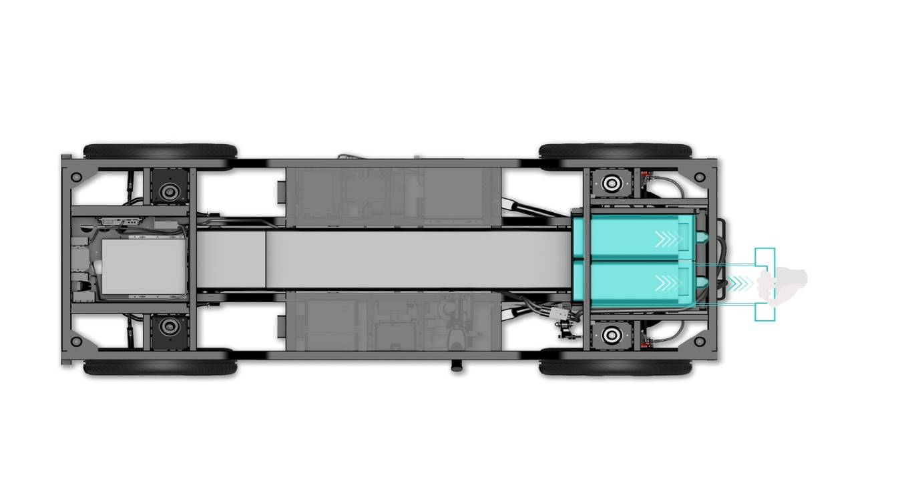

## 2.2电池拆装方式

-   动力电池拆卸顺序

1.  确认车辆整体断电

2.  拔下高压接口线

3.  打开卡口开关

4.  将托架手柄向外侧斜向上拉动，移出电池仓

5.  取出动力电池

    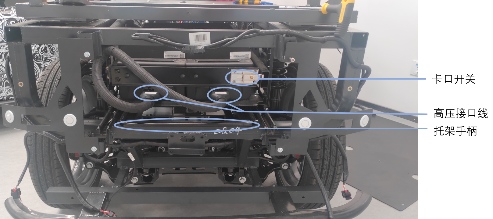

-   动力电池安装顺序

1.  将动力电池放入电池仓

2.  将托架手柄向内侧斜向上推动，推入电池仓

3.  锁死卡口开关

4.  连接高压接口线

注意事项

-   电池必须是同一组（如1A，1B同组，1A，2B或1B、2A不可混用）

-   高压线束须按线束上标识左或右插入对应电池中

-   在确保整车下电状态下进行操作

-   请不要在电池出现破损或是故障后继续使用，否则可能导致电池损坏或人员伤亡。

-   电池出现故障或报废后，请合理处置电池，遵守当地法规，否则可能导致严重环境污染

## 2.3 充电方式及注意事项

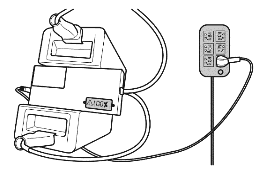

### 2.3.1充电方式

-   严格按照电池更换方式取下待充电电池

-   先将充电机插头与电池组连接，将充电机电源插头与220V电源接通

-   充电机显示界面亮起并伴随“嗡嗡”声表明电池组已开始充电

-   充电机上有电量显示，充电完成后先断开电源插头，再将电源插头拔掉

### 2.3.2充电注意事项（需严格按照执行）

-   必须使用规定配套充电机，严禁使用其它充电设备

-   充电环境：非室内的空旷环境，周围无火源及易燃物，严禁暴晒，充电时需有人看管

-   充电环境温度：0℃-40℃（推荐上限温度保持在25℃±10℃）

-   充电环境湿度：5%-95%

-   充电电压220V

-   充电时长6-8小时

-   严禁将电源靠近热源，严禁私自拆装电源

-   严禁短接，反接电源正负极

-   充电机和电池组严禁溅水

-   为保证行车安全及电池寿命严禁将电池电量消耗至20%以下（当电量低于10%车辆会强制下电）

## 2.4 车辆上下电流程

-   确认动力电池电量充足安装正确

-   电池电量查看：

方法一：通过自带脚本查看电池电量：查看路径：Files—Desktop—carmonitor.sh

方法二：通过apollo系统cyber_monitor查看电池电量：

启动apollo后，启动canbus模块，通过cyber_monitor工具，查看chassis_detial--\>vcu_vehicle_status_report_101--\>vcu_display_soc查询当前电池电量，如下图所示：  

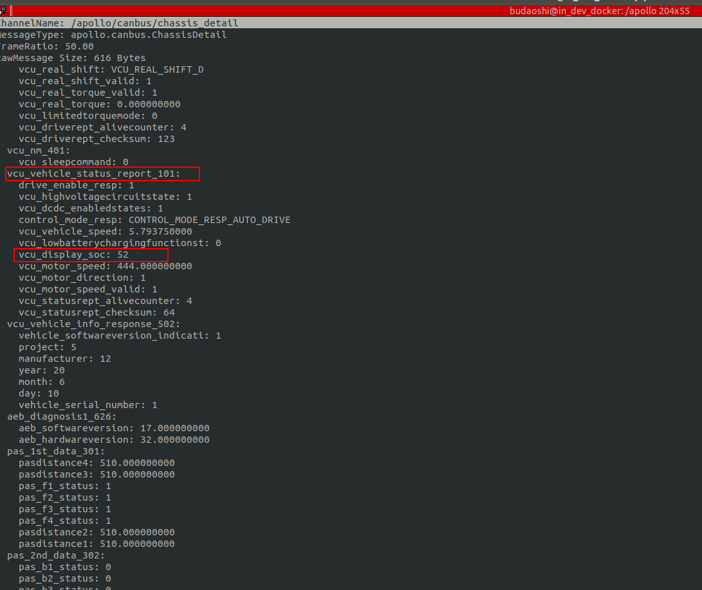

-   上电顺序

1.  开启遥控器，并处于遥控接管模式，拨杆处于驻车、空挡状态

2.  将①号电源总开关旋至开启位置（缺口对应ON）

3.  摁下⑥号开关键，⑦号灯由青色变为绿色表明车辆高压上电成功，可使用遥控器控制车辆

-   下电顺序

1.  遥控器拨杆处于遥控器接管模式，驻车、空挡状态

2.  摁下⑥号开关键，待面板指示灯全部熄灭

3.  将①号电源总开关旋至关闭位置（缺口对应OFF）

-   故障下电方式

    整车处于故障状态闪红灯，待故障确认或解除后，摁下6号开关键，待面板指示灯全部熄灭，将①号电源总开关旋至关闭位置（缺口对应OFF）

-   特殊下电方式（遇到无法正常下电情况）

    一种紧急下电方式 ( 不建议常态化使用 )，在上电10s 后，
    再次按启动按键持续10s，待面板指示灯全部熄灭，将①号电源总开关旋至关闭位置（缺口对应OFF）

# 3．遥控器及注意事项

## 3.1功能介绍及注意事项

车辆可以通过遥控器完成转向控制、刹车控制、驻车控制、挡位控制、接管控制等动作

在使用遥控器开始控制车辆之前，需要先长按遥控器电源键，打开遥控器，如果遥控器电压低于3.6V，建议及时充电。遥控器由一块锂电池供电，电池充电采Micro
usb接口，采用手机适配器充电即可

## 3.2键位说明

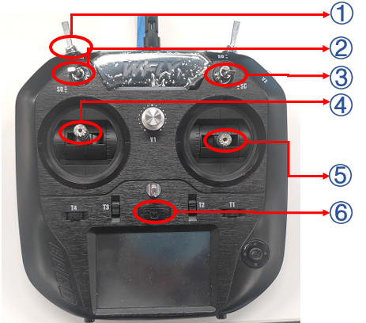

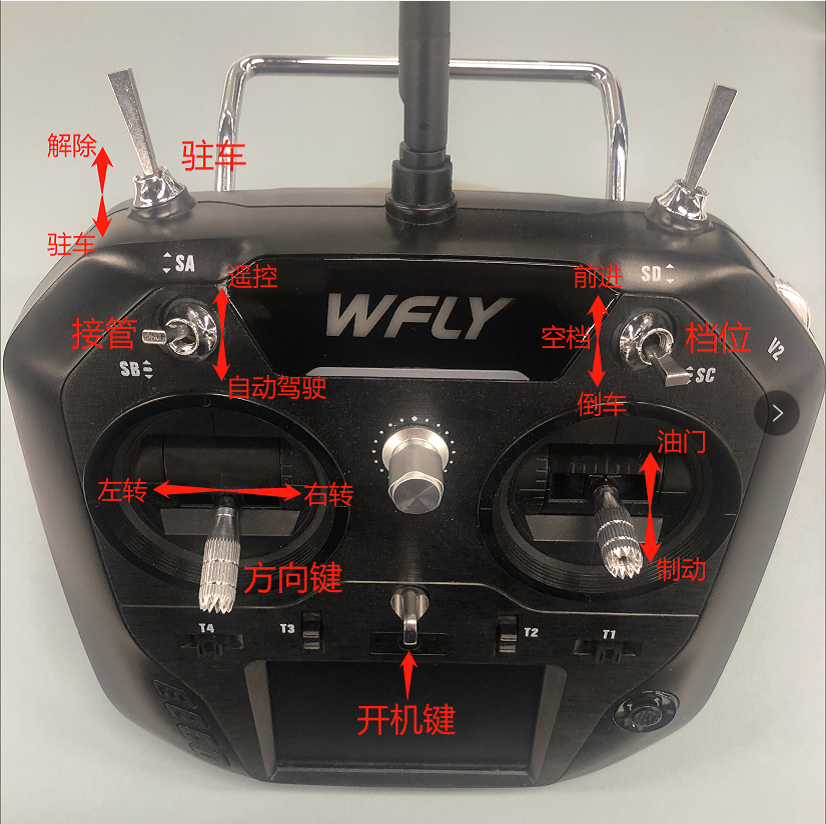

注意事项：

-   ①驻车键

1.  释放驻车，如下图1位置，向下拨

2.  驻车，如下图2位置，向上拨

    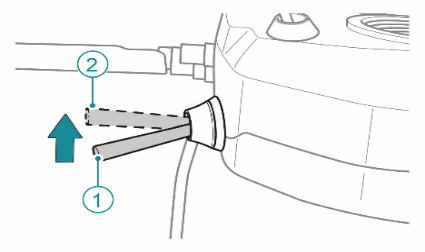

-   ②接管模式键

1.  遥控接管控制位（拨杆在中或上位置），该状态为可通过遥控器控制车辆，此时七彩灯呈绿色

2.  自动驾驶接管控制位（拨杆在下位置），该状态为自动驾驶系统控制车辆，此时七彩灯呈蓝色

    注意：

    1．当自动驾驶状态车辆行驶时存在风险时，请将拨杆及时拨到遥控接管位

    置，车辆会立即驻车

    2．确保在将遥控接管模式切换至自动驾驶接管模式前，车辆必须处于驻车状态

-   ③挡位控制

1.  D挡（前进挡），拨杆拨到最上侧

2.  R挡（后退挡），拨杆拨到最下侧

3.  N挡（空挡），拨杆拨到中间位侧

-   ④转向控制

转向控制功能由左侧水平摇杆实现，拨向左侧时车轮左转，拨向右侧时车轮右转

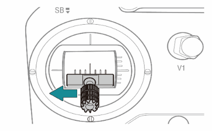

-   ⑤油门、刹车控制

油门、刹车控制功能由右侧竖直摇杆的上、下行程实现，该拨杆正常时会处于中间位置，当需要动力时，向上拨动摇杆,实现动力；当需要制动时，向下侧拨动摇杆，实现制动

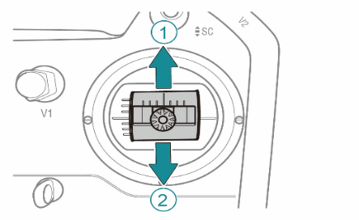

-   ⑥遥控器开关，长按开启或关闭

## 3.3驱动控制

车辆支持扭矩控制方法，扭矩控制模式下，遥控器输出的是扭矩值，即电机的驱动力的大小。

在使用遥控器控制车辆行驶前，需要先确定以下事项：

-   遥控器处于遥控接管状态

-   解除车辆驻车、且无制动

-   将挡位控制拨杆拨至对应的挡位上，非N挡

扭矩控制模式：

前进：D挡+右侧摇杆上半行程控制（右侧遥杆⑤）

后退：R挡+右侧摇杆上半行程控制（右侧遥杆⑤）

## 3.4遥控器安全操作提示

-   遥控器开启和关闭时需保证各键位处于关闭状态，即驻车、空挡、遥控接管，无油门

-   进入遥控模式后，请勿一次性将油门推到最大，以免发生危险，应慢慢推动油门控制方向验证各键位是否正常工作

-   遥控器电量不足时会发出警报声，应立即对遥控器进行充电操作

-   若感觉遥控器键位异常，应立即停车检查，或用急停遥控器停车

-   车辆在退出遥控器控制模式前，需确保车辆在驻车、空挡完全处于停止状态

-   在空旷环境遥控器使用范围保证在50米以内

-   停车后保证车辆驻车、空挡状态，避免在坡道停车

-   出于安全考虑，任何人在使用遥控器前需仔细阅读遥控器相关说明，切勿将遥控器交给不熟悉相关操作的人员使用，以免发生危险

-   为了您的安全，在进入自动驾驶模式前，请务必提前熟悉遥控器的各项操作，尤其关于急停功能的使用，请在每次进入自动驾驶模式前进行遥控操作确认。为了您的安全，我们已在工控机与底层协议层定义了遥控器的绝对优先权，即平台移动的任何状态下（请在每次运行前确保遥控器电量充足），只要遥控器上电且处于遥控器接管状态，平台即进入人工接管模式，为您的安全测试保驾护航

# 4. 硬件软件安装与调试

在了解了第3、4节的内容后，您已经可以使用遥控器完成非自动驾驶模式下的各项移动操作。由于与自动驾驶相关的硬件与软件的安装与调试过程较为复杂，相关的指引请参照[github其它文档](https://github.com/ApolloAuto/apollo/tree/master/docs/D-kit)。

# 5. 使用场景限制

[请参考产品手册](https://github.com/ApolloAuto/apollo/tree/master/docs/D-kit)。

# 6. 车辆安全机制

## 6.1 AEB防碰撞系统

-   **系统简介**

AEB防碰撞系统是一套用于避免低速无人驾驶在规定场景运行中发生碰撞情况的安全保障系统。在低速情况下系统可通过超声波传感器测出与障碍物的距离，预测车辆潜在的碰撞风险，在碰撞发生前主动干预制动，减少发生碰撞的风险。

对于静止、匀速和加速前进的障碍物，该系统可以实现以下功能：

1）减少车辆在10km/h及以下车速直行向前行驶时发生碰撞风险；

2）减少车辆在以不大于5km/h速度转向行驶时发生碰撞风险；

3）减少车辆在以不大于5km/h速度倒车行驶时发生碰撞风险；

4）以上需求适用于车辆的自动驾驶、遥控驾驶状态；

-   **系统组成**

| 系统组成   | 属性                        | 数量 |
|------------|-----------------------------|------|
| 控制器     | 控制器                      | 1    |
| 超声波雷达 | STP-318：探测距离0.3m\~4.5m | 8    |
| 温度传感器 | 探测环境温度，温度精度为1℃  | 1    |
| 轮速传感器 | 测量车辆轮胎转速            | 4    |
| CBS        | 对车辆进行制动              | 1    |

-   **超声波雷达测试**

超声波雷达测试数据是基于STP-318超声波雷达。STP-318是车规级车载超声波雷达，主要应用于汽车主动式AEB防碰撞功能设备以及相关ADAS系统场景。

>   ☆超声波雷达STP-318

超声波STP-318为短距离超声波，其主要的特性如下表所示：

| STP-318        |                                     |
|----------------|-------------------------------------|
| 供电电压（V）  | 12VDC额定（9～16VDC）               |
| 供电电流（mA） | 10\~20mA                            |
| 测试距离（m）  | 0.25\~2                             |
| 触发范围（m）  | 0.25\~2（与速度快慢及转向幅度相关） |
| 视场角         | 水平：100°±10 垂直：40°±10          |
| 死区（cm）     | 30                                  |
| 精度(cm)       | \-5\~5                              |
| 分辨率（mm）   | 10                                  |
| 反应时间（ms） | 20                                  |
| 工作温度（℃）  | \-40\~85                            |

>   ☆传感器布局图

AEB设备超声波传感器的布置采用前4后4的布局，其lin线连接分布如下所示。系统使用了两个LIN通信总线，每条LIN通信分别挂载4个超声波传感器。

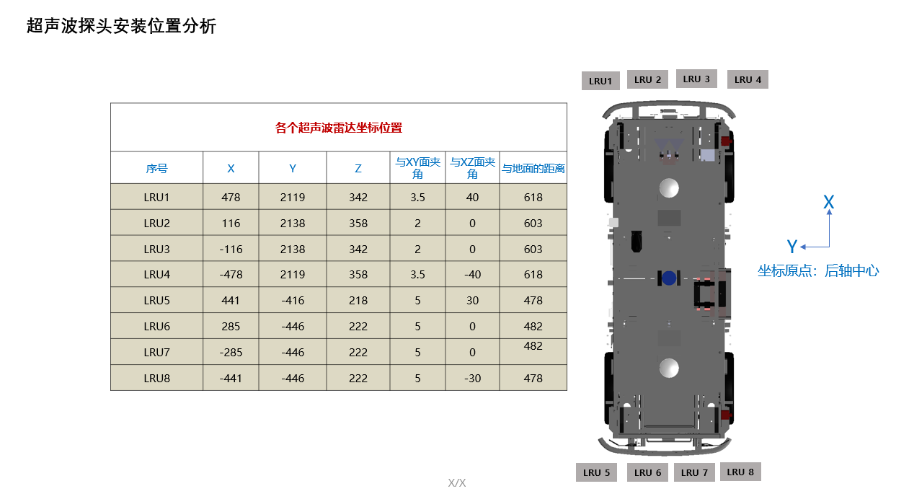

『从Apollo系统查看相关信息』

注：请确保已经在车辆配套计算单元中正确安装了Apollo系统

>   ☆超声波传感器编号与proto文件对应说明：

ChannelName:/Apollo/canbus/chassis_detail

MessageType:Apollo.canbus.ChassisDetail

| 超声波传感器序号 | Proto                         |
|------------------|-------------------------------|
| LRU1             | Pas_1st_data_312.pasdistance4 |
| LRU2             | Pas_1st_data_312.pasdistance3 |
| LRU3             | Pas_1st_data_312.pasdistance2 |
| LRU4             | Pas_1st_data_312.pasdistance1 |
| LRU5             | Pas_1st_data_311.pasdistance1 |
| LRU6             | Pas_1st_data_311.pasdistance2 |
| LRU7             | Pas_1st_data_311.pasdistance3 |
| LRU8             | Pas_1st_data_311.pasdistance4 |

## 6.2 碰撞传感器

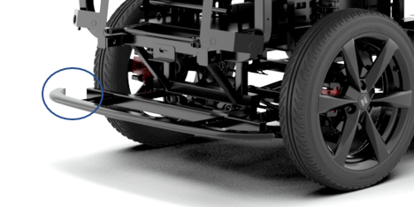

-   车辆前后分别有一条防撞条，能够感应防撞条与车体间的压力从而判断是否发生了碰撞

-   碰撞传感器最小触发力≤50N，触发后车辆立即进入紧急制动状态，车辆会以最大刹车力进行制动，以防止进一步伤害，随后车辆高压下电，保持低压在线状态，车辆进入紧急制动模式，此模式下车辆无法移动，且无法控制

-   解除紧急制动状态

    使用EPB开关，将车辆解除驻车后，然后通过摁下上电开关强制下电，重新进行上电操作

## 6.3 急停按钮

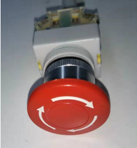

急停开关作用是给车辆提供驻车信号，该按键位于车架右侧两端

-   按下车身急停开关，触发紧急制动，车辆进入紧急制动模式，此模式下车辆无法移动，且无法控制

-   解除：将急停按钮顺时针旋起及解除紧急制动状态

## 6.4 急停遥控器

当车辆即将发生碰撞风险时，可使用急停遥控器使车辆紧急制动

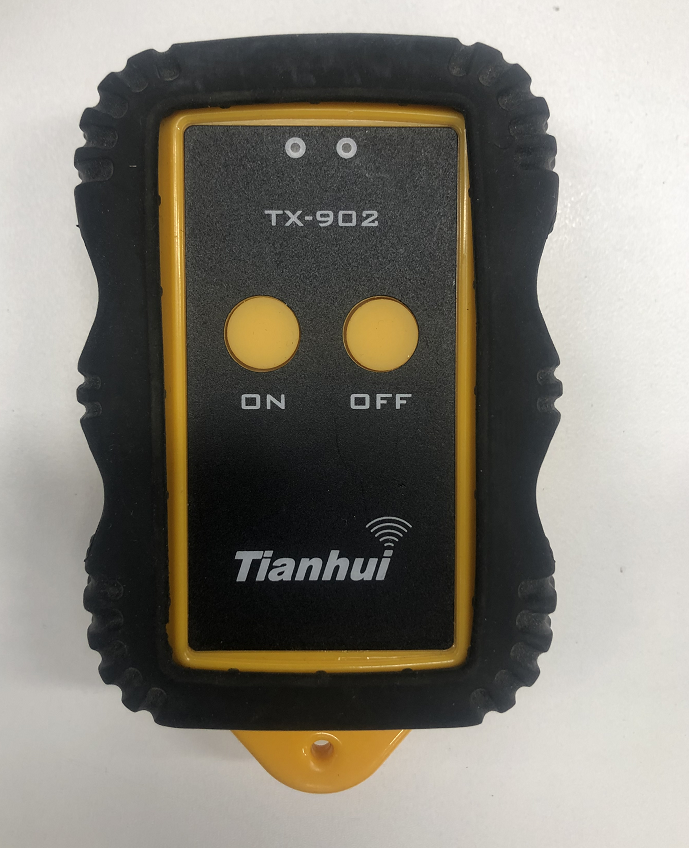

-   按下遥控急停的“ON”按键，车辆以最大刹车力执行制动

-   按下遥控急停的“OFF”按键，车辆退出刹车，车辆之前状态保持不变，不进入紧急制动状态

-   空旷环境紧急遥控器使用有效距离范围20米

-   摁下“ON”键没有其它操作情况下10分钟后车辆驻车，此时需通过EPB开关解除驻车后再摁下急停遥控器的“OFF”键，退出刹车

-   车辆使用前需验证急停遥控器是否正常工作，无法工作时检查急停遥控器电池电量及信号接收天线（天线位于底盘）下图为信号接收器

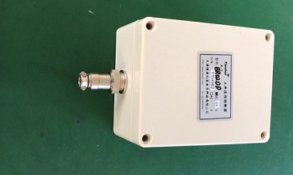

## 6.5 车辆限速

-   为保证车辆行驶安全，车辆遥控器模式前进限速20km/h，后退5km/h，自动驾驶限速20km/h

# 7.常见问题及解决方法

**7.1车辆无法上电启动**

-   确认SOC电量，当电池电量较低时，请您进行充电。

-   检查12V蓄电池电量是否充足：

-   当亏电并可以启动时，须使用高压电池电量在50%以上的电池，在车辆开机状态下进行充电。

-   当亏电并导致无法启动时，须使用车辆的搭电设备完成启动，并按照上述条件完成充电（此状态须保持车辆开机至少2小时以上进行充电）。

**7.2遥控器无法驱动车辆**

-   检查遥控器驻车状态

-   检查四个微调（T1-T4）按钮数值是否为0

-   检查急停遥控器是否被摁下

-   检查车身急停按钮是否被拍下

-   检查碰撞传感器是否被挤压

-   检查遥控器信号接收器连接是否正常

-   遥控器损坏更换后需进行遥控器与接收器配对

附件为遥控器默认参数设置说明文档（遥控器默认配置出场已配置完成，使用过程中切勿调动各模块参数，以免遥控器无法正常使用导致危险发生）

**配置步骤：遥控器信号配对**

该款遥控器共支持两种无线信号模式：PPM信号机W-BUS信号。

SLV11车型采用PPM进行通信，在对遥控器进行参数配置前，需要对遥控器执行对码操作。

设置方法如图所示：

1.  设置通信模式：通信设置\>\>PPM/W.BUS\>\>选择PPM模式

1.  完成对码操作：

2.  长按车端遥控接收器的SET键3-4秒，SET灯开始闪烁黄灯，等待遥控器信号

3.  遥控器：通信设置\>\>对码\>\>开始，对码成功后，会听到遥控器笛一声，并且SET灯蓝色长亮，并且RX有绿色信号，Tx
    ID和Rx ID有相应的数值显示。如下图：

**7.3车辆无法进入自动驾驶状态**

首先检查遥控器是不是已经放权，遥控器放权后，然后手动解除驻车开关

**7.4保险丝更换**

底盘保险丝盒安装在车架左侧中部，蓄电池正极保险丝盒安装在车架左侧中部低压蓄电池正极上。更换保险丝时，需保证车辆处于下电状态。

**更换保险丝的步骤：**

1.  打开盒盖，在内侧可见相应电路的保险丝

2.  可通过外观看到烧断的保险丝在确定烧损原因(过载、短路等)之前请勿更换保险丝，更换时，须用相同规格的保险丝

3.  将新的保险丝安装在其固定位置上，卡入并安装盒盖。保险丝盒盖中有放置备用保险丝的地方

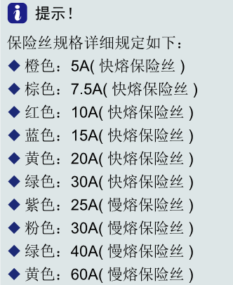

具体规格以保险丝盒内为准

# 8.通过chassis_detail查看车辆故障信息

『从Apollo系统查看相关信息』

注：请确保已经在车辆配套计算单元中正确安装了Apollo系统

通过执行cyber_monitor，查看底盘chassis_detail信息：

chassis_detail中故障相关部分为a. check_response; b.neolix_edu

neolix_edu部分故障上报模块分别是：

(1)刹车状态：vcu_brake_report_47;

(2)驱动状态：vcu_drive_report_52;

(3)转向状态：vcu_eps_report_57;

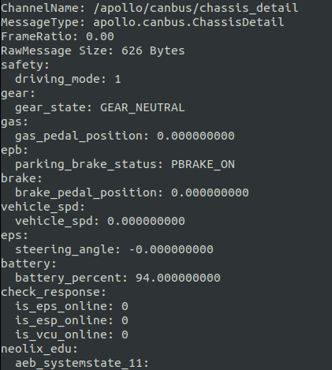

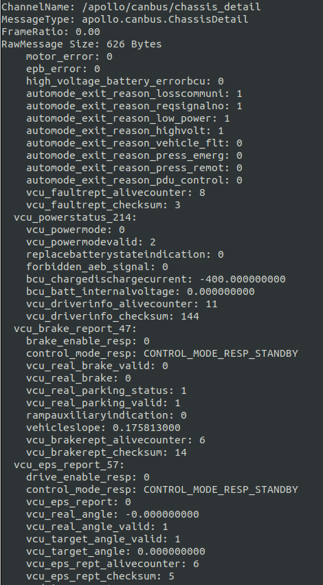

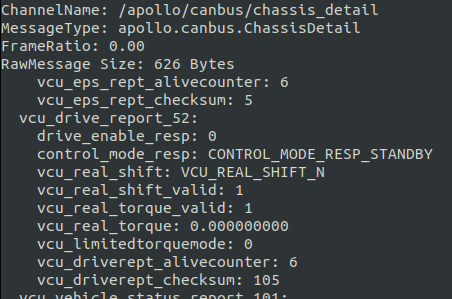

a. check_response

车辆进入自动驾驶后，相应的状态会由0变为1: is_eps_online:1; is_esp_online:1;
is_vcu_online:1;
如果仍旧为0,说明没有进入自动驾驶，首先检查遥控器是否放权，若放权后还是不能进入再自动驾驶，请检查ch部分是否有故障上报。

b. neolix_edu

​ 1） vcu_brake_report_47:

brake_enable_resp: false (刹车状态)

control_mode_resp: CONTROL_MODE_RESP_STANDBY (控制状态)

vcu_real_brake_valid: false (刹车有效性)

vcu_real_brake: 0 (刹车值)

vcu_real_parking_status: 1 (驻车有效性)

vcu_real_parking_valid: true (驻车状态)

rampauxiliaryindication: false (坡道辅助状态)

vehicleslope: 0.175813 (坡道状态)

vcu_brakerept_alivecounter: 4 (通信计数)

vcu_brakerept_checksum: 12 (通信校验)

​ 2） vcu_drive_report_52:

drive_enable_resp: false (油门状态)

control_mode_resp: CONTROL_MODE_RESP_STANDBY (控制状态)

vcu_real_shift: VCU_REAL_SHIFT_N (档位状态)

vcu_real_shift_valid: true (档位有效性)

vcu_real_torque_valid: true (油门有效性)

vcu_real_torque: 0 (油门值)

vcu_limitedtorquemode: false (油门限制模式)

vcu_driverept_alivecounter: 4 (通信计数)

vcu_driverept_checksum: 107 (通信校验)

3） vcu_eps_report_57:

drive_enable_resp: false (转向状态)

control_mode_resp: CONTROL_MODE_RESP_STANDBY (控制状态)

vcu_eps_report: false (转向状态)

vcu_real_angle: -0 (转向值)

vcu_real_angle_valid: true (转向有效性)

vcu_target_angle_valid: true (转向目标有效性)

vcu_target_angle: 0 (转向目标值)

vcu_eps_rept_alivecounter: 4 (通信计数)

vcu_eps_rept_checksum: 7 (通信校验)

# 9. 注意事项

**9.1车辆使用环境**

-   夏天天气炎热气温高，为保证车辆安全，建议请勿将车辆长期停放在高温环境下，请选择停放在通风效果好的地方

-   请勿在室外雨雪、冰雹、扬尘天气使用车辆

-   雨天时，若地面积水没过侧围底部，严禁启动车辆

-   冬季天气寒冷低温，车辆动力电池的效率较低，建议使用车辆后，应立即取出车辆电池进行充电，以提高充电效率

-   请勿在崎岖不平的路面行驶

**9.2车辆高压系统注意事项**

-   车辆安装了高压动力电池（72V），驱动电机的工作电压也是高压，所有的高压线缆和接插头在设计、制造和装配工作中已经严格按照相关国家标准和行业标准执行。除进行本说明书中容许的必要操作外，请勿触摸高压线缆（这些高压线缆表面颜色为橘黄色）及接插件，请勿拆卸或更换驱动电机、高压配电盒等零部件，防止触电

-   请勿自行拆卸或更换电器系统任何部件，对车辆部件的任何变更，可能影响车辆性能和高压安全，甚至可能导致触电危险

-   请勿私自开启高压配电盒。如果高压保险丝熔断，表示车辆电器系统有较大的故障。

**9.4 发生故障时注意事项**

-   保持车辆处于驻车状态，并关闭高压电

-   如果车上电线裸露或破损，禁止触碰车辆，以防触电

-   如果发生火灾，应立即离开车辆并使用磷酸铵盐类灭火器灭火或用大量水灭火

**9.5 安全操作重要事项**

本说明书中所有有关安全操作和使用寿命都需要您严格遵守，否则可能会严重影响您的人身安全和车辆的性能，也可能导致您丧失某些权力，这包括：

-   使用前：

    目视检查车胎是否损坏、充气压力是否合适以及胎纹内是否嵌入异物，必要时采取校正措施

    检查车辆下部是否有泄露液体或易燃物

-   启动前：

    检查上电开关接通时各项指示灯的工作状况

-   请勿牵引其它车辆

-   检查轮胎及轮胎气压

    至少每月2次检查轮胎气压，如有必要，应按时充气，这将显著延长轮胎使用寿命，并让车辆保持安全，车辆正常胎压2.5-2.6kpa

-   按规定的周期和规格使用液体和润滑剂，否则可能会损坏您的车辆，甚至造成人员伤害

-   按照规定放电

    按照规定的行驶时间和里程进行充放电，防止过充过放。这将延长车辆动力总成的使用寿命

-   安全起见，遥控驾驶时建议车速在10km/h以下，并时刻注意危险情况，随时做好紧急制动准备，正常测试时控制遥控器和紧急遥控器需有专人负责

-   遥控车辆及自动驾驶行驶前需确认控制遥控器及紧急遥控器可正常工作

# 10. 底盘线束安装说明

**10.1控制面板说明**

**10.2电源总开关**

-   上图①电源总开关，缺口位于OFF关闭状态，位于ON开启状态

**10.3驻车开关**

-   上图②号为驻车开关

-   拉起驻车按键，ECU执行驻车动作，驻车指示灯点亮

-   按下驻车按键，ECU执行释放动作，驻车指示灯熄灭

-   进行自动驾驶前，需手动解锁驻车开关

**10.4接收器指示灯**

-   上图③号为接收器指示灯

-   指示灯可显示红、蓝、两种颜色（红色常亮代表无信号，红色闪烁表示低电压 ( ≤
    3.7V)蓝色常亮代表有信号

-   灯的下方有匹配按钮，按下此按钮，接收器与遥控器接通匹配

-   底部为天线用来接收遥控器信号

**10.4 USB接口**

-   上图④号用来连接外部移动设备

**10.5诊断口**

-   上图⑤号，诊断口是连接诊断仪读取车辆相关数据的接口，诊断口的针脚定义如下图

    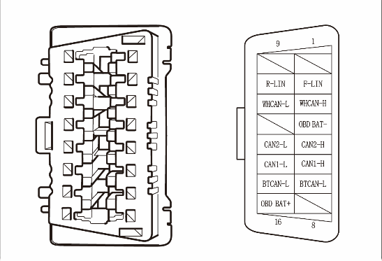

**10.6 上电开关**

-   上图⑥号，使用按键进行车辆上电和下电操作

**10.7七彩灯**

-   上图⑦号，七彩灯分为蓝色/绿色/红色/黄色/白色/青色/粉色，功能分为：
    故障指示（优先显示）： VCU检测到低级故障时，以10Hz的频率闪烁黄色 ；VCU
    检测到高级故障时，以10Hz的频率闪烁红色

-   电量指示如下表

| 高压电池SOC状态显示 |          |                                                          |                                                          |
|---------------------|----------|----------------------------------------------------------|----------------------------------------------------------|
| 状态                | SOC比例  | 遥控接管                                                 | 非遥控接管                                               |
| 良好                | 20\~100% | 绿色                                                     | 蓝色                                                     |
| 预警                | 10\~20%  | 初始为黄色，每隔5s，颜色改变为绿色，再隔1s，跳变为黄色。 | 初始为黄色，每隔5s，颜色改变为蓝色，再隔1s，跳变为黄色。 |
| 警告                | \<10%    | 初始为红色，每隔5s，颜色变为绿色，跳变为红色。           | 初始为红色，每隔5s，颜色改变为蓝色，跳变为红色。         |

# 11. 免责声明

1）本手册在印刷时已尽可能的包含各项功能介绍和使用说明。但由于产品功能不断完善、设计变更等，仍可能与您购买的产品有不符之处。由于产品更新，本手册与实际产品在颜色、外观等方面可能有所偏差，请以实际产品为准。  
2）为保护用户的合法权益，请您在使用本产品前务必仔细阅读我们随附本产品提供的说明书。套件提供商保留对上述文档进行更新的权利。请您务必按照说明书和安全须知操作本产品。  
3）本产品不适合未满18周岁及其他不具备完全民事行为能力的人士使用，请您避免上述人士接触本产品，在有上述人士出现的场合操作时请您格外注意。  
4）一旦开始使用本产品，即视为您已阅读、理解、认可和接受本产品的说明书、免责声明的全部条款和内容。使用者承诺对自已的行为及因此而产生的所有后果负责。  
5）在使用本产品的过程中，请您务必严格遵守并执行包括但不限于说明书里的要求。对于违反说明书所提示的使用行为或不可抗因素导致的一切人身伤害、事故、财产损失、法律纠纷，及其他一切造成利益冲突的不利事件，均由用户自己承担相关责任和损失，套件提供商将不承担任何责任。  
6）用户使用本产品直接或间接发生的任何违反法律规定的行为，套件提供商将不承担任何责任。
