# **快速介绍**

欢迎您选择百度Apollo联合北京智行者科技推出的自动驾驶套件，一款为开发者而生的自动驾驶开发软硬件平台。该套件采用纯线控底盘+高扩展硬件结构平台的方式，搭载多传感器套件，参照多冗余安全机制设计并可提供持续的开发资源，帮助您轻松实现硬件集成，降低自动驾驶门槛，加速您的自动驾驶研发进程。此quick start旨在帮助您快速了解Apollo套件的组成和使用注意事项，确保安全同时延长套件的使用寿命。如果您在使用过程中遇到问题或者有更好的建议给我们，欢迎在apollo开发者社区群一起讨论或者在Apollo开发者套件留下您的宝贵意见。

****

# **1. 车体整体结构**

## **1.1 车体整体结构简介**

本产品主要由两部分组成，分别为①车体部分、②底盘部分，如下图：


其中底盘包含如下部件，其结构图如下图所示：

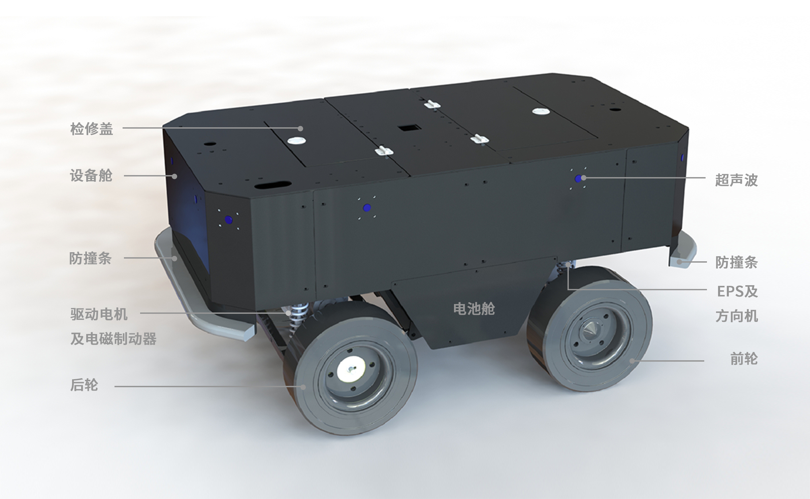

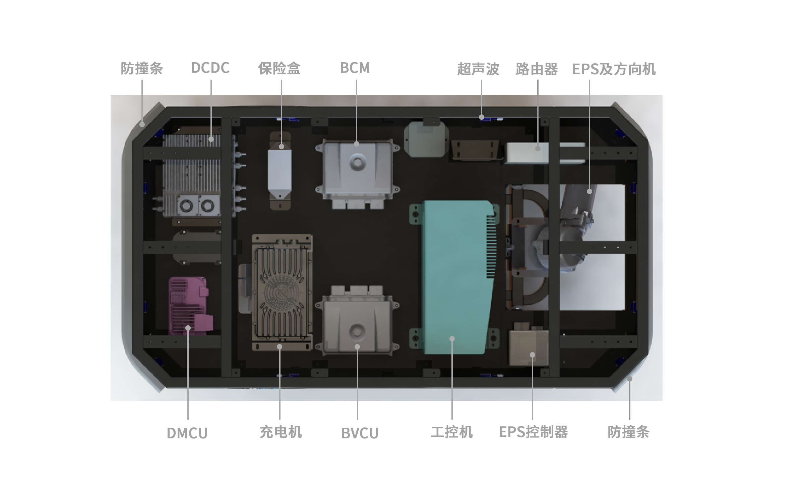

上装车体的结构如下图所示：
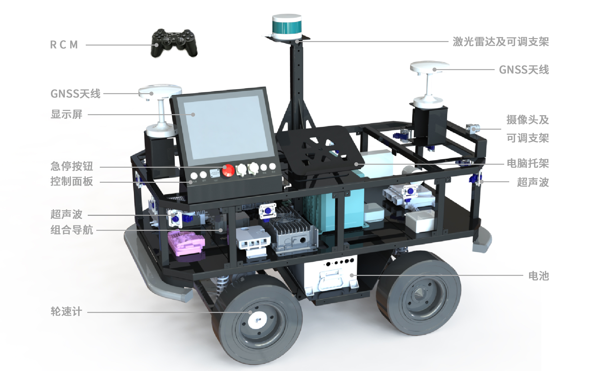

控制面板上各按键从左到右依次是：①电源开关、②遥控按键、③定位232升级口、④急停按钮、⑤网络调试口、⑥USB调试口、⑦使能开关、⑧自动开关

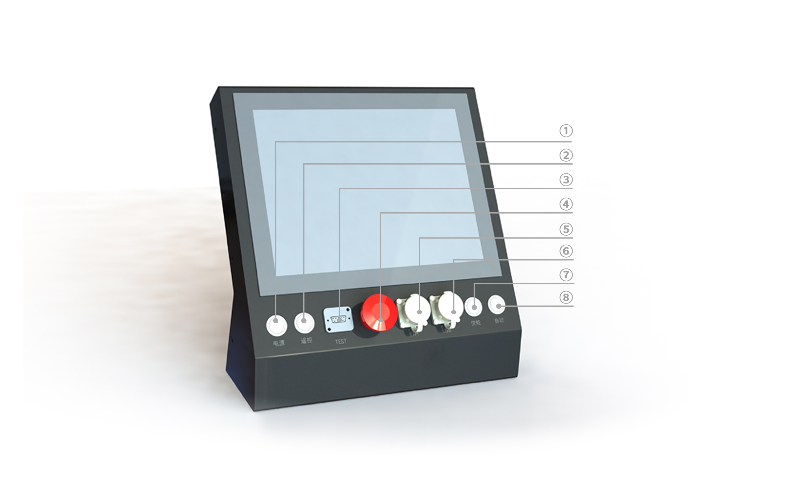

扩展供电口位于控制面板背部，位置如下图所示：

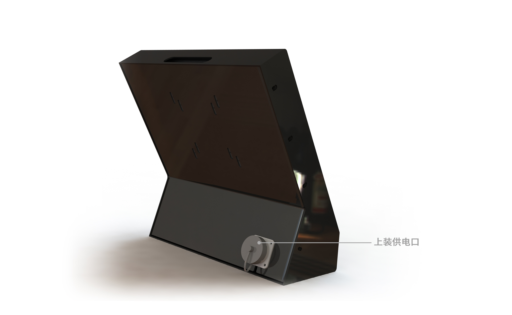

## 1.2 整车硬件参数

尺寸：1295(L)x695(W)x1128(H)mm

车速：巡航4km/h、最高6km/h

整车重量：194KG

最大载重：80KG

续航里程：60KM（综合工况）

续航时间：6-8h

最小转弯半径：1.18m

爬坡度：10°

最小离地间隙：80mm

# **2. 电池**

## 2.1 简介

本产品采用的是模块化锂电池组，电池组有正面和侧面两个操作面。产品外形如下图所示：
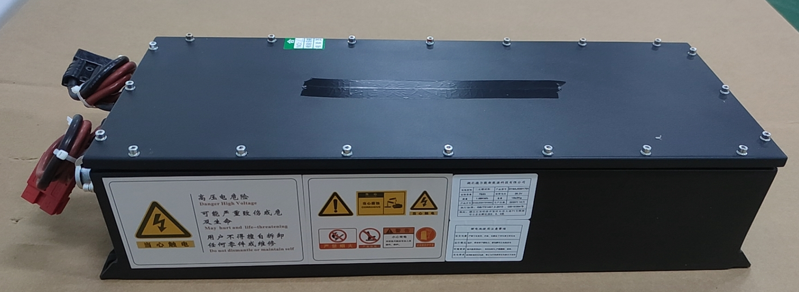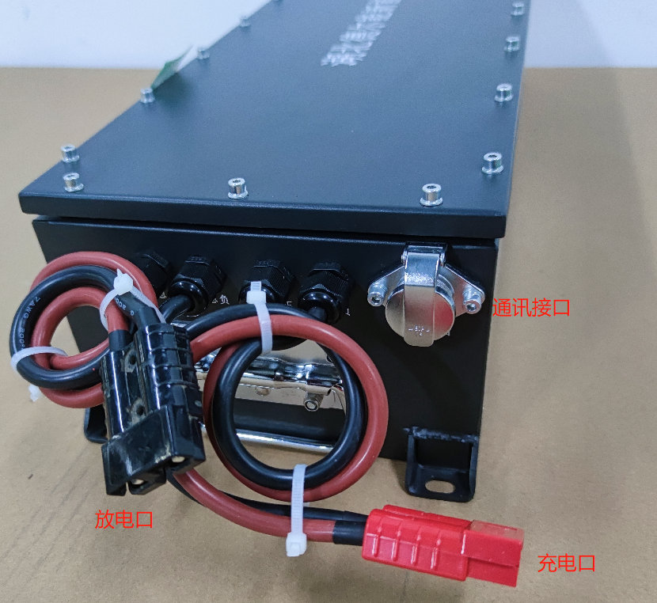
首先把电池箱可靠固定到整车安装位置，再将电池箱充放电接口与通讯接口与相应整车上的对接插件进行可靠的电气连接后，此时按下控制面板上的电源按钮，按钮出现红色背光，为整车上电状态，电池箱对外放电；若再次按下电源按钮，按钮弹起，红色背光消失，为整车下电状态，电池箱不对外放电。
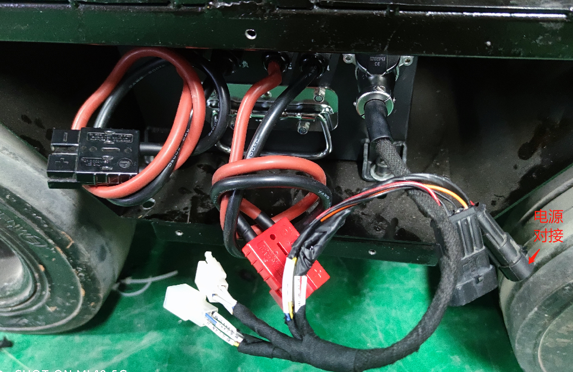
    

## 2.2 取放方式

电池组安装在底盘下方的电池舱内部，安装方式如下： 

1. 确保车辆停放在安全位置，全车处于断电状态，即控制面板上的电源按钮位于关闭位置（弹起状态且红色背光灯不亮）；
2. 将电池组放入电池舱内，并用4个螺栓将电池可靠固定，如下图所示：
   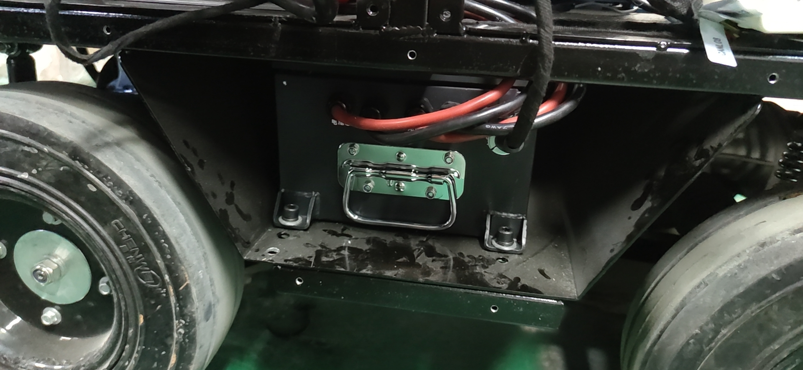
3. 将高压充/放电连接器、低压通讯连接器与整车上的相应连接器连接妥当，如下图所示：
   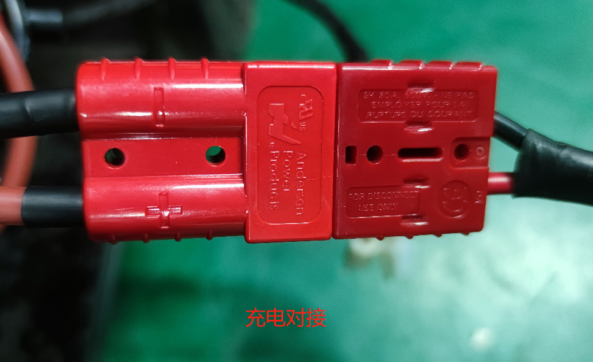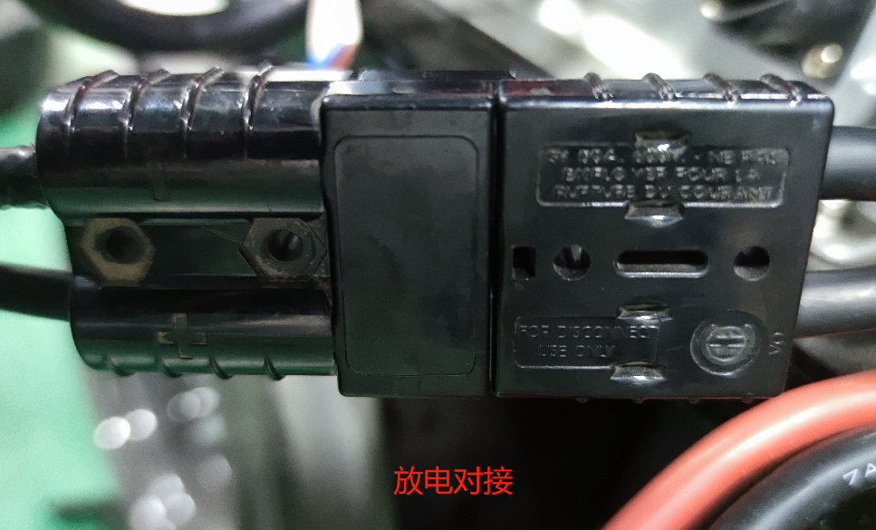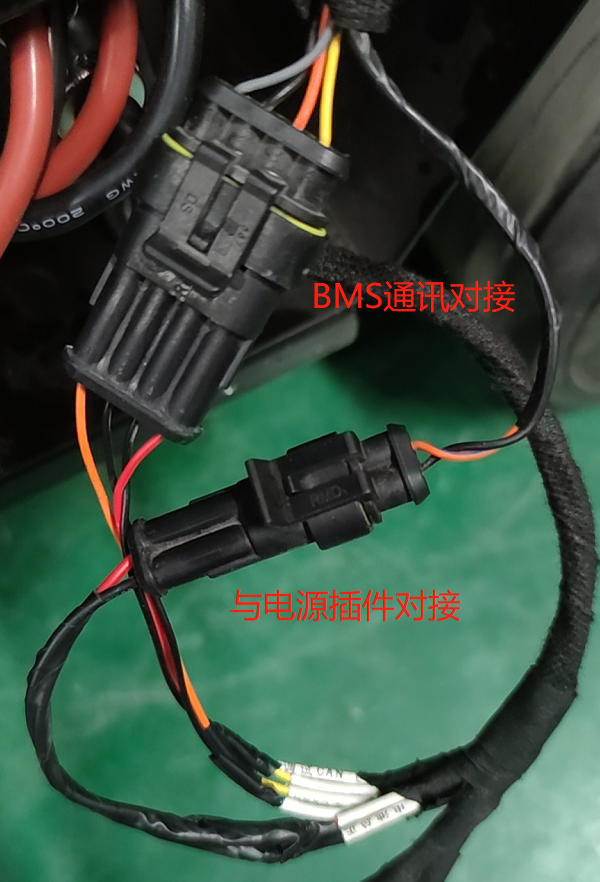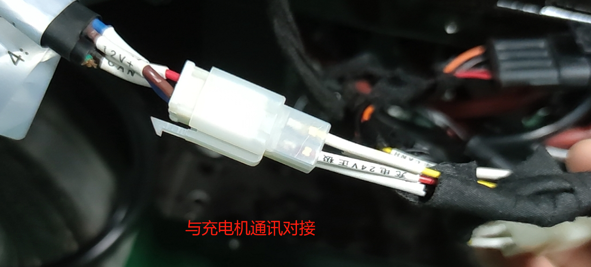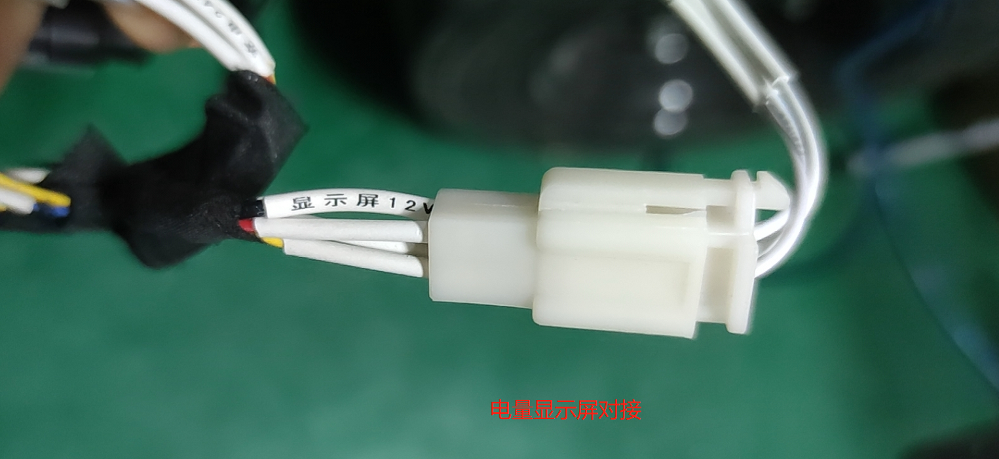
4. 最后将电池舱盖板用螺栓与整车可靠固定，确保盖板不会晃动，完成电池箱的安装。
   如果需要拆卸电池组，步骤相似，具体可参照以上安装步骤。
   •	警告：在确保全车断电即电源按钮处于关闭状态下进行操作。
   •	警告：请勿擅自使用其他型号或品牌的电池组，否则可能出现安全风险。
   •	警告：请不要在电池出现破损或是故障后继续使用。否则可能导致电池损坏或人员伤亡。
   •	警告：电池出现故障或报废后，请合理处置电池，遵守当地法规，否则可能导致严重环境污染。
   •	警告：电池电量显示屏处为电子件散热区，谨防溅水。
   •	警告：电池停止使用时请关闭电源按钮，切断电源，避免安全隐患。

## 2.3 充电方式及注意事项

充电方式：

- 请先参照本手册2.2的操作，并确保充电接口可靠连接；
- 取出随车充电枪，可靠的对插到车辆正后方充电口处，进行充电操作：
    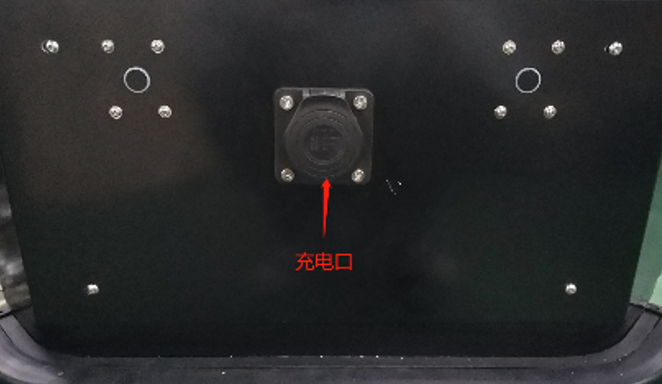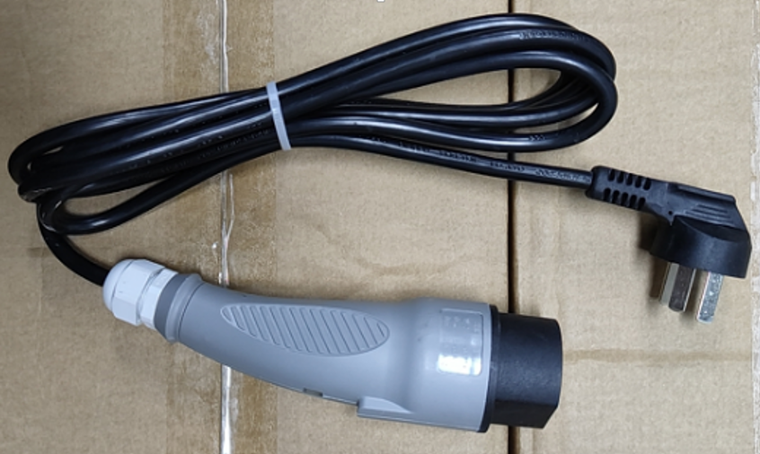
    上电步骤：先插充/放电插头，后接通220V电源
    下电步骤：先关电源开关，后拔充/放电插头；
    警告
    •	警告：充电时，严禁触碰电池组输出端口！
    •	警告：确保只使用原装适配的充电器对电池进行充电，否则有损坏或起火的危险！
    •	警告：为保证运行安全及电池寿命，ECU设定的截止放电量为5% SOC，电量低于5%时请不要继续使用。强烈建议电量低于10%时就断电进行充电操作。测试完成及时整车下电，严禁电池过放。
    •	警告：严禁将电源靠近热源，严禁私自拆装电源。
    •	警告：严禁短接，反接电源正负极。
    •	警告：电源内部设有保护板及电子线路，注意防水，严禁涉水。
    •	警告：在使用、充电或存储期间如发现电源变热、散发气味、变形或其他反常应立即停止使用。
    •	警告：零度以下严禁充电。
    •	警告：请用专配锂电充电器充电，不匹配充电器可能会带来安全隐患。
    •	警告：电池显示屏处为电子件散热区，谨防溅水。
    •	警告：电池停止使用时请关闭手动开关，切断电源，避免安全隐患。

## 2.4 上电及断电

在上电/断电之前，先确保车辆停放在安全位置，并将急停开关拍下。 

1. 上电
   •   按照2-2中的操作步骤，将电池组装入底盘电池舱且所有的电气插件可靠连接；
   •   将电源按钮置于开启位置（按钮红色背光亮起），整车上电，此时车辆可以执行车辆具备的所有功能，如下图所示：
   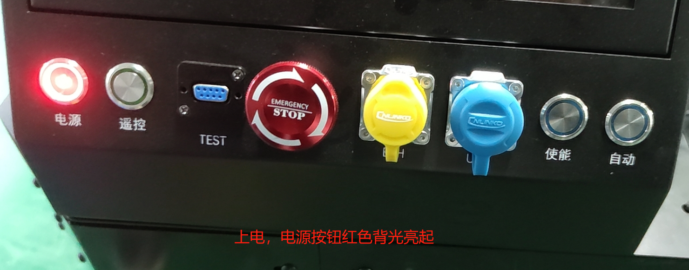

2. 断电
   •   将电源按钮置于关闭位置，即可完成整车断电，如下图所示：
   


# **3. 遥控器及注意事项**

## **3.1 遥控器介绍**

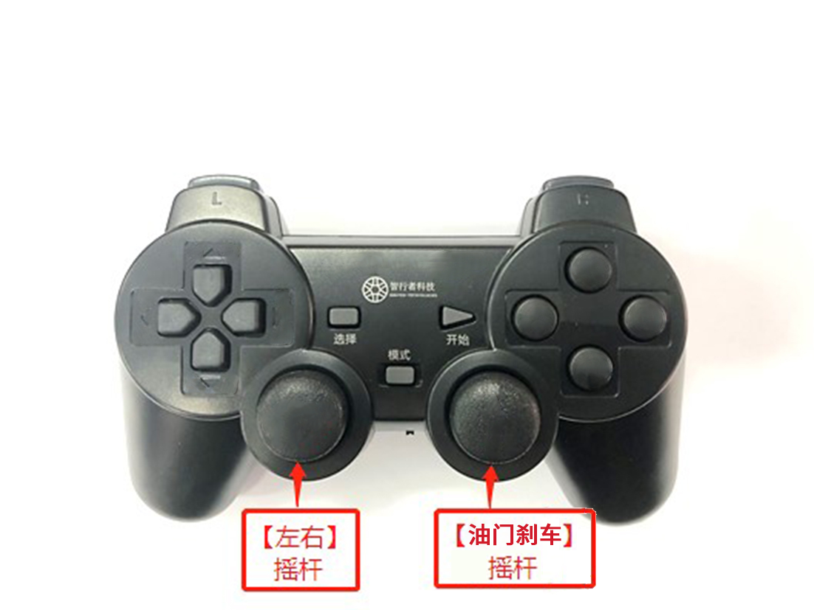

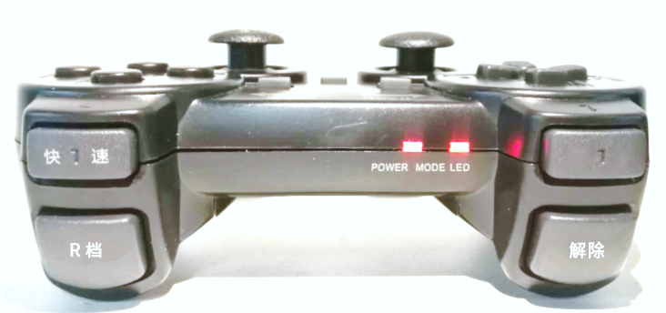

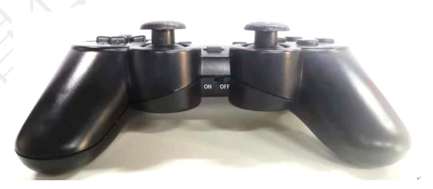

遥控器采用两节7号电池进行供电，此外具有以下控制单元：

* 电源控制开关——power
* 左右控制摇杆——向左左转，向右右转
* 油门刹车遥杆——向上推油门从0逐渐增大，向下推刹车从0逐渐增大
* 解除——长按会解除超声波AEB停车功能 ，松开恢复超声波AEB功能
* 换档开关——常规默认挂D档，默认D档，R档键按下不放，车辆挂入倒挡，缓缓将油门刹车控制遥杆 向上推，车辆加油，车辆开始倒车，向下推，车辆刹车，车辆开始减速。
* 提示：遥控的时候车辆默认为D档，为了保证安全操作，对于D<->R档位切换，一定要注意停车才换挡；停车时D->R换档时，一定要先按键挂R档后，再给油门；从R->D换档时，一定要先停车释放油门，再松R档按键。


A/B键模块，包括两个部分：控制器和**A/B键**，如下图所示：

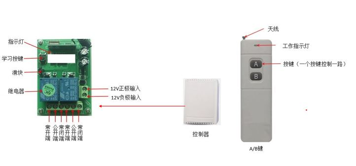


* A/B键遥控器匹配方法：打开遥控器电源开关，按住控制器的学习按键3秒，指示灯灭（表示已进入学习状态），松开学习按键，按遥控器任意键，指示灯闪4次后常亮，表示学习成功（重新配对是需要打开控制器的，但是我司出厂已配对成功）。
* A/B——远程急停功能，按下A键或B键车辆紧急制动，进入急停模式，再按一下解除（A键、B键任意一个按下就有效）
* 注意：默认状态下左右、油门刹车遥杆位于中值（在中间），各按键为弹起状态。
* 警告：进行电池更换操作前请关闭遥控器电源开关，以免出现危险情况。
* 警告：操作油门/刹车摇杆时，请注意当前档位，以免造成危险。
* 警告：遥控器电池长期不用建议取出，更换电池对接插针时请仔细识别正负。
* 警告：遥控器电量不足时，POWER LED灯会闪烁提示，在这种情况下，遥控会出现迟滞、不响应等情况，请及时更换电池。

## **3.2 开启和关闭**

**开启：**

遥控器配对流程

​		1. 整车上电工况下，遥控器电源开关拨到**【ON】**，确认遥控器POWER【**LED**】红灯亮；

​		2. 按下车辆控制面板上的**遥控按键**（自复位按键），确认车辆面板**遥控按键**的绿色LED闪烁；

​		3. 按住遥控器【**开始**】按键2s左右 , 确认喇叭响2声，并且车辆面板**遥控按键**的绿色LED有闪烁变为常亮，表

示车辆配对成功；

​		4. 按下遥控器**【模式】**按键，检查确认遥控器 **MODE LED**亮起，即可遥控车辆。

关闭遥控器电源

​		遥控器使用完毕后，遥控器电源开关拨到**【OFF】**，遥控器两个【**LED**】红灯同时熄灭，且同时关闭车辆面板遥控按键，遥控器配对断开。
* 提示：如果匹配车辆按下【**急停**】按键，会直接退出遥控模式，即无法遥控控制车辆前进、后退及转向。
* 提示：只有**MODE LED**和**POWER**两灯同时亮起，才能正常遥控车辆。
* 警告：如果需要长时间停车，建议按下车辆上的【**急停**】按键。

## **3.3 急停**

当拍下急停按钮或者按下**A键**或**B键**后，车辆会立即刹车，退出前一时刻所有的控制。
提示：当触发急停时，底盘前进后退控制无效。只有当急停开关处于弹起状态时，刹车才会释放，使操作人员可以控制车辆。

## **3.4 转向及行进**

**【左-右】遥杆：**车辆横向控制（上下无反应），左右控制车辆转向。

**【油门/刹车】遥杆：**车辆纵向控制（左右无反应），往上推到底前进；按下**R档**按键 ，往上推会实现倒车功能，换档时一定要停车换挡。

**【快速】按键**：前进时推杆推到底同时按下遥控器**【快速】**按键，车辆为快速模式；推杆往下推为刹车模式。

提示：摇杆带有自动回位功能，松开方向摇杆，底盘方向会自动回正；松开前进后退摇杆，底盘会停止运动。

* 警告：出于安全考虑，在人工接管驾驶时，请不要来回拨动遥控杆，避免突然刹车、突然转向等可能导致危险情况的出现。
* 提示：遥控的时候车辆默认为D档，为了保证安全操作，对于D<->R档位切换，一定要注意停车才换挡；停车时D->R换档时，一定要先按键挂R档后，再给油门；从R->D换档时，一定要先停车释放油门，再松R档按键。

## **3.5 车辆安全机制**

为了您的安全，在进入自动驾驶模式前，请务必提前熟悉急停和A/B键的各项操作，请在每次进入自动驾驶模式前进行车端的急停按钮和A/B键操作确认，同时确保A/B键电量充足。为了您的安全，我们已在工控机与底层协议层定义了急停按钮和A/B键的优先权，即平台移动的任何状态下，只要按下急停按钮或A/B键时会立即进入急停模式，为您的安全测试保驾护航。

`注意`：在按下急停按钮的急停模式下，车轮会处于抱死状态；同时在急停按钮没有松开释放之前是不能进入遥控模式和自动驾驶模式的；

`注意`：在A/B键触发下的急停模式下，轮会处于抱死状态；同时，在A/B键未复位的模式下（A、B两键用谁触发就用谁复位，如A按键触发，必须用A键复位），车辆是不能进入遥控模式和自动驾驶模式的。

## **3.6 遥控器安全操作提示**

- 开启遥控器电源前，确保所有按键都是弹起状态，待遥控器匹配成功后，即可接管；

- 进入遥控器模式后，需要试车，即依次对各功能键进行检查，确认无误后方可采用遥控器控制车辆；

- 遥控器操控车辆起步时，请勿一次性将遥控器拨杆推到极限，以免发生危险，应慢慢推动遥控器拨杆，车辆缓缓启动后根据情况适当调节推杆，并时刻注意周围环境，危险情况下及时使用**A/B**键接管或者按下车辆的急停按钮；


​      `注意`：遥控器**左右摇杆**、**油门/刹车摇杆**需谨慎操作，避免转向、加速或刹车过急。

- 遥控器电量不足时，POWER LED灯会闪烁提示，在这种情况下，遥控器控制车会出现迟滞、不响应等情况，请及时更换电池；

- 操作时如感觉遥控器异常，立即停车，如遇紧急情况时，立即使用车辆的急停按钮或**A/B**键停车；

- 临时停车状态下要养成断开遥空电源开关的好习惯，长时间停车要按下车辆的急停按钮；

- 出于安全考虑，任何人在进行遥控器的操作前都应该仔细阅读相关说明和注意事项，请不要将遥控器交给不熟悉相关操作的人员使用，以免发生危险。 

- 在车辆退出遥控控制模式前，需确保车辆在完全停止状态下，再退出；

- 长时间不用遥控器（2分钟），遥控器会进入休眠模式，通过 **“开始”**可以唤醒遥控并可控制车辆。超过3分钟需要唤醒并与车辆重新配对才能控制车辆


# **4. 硬件软件安装与调试**

在了解了第3节的内容后，您已经可以使用遥控器完成非自动驾驶模式下的各项移动操作。


# **5. 使用场景限制**

- 避免急停急走，尽量缓慢启动/制动，匀速运行

- 由于不具备照明设备，尽量避免在夜间行车

- 请勿在冬天气温过低的地区运行

- 夏天运行出车辆的时候需要尽可能避免太阳长时间直晒，以免超过部分器件运行温度

- 虽然大多器件具有防水防尘能力，但是请勿在下雨、下雪、沙尘暴等不利天气情况下运行

- 请注意道路限高限宽，以免产生磕碰

- 请在简单封闭区域运行此产品，请勿在未经许可情况下驶入公共道路、机动车道或高速公路

- 遇到减速带/颠簸路面时，请勿高速通过

- 禁止在积水超过`3cm`的积水中运行

- 遇到光滑的路面时，请勿急停，急转，以免出现侧翻的情况

- 上下坡时请注意控制车速，超时做好刹车准备

- 禁止驾驶此车上下台阶

- 请勿在行驶时在车架上放置与行驶无关的物品


# **6. 车辆安全机制**

## **6.1 限速保护**

无论自动驾驶模式或是遥控驾驶模式，ECU会将车速限制在一个比较安全的范围。小车的最高速度被限制为前进6km/h，后退5km/h，以防止严重的碰撞事故（为了实验安全，遥控或线控超出该速度范围会直接触发急停予以警告）。正常测试使用建议车速在0~6km/h。
注意：安全起见，遥控驾驶车辆时建议最好将车速控制在6km/h左右，并时刻注意危险情况，随时做好接管准备，正常测试建议遥控器专人负责。

## **6.2 遥控接管优先级定义** 

当车辆处于自动驾驶模式时，如果出现偏离航向、车速过快或者有碰撞风险时，可以直接使用**A/B**键接管车辆的控制，**A/B**键所发出的控制指令的优先级永远高于自动驾驶系统所给出的控制指令。

- 遥控器不具备远程接管能力

## 6.3 超声波AEB功能

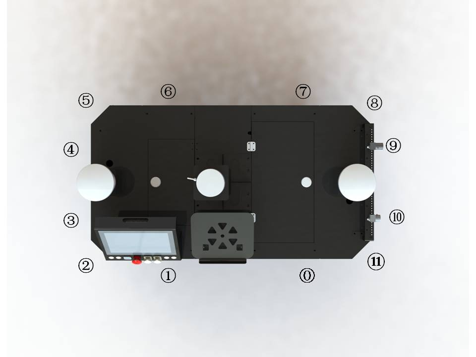

车上共装有12个超声波，前后各4个STP-318超声波，两侧各两个STP-313超声波。STP-318超声波有效的检测距离为：20cm ~170 cm；STP-313超声波有效的检测距离为：21cm ~178 cm。

STP-318探头除了收到自己发射的超声波信号，还可以收到相邻的一个探头发射的超声波信号，得到的这两个距离值分别称为直接距离和间距距离，STP-313超声波只有直接距离。

1. 前进触发AEB条件


车辆前进时，当前4个超声波（8号~11号）中，有任意一个检测到达到触发值时，就会触发AEB功能，正前方9~10号超声波设置的安全距离大于等于90cm；两侧的（8号和11号）超声波安全距离大于等于40cm；

2. 倒车触发AEB条件


车辆倒车时，当检测到正后方两个超声波#3-#4中，有一个达到触发值就会触发AEB功能，后侧的安全距离大于等于40cm；	

- 提示：超声波触发后，长按遥控上的解除按钮，可解除超声波AEB功能，松开后恢复超声波AEB功能。

​	

## **6.3 碰撞保护**

车辆前后分别有一条防撞条，能够感应防撞条与车体间的压力从而判断是否发生了碰撞。当发生轻微碰撞时，碰撞保护触点开关感受到压力就会立即解除动力，并会触发刹车，待车停稳后自动复位，以防进一步伤害。此外，防撞条本身也能形成有效的隔离，一定程度上保护车辆和被撞物体。
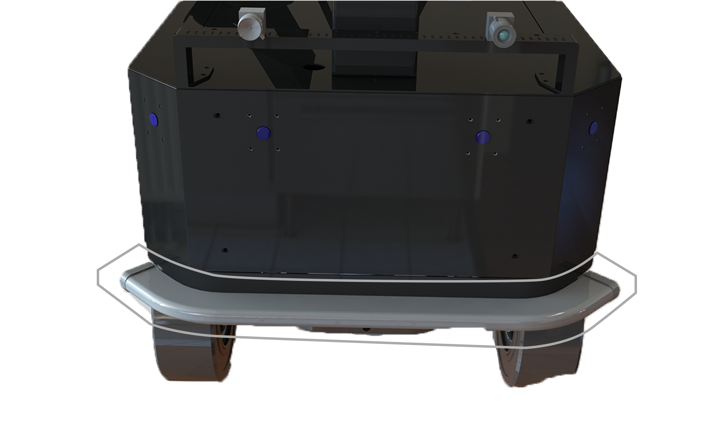 

# **7. 车辆网络配置**

## **7.1 4G路由器网络配置**

- wifi名是厂商默认名字
- wifi登录密码为:`12345678`

- 路由器登录地址为:`192.168.1.1`
- 路由器登录密码为:`admin`

## **7.2 工控机的网络配置** 

- 工控机用户名:`apollo`
- 工控机密码:`apollo`
- 工控机网卡固定IP可参考文件`/etc/netplan/01-network-manager-all.yaml`
```
# Let NetworkManager manage all devices on this system
network:
  ethernets:
        enp8s0:
            addresses: [192.168.1.109/24]
            dhcp4: no
            dhcp6: no
            gateway4:  192.168.1.1
            nameservers:
                addresses: [8.8.8.8, 9.9.9.9, 114.114.114.114]
        enp0s31f6:
            addresses: [192.168.2.108/24]
            dhcp4: no
            dhcp6: no
            # gateway4:  192.168.1.1
            # nameservers:
            #   addresses: [8.8.8.8, 9.9.9.9, 114.114.114.114]
  version: 2
  renderer: NetworkManager
```

## **7.3 定位模块M2的网络配置**

- M2的IP为：`192.168.1.123`

- M2需要配置车辆的杆臂值，具体量取方法请参考官方文档[循迹搭建--车辆集成](https://github.com/ApolloAuto/apollo/blob/master/docs/D-kit/Waypoint_Following/vehicle_integration_cn.md)，推荐的杆臂值为：
```
x_offset: 0.0m
y_offset: -0.225m
z_offset: 0.512m
```

## **7.4 激光雷达的网络配置**

- 激光雷达的IP为：`192.168.2.201`

# **8. 常见问题及解决方法**

**Q：车辆不启动怎么办？**

A：首先请检测电池组是否为有电，电池组安装是否正确（包括接线是否正确），之后检查车辆是否正确上电。如经过上述操作仍无法启动，请在Apollo开发套件QA微信群反馈，会有相关技术人员为您跟进。

**Q：车辆不响应遥控指令怎么办？**

A：首先检查车辆控制面板遥控指示灯是否点亮（如果是闪烁或者熄灯状态，说明此时遥控器根本没有匹配成功），然后，检查遥控器电源开关是否处于开启位置，检查遥控器是否有电，确保遥控器前面两个指示灯点亮状态。如上述操作后仍不能解决问题，请在Apollo开发套件QA微信群反馈，会有相关技术人员为您跟进。

**Q：底盘上电后车辆显示屏不亮，工控机不工作怎么办？**

A：首先检查，车端供电插头是否跟电池放电端连接妥当，然后检查急停或者防撞是否工作，如果没反应，请联系线上技术支持。

**Q：车辆无法进入自动驾驶？**

A：首先检查遥控器是不是已经放权，以及急停按钮是否处在弹起状态，以及A/B键是否复位，如果依然无法进入自动驾驶，请重启车辆确认是否可以进入自动驾驶，如不可行，可通过第8章的方法查看底盘是否有故障上报。

# **9.通过chassis_detail查看车辆故障信息**

通过执行cyber_monitor，查看底盘chassis_detail信息：

chassis_detail分为(1)check_response; (2)devkit

devkit部分分12个模块上报，分别是：(1) throttle_report_500; (2) brake_report_501; (3) steering_report_502; (4) gear_report_503; (5) Park_report;_504 (6) vcu_report_505; (7) wheelspeed_report_506; (8) ultr_sensor_1_507; (9) ultr_sensor_2_508; (10) ultr_sensor_3_509; (11) ultr_sensor_4_510; (12) ultr_sensor_5_511;

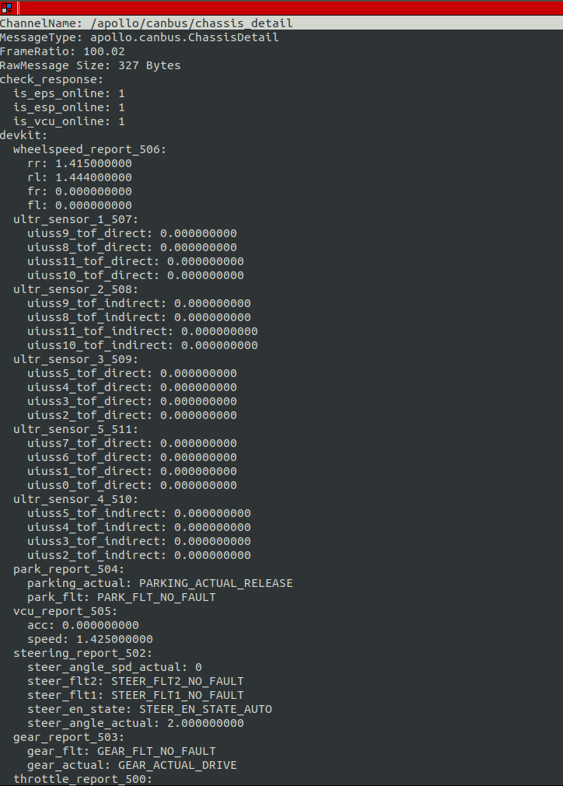

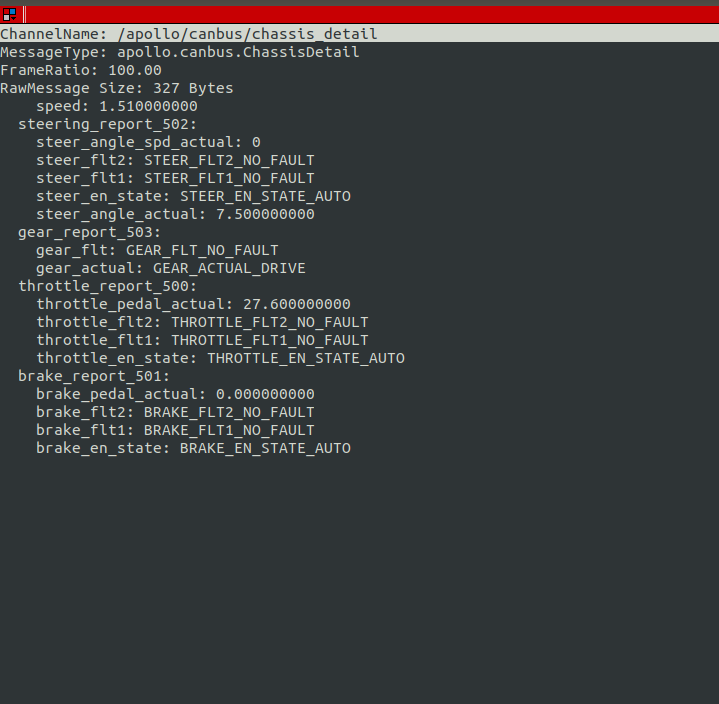

a. check_response

车辆进入自动驾驶后，相应的状态会由0变为1: is_eps_online:1;  is_esp_online:1;  is_vcu_online:1; 如果仍旧为0,说明没有进入自动驾驶，首先检查遥控器是否放权，若放权后还是不能进入再自动驾驶，请检查ch部分是否有故障上报。

b. devkit

​	   **throttle_report_500：**

​       throttle_pedal_actual：实际油门踏板量（百分比）

​       throttle_flt2:控制通信故障标志位

​       throttle_flt1:油门故障标志位

​       throttle_en_state:油门使能状态

​	   **brake_report_501：**

​       brake_pedal_actual：实际刹车踏板量（百分比）

​       brake_FLT2:控制通信故障标志位

​       brake_FLT1:刹车故障标志位

​       brake_en_state:刹车使能状态

​	   **steering_report_502：**

​       steer_angle_spd_actual：

​       steer_flt2:控制通信故障标志位

​       steer_flt1:转向故障标志位

​       steer_en_state:转向使能状态

​       steer_angle_actual:实际转向角度

​	   **gear_report_503:**

​       gear_flt:档位故障标志位

 	  gear_actual:实际档位

​	   **park_report_504:**

​       parking_actual:实际手刹状态

 	  parking_flt:手刹故障标志位

​	   **vcu_report_505:**

​	   acc:实际加速度（预留）

​	   speed:实际车速

​	   **wheelspeed_report_506:**

​		rr:右后轮轮速（m/s）

​		rl:左后轮轮速（m/s）

​		fr:右前轮轮速（预留）

​		fl:左前轮轮速（预留）

​	    **ultr_sensor_1_507:**

​		uiuss9_tof_direct:9号超声波直接距离

​		uiuss8_tof_direct:8号超声波直接距离

​		uiuss11_tof_direct:11号超声波直接距离

​		uiuss10_tof_direct:10号超声波直接距离

​	    **ultr_sensor_2_508:**

​		uiuss9_tof_indirect:9号超声波间接距离

​		uiuss8_tof_indirect:9号超声波间接距离

​		uiuss11_tof_indirect:9号超声波间接距离

​		uiuss10_tof_indirect:9号超声波间接距离

​	    **ultr_sensor_3_509:**

​		uiuss5_tof_direct:5号超声波直接距离

​		uiuss4_tof_direct:4号超声波直接距离

​		uiuss3_tof_direct:3号超声波直接距离

​		uiuss2_tof_direct:2号超声波直接距离

​        **ultr_sensor_4_510:**

​		uiuss5_tof_indirect:5号超声波间接距离

​		uiuss4_tof_indirect:4号超声波间接距离

​		uiuss3_tof_indirect:3号超声波间接距离

​		uiuss2_tof_indirect:2号超声波间接距离

​	    **ultr_sensor_5_511:**

​		uiuss7_tof_direct:7号超声波直接距离

​		uiuss6_tof_direct:6号超声波直接距离

​		uiuss1_tof_direct:1号超声波直接距离

​		uiuss0_tof_direct:0号超声波直接距离

- 注：读到的超声波的值，乘以0.01724就是实际的距离，单位为：cm

# **10. 日常保养和维护**

## **10.1 清洁和存储**

- 底盘及车架如有灰尘或是污渍，可以用湿布进行擦拭；其它上装传感器器件也可以用同样的方式进行清洁，但是需要在擦拭过后用干布擦去表面的水分；工控机由于内部零件较为敏感且容易积攒灰尘，需要打开进行清洁。
- 摄像头要及时清理灰尘。
- 请勿随意使用酒精、汽油、煤油或其他具有腐蚀性、挥发性的溶剂对各个部位进行清洁。这些物质可能会损坏车体结构或是内部部件。
- 在进行清洁前，请确保车辆已经正确断电，否则可能导致漏电、触电的后果。
- 不使用时，请将车辆放在阴凉、干燥的位置，并用防尘罩进行遮蔽。请不要将车长时间存放在户外，过冷和过热都会对器件的寿命产生影响。

## **10.2 电池**

- 不要将电池组放置在超过 50℃的高温或低于 -20℃的低温环境中（例如，请勿将其电池组放在夏天曝晒下的汽车中）。
- 避免电量完全耗尽再充电，尽量即充即用，这样可大大延长电池的使用寿命。另外，在常温下使用，电池组可发挥较高的续航里程和性能。
- 为了避免电池过放，每隔1个月对电池进行充电和放电。如长时间存放，将电池拆卸，并保持间隔1个月的充放电操作。
- 电池要轻拿轻放，谨防撞坏！

提示：非专业人员禁止随意拆卸电池组，否则可能因电击或短路导致严重安全事故！

## **10.3 车体部件**

- 定期向底盘车轴、轮轴等位置补加润滑油。
- 定期检查关键传感器的安装是否产生松动，若有松动及时紧固。

## **10.4 安全注意事项**

- 请不要随意拆卸车体盖板，严禁上电状态拆装盖板，严禁带电操作，如：插拔线束或用手触摸制动，转向以及其他运动机构；如有特殊需求，请联系线上技术支持。
- 请不要随意加装更改电路，如有特殊需求，请联系线上技术支持。
- 因违规操作产生的人身伤害套件提供商不承担任何责任

# **11. 免责声明**

- 本手册在印刷时已尽可能的包含各项功能介绍和使用说明。但由于产品功能不断完善、设计变更等，仍可能与您购买的产品有不符之处。由于产品更新，本手册与实际产品在颜色、外观等方面可能有所偏差，请以实际产品为准。  
- 为保护用户的合法权益，请您在使用本产品前务必仔细阅读我们随附本产品提供的说明书。套件提供商保留对上述文档进行更新的权利。请您务必按照说明书和安全须知操作本产品。  
- 本产品不适合未满18周岁及其他不具备完全民事行为能力的人士使用，请您避免上述人士接触本产品，在有上述人士出现的场合操作时请您格外注意。  
- 一旦开始使用本产品，即视为您已阅读、理解、认可和接受本产品的说明书、免责声明的全部条款和内容。使用者承诺对自已的行为及因此而产生的所有后果负责。  
- 在使用本产品的过程中，请您务必严格遵守并执行包括但不限于说明书里的要求。对于违反说明书所提示的使用行为或不可抗因素导致的一切人身伤害、事故、财产损失、法律纠纷，及其他一切造成利益冲突的不利事件，均由用户自己承担相关责任和损失，套件提供商将不承担任何责任。  
- 用户使用本产品直接或间接发生的任何违反法律规定的行为，套件提供商将不承担任何责任。
