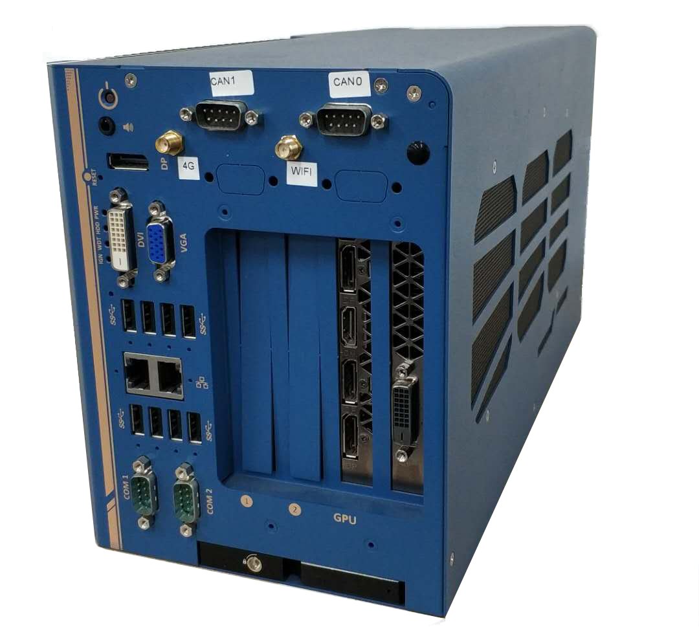
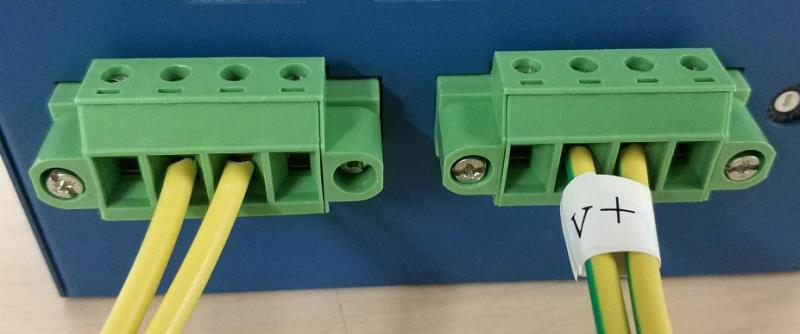
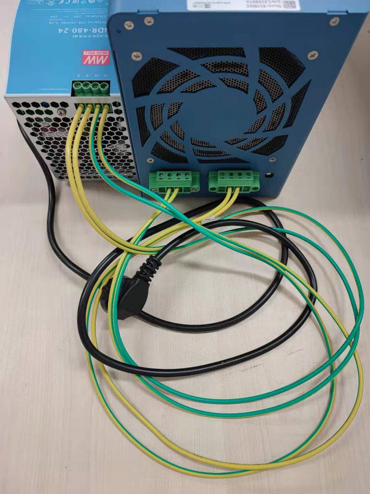
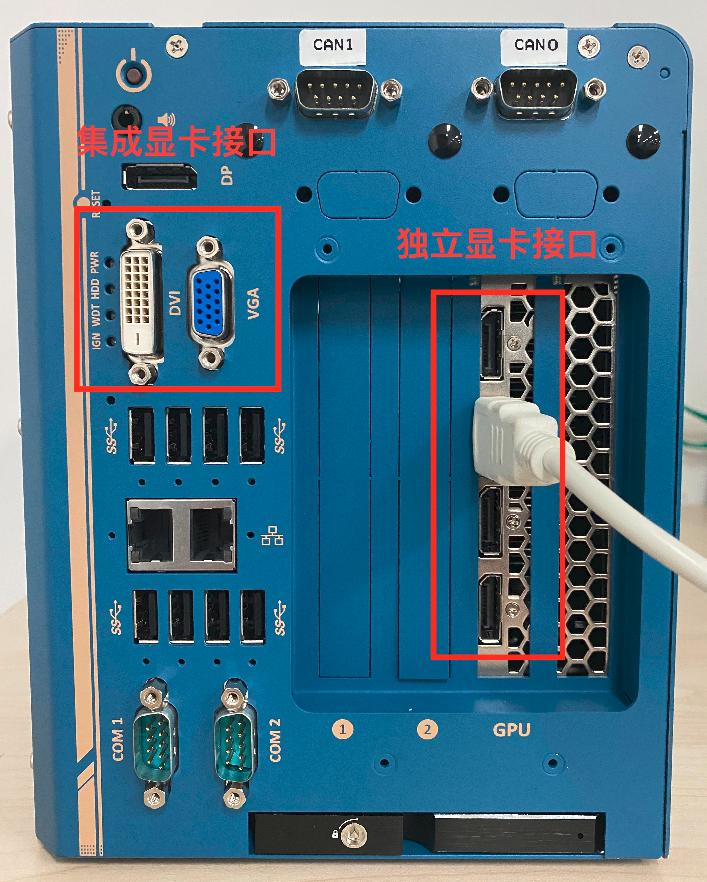
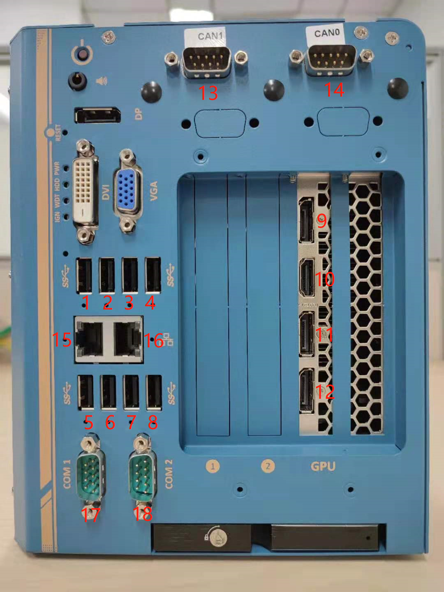

# 循迹搭建--Apollo系统安装
- [循迹搭建--Apollo系统安装](#循迹搭建--Apollo系统安装)
  - [概览](#概览)
  - [工控机系统安装](#工控机系统安装)
    - [工控机硬件安装](#工控机硬件安装)
      - [IPC配置](#IPC配置)
      - [准备IPC](#准备IPC)
        - [配置IPC加电组件](#配置IPC加电组件)
        - [启动计算机](#启动计算机)
    - [工控机软件系统安装](#工控机软件系统安装)
      - [配置Linux系统](#配置Linux系统)
        - [安装GCC和G++](#安装GCC和G++)
      - [升级Apollo源代码](#升级Apollo源代码)
      - [设置Apollo编译环境](#设置Apollo编译环境)
      - [编译Apollo源代码](#编译Apollo源代码)
      - [运行DreamView](#运行DreamView)
      - [NEXT](#NEXT)
      - [常见问题](#常见问题)

## 概览

该用户手册旨在帮助用户在开发套件上安装、配置软硬件，并启动使用Apollo自动驾驶平台。

## 工控机系统安装

在集成车辆之前，首先需要完成工控机的硬件安装，如电源模块的安装；之后需要完成工控机的软件安装，包括Ubuntu Linux安装、Apollo软件系统安装等。

### 工控机硬件安装

工控机硬件安装包括电源模块的安装和相关线缆的连接，以及BIOS相关的设置。

#### IPC配置

参考下述IPC配置：

- Nuvo-8108GC-RTX2070s-i9-9900k

- DDR4-32GB-ECC

- Seagate M.2 2280 NVMe SSD(PCIe Gen3x4)512G

- EMUC-B202 CAN

- 480W适配器

  


#### 准备IPC

参考下述步骤：

##### 配置IPC加电组件

  将电源线接入到为IPC配置的电源连接器（接线板）

- 8108的电源线

8108的电源线是四根，两正两负，正极的两根电源线是贴有`V+`的白色标签的，如下图所示：

   

将接有正极的两根电源线的端子插入`V+`接口，将接有负极的两根电源线的端子插入`GND`接口，如下图所示：

   

   如果工控机在办公室使用的话，请使用下图中的电源适配器给工控机供电；如果工控机在小车上使用的话，请使用小车上的接线盒引出的24V的电源来给工控机供电。

   
  
##### 启动计算机

如果系统接入了一个或多个外部插入卡，建议通过BIOS设置风扇的转速：

```
- 计算机启动时按F2进入BIOS设置菜单
- 进入 [Advanced] => [Smart Fan Setting]
- 设置 [Fan Max. Trip Temp] 为 50
- 设置 [Fan Start Trip Temp] 为 20
```

如果用户使用的是已经提前预装好显卡驱动及Apollo镜像的工控机版本，则使用HDMI线连接显示器与工控机的独立显卡的HDMI接口即可：



工控机需要外接大量的外部设备，下面给出一些常用的外设的接口安装位置的建议。



如上图所示，1-8是8个usb接口；9-12是独立显卡的4个接口，其中9、11和12是dp接口，10是hdmi接口；13和14是两个can卡接口；15和16是两个有线网卡接口；17和18是两个com接口。
8个usb接口中，指定1接车头的左边的6mm相机，2接车头的中间的12mm相机，3接车头的右边的6mm相机，4接imu的usb数据线。5-8四个usb接口给客户自己外接键盘鼠标等其他外设，不做指定。独立显卡的4个接口中，10接hdmi延长线和车尾的显示器相连接，其他三个dp接口暂时不用。13和14这两个can口中，接口14是can0接口，接底盘的can线；接口13是can1接口，接毫米波雷达的can线。15和16这两个有线网口分别接4G路由器和激光雷达的网口。17和18是com接口，在配置imu时，需要将imu的升级口通过串口延长线接到接口17的COM1上。

建议设置IPC的运行状态为一直以最佳性能状态运行：

```
- 计算机启动时按F2进入BIOS设置菜单
- 进入 [Power] => [SKU POWER CONFIG] => 设置为 "MAX TDP"
```

### 工控机软件系统安装

 在本小节中，开发套件的客户的工控机已经预装了Ubuntu18.04LTS操作系统和apollo运行所需的环境，我们可以直接编译apollo开启我们的自动驾驶之旅了。若您需要自己重装系统，请点击[循迹搭建--Apollo系统重装](reinstall_my_apollo_system_cn.md)查看重新安装Apollo系统的方法。

#### 配置Linux系统

开发套件的客户的工控机已经预装了Ubuntu18.04LTS操作系统和apollo运行所需的环境，预装系统的IPC的用户名和密码均为apollo。

**WARNING**：在整个Apollo系统的操作过程中，全程禁用root账户，皆用普通账户进行操作，切记！

##### 安装GCC和G++

请执行以下命令安装gcc和g++，命令如下：
```
sudo apt update
sudo apt install gcc g++ -y
```

安装完成后，请先用以下命令检查gcc和g++的版本：
```
gcc --version
g++ --version
```

若输出的gcc和g++是7.5.0版本的，则确认安装成功；否则请重新安装直到成功为止。

**WARNING**：在以下模块的操作中，如非本文档或操作系统要求，禁用一切`sudo`操作，切记！

#### 升级Apollo源代码

当前用户的home目录下已有Apollo代码，请按照以下步骤来更新代码：

```
cd ~/apollo
git checkout .
git pull origin v6.0_edu
```

#### 设置Apollo编译环境

a.设置环境变量，在终端输入以下命令：

```
cd ~
echo "export APOLLO_HOME=$(pwd)" >> ~/.bashrc && source ~/.bashrc
source ~/.bashrc
```

b.将当前账户加入docker账户组中并赋予其相应权限，在终端输入以下命令：

```
sudo gpasswd -a $USER docker  
sudo usermod -aG docker $USER  
sudo chmod 777 /var/run/docker.sock
```

命令执行完成后，重新启动一下计算机。

c.请输入以下命令加载docker的image镜像：

```
cd ~/images_v6.0_edu
sudo bash LoadImages.sh
```

#### 编译Apollo源代码

a.启动并进入docker容器，在终端输入以下命令：

```
cd ~/apollo
bash docker/scripts/dev_start.sh -g cn
```

第一次进入docker时或者image镜像有更新时会自动下载apollo所需的image镜像文件，下载镜像文件的过程会很长，请耐心等待；如果你确信计算机本地有你需要的image镜像文件或者你不希望更新image镜像时，可以使用`bash docker/scripts/dev_start.sh -l`这个命令代替上面的命令，这样apollo就不会去github的官方网站比较本地image镜像和官方网站image镜像的区别了，这样可以省去二者比较的时间和避免因网络问题而导致的二者比较失败的现象，可以加快启动docker容器的速度。这个过程完成后，请输入以下命令以进入docker环境中：
```
bash docker/scripts/dev_into.sh
```

b.编译apollo，在终端输入以下命令，等待编译完成，整个编译过程大约耗时30分钟：

```
bash apollo.sh build_opt_gpu
```

#### 运行DreamView

a.若您已经在docker环境中，请忽略此步骤，否则请执行以下命令进入docker环境：

````
cd ~/apollo
bash docker/scripts/dev_start.sh
bash docker/scripts/dev_into.sh
````

b.启动apollo
在终端输入以下命令：

```
bash scripts/bootstrap.sh
```

如果启动成功，在终端会输出以下信息：

```
nohup: appending output to 'nohup.out'
Launched module monitor.
nohup: appending output to 'nohup.out'
Launched module dreamview.
Dreamview is running at http://localhost:8888
```

在浏览器中输入以下地址： 

```
http://localhost:8888
```

可以访问DreamView。

c.回放数据包
在终端输入以下命令下载数据包：

```
python3 docs/demo_guide/record_helper.py demo_3.5.record
```

输入以下命令可以回放数据包，在浏览器DreamView中应该可以看到回放画面。

```
cyber_recorder play -l -f demo_3.5.record
```

如果成功在浏览器中看到回放画面，则表明您的apollo系统已经部署成功！

## NEXT

现在，您已经完成Apollo系统安装，接下来可以开始[循迹搭建--车辆集成](vehicle_integration_cn.md)

## 常见问题

a.docker进不去, no matching entries in passwd file

安装好ubuntu Linux，apollo-kernel，docker后，执行
 
 ```
 bash docker/scripts/dev_start.sh
 bash docker/scripts/dev_into.sh
 ```
 
 遇到报错如下：
 unable to find user xxx : no matching entries in passwd file.
 主要是由于用户权限没有加进docker去导致。执行如下两行命令：
 
 `sudo gpasswd -a $USER docker`
 `sudo usermod -aG docker $USER` 

 其中$USER是登陆用户名，执行成功后logout，然后重新登陆ubuntu。
 如果没有解决，那么有可能是/apollo/scripts/docker_adduser.sh没有权限，需要`sudo chmod a+rx /apollo/scripts/docker_adduser.sh`增加权限。（ 我们曾遇到一种情况就是/apollo/scripts/目录下有一个docker_adduser.sh~文件，导致报错，所以需要检查是否存在副本文件或者交换文件之类的，需要删除掉 ）。
如果还是不行，可以试试`sudo chmod 777 /var/run/docker.sock docker/scripts`。

b.编译的时候CAN警告

若您的CAN卡是EMUC-CAN卡，请直接忽略；若您的CAN卡是ESD-CAN卡，请接着往下看。    
编译的时候，刚开始就报出几行黄色的提示找不到ESD CAN的报错，原因是CAN驱动没有安装好，参见下图：


首先要下载ESD CAN安装包，按照<https://github.com/ApolloAuto/apollo-kernel/blob/master/linux/ESDCAN-README.md>进行CAN驱动安装。其次需要从安装包中拷贝头文件和库文件到指定目录。具体操作如下：
检查apollo/apollo.sh脚本中的check_esd_files()函数，我这里看到1.0.0版本会检查3个文件：
libntcan.so，
libntcan.so.4，
libntcan.so.4.0.1，
所以对应应该建立的软链接是：
```
ln -s libntcan.so.4.0.1 libntcan.so.4
ln -s libntcan.so.4.0.1 libntcan.so.4.0
```
请看apollo.sh的check_esd_files()函数：
```
function check_esd_files() {
  if [ -f ./third_party/can_card_library/esd_can/include/ntcan.h \
      -a -f ./third_party/can_card_library/esd_can/lib/libntcan.so \
      -a -f ./third_party/can_card_library/esd_can/lib/libntcan.so.4 \
      -a -f ./third_party/can_card_library/esd_can/lib/libntcan.so.4.0.1 ]; then
      USE_ESD_CAN=true
  else
      warning "${YELLOW}ESD CAN library supplied by ESD Electronics does not exit.${NO_COLOR}"
      warning "${YELLOW}If you need ESD CAN, please refer to third_party/can_card_library/esd_can/README.md${NO_COLOR}"
      USE_ESD_CAN=false
  fi
}
```
不同的apollo版本可能对检查的库文件名称的要求不同，可根据实际情况建立软连接。

c.`apollo`代码没有`git remote -v`、`git branch -a`和`git log`等相关的`git`信息。

造成以上问题的原因是用户错误地使用了`git init`等相关的命令而导致的`apollo`代码的`git`信息丢失。依次输入以下命令即可恢复`apollo`代码的`git`信息，切记在操作之前备份自己的`apollo`代码。
```
cd ~/apollo
git init
git remote add origin https://gitee.com/ApolloAuto/apollo.git
git clean -fd
git pull origin master
git pull
git checkout -b r5.5.0 origin/v6.0_edu
git branch -D master
```
