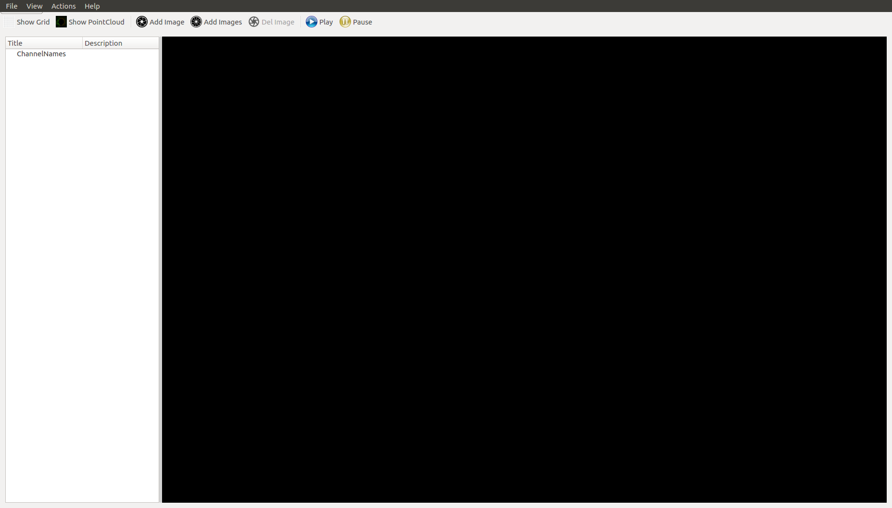
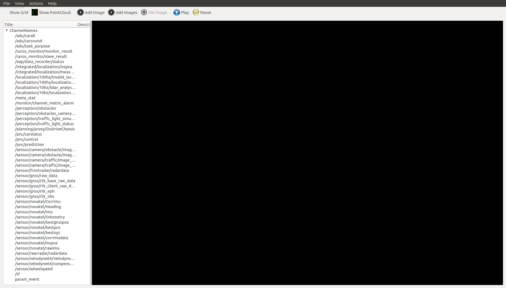
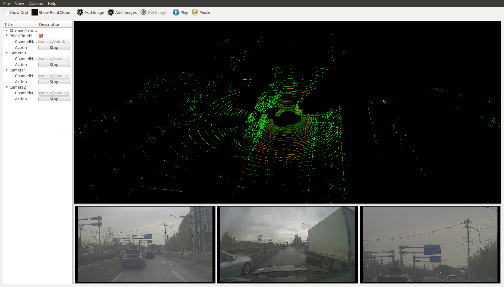
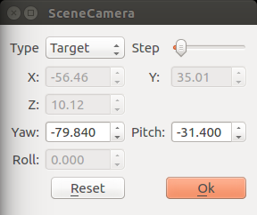
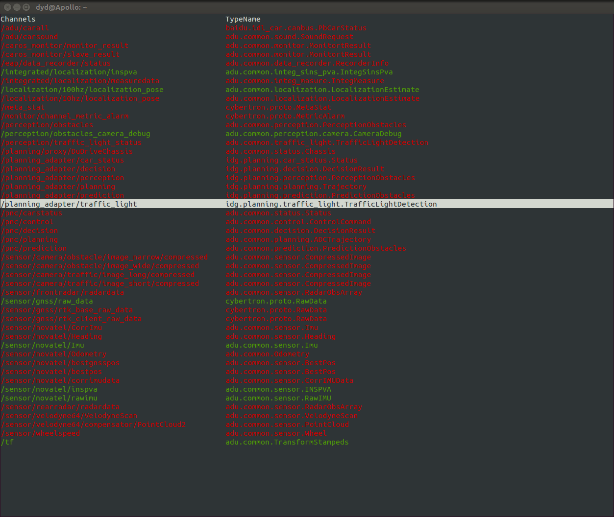

# Apollo Cyber RT Developer Tools

Apollo Cyber RT framework comes with a collection of useful tools for daily development, including one visualization tool cyber_visualizer and two command line tools cyber_monitor and cyber_recorder.

*Note: apollo docker environment is required to use the tools, please follow apollo wiki to enter docker*

All the tools from Apollo Cyber RT rely on Apollo Cyber RT library, so you must source the setup.bash file for environment setup before using any Apollo Cyber RT tools, shown as below:

```bash
username@computername:~$: source /your-path-to-apollo-install-dir/cyber/setup.bash
```

## Cyber_visualizer

### Install and run

`cyber_visualizer` is a visualization tool for displaying the channel data in Apollo Cyber RT.

```bash
username@computername:~$: source /your-path-to-apollo-install-dir/cyber/setup.bash
username@computername:~$: cyber_visualizer
```


### Interacting with cyber_visualizer

- After launching cyber_visualizer, you will see the following interface:

	

- When data flow through channels in Apollo Cyber RT, the list of all channels are displayed under `ChannelNames` as seen in the figure below. For example, you can use the record tool(cyber_recorder) of Apollo Cyber RT to replay data from another terminal, then `cyber_visualizer` will receive information of all active channels(from replay data) and display it.

	

- By clicking on options in toolbar, you can enable reference grid, display point clouds, add images, or display multiple camera's data at the same time. If you have `Show Grid` option enabled, you can set the color of the grid by double-clicking the `Color` item of the `Grid` list below `ChannelNames`. The default color is gray. You can also edit the value of `Cellcount` to adjust the number of cells in the grid.
As for a point cloud or an image, you can select the source channel through its `ChannelName` sub-item, and `Action` sub-item to play or stop the data from the corresponding channel.
As shown in figure below, three cameras' channel data on the buttom sections and one point cloud channel data on the top section are displayed simultaneously.

    

- To adjust the virtual camera in the 3D point cloud scene, you can right click on the point cloud display section. A dialog box will pop up as shown in figure below.

	

	 The point cloud scene supports two types of cameras: Free and Target.(select Type from pop up dialog above)
    - **Free type Camera**: For this type of camera in the point cloud scene, you can change the pose of the camera by holding down either left or right mouse button and move it. To change the pitch of camera, you can scroll the mouse wheel.
    - **Target type Camera**: For this type of camera in the point cloud scene, to change the camera's viewing angle, you can hold down the left mouse button and then move it. To change the distance of the camera to the observed point (the default observation point is the coordinate system origin (0, 0,0)), you can scroll the mouse wheel.

   You can also modify the camera information directly in the dialog box to change the camera's observation status in the point cloud scene. And the "Step" item is the step value from the dialog box.

   Place the mouse on the image of the camera channel, you can double-click the left button to highlight the corresponding data channel on the left menu bar. Right click on the image to bring up menu for deleting the camera channel.
   
   Play and Pause buttons: when clicking the `Play` button, all channels will be showed. While when clicking the `Pause` button, all channels will stop showing on the tool.

## Cyber_monitor

### Install and run

The command line tool `cyber_monitor` provides a clear view of the list of real time channel information Apollo Cyber RT in the terminal. 

```bash
username@computername:~$: source /your-path-to-apollo-install-dir/cyber/setup.bash
username@computername:~$: cyber_monitor
```

### Useful commands

#### Display help information

Use the -h option to get help for cyber_monitor

```bash
username@computername:~$: cyber_monitor -h
```

#### Specify the channel

With the -c option, you can have cyber_monitor to monitor only a specified channel, such as:

```bash
username@computername:~$: cyber_monitor -c ChannelName
```

## Get familiar with UI of cyber_monitor

After launching the command line tool, you will notice it is similar to cyber_visualizer. It automatically collects the information of all the channels through the topology and displays them in two columns (channel name, channel data type).

The default display for channel information is in red. However, if there is data flowing through the a channel, the corresponding line of the channel is displayed in green. As shown in the image below:



### Interacting with cyber_monitor

#### Common commands

```
ESC | q key ---- Exit
Backspace ---- Back
h | H ---- Show help page
```

#### Common command for topology and channel

```
PageDown | Ctrl+d --- Next
PageUp | Ctrl+u --- Previous
Up, down or w, s keys ---- Move the current highlight line up and down
Right arrow or d key ---- Enter highlight line, display highlighted line data in detail
Left arrow or a key ------ Return to the previous layer from the current
Enter key ----- Same as d key
```

#### Commands only for topology

```
f | F ----- Display frame rate
t | T ----- Display channel message type
Space ----- Close|Open channel (only valid for channels with data arrival; yellow color after channel is closed)
```

#### Commands only for channel 

```
i | I ----- Display channel Reader and Writer information
b | B ------ Display channel message content
```

#### View the repeated data field in a channel

```
n | N ---- Repeat the next data in the domain
m | M ---- Repeat one data on the domain
```


## Cyber_recorder

`cyber_recorder` is a record/playback tool provided by Apollo Cyber RT. It provides many useful functions, including recording a record file, playing back a record file, splitting a record file, checking the information of record file and etc.

### Install and run

Launch cyber_recorder:

```bash
$ source /your-path-to-apollo-install-dir/cyber/setup.bash
$ cyber_recorder
usage: cyber_recorder <command>> [<args>]
The cyber_recorder commands are:
    info                               Show infomation of an exist record.
    play                               Play an exist record.
    record                             Record same topic.
    split                              Split an exist record.
    recover                            Recover an exist record.
```

### Commands of cyber_recorder

- To view the information of a record file:

```
 cyber_recorder info -h
usage: cyber_recorder info [options]
	-h, --help				show help message
```

- To record a record file

```
$ cyber_recorder record -h
usage: cyber_recorder record [options]
    -o, --output <file>                output record file
    -a, --all                          all channels
    -c, --channel <name>               channel name
    -h, --help                         show help message

```

- To play back a record file:

```
$ cyber_recorder play -h
usage: cyber_recorder play [options]
    -f, --file <file>			input record file  
    -c, --white-channel <name>		only play the specified channel  
    -l, --loop				loop play  
    -r, --rate <1.0>			multiply the play rate by FACTOR  
    -b, --begin <2018-07-01 00:00:00>	play the record begin at  
    -e, --end <2018-07-01 00:01:00>	play the record end at  
    -s, --start <seconds>		play started at n seconds  
    -d, --delay <seconds>		play delayed n seconds  
    -p, --preload <seconds>		play after trying to preload n second(s)  
    -h, --help				show help message  
```

- To split a record file:

```
$ cyber_recorder split -h
usage: cyber_recorder split [options]
    -f, --file <file>                  input record file
    -o, --output <file>                output record file
    -a, --all                          all channels
    -c, --channel <name>               channel name
    -b, --begin <2018-07-01 00:00:00>  begin at assigned time
    -e, --end <2018-07-01 01:00:00>    end at assigned time
```

- To repair a record file:

```
$ cyber_recorder recover -h
usage: cyber_recorder recover [options]
    -f, --file <file>                  input record file
    -o, --output <file>                output record file
```

### Examples of using cyber_recorder 

#### Check the details of a record file

```
$ cyber_recorder info demo.record
record_file:    demo.record
version:        1.0
duration:       19.995227 Seconds
begin_time:     2018-04-17 06:25:36
end_time:       2018-04-17 06:25:55
size:           28275479 Bytes (26.965598 MB)
is_complete:    true
message_number: 15379
channel_number: 16
channel_info:   /apollo/localization/pose                             2000 messages : apollo.localization.LocalizationEstimate
                /tf                                                   4000 messages : apollo.transform.TransformStampeds
                /apollo/control                                       2000 messages : apollo.control.ControlCommand
                /apollo/sensor/gnss/odometry                          2000 messages : apollo.localization.Gps
                /apollo/canbus/chassis                                2000 messages : apollo.canbus.Chassis
                /apollo/sensor/gnss/imu                               1999 messages : apollo.drivers.gnss.Imu
                /apollo/sensor/gnss/rtk_obs                             41 messages : apollo.drivers.gnss.EpochObservation
                /apollo/sensor/gnss/ins_stat                            20 messages : apollo.drivers.gnss.InsStat
                /apollo/sensor/gnss/best_pose                           20 messages : apollo.drivers.gnss.GnssBestPose
                /apollo/perception/obstacles                           400 messages : apollo.perception.PerceptionObstacles
                /apollo/prediction                                     400 messages : apollo.prediction.PredictionObstacles
                /apollo/sensor/conti_radar                             270 messages : apollo.drivers.ContiRadar
                /apollo/planning                                       200 messages : apollo.planning.ADCTrajectory
                /apollo/monitor/static_info                              1 messages : apollo.data.StaticInfo
                /apollo/sensor/gnss/rtk_eph                             25 messages : apollo.drivers.gnss.GnssEphemeris
                /apollo/monitor                                          3 messages : apollo.common.monitor.MonitorMessage

```

#### Record a record file

```
$ cyber_recorder record -a
[RUNNING]  Record :     total channel num : 1  total msg num : 5
...
```

#### Replay a record file

```
$ cyber_recorder play -f 20180720202307.record
file: 20180720202307.record, chunk_number: 1, begin_time: 1532089398663399667, end_time: 1532089404688079759, message_number: 75
please wait for loading and playing back record...
Hit Ctrl+C to stop replay, or Space to pause.
[RUNNING]  Record Time: 1532089404.688080    Progress: 6.024680 / 6.024680
play finished. file: 20180720202307.record
```


## rosbag_to\_record

`rosbag_to_record` is a tool which can convert rosbag to recorder file provided by Apollo Cyber RT. Now the tool support following channel:

```
/apollo/perception/obstacles
/apollo/planning
/apollo/prediction
/apollo/canbus/chassis
/apollo/control
/apollo/guardian
/apollo/localization/pose
/apollo/perception/traffic_light
/apollo/drive_event
/apollo/sensor/gnss/odometry
/apollo/monitor/static_info
/apollo/monitor
/apollo/canbus/chassis_detail
/apollo/control/pad
/apollo/navigation
/apollo/routing_request
/apollo/routing_response
/tf
/tf_static
/apollo/sensor/conti_radar
/apollo/sensor/delphi_esr
/apollo/sensor/gnss/best_pose
/apollo/sensor/gnss/imu
/apollo/sensor/gnss/ins_stat
/apollo/sensor/gnss/rtk_eph
/apollo/sensor/gnss/rtk_obs
/apollo/sensor/velodyne64/compensator/PointCloud2
```

### Install and run

Launch rosbag_to\_record:

```bash
$ source /your-path-to-apollo-install-dir/cyber/setup.bash
$ rosbag_to_record
Usage:
  rosbag_to_record input.bag output.record
```

### Example
 
We can convert [Apollo2.5 demo bag](https://github.com/ApolloAuto/apollo/releases/download/v2.5.0/demo_2.5.bag) to record file.

```bash
$ rosbag_to_record demo_2.5.bag demo.record
record_file:    demo.record
version:        1.0
duration:       19.995227 Seconds
begin_time:     2018-04-17 06:25:36
end_time:       2018-04-17 06:25:55
size:           28275479 Bytes (26.965598 MB)
is_complete:    true
message_number: 15379
channel_number: 16
channel_info:   /apollo/localization/pose                             2000 messages : apollo.localization.LocalizationEstimate
                /tf                                                   4000 messages : apollo.transform.TransformStampeds
                /apollo/control                                       2000 messages : apollo.control.ControlCommand
                /apollo/sensor/gnss/odometry                          2000 messages : apollo.localization.Gps
                /apollo/canbus/chassis                                2000 messages : apollo.canbus.Chassis
                /apollo/sensor/gnss/imu                               1999 messages : apollo.drivers.gnss.Imu
                /apollo/sensor/gnss/rtk_obs                             41 messages : apollo.drivers.gnss.EpochObservation
                /apollo/sensor/gnss/ins_stat                            20 messages : apollo.drivers.gnss.InsStat
                /apollo/sensor/gnss/best_pose                           20 messages : apollo.drivers.gnss.GnssBestPose
                /apollo/perception/obstacles                           400 messages : apollo.perception.PerceptionObstacles
                /apollo/prediction                                     400 messages : apollo.prediction.PredictionObstacles
                /apollo/sensor/conti_radar                             270 messages : apollo.drivers.ContiRadar
                /apollo/planning                                       200 messages : apollo.planning.ADCTrajectory
                /apollo/monitor/static_info                              1 messages : apollo.data.StaticInfo
                /apollo/sensor/gnss/rtk_eph                             25 messages : apollo.drivers.gnss.GnssEphemeris
                /apollo/monitor                                          3 messages : apollo.common.monitor.MonitorMessage
Convertion finished! Took 0.505623051 seconds in total.
```
