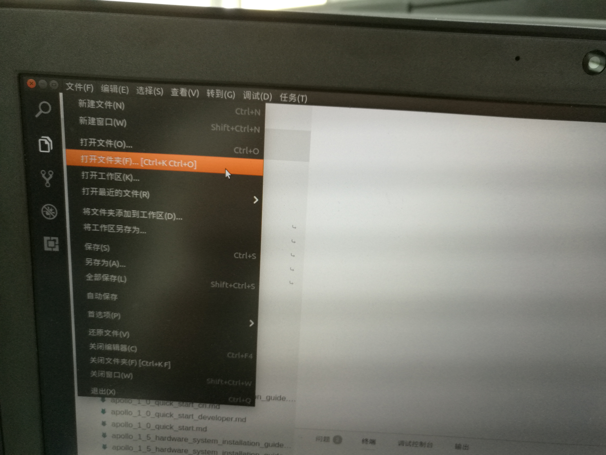
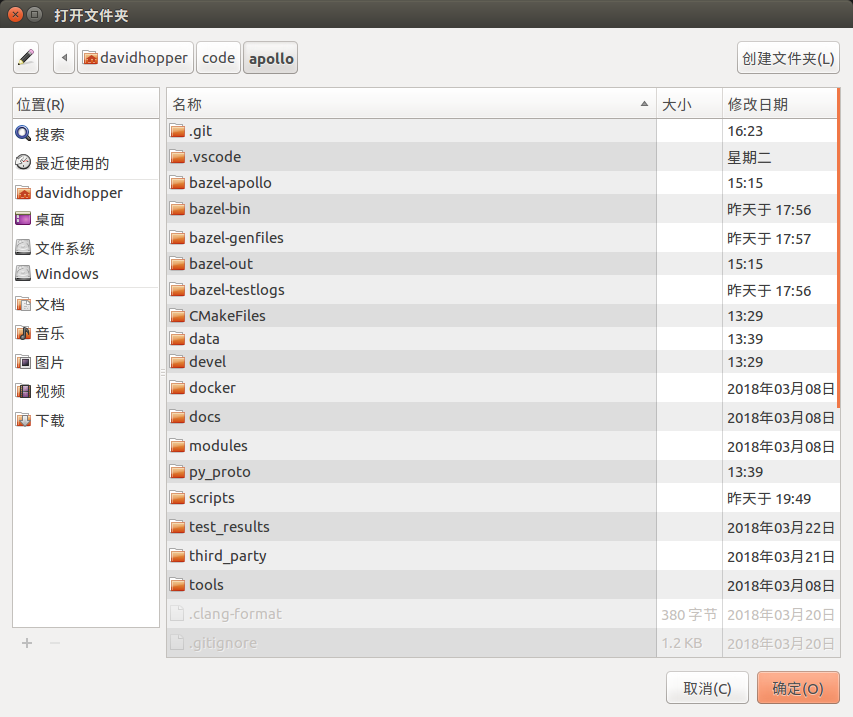
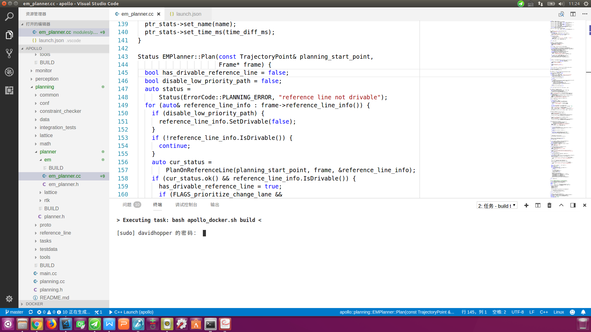
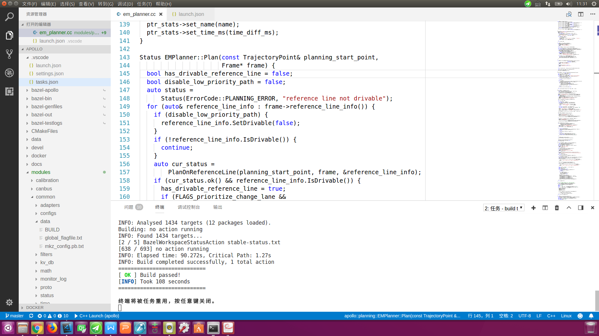
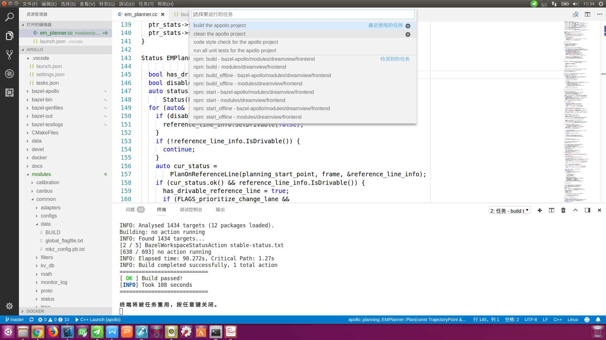

#使用VSCode构建、调试Apollo项目

Apollo项目以其优异的系统架构、完整的模块功能、良好的开源生态及规范的代码风格，受到众多开发者的喜爱和好评。然而，该项目使用命令行编译和调试，不能使用IDE开发，既不直观，也不利于提高效率。我有点追求完美，必须想办法让Apollo项目能在IDE中编译、调试。 
Visual Studio Code（以下简称VSCode）是微软第一款支持Linux的轻量级代码编辑器，其功能介于编辑器与IDE之间，但更倾向于一个编辑器。优点是运行速度快，占用内存少，使用方法与Visual Stuio类似。缺点在于，与Visual Studio、QT等IDE相比，功能还不够强大。我认为，Windows中最强大的C++ IDE为Visual Studio，Linux中最强大的C++ IDE为QT。Apollo项目目前只支持Ubuntu系统（Mac OS系统部分支持），Windows系统中的Visual Studio自然排除在外；此外，Apollo项目使用Bazel编译，而QT目前只支持QMake和CMake工程，因此只能忍痛割爱。在无法使用上述两种IDE的前提下，退而求次选用VSCode。我写了几个配置文件，允许使用VSCode编译、调试Apollo项目，下面对其进行具体阐述，希望能给广大开发者带来一定的帮助。
##一、使用VSCode编译Apollo项目
首先从GitHub网站（https://github.com/ApolloAuto/apollo）下载Apollo源代码，可以使用git命令下载，也可以直接通过网页下载压缩包。源代码下载完成后，将其放置到合适的目录。使用VSCode编译Apollo项目有一个前提，就是在你的机器上已经顺利安装了Docker。Apollo之前版本提供了一个“install_docker.sh”脚本文件，因为很多开发者反映可能出错，Apollo项目组已将该文件移除。现在要安装Docker就只能参考Docker官方网站（https://www.docker.com/）的帮助文档了。
###1.1 编译方法
打开“Visual Studio Code”，执行菜单命令“文件->打开文件夹”，在弹出的对话框中，选择“Apollo”项目源文件夹，点击“确定”，如下图所示：


之后，执行菜单命令“任务->运行生成任务”或直接按快捷键“Ctrl+Shift+B”（与Visual Studio和QT的快捷键一致）构建工程，若之前没有启动过Docker，则编译时会启动Docker，需在底部终端窗口输入超级用户密码，如下图所示：

命令执行完毕，若在底部终端窗口出现“**终端将被任务重用，按任意键关闭。**”信息（如下图所示），则表示构建成功。整个过程一定要保持网络畅通，否则无法下载依赖包。

###1.2 配置文件解析
我在`.vscode/tasks.json`文件中总共配置了四个常见的任务：`build the apollo project`（构建Apollo项目）、`run all unit tests for the apollo project`（运行Apollo项目的所有单元测试）、`code style check for the apollo project`（Apollo项目的代码风格检查）、`clean the apollo project`（清理Apollo项目）。其中第一个任务是默认生成任务，可以直接按快捷键“Ctr+Shift+B”调用，其他任务可通过执行菜单命令：任务->运行任务(R)…，在弹出的窗口中，选择对应选项即可，如下图所示：


下面是具体的配置内容，请参考里面的注释来调整编译任务以满足你的构建需求：
```
{
    "version": "2.0.0",
    "tasks": [
        {
            "label": "build the apollo project",
            "type": "shell",
            // 可根据"apollo.sh"提供的选项来调整编译任务，例如：build_gpu
            "command": "bash apollo_docker.sh build",
            "group": {
                "kind": "build",
                "isDefault": true // default building task invoked by "Ctrl+Shift+B"
            },
            // 格式化错误信息
            "problemMatcher": {
                "owner": "cc",
                "fileLocation": [
                    "relative",
                    "${workspaceFolder}"
                ],
                "pattern": {
                    "regexp": "^(.*):(\\d+):(\\d+):\\s+(warning|error):\\s+(.*)$",
                    "file": 1,
                    "line": 2,
                    "column": 3,
                    "severity": 4,
                    "message": 5
                }
            }
        }, 
        {
            "label": "run all unit tests for the apollo project",
            "type": "shell",           
            "command": "bash apollo_docker.sh test",
            "problemMatcher": {
                "owner": "cc",
                "fileLocation": [
                    "relative",
                    "${workspaceFolder}"
                ],
                "pattern": {
                    "regexp": "^(.*):(\\d+):(\\d+):\\s+(warning|error):\\s+(.*)$",
                    "file": 1,
                    "line": 2,
                    "column": 3,
                    "severity": 4,
                    "message": 5
                }
            }
        },
        {
            "label": "code style check for the apollo project",
            "type": "shell",            
            "command": "bash apollo_docker.sh lint",          
            "problemMatcher": {
                "owner": "cc",
                "fileLocation": [
                    "relative",
                    "${workspaceFolder}"
                ],
                "pattern": {
                    "regexp": "^(.*):(\\d+):(\\d+):\\s+(warning|error):\\s+(.*)$",
                    "file": 1,
                    "line": 2,
                    "column": 3,
                    "severity": 4,
                    "message": 5
                }
            }
        },
        {
            "label": "clean the apollo project",
            "type": "shell",            
            "command": "bash apollo_docker.sh clean",           
            "problemMatcher": {
                "owner": "cc",
                "fileLocation": [
                    "relative",
                    "${workspaceFolder}"
                ],
                "pattern": {
                    "regexp": "^(.*):(\\d+):(\\d+):\\s+(warning|error):\\s+(.*)$",
                    "file": 1,
                    "line": 2,
                    "column": 3,
                    "severity": 4,
                    "message": 5
                }
            }
        }
    ]
}
```
###1.3 可能存在的问题及解决方法
####1.3.1 编译时遇到“ERROR: query interrupted”错误
这是由于bazel内部缓存不一致造成的。 
解决方法： 
按任意键退出编译过程，在VSCode的命令终端窗口（如果未打开，按快捷键“Ctrl + `”开启）执行如下命令进入Docker环境：
``` bash
bash docker/scripts/dev_into.sh
```
在Docker环境中输入如下命令，执行bazel的清理缓存任务（**一定要保持网络畅通**，以便成功下载依赖包，否则该命令即使执行一万次也不会奏效）：
``` bash
bazel query //...
```
最后输入exit命令退出Docker环境，按快捷键“Ctrl+Shift+B”，重新执行构建任务。
####1.3.2 编译时长时间停留在“Building: no action running”界面
这是由于当前系统中存在多个不同版本的Docker或者是bazel内部缓存不一致造成的。 
解决方法： 
按快捷键“Ctrl+C”键终止当前构建过程，在VSCode的命令终端窗口（如果未打开，按快捷键“Ctrl + `”开启），使用下述方法中的任意一种，停止当前运行的Docker：
``` bash
# 方法1：停止当前所有的Apollo项目Docker
docker stop $(docker ps -a | grep apollo | awk '{print $1}')
# 方法2：停止当前所有的Docker
docker stop $(docker ps -aq)
```
执行VSCode的菜单命令：任务->运行任务(R)…，在弹出的窗口中，选择 
“clean the apollo project”（清理Apollo项目）。待清理完毕后，按快捷键“Ctrl+Shift+B”，重新构建Apollo项目。
####1.3.3 编译时出现类似“Another command (pid=2466) is running. Waiting for it to complete…”的错误
这是由于在其他命令行终端进行编译或是在之前编译时按下“Ctrl+C”键强行终止但残留了部分编译进程所引起的。 
解决方法： 
按快捷键“Ctrl+C”键终止当前构建过程，在VSCode的命令终端窗口（如果未打开，按快捷键“Ctrl + `”开启），使用如下命令终止残留的编译进程：
``` bash
# 1.进入Docker
bash docker/scripts/dev_into.sh
# 2.杀死Docker中残留的编译进程
pkill bazel-real
# 3.查看Docker中是否残留bazel-real进程，若有则按“q”退出，再次执行步骤2。
# 也可使用“ps aux | grep bazel-real”查看
top
# 4.退出Docker
exit
```
按快捷键“Ctrl+Shift+B”，重新执行构建任务。
##二、使用VSCode调试Apollo项目
Apollo项目运行于Docker中，不能在宿主机（所谓宿主机就是运行Docker的主机，因为Docker服务像寄宿于主机中，故有此称呼）中直接使用GDB调试，而必须先在Docker中借助GDBServer创建调试服务进程，再在宿主机中使用GDB连接Docker中的调试服务进程来完成。下面介绍具体操作方法：
###2.1 前提条件
####2.1.1 编译Apollo项目需带调试信息
编译Apollo项目时需使用`build`或`build_gpu`等带调试信息的选项，而不能使用`build_opt`或`build_opt_gpu`等优化选项。
####2.2.2 Docker内部已安装GDBServer
进入Docker后，可使用如下命令查看：
``` bash
gdbserver --version
```
若提示类似如下信息：
```
GNU gdbserver (Ubuntu 7.7.1-0ubuntu5~14.04.3) 7.7.1
Copyright (C) 2014 Free Software Foundation, Inc.
gdbserver is free software, covered by the GNU General Public License.
This gdbserver was configured as "x86_64-linux-gnu"
```
则表示Docker内部已安装了GDBServer（我已请Apollo项目组老师将GDBServer预装至Docker内部，正常情况下应该能看到上述提示信息）。若提示如下信息：
```
bash: gdbserver: command not found
```
则表示Docker内部未安装GDBServer，可使用如下命令安装：
``` bash
sudo apt-get install gdbserver
```
###2.2 Docker内部的操作
####2.2.1 启动Dreamview后台服务程序
进入Docker，启动Dreamview，命令如下：
``` bash
cd your_apollo_project_root_dir
# 如果没有启动Docker，首先启动，否则忽略该步
bash docker/scripts/dev_start.sh -C
# 进入Docker
bash docker/scripts/dev_into.sh
# 启动Dreamview后台服务
bash scripts/bootstrap.sh
```
####2.2.2 启动待调试模块
启动待调试模块，既可使用命令行操作，也可借助Dreamview界面完成。我肯定喜欢使用Dreamview界面操作了，下面以调试“planning”模块为例进行说明。
打开Chrome浏览器，输入网址：http://localhost:8888/，打开Dreamview界面，打开“SimControl”选项，如下图所示：

点击左侧工具栏“Module Controler”标签页，选中“Routing”和“Planning”选项，如下图所示：

点击左侧工具栏“Default Routing”标签页，选中“Route: Reverse Early Change Lane”或其中任意一个选项，发送“Routing Request”请求，生成全局导航路径，如下图所示：

####2.2.3 查看“Planning”进程ID
使用如下命令，查看“Planning”进程ID：
``` bash
top
```
结果类似下图，可以看到“Planning”进程ID为4147，请记住该ID。按“q”退出“top”界面。

还可使用如下命令查看：
``` bash
ps aux | grep planning
```
结果类似下图，可以看到“Planning”进程ID为4147。

####2.2.4 使用GDBServer附加调试“Planning”进程
接下来需要进行我们的关键操作了，使用GDBServer附加调试“Planning”进程，命令如下：
``` bash
sudo gdbserver :1111 --attach 4147
```
上述命令中，**“:1111”表示开启端口为“1111”的调试服务进程，“4147”表示`步骤2.2.3`中查到的“Planning”进程ID**。若结果如下图所示，则表示操作成功。

重新开启一个命令终端，进入Docker后，使用如下命令可看到“gdbserver”进程已正常运行：
``` bash
ps aux | grep gdbserver
```

####2.2.5 使用脚本文件启动GDBServer
我写了两个脚本文件：`scripts/start_gdb_server.sh`、`docker/scripts/dev_start_gdb_server.sh`，其中前者用于在Docker内部启动GDBServer，后者直接在宿主机（Docker外部）启动GDBServer。
假设调试`planning`模块，端口号为`1111`，`scripts/start_gdb_server.sh`的使用方法为：
``` bash
# 进入Docker
bash docker/scripts/dev_into.sh
# 启动gdbserver
bash scripts/start_gdb_server.sh planning 1111
```
假设调试`planning`模块，端口号为`1111`，`docker/scripts/dev_start_gdb_server.sh`的使用方法为：
``` bash
# 在宿主机中（Docker外部）直接启动gdbserver
bash docker/scripts/dev_start_gdb_server.sh planning 1111
```
在**2.3节**我还将继续配置VSCode文件，以便在VSCode中直接按快捷键“F5”就可启动调试。
`start_gdb_server.sh`的内容如下：
``` bash
#!/usr/bin/env bash

function print_usage() {
  RED='\033[0;31m'
  BLUE='\033[0;34m'
  BOLD='\033[1m'
  NONE='\033[0m'

  echo -e "\n${RED}Usage${NONE}:
  .${BOLD}/start_gdb_server.sh${NONE} MODULE_NAME PORT_NUMBER"

  echo -e "${RED}MODULE_NAME${NONE}:
  ${BLUE}planning${NONE}: debug the planning module. 
  ${BLUE}control${NONE}: debug the control module.
  ${BLUE}routing${NONE}: debug the routing module.
  ..., and so on."

  echo -e "${RED}PORT_NUMBER${NONE}: 
  ${NONE}a port number, such as '1111'."
}

if [ $# -lt 2 ];then
    print_usage
    exit 1
fi

DIR="$( cd "$( dirname "${BASH_SOURCE[0]}" )" && pwd )"
source "${DIR}/apollo_base.sh"

MODULE_NAME=$1
PORT_NUM=$2
shift 2

# If there is a gdbserver process running, stop it first. 
GDBSERVER_NUMS=$(pgrep -c -x "gdbserver")
if [ ${GDBSERVER_NUMS} -ne 0 ]; then
  sudo pkill -f "gdbserver"
fi

# Because the "grep ${MODULE_NAME}" always generates a process with the name of 
# "${MODULE_NAME}", I added another grep to remove grep itself from the output.
# The following command got a wrong result and I can't find the reason. 
#PROCESS_ID=$(ps -eo pid,command | grep "${MODULE_NAME}" | grep -v "grep" | awk '{print $1}')
# This one is OK.
PROCESS_ID=$(pgrep -o -x "${MODULE_NAME}")
#echo ${PROCESS_ID}

# If the moudle is not started, start it first. 
if [ -z ${PROCESS_ID} ]; then       
  #echo "The '${MODULE_NAME}' module is not started, please start it in the dreamview first. "  
  #exit 1 

  # run function from apollo_base.sh
  # run command_name module_name
  run ${MODULE_NAME} "$@"

  PROCESS_ID=$(pgrep -o -x "${MODULE_NAME}")
fi 

sudo gdbserver :${PORT_NUM} --attach ${PROCESS_ID}
```
`dev_start_gdb_server.sh`的内容如下：
``` bash
#!/usr/bin/env bash

function check_docker_open() {
  docker ps --format "{{.Names}}" | grep apollo_dev 1>/dev/null 2>&1
  if [ $? != 0 ]; then       
    echo "The docker is not started, please start it first. "  
    exit 1  
  fi
}

function print_usage() {
  RED='\033[0;31m'
  BLUE='\033[0;34m'
  BOLD='\033[1m'
  NONE='\033[0m'

  echo -e "\n${RED}Usage${NONE}:
  .${BOLD}/dev_debug_server.sh${NONE} MODULE_NAME PORT_NUMBER"

  echo -e "${RED}MODULE_NAME${NONE}:
  ${BLUE}planning${NONE}: debug the planning module. 
  ${BLUE}control${NONE}: debug the control module.
  ${BLUE}routing${NONE}: debug the routing module.
  ..., and so on."

  echo -e "${RED}PORT_NUMBER${NONE}: 
  ${NONE}a port number, such as '1111'."
}

if [ $# -lt 2 ];then
    print_usage
    exit 1
fi

check_docker_open

DIR="$( cd "$( dirname "${BASH_SOURCE[0]}" )" && pwd )"
cd "${DIR}/../.."
# pwd

xhost +local:root 1>/dev/null 2>&1
#echo $@
docker exec \
    -u $USER \
    -it apollo_dev \
    /bin/bash scripts/start_gdb_server.sh $@
xhost -local:root 1>/dev/null 2>&1
```
####2.2.6 使用SSH命令远程登录车内工控机操作
还可使用SSH命令远程登录车辆工控机操作。首先使用如下命令远程登录车内工控机：
``` bash
ssh username@your_vehicle_computer_ip
```
接下来在工控机内按照**步骤2.2.1-2.2.5**的操作方法附加调试“Planning”进程。
###2.3 宿主机上VSCode内部的操作
在宿主机上使用VSCode打开Apollo项目（必须是你刚才构建的版本），打开需要调试的文件，在指定位置设置断点，按“F5”键启动调试。注意：**由于VSCode使用脚本语言编写，因此启动过程会较慢，若加上网速不够快，甚至出现一分钟等待也有可能**。调试方法和Visual Studio类似，此处不再赘述。如下图所示：

###2.4 配置文件解析
我对`.vscode/launch.json`文件作出配置以便能在VSCode中连接Docker中的调试服务进程。此外，为了能在VSCode中直接启动GDBServer，我在`.vscode/launch.json`文件中添加了一个调试前启动任务：`"preLaunchTask": "start gdbserver"`，该任务对应于`.vscode/tasks.json`文件中的一个启动GDBServer的任务，因为GDBServer启动后会一直阻塞命令行窗口，且无法通过在命令后面添加`&`的方式进行后台启动，我只能将其配置为一个VSCode的后台运行任务。
`.vscode/launch.json`文件的配置内容如下：
```
{
    "version": "0.2.0",
    "configurations": [
    {
        "name": "C++ Launch",
        "type": "cppdbg",
        "request": "launch",
        // You can change the "planning" to your module name, but it should be 
        // same as in gdbserver of the docker container. 
        "program": "${workspaceRoot}/bazel-bin/modules/planning/planning",
        // You can change "localhost:1111" to another "IP:port" name, but it 
        // should be same as in gdbserver of the docker container.  
        "miDebuggerServerAddress": "localhost:1111",
        // You can change the task to meet your demands in the 
        // ".vscode/tasks.json" file (search the label:  
        // "start gdbserver", but the module name and the port 
        // number should be consistent with this file.        
        "preLaunchTask": "start gdbserver",
        "args": [],
        "stopAtEntry": false,
        "cwd": "${workspaceRoot}",
        "environment": [],
        "externalConsole": true,
        "linux": {
            "MIMode": "gdb"
        },
        "osx": {
            "MIMode": "gdb"
        },
        "windows": {
            "MIMode": "gdb"
        }
    }
    ]
}
```
`.vscode/tasks.json`文件中用于启动GDBServer的任务配置如下：
```
	{
            "label": "start gdbserver",
            "type": "shell",
            // you can change the "planning" module name to another one and 
            // change the "1111" to another port number.
            // Note: the module name and port number should be same as in 
            // the "launch.json" file. 
            "command": "bash docker/scripts/dev_start_gdb_server.sh planning 1111",            
            "isBackground": true,
            "problemMatcher": {
                "owner": "custom",
                "pattern": {
                    "regexp": "__________"
                },
                "background": { 
                    "activeOnStart": true,
                     // Don't change the following two lines, otherwise the 
                    // gdbserver can't run in the background.
                    "beginsPattern": "^Listening on port$",
                    "endsPattern": "^$"
                }
            }                           
        }
```

###2.5 可能碰到的问题及解决方法
调试过程中，可能会碰到以下问题：
一是Docker内部待调试进程崩溃，无法在VSCode中调试，解决办法是：重启Docker内部的调试进程；
二是网络连接不畅，无法在VSCode中调试，解决办法是：确保网络畅通，并停用代理工具；
三是在VSCode内部关闭调试后，会同时将Docker内部的调试服务进程关闭，可能会出现无法直接在VSCode再次启动调试服务里程的情形，解决办法是：在Docker内部重启调试服务进程，再在VSCode中按“F5”键启动调试。
