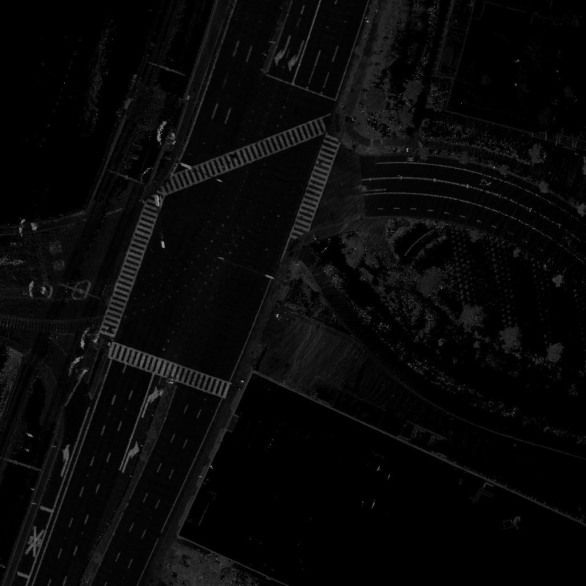

# How to Generate Local Map For MSF Localization Module

## 1. Preparation
 - Download source code of Apollo from [GitHub](https://github.com/ApolloAuto/apollo)
 - Follow the tutorial to set up [docker environment](https://github.com/ApolloAuto/apollo/blob/master/docs/howto/how_to_build_and_release.md).
 - Download localization data from [Apollo Data Open Platform](http://data.apollo.auto/?name=sensor%20data&data_key=multisensor&data_type=1&locale=en-us&lang=en)（US only).

## 2. Build Apollo

First check and make sure you are in development docker container before you proceed. Now you will need to build from the source. 
```
# To make sure you start clean
bash apollo.sh clean
# Build the full system
bash apollo.sh build_opt
```

`note:` If the computer is very slow, you can enter the following command to limit the CPU.

```
bash apollo.sh build_opt --local_resources 2048,1.0,1.0
```

## 3. Generate Localization Map
In the downloaded data, you can find a folder named *apollo3.5*. Let's assume the path of this folder as DATA_PATH.

```
/apollo/scripts/msf_simple_map_creator.sh DATA_PATH/records/ DATA_PATH/params/velodyne_params/velodyne128_novatel_extrinsics.yaml 10 OUT_FOLDER_PATH
```

After the script is finished, you can find the produced localization map named *local_map* in the output folder.

The scripts also stores the visualization of each generated map node in the map's subfolder named *image*. The visualization of a map node filled with LiDAR data looks like this.
