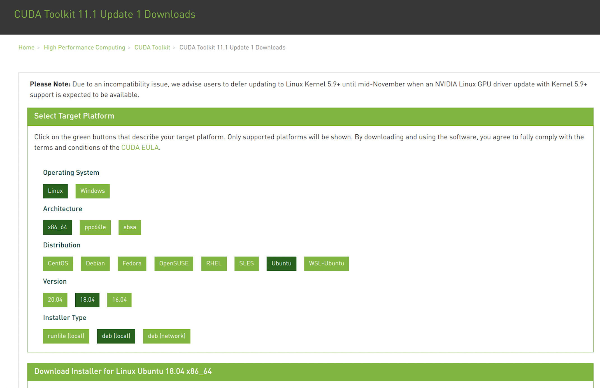

# How to Install Low-Latency Kernel for Apollo

This document describes the steps to install stock Ubuntu low-latency kernel
with Nvidia driver on Ubuntu 18.04.x.

## Before You Begin

There was once an
[Apollo Kernel](https://github.com/ApolloAuto/apollo-kernel.git) project based
on the Linux 4.4.32 source tree, which provides real-time kernel support for
running Apollo software stack in the vehicle. However, that project hasn't been
updated for long, causing a lot of trouble for the community. The Apollo team
thus decided to find alternative ways to provide low-latency/real-time kernel
support, which, should be easy to migrate to newer Linux kernels.

The low-latency alternative they found was stock Ubuntu low-latency kernel
(available in Ubuntu repositories). Ubuntu low-latency kernel is completely
capable of low- to no- latency for running Apollo in the vehicle. Preempt
optimization is enabled in kernel configuration, and latency as low as 0.1
millisecond can and has been achieved using it.

In the section below, we will describe the steps to install the low latency
kernel on Ubuntu.

**Note**:

> If your sole purpose was to develop/test on Apollo platform, or to run
> simulation software (e.g., LGSVL simulator), then you don't need to install
> low-latency/real-time kernels at all.

## Installing Ubuntu Low-Latency Kernel

The steps required to install low-latency kernel on Ubuntu is as follows:

1. Install the latest low-latency kernel and its headers.

```bash
# Sync package index with upstream sources.list
sudo apt-get update

# Print your current kernel release
uname -r

# Check if newer Linux image is available.
apt-cache search linux-image | grep "Signed kernel image lowlatency"

# Install the latest low-latency kernel & headers.
sudo apt-get install linux-image-$(uname -r)-lowlatency linux-headers-$(uname -r)-lowlatency
```

**Note**:

> Please change `$(uname -r)` to the latest kernel image if availabe. The latest
> kernel version on Ubuntu 18.04 as of this writing (Nov 17, 2020) is `5.4.0-54`

2. Reboot to start the low-latency kernel.

```bash
sudo reboot
```

## Install Nvidia Driver

1. Download and install the latest Nvidia driver from the
   [CUDA Toolkit Downloads](https://developer.nvidia.com/cuda-downloads?target_os=Linux)
   Page.

   Choose either **Local Installer**("deb[local]") or **Network
   Installer**("deb[network]") for **Installer Type** and follow the
   instructions there.




**Note**

> You may need to regist and sign CUDA EULA before continue.

For example, below is the instructions installing Nvidia driver on x86_64 Ubuntu
18.04.5 with the "deb[local]" approach:

```bash
wget https://developer.download.nvidia.com/compute/cuda/repos/ubuntu1804/x86_64/cuda-ubuntu1804.pin
sudo mv cuda-ubuntu1804.pin /etc/apt/preferences.d/cuda-repository-pin-600
wget https://developer.download.nvidia.com/compute/cuda/11.1.1/local_installers/cuda-repo-ubuntu1804-11-1-local_11.1.1-455.32.00-1_amd64.deb
sudo dpkg -i cuda-repo-ubuntu1804-11-1-local_11.1.1-455.32.00-1_amd64.deb
sudo apt-key add /var/cuda-repo-ubuntu1804-11-1-local/7fa2af80.pub
sudo apt-get update
sudo apt-get install nvidia-driver-455
```

**Note**:

> The number in `nvidia-driver-XXX` should match that in the local installer
> (455 in the example above).

2. Reboot for the changes to make effect.

3. Run `nvidia-smi` to check if everything is OK.

## Build and Install ESD-CAN Driver (Optional)

You should follow the
[instructions](https://github.com/ApolloAuto/apollo-kernel/blob/master/linux/ESDCAN-README.md#build--install-out-of-tree-esd-kernel-driver)
to build ESD-CAN driver if necessary.

## Final Words

In this article, we described briefly the steps to install Ubuntu low-latency
kernel and integrate Nvidia GPU driver with it. This kernel should be sufficient
for Apollo runtime in vehicle. However, we haven't fully test it on real
vehicles. Please use it with caution and report any issues to us.
