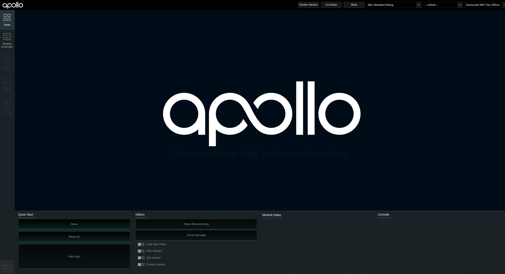

# How to Launch and Run Apollo
First check and make sure you are in development docker container before you proceed. Now you will need to build from the source. If you want to run the entire system, make sure you have an
nVidia GPU and that you have installed the Linux nVidia drivers.
You could still proceed with the next few steps even if you are missing the Linux nVidia drivers, as the system will run but with the CUDA-based perception and other modules.
```
# To get a list of build commands
./apollo.sh
# To make sure you start clean, cleanup bazel output and log/coredump files.
./apollo.sh clean
# This will build the full system and requires that you have an nVidia GPU with nVidia drivers loaded.
# You can specify a module to build, e.g. <module> = cyber or modules/<module>. If <module> unspecified, build all.
./apollo.sh build [module]
```

If you make modifications to the Dreamview frontend, then you must run `bash apollo.sh build_fe`  before you run the
full build.

## Run Apollo

Follow the steps below to launch Apollo. Note that you must build the system first before you run it. Note that the
bootstrap.sh will actually succeed but the user interface will not come up if you skip the build step.

### Start Apollo

Running Apollo will start the Dreamview backend and then startup a web user interface called Dreamview frontend, this is handled by
the bootstrap script, so from within the docker container, you should run:

```
# Startup modules monitor and dreamview, the default option is start.
./scripts/bootstrap.sh [start | stop | restart]
```

### Access Dreamview
Access Dreamview by opening your favorite browser, e.g. Chrome, go to http://localhost:8888 and you should see this screen
However, there will be nothing running in the system.



### Select Drive Mode
From the dropdown box selet "Navigation" mode.


### Replay demo record

To see if the system works, use the demo 'record' which feeds the system.

```
# You need to download the demo record using the following commands
cd docs/demo_guide/
python3 rosbag_helper.py demo_3.5.record

# You can now replay this demo "record" in a loop with the '-l' flag
cyber_recorder play -f docs/demo_guide/demo_3.5.record -l
```

Dreamview should show a running vehicle now. (The following image might be different due to changes in frontend.)


Congratulations! You have successfully built out Apollo!! If you do have the necessary Hardware setup, please go back to our [Readme](https://github.com/ApolloAuto/apollo/blob/master/README.md) for additional guidelines.
