# How to Leverage Scenario Editor

## Introduction

Simulation plays a central role in Apollo’s internal development cycle. Dreamland empowers developers and start-ups to run millions of miles of simulation daily, which dramatically accelerates the development cycle.

So far Apollo simulation allowed external users to access over 200 sample scenarios which includes a diverse range of LogSim scenarios based on real world driving data and WorldSim scenarios that have been manually created by our simulation team. To learn more about Dreamland, refer to [our Dreamland Introduction Guide](https://github.com/ApolloAuto/apollo/blob/master/docs/specs/Dreamland_introduction.md)

Several developers wrote in requesting that our Dreamland platform should support Scenario Creation and Editing which the Apollo team now proudly presents in Apollo 5.0!

## Setting up Scenario Editor

1. Login to your Dreamland account. For additional details on How to create an account, please refer to [our Dreamland Introduction Guide](https://github.com/ApolloAuto/apollo/blob/master/docs/specs/Dreamland_introduction.md) 

2. Once inside the platform, the Scenario Editor can be accessed under `Scenario Management` or using the [following link](https://azure.apollo.auto/scenario-management/scenario-editor)

    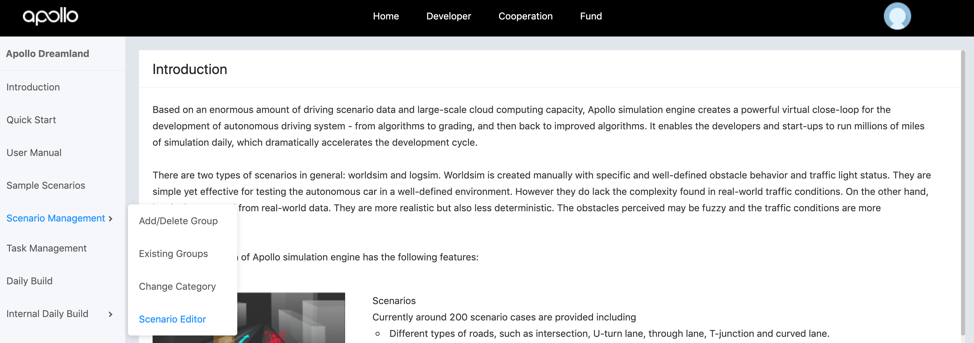

3. Once inside, you will have to comeplete the form on the screen as seen in the image below. As this app is in Beta testing, it is not open to all our developers.

    

4. You should receive the following activation confirmation via email:

 

## Using Scenario Editor

Congratulations! You are now ready to use our scenario editor.

1. The first step is to select a map. Currently, we offer 2 maps - Sunnyvale and San Mateo

    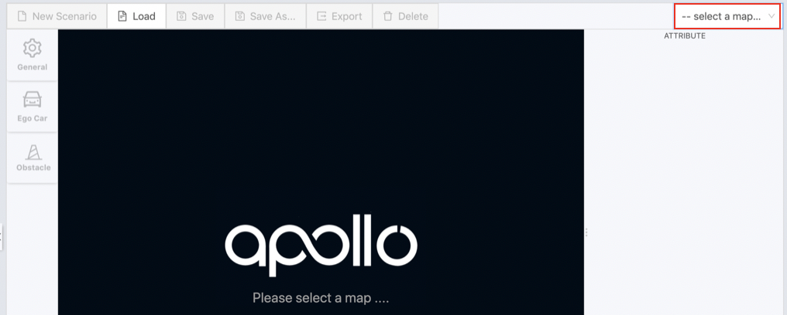

2. Once a map has been selected, you will have access to the editor pane on the right along with other tools as seen below:

    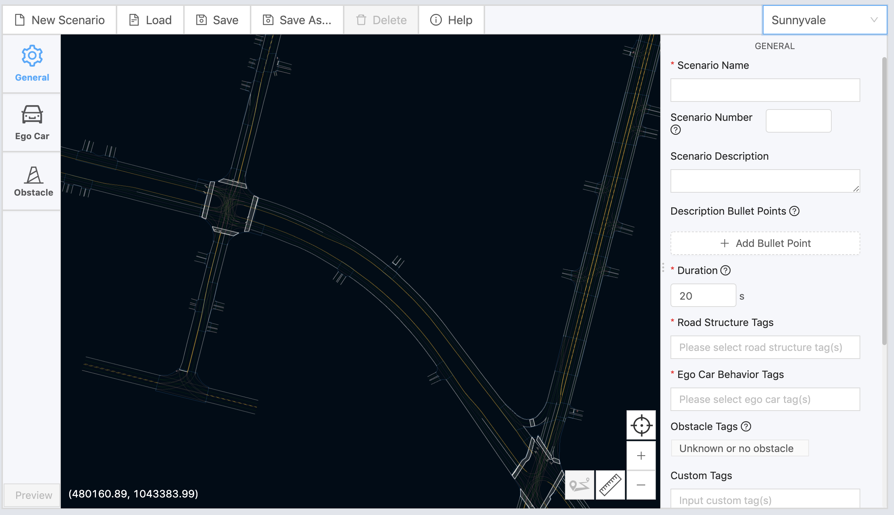


You can navigate through the map using your arrow keys. Alternatively, you can right-click the mouse and drag it to move the map. If you are using a trackpad, you will have to double click and then drag with two fingers.
Let's understand each tool along with its purpose

### General Action Tools

The 4 General action tools can be found on the bottom right corner of the map. 

1. **Zoom tool**: while you can use your trackpad to zoom in and out of the map, there exists the Zoom tool to help you zoom in and out of the map in case you do not have a trackpad ready.

    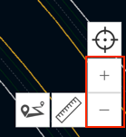

2. **Re-center tool**: this tool allows you to locate your ego-car on the map even if you have moved away

    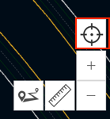

3. **Ruler tool**: this tool allows you to measure the distance between two points. 

      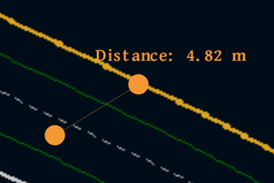

4. **Add Route tool**: you can set the ego car’s end point by clicking on the Add Route tool. Please note that the first version of the Scenario Editor does support the creation of multiple route points for the ego car.

    
 
### Configuration Tools

There are 4 types of configurations that you will need to set up in order to create a scenario, three of which are listed on the left-side of the map - General, Ego-car and Participants (Obstacles) and the last one is Traffic Light

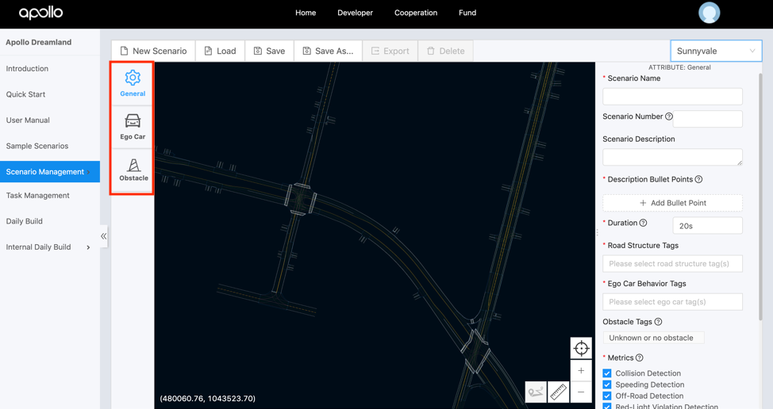

#### General Configuration

This configuration tool is selected by default upon the selection of a map. The form on your right requests general scenario information like the scenario name, duration, road structure, ego-car behavior along with which metrics you would like to track. Please note some fields are required while some are based on your discretion. Once you have set and confirmed all the parameters, please proceed to the `Ego Car` configuration tool.

You can learn more about each parameter by hovering over the `?` sign next to each parameter.

#### Ego Car Configuration

This configuration tool allows you to set your Ego car on the map and configure its parameters. As soon as you select the tool icon, you can then hover over the map and place the car at your desired location. You will notice that your mouse pointer will turn into a cross until you place the ego-car on your map. Once placed, a form should appear on the right-hand side of the map, which allows you to configure the Ego car to set its speed, acceleration, along with your desired destination.

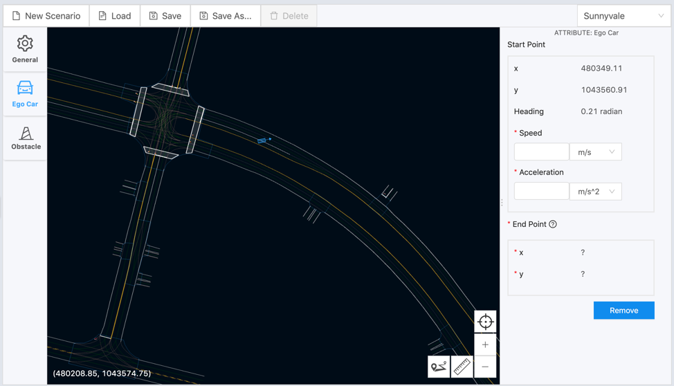

The Ego car's heading can also be set by dragging the arrow linked to the ego car

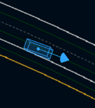

```
Note: 
You can set the ego car’s end point by clicking on the “Add Route Point” icon in the lower right corner of the map. Described in the General Action tools section. 
```

Once you have placed the Ego car's end point on the map, The end point coordinates will then appear on the right-hand attribute's window. You can drag the end point flag to change the ego car’s end point location. The “End point” coordinates will be automatically updated accordingly.

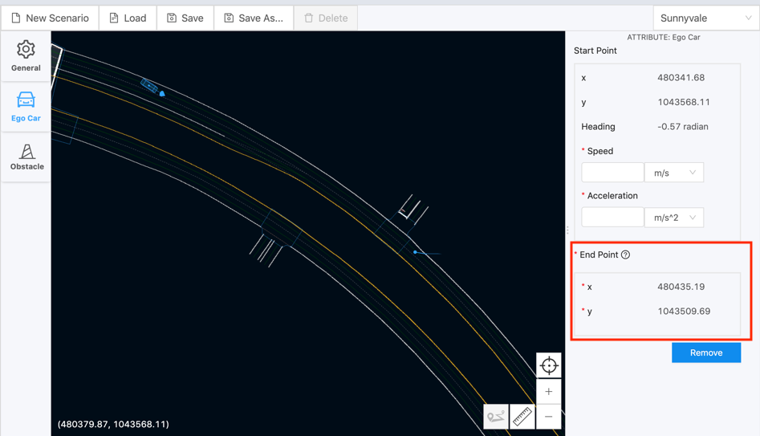

Finally, you can always come back and edit the existing attributes of the ego car by clicking on the ego car on the map. This will open its attributes tab in the right-hand attributes window.

#### Participants' Configuration

If you select `Participant` from the configuration menu, you can place your obstacle in your scenario by clicking on a desired location on the map. You will notice that your mouse pointer will turn into a cross until you place the new obstacle on your map. Once you place it, a form will appear on the right-hand attributes window as it did with `Ego Car`. Before you edit the fields on the form, you can change the position of the obstacle by clicking and dragging it. You can also modify its heading by clicking on the arrow head. Once you have finalized the heading and position of your participant, you can start working on specific details mentioned in the form - type, length, speed and motion type. 

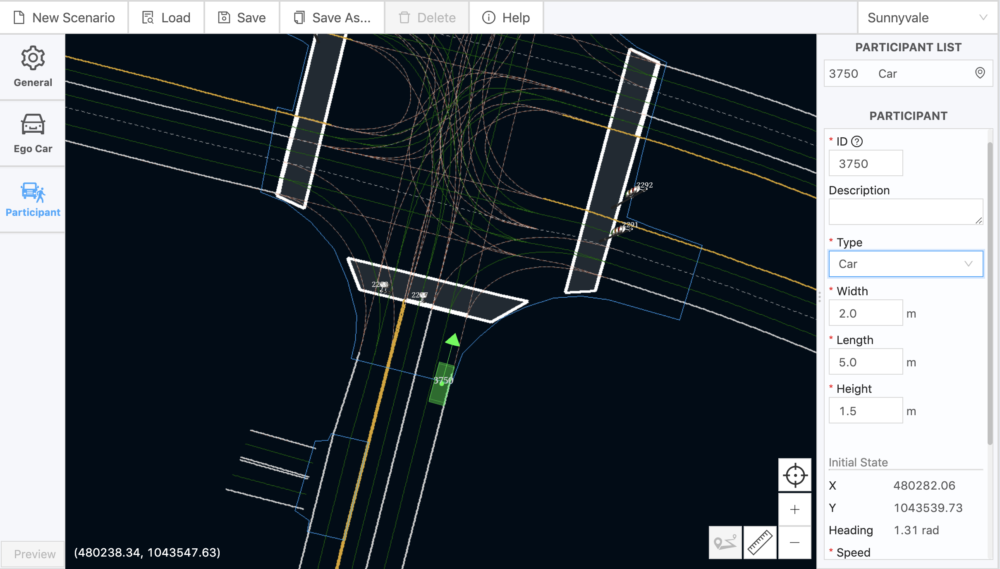

In the Basic Information section, you will notice an auto-generated ID along with a description textbox. You could give your obstacle a suitable ID as well as a description about its expected behavior. You could also specify what is the type of the obstacle, which will be set to `Car` by default. Upon selecting a different type, the obstacle on your screen will change accordingly. You will also need to determine its initial speed and other attributes including width, length and height. There are predetermined values for each vehicle type, which can be changed. 

In the Initial State section, you will need to set the speed of the obstacle which can be either set in `m/s` or `km/hr`. The coordinates and heading of the obstacle is preset and can be changed by directly editing the obstacle's position on the map.

In Runtime Configuration, you can set whether the participant is mobile or static. Should you select static, you have finished setting up your obstacle and are ready to save. If you select mobile instead, you would need to set its `Trigger Type`.

Once you have completed your setup, click on the `add route point` button to set the obstacle's trajectory points as seen in the image below. 


You can set a single destination, or add several points in between. You will also be able to add speed and change the speed of your obstacle on the form from one point to the next. Also, you can edit the location of the point on the screen by clicking on and dragging it to its desired locaiton.

Finally, if you have added several trajectory points and do not know how to go back to your obstacle, you can use the `Re-center tool` (which is similar to the General Action re-center tool), but this re-center tool only works for your obstacles. 

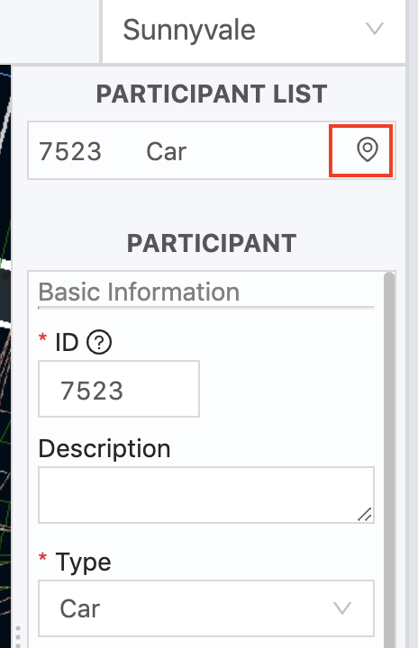

Your final participant screen should appear as follows:

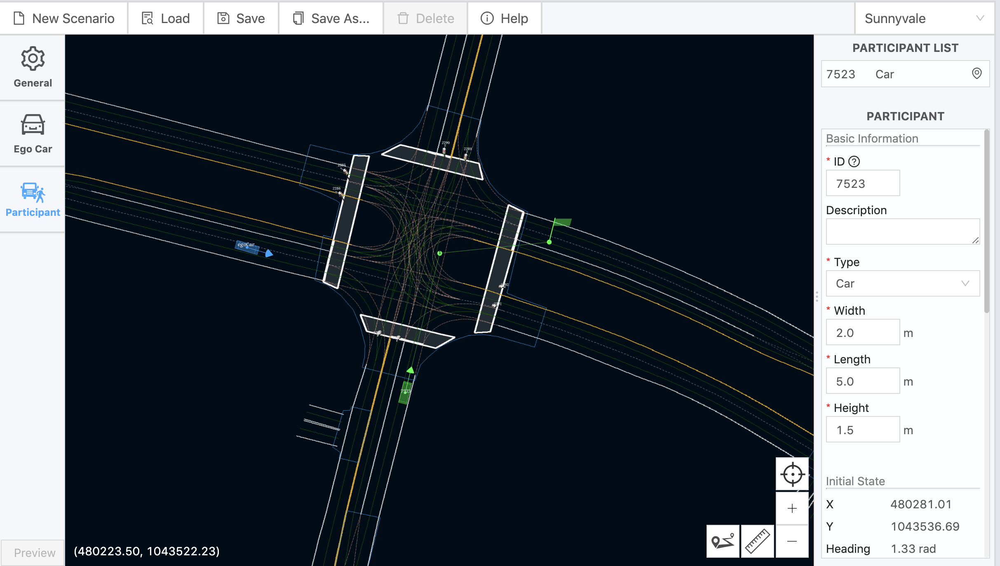


#### Traffic Light Configuration

This configuration tool will allow you to edit the traffic lights that are a part of your scenario. To activate this tool, look for a traffic light on the map and click on it which opens a configuration form on the right-hand side of your window. You will notice 2 constant attricutes ID and its coordinates.
However, you will need to select a trigger type for the traffic light:
- **Distance** - the traffic light will be triggered by the distance between the ego car and the light
- **Time** -  the light will be triggered by the scenario run time

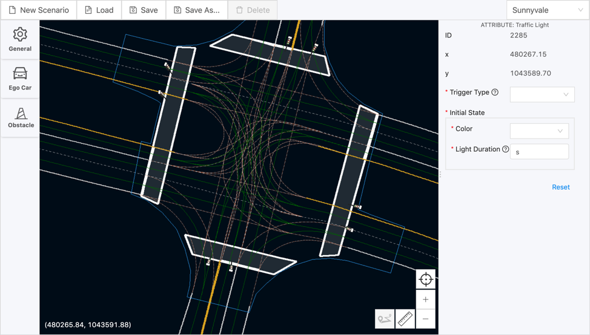

You will also be required to set the `Initial State` of the traffic light. And once your trigger type is set, you will also be required to complete the `States` section, in terms of color and light durations for each state. If the traffic lights have reached the end of their configured states before the end of the scenario, the last state will remain until the end.

## Saving a Scenario

You can save your scenario by clicking on `Save` in the file menu.
```
Note:
The minimum requirements of saving a scenario are to configure all required attributes in the “General” and “Ego Car” configurations. If not, a pop-up window with a failure message will highlight what you are still required to configure.
```

## Running a New Scenario

1. To locate and run your scenario requires you to trigger a `New Task` under `Task Management`

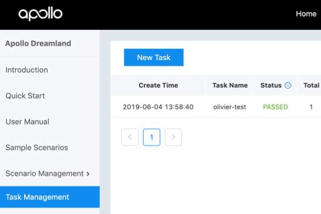

2. click on `Select Scenarios`

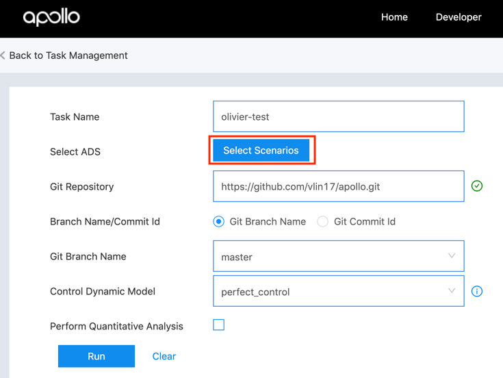

3. You can then search for your newly created scenario. An easy way to filter your private scenarios is to perform an instance search for your username in the `Search scenarios` field. 


c