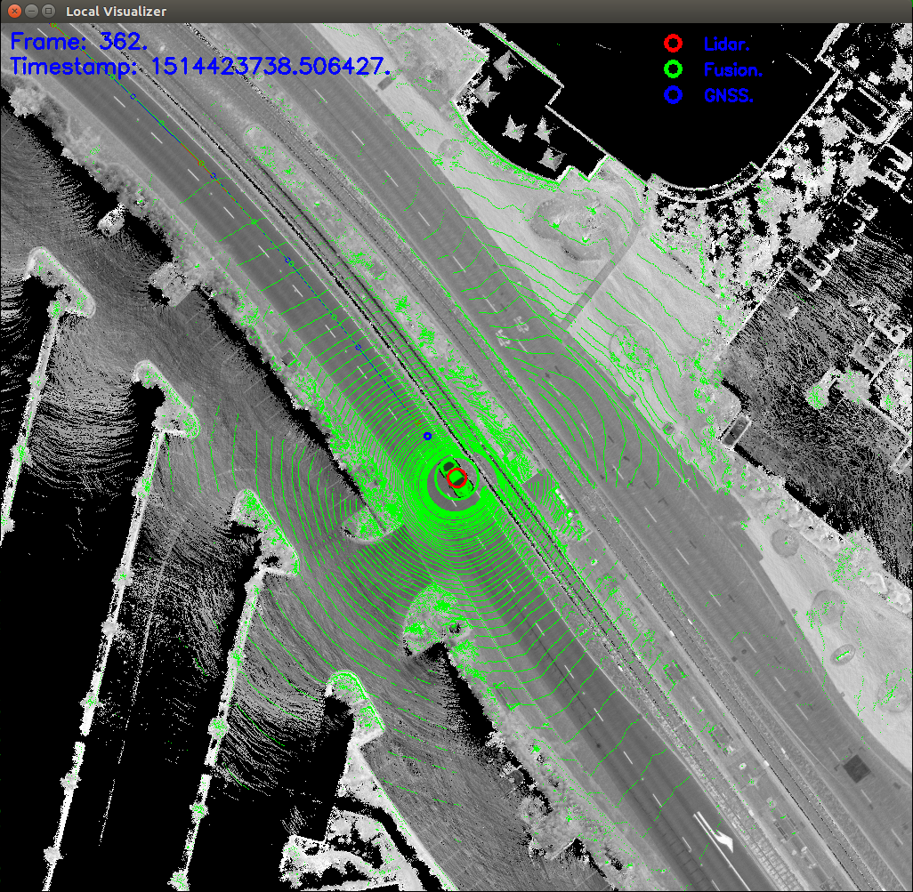

# How to Run MSF Localization Module On Your Local Computer

## 1. Preparation
 - Download source code of Apollo from [GitHub](https://github.com/ApolloAuto/apollo)
 - Follow the tutorial to set up [docker environment](https://github.com/ApolloAuto/apollo/blob/master/docs/howto/how_to_build_and_release.md) and [build Apollo](https://github.com/ApolloAuto/apollo/blob/master/docs/howto/how_to_launch_Apollo.md).
 - Download localization data from [Apollo Data Open Platform](http://data.apollo.auto/?name=sensor%20data&data_key=multisensor&data_type=1&locale=en-us&lang=en)（US only)

## 2. Configuring Parameters
Assume that the path to download localization data from is DATA_PATH.
### 2.1. Configure Sensor Extrinsics
```
cp DATA_PATH/params/ant_imu_leverarm.yaml /apollo/modules/localization/msf/params/gnss_params/
cp DATA_PATH/params/velodyne64_novatel_extrinsics_example.yaml /apollo/modules/localization/msf/params/velodyne_params/
cp DATA_PATH/params/velodyne64_height.yaml /apollo/modules/localization/msf/params/velodyne_params/
```
The meaning of each file
 - **ant_imu_leverarm.yaml**:  Lever arm value
 - **velodyne64_novatel_extrinsics_example.yaml**: Transform from IMU coord to LiDAR coord
 - **velodyne64_height.yaml**: Height of the LiDAR relative to the ground

### 2.2. Configure Map Path
Add config of map path in /apollo/modules/localization/conf/localization.conf
```
# Redefine the map_dir in global_flagfile.txt
--map_dir=DATA_PATH
```
This will overwrite the default config defined in global_flagfile.txt

## 3. Run the multi-sensor fusion localization module
run the script in apollo directory
```
./scripts/localization.sh
```
This script will run localization program in the background. You can check if the program is running by using the command.
```
ps -e | grep "localization".
```     

In /apollo/data/log directory, you can see the localization log files.     
 - localization.INFO : INFO log
 - localization.WARNING : WARNING log
 - localization.ERROR : ERROR log
 - localization.out : Redirect standard output
 - localizaiton.flags : A backup of configuration file

## 4. Play ROS bag
```
cd DATA_PATH/bag
rosbag play *.bag
```
The localization module will finish initialization and start publishing localization results after around 30 seconds.

## 5. Record and Visualize localization result (optional)
### Record localization result
```
./scripts/record_bag.sh
```
### Visualize Localization result
```
./scripts/localization_online_visualizer.sh
```
First, the visualization tool will generate a series of cache files from the localization map, which will be stored in the apollo/data/map_visual directory.

Then it will receive the topics blew and draw them on screen.
 - /apollo/sensor/velodyne64/compensator/PointCloud2
 - /apollo/localization/lidar_pose
 - /apollo/localization/gnss_pose
 - /apollo/localization/pose

If everything is fine, you should see this on screen.



## 6. Stop localization module  
You can stop localizaiton module by
```
./scripts/localizaiton.sh stop
```
If you record localization result in step 5, you will also need to end the recording process:
```
./scripts/record_bag_local.sh stop
```

## 7. Verify the localization result (optional)

```
./scripts/msf_local_evaluation.sh OUTPUT_PATH ANT_IMU_PATH
```
OUTPUT_PATH is the folder stored recording bag in step 5, and ANT_IMU_PATH is the file stored lever arm value.

This script compares the localization results of MSF mode to RTK mode.

(Aware that this comparison makes sense only when the RTK mode runs well.)

And we can get the statistical results like this


The first table is the statistical data of Fusion localization. The second table is the statistical result of Lidar localization. The third table is the statistical result of GNSS localization.

The meaning of each row in the table
 - **error**：  the plane error, unit is meter
 - **error lon**：  the error in the car's heading direction, unit is meter
 - **error lat**：  the error in the car's lateral direction, unit is meter
 - **error roll**： the roll angle error, unit is degree
 - **error pit**：  the pitch angle error, unit is degree
 - **error yaw**：  the yaw angle error, unit is degree

The meaning of each col in the table
 - **mean**： evaluation value of the error
 - **std**：  the standard deviation of the error
 - **max**：  the maximum value of the error
 - **< xx**：  percentage of frames whose error is smaller than the indicated range
 - **con_frame()**： the maximum number of consecutive frames that satisfy the conditions in parentheses