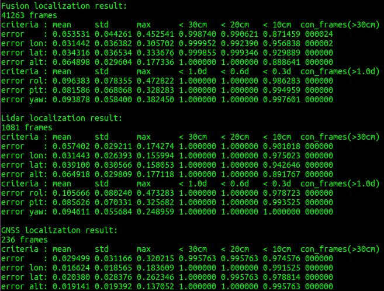

# 如何在本地运行多传感器融合定位模块

本文档提供了如何在本地运行多传感器融合定位模块的方法。

## 1. 事先准备
 - 从[GitHub网站](https://github.com/ApolloAuto/apollo)下载Apollo源代码
 - 按照[教程](https://github.com/ApolloAuto/apollo/blob/master/README_cn.md)设置Docker环境并搭建Apollo工程
 - 从[Apllo数据平台](http://data.apollo.auto/?name=sensor%20data&data_key=multisensor&data_type=1&locale=en-us&lang=en)下载多传感器融合定位数据（仅限美国地区）

## 2. 配置定位模块
为了使定位模块正确运行，需要根据下载的定位数据对地图路径和传感器外参进行配置。

在进行以下步骤前，首先确定你在docker容器中。

假设存放定位数据的路径为DATA_PATH。
### 2.1 配置传感器外参
将定位数据中的传感器外参拷贝至指定文件夹下。

```
  cp DATA_PATH/params/ant_imu_leverarm.yaml /apollo/modules/localization/msf/params/gnss_params/
  cp DATA_PATH/params/velodyne64_novatel_extrinsics_example.yaml /apollo/modules/localization/msf/params/velodyne_params/
  cp DATA_PATH/params/velodyne64_height.yaml /apollo/modules/localization/msf/params/velodyne_params/
```

### 2.2 配置地图路径
在/apollo/modules/localization/conf/localization.conf中添加关于地图路径的配置

```
# Redefine the map_dir in global_flagfile.txt
--map_dir=DATA_PATH
```
这将会覆盖global_flagfile.txt中的默认值。

## 3. 运行多传感器融合定位模块
```
./scripts/localization.sh
```
定位程序将在后台运行，可以通过以下命令进行查看。
```
ps -e | grep localization
```
在/apollo/data/log目录下，可以看到定位模块输出的相关文件。 

 - localization.INFO : INFO级别的log信息
 - localization.WARNING : WARNING级别的log信息
 - localization.ERROR : ERROR级别的log信息
 - localization.out : 标准输出重定向文件
 - localizaiton.flags : 启动localization模块使用的配置

## 4. 播放演示rosbag
```
cd DATA_PATH/bag
rosbag play *.bag
```

## 5. 记录与可视化定位结果（可选）
### 记录定位结果
```
./scripts/record_bag.sh
```
该脚本会在后台运行录包程序，并将存放路径输出到终端上。

### 可视化定位结果
```
./scripts/localization_online_visualizer.sh
```
该可视化工具首先根据定位地图生成用于可视化的缓存文件，存放在/apollo/data/map_visual目录下。

然后接收以下topic并进行可视化绘制。

 - /apollo/sensor/velodyne64/compensator/PointCloud2
 - /apollo/localization/msf_lidar
 - /apollo/localization/msf_gnss
 - /apollo/localization/pose

可视化效果如下


## 6. 结束运行定位模块

```
./scripts/localization.sh stop
```

如果之前有运行步骤5的录包脚本，还需执行

```
./scripts/record_bag.sh stop
```

## 7. 验证定位结果（可选）

假设步骤5中录取的数据存放路径为OUTPUT_PATH

运行脚本
```
./scripts/msf_local_evaluation.sh OUTPUT_PATH
```
该脚本会以RTK定位模式为基准，将多传感器融合模式的定位结果进行对比。

(注意只有在GNSS信号良好，RTK定位模式运行良好的区域，这样的对比才是有意义的。)

最终获得如下统计结果：

可以看到两组统计结果，第一组是组合导航(输出频率200hz)的统计结果，第二组是点云定位(输出频率5hz)的统计结果。

表格中各项的意义， 
 - error：  平面误差，单位为米
 - error lon：  车前进方向的误差，单位为米
 - error lat：  车横向方向的误差，单位为米
 - error roll： 翻滚角误差，单位为度
 - error pit：  俯仰角误差，单位为度
 - error yaw：  偏航角误差，单位为度
 - mean： 误差的平均值
 - std：  误差的标准差
 - max：  误差的最大值
 - <30cm：  距离误差少于30cm的帧所占的百分比
 - <1.0d：  角度误差小于1.0d的帧所占的百分比
 - con_frame()： 满足括号内条件的最大连续帧数