# Apollo 2.5版导航模式的使用方法


`Apollo`项目以其优异的系统架构、完整的模块功能、良好的开源生态及规范的代码风格，受到众多开发者的喜爱和好评。不过在`Apollo`之前的版本中，感知、预测、导航、规划模块均依赖于高精地图，而高精地图的制作方法繁琐且不透明，对于很多开发者而言，这是一个难以逾越的障碍。因为没有高精地图，很多人只能使用`Apollo`提供的模拟数据包进行走马观花式的观赏，而无法在测试道路上完成真枪实弹式的实车调试，这极大降低了`Apollo`项目带来的便利，也不利于自动驾驶开源社区的发展和壮大。显然，`Apollo`项目组已注意到该问题，经过他们几个月的艰苦努力，终于在2.5版开发了一种新的基于相对地图(`relative map`)的导航模式(`navigation mode`)，利用该模式可顺利实施测试道路上的实车调试。

相对地图是Apollo2.5引入的新特性。从架构层面，相对地图模块是连接高精地图(`HD Map`)、感知(`Perception`)模块和规划(`Planning`)模块的中间层。相对地图模块会实时生成基于车身坐标系的地图（格式与高精地图一致），并且输出供规划模块使用的参考线。更多信息，可以参考[相对地图的说明文档](https://github.com/ApolloAuto/apollo/blob/master/modules/map/relative_map/README.md)。从开发者友好性角度看，基于相对地图的导航模式，让开发者可以不依赖高精地图便可实施测试道路的实车调试，极大降低了开发者的使用门槛。

导航模式的基本思路是：

1. 通过人工驾驶方式录制测试道路上的行驶轨迹；
2. 利用`Apollo`工具对原始轨迹进行处理得到平滑轨迹，该轨迹既用于替代路由(`routing`)模块输出的导航路径，也是规划(`planning`)模块用到的参考线（或称指引线、中心线，`reference line`），还是生成相对地图（`relative map`）的基准线。此外，平滑轨迹还可用于替换高精地图内某些车道的参考线（默认情况下，高精地图将车道中心线作为参考线，在道路临时施工等特殊情形下该方式很不合适，需使用人工录制并平滑处理的轨迹替换特殊路段的车道参考线，当然本文不讨论该项内容）；
3. 驾驶员将车辆行驶到测试道路起点，在`Dreamview`中打开导航(`Navigation`)选项及相关功能模块，切换到自动驾驶模式并启动车辆；
4. 自动驾驶过程中，感知（`perception`）模块的相机（`camera`）动态检测道路边界及障碍物，地图（`map`）模块下的相对地图（`relative map`）子模块基于参考线及道路边界实时地生成相对地图（使用以车辆当前位置为原点的相对坐标系），规划（`planning`）模块依据地图模块输出的相对地图和感知模块输出的障碍物信息，动态输出局部行驶路径给控制(`control`)模块执行。
5. 目前，导航模式仅支持单车道行驶，可完成加减速、跟车、遇障碍物减速停车或在车道宽度允许的情形下对障碍物绕行等功能，后续版本的导航模式将会进一步完善以支持多车道行驶、交通标志和红绿灯检测等。

本文对`Apollo2.5`版的构建、参考线数据采集与制作、`Dreamview`前端编译配置、导航模式使用等内容进行全面阐述，希望能给各位开发者正常使用`Apollo 2.5`版带来一定的便利。

## 一、Apollo 2.5版的构建

首先从[GitHub网站](https://github.com/ApolloAuto/apollo)下载`Apollo2.5`版源代码，可以使用`git`命令下载，也可以直接通过网页下载压缩包。源代码下载完成并放置到合适的目录后，可以使用两种方法构建：1.在`Visual Studio Code`中构建（推荐）；2.使用命令行构建。当然，两种方法都有一个前提，就是在你的机器上已经顺利安装了`Docker`。`Apollo`之前版本提供了一个`install_docker.sh`脚本文件，因为很多开发者反映可能出错，`Apollo`项目组已将该文件移除。现在要安装`Docker`就只能参考[Docker官方网站](https://www.docker.com/)的帮助文档了。

### 1.1 在Visual Studio Code中构建

打开`Visual Studio Code`，执行菜单命令`文件->打开文件夹`，在弹出的对话框中，选择`Apollo项目`源文件夹，点击“确定”，如下图所示：

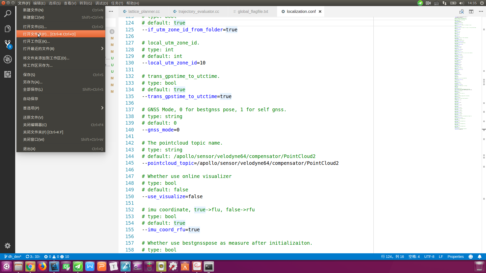 

 

之后，执行菜单命令`任务->运行生成任务`或直接按快捷键`Ctrl+Shift+B`（与`Visual Studio`和`QT`的快捷键一致）构建工程，若之前没有启动过`Docker`，则编译时会启动`Docker`，需在底部终端窗口输入超级用户密码。命令执行完毕，若在底部终端窗口出现`终端将被任务重用，按任意键关闭。`信息（如下图所示），则表示构建成功。整个过程**一定要保持网络畅通**，否则无法下载依赖包。构建过程可能会遇到一些问题，解决方法可参见我写的一篇[博客](https://blog.csdn.net/davidhopper/article/details/79349927) ，也可直接查看`GitHub`网站的[帮助文档](https://github.com/ApolloAuto/apollo/blob/master/docs/howto/how_to_build_and_debug_apollo_in_vscode_cn.md)。

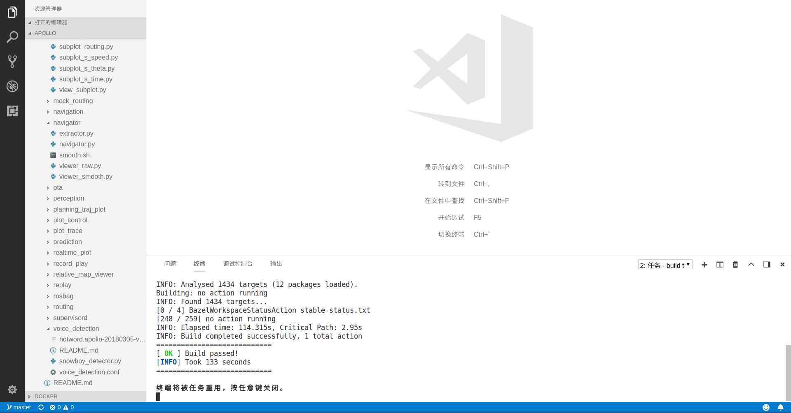 

### 1.2 在命令行中构建

按快捷键`Ctrl + Alt + T`打开命令行终端，输入如下命令启动`Docker`：
``` bash
cd your_apollo_project_root_dir
# 从中国大陆访问，最好加上“-C”选项，直接访问中国大陆镜像服务器以获取更快的下载速度
bash docker/scripts/dev_start.sh -C
```
输入如下命令进入`Docker`：
``` bash
bash docker/scripts/dev_into.sh
```
在`Docker`内部，执行如下命令构建`Apollo`项目：
``` bash
bash apollo.sh build
```
整个操作如下图所示：

 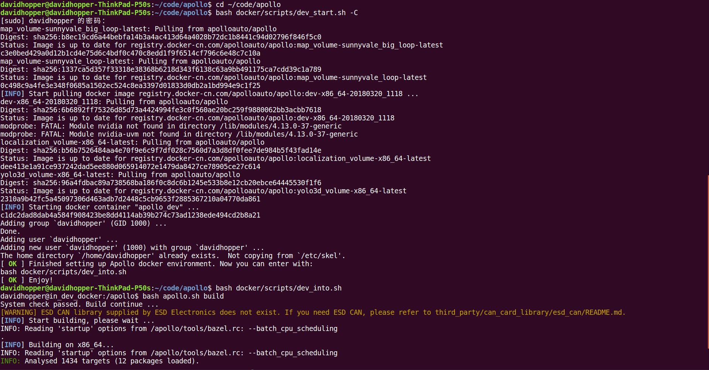

### 1.3 修改定位模块UTM区域ID

`Apollo`项目定位(`localization`)模块默认使用美国西部UTM坐标，在国内需要修改该值。在`Docker`外部，使用`vi`或其他文本编辑器，打开文件`[apollo项目根目录]/modules/localization/conf/localization.conf`，将下述内容：
``` bash
--local_utm_zone_id=10
```
修改为下述内容（这是长沙地区的UTM区域ID，中国UTM分区可参考[该网页](http://www.360doc.com/content/14/0729/10/3046928_397828751.shtml)）：
``` bash
--local_utm_zone_id=49
```
**注意：**如果录制数据时未修改上述内容，则线下模拟测试回放数据包时只能将错就错，千万不能再修改该值，否则地图上的参考线定位会出错！有一次我采集数据时，忘了修改该值，回放数据时又进行修改，结果导致参考线定位到了美国西海岸！我取消修改，按`F5`键刷新浏览器后显示就恢复正常了。

## 二、参考线原始数据的采集

将构建好的`Apollo`项目文件导入车内工控机，并按照**步骤1.2**的方法进入`Docker`，再执行如下命令，启动`Dreamview`服务端程序：
``` bash
bash scripts/bootstrap.sh
```
在浏览器中打开网页[http://localhost:8888](http://localhost:8888)（注意不要使用代理），进入`Dreamview`界面，如下图所示：

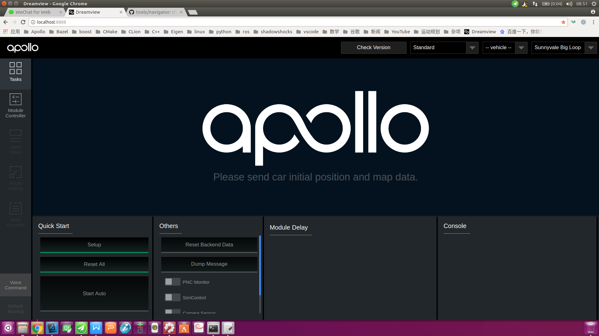 

**1**  驾驶员将车辆驶入待测试路段起点；

**2**  操作员点击`Dreamview`界面左侧工具栏中的`Module Controller`按钮，进入模块控制页面，选中`GPS`、`Localization`、`Record Bag`选项，**注意：如果采集的数据包需用于线下模拟测试，还需加上`CAN Bus`选项。**

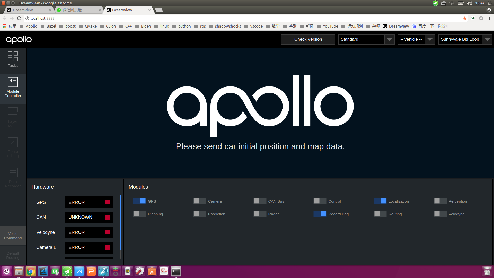 

**3**  驾驶员从起点启动车辆并按预定路线行驶至终点；

**4**  操作员关闭`Dreamview`界面中的`Record Bag`选项，此时会在`/apollo/data/bag`目录（这是`Docker`中的目录，宿主机上对应的目录为`[你的apollo根目录]/data/bag`）中生成一个类似于`2018-04-01-09-58-00`的目录，该目录中保存着类似于`2018-04-01-09-58-00.bag`的数据包。这就是我们所需的数据包，请记住它的路径及名称。**注意：**单个数据包文件的默认录制时长为1分钟，默认文件大小为2048MB，可通过修改文件`/apollo/scripts/record_bag.sh`来改变默认值。

为后文阐述方便起见，我假设数据包`2018-04-01-09-58-00.bag`直接存放于`/apollo/data/bag`目录。

## 三、参考线的制作

参考线的制作既可在车内工控机内完成，也可在其他计算机上实施。无论在哪台计算机上制作，我们首先假定已按**步骤1.2**的方法进入`Docker`，并按照**步骤二**中录制的数据包放置在`/apollo/data/bag`目录中，且假定该文件名为`2018-04-01-09-58-00.bag`（在你的机器上并非如此，这样做只是为了后文阐述方便而已）。

### 3.1 从原始数据包提取裸数据

在`Docker`内部，使用如下命令从原始数据包提取裸数据：
``` bash
cd /apollo/modules/tools/navigator
python extractor.py /apollo/data/bag/2018-04-01-09-58-00.bag
```
上述命令会在当前目录（易知我们在`/apollo/modules/tools/navigator`目录中）生成一个提取后的裸数据文件：`path_2018-04-01-09-58-00.bag.txt`。

为了验证裸数据的正确性，可以使用如下命令查看：
``` bash
python viewer_raw.py ./path_2018-04-01-09-58-00.bag.txt
```
会显示类似下图的路径图：

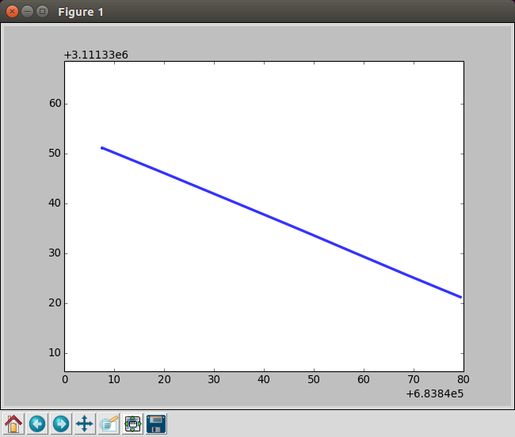 

### 3.2 对裸数据进行平滑处理

如果录制数据时，车辆行驶不够平顺，提取的裸轨迹数据可能会不光滑，有必要对其进行平滑处理。继续在`Docker`内部使用如下命令完成平滑处理：
``` bash
bash smooth.sh ./path_2018-04-01-09-58-00.bag.txt 200
```
注意：上述命令中`200`是平滑处理的长度，该值一般为`150-200`，如果执行失败，可尝试调整该参数，再次进行平滑。

为了验证平滑结果的正确性，可以使用如下命令查看：
``` bash
python viewer_smooth.py ./path_2018-04-01-09-58-00.bag.txt ./path_2018-04-01-09-58-00.bag.txt.smoothed
```
其中，第一个参数`./path_2018-04-01-09-58-00.bag.txt`是裸数据，第二个参数`./path_2018-04-01-09-58-00.bag.txt.smoothed`是平滑结果，显示效果类似下图：

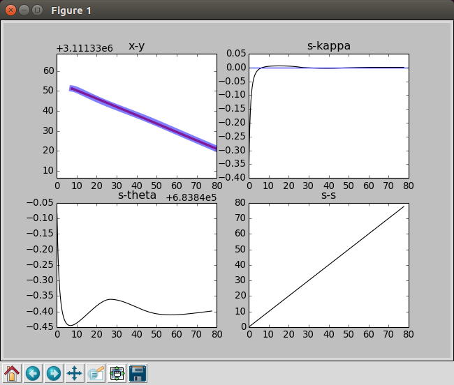 

## 四、Dreamview前端的编译及配置

`Dreamview`前端默认使用`Baidu`地图，也可修改为`Google`地图，但需重新编译`Dreamview`前端，并正确设置UTM区域，具体方法如下（**注意**：如不需修改地图设置，可忽略**4.1-4.2**步，直接执行**4.3**步）：

### 4.1 更改导航地图

打开文件`[apollo项目根目录]/modules/dreamview/frontend/src/store/config/ parameters.yml`，根据需要将下述内容替换为`Google`地图或`Baidu`地图： 
``` bash
navigation:
  # possible options: BaiduMap or GoogleMap
  map: "BaiduMap"

  # Google Map API: "https://maps.google.com/maps/api/js"
  # Baidu Map API: "https://api.map.baidu.com/api?v=3.0&ak=0kKZnWWhXEPfzIkklmzAa3dZ&callback=initMap"
  mapAPiUrl: "https://api.map.baidu.com/api?v=3.0&ak=0kKZnWWhXEPfzIkklmzAa3dZ&callback=initMap"
```
### 4.2 重新编译Dreamview前端

按照**步骤1.2**的方法进入`Docker`，运行如下命令编译`Dreamview`前端：
``` bash
# 安装Dreamview前端依赖包，注意：该步骤只需执行一次，不必每次执行
cd /apollo/modules/dreamview/frontend/
yarn install
# 编译Dreamview前端
cd /apollo
bash apollo.sh build_fe
```
编译过程可能会出现如下错误：
```
ERROR in ../~/css-loader!../~/sass-loader/lib/loader.js?{"includePaths":["./node_modules"]}!./styles/main.scss*
*Module build failed: Error: ENOENT: no such file or directory, scandir '/apollo/modules/dreamview/frontend/node_modules/node-sass/vendor'*
...
（后面还有一长串，不再一一列出）
```
这是内部依赖包不一致造成的，**解决方法如下：**

在`Docker`内部，运行如下命令（注意：**一定要保持网络畅通**，否则无法重新下载依赖包）：
``` bash
cd /apollo/modules/dreamview/frontend/
rm -rf node_modules
yarn install
cd /apollo
bash apollo.sh build_fe
```
### 4.3 配置UTM区域ID

打开文件`[apollo项目根目录]/modules/common/data/global_flagfile.txt`，在最后一行添加如下语句（这是长沙地区的UTM区域ID，中国UTM分区可参考[该网页](http://www.360doc.com/content/14/0729/10/3046928_397828751.shtml)）：
```
--local_utm_zone_id=49
```
## 五、导航模式的使用

### 5.1. 打开Dreamview并开启导航模式

进入`Docker`，启动`Dreamview`，命令如下：
``` bash
cd your_apollo_project_root_dir
# 如果没有启动Docker，首先启动，否则忽略该步
bash docker/scripts/dev_start.sh -C
# 进入Docker
bash docker/scripts/dev_into.sh
# 启动Dreamview后台服务
bash scripts/bootstrap.sh
```
若是线下模拟测试，则将**步骤二**中录制好的数据包`/apollo/data/bag/2018-04-01-09-58-00.bag`（这是我机器上的录制数据）循环播放；**若是实车调试，则忽略该步骤**。
``` bash
# 模拟测试情形下，循环播放录制数据；实车调试情形忽略该步骤
rosbag play -l /apollo/data/bag/2018-04-01-09-58-00.bag
```
在浏览器中打开网页[http://localhost:8888](http://localhost:8888)（注意不要使用代理），进入`Dreamview`界面，点击右上方下拉框，将模式设置为`Navigation`（导航模式），如下图所示： 

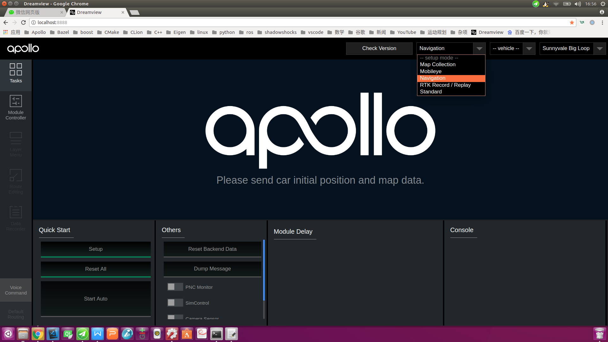 

### 5.2 打开Dreamview导航模式选项

点击`Dreamview`界面左侧工具栏中的`Module Controller`按钮，进入模块控制页面。**若是线下模拟测试**，选中`Relative Map`、`Navi Planning`选项，其他模块根据需要开启，如下图所示（图中显示空白文本的模块是`Mobileye`模块，需安装配置好相关硬件后才可见））：

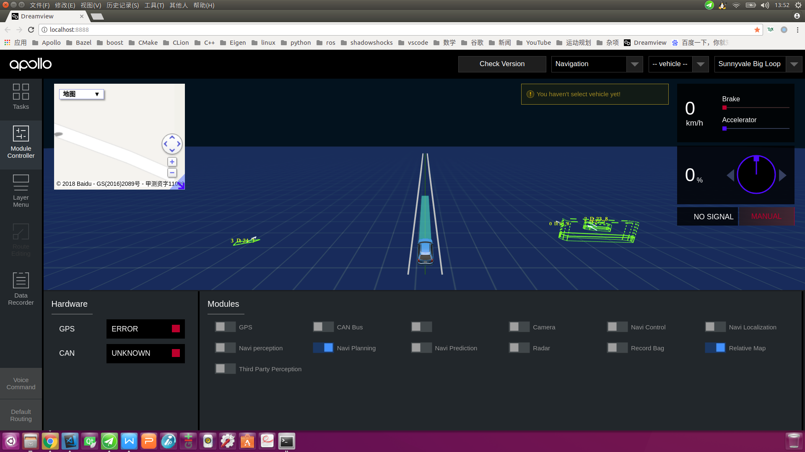 

**若是实车调试**，建议除`Record Bag`、`Mobileye`（若`Mobileye`硬件未安装，则会显示为空白文本）和`Third Party Perception`模块外，其余模块全部开启，如下图所示：

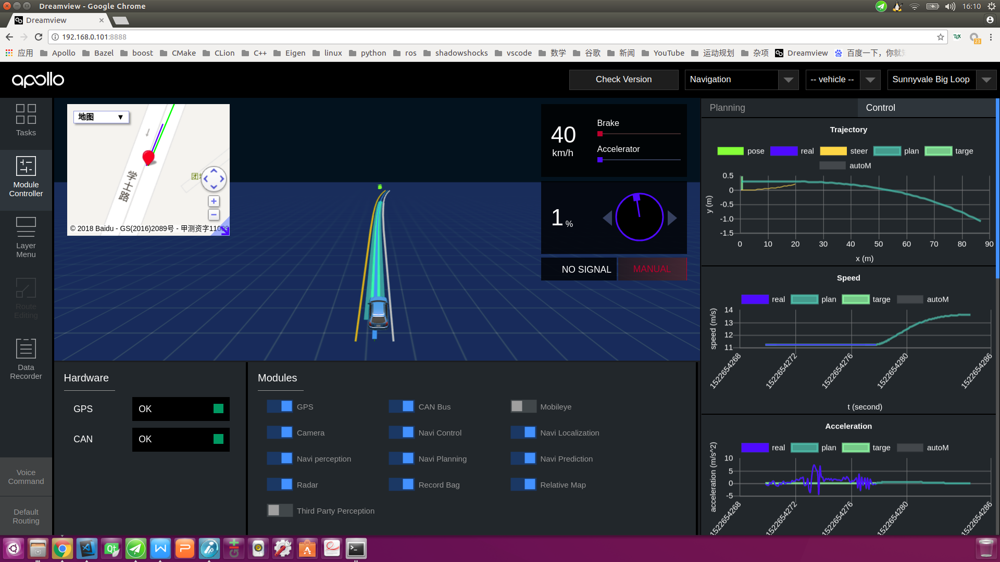 

### 5.3 发送参考线数据

在`Docker`内部，使用如下命令发送**步骤三**中制作的参考线数据：
``` bash
cd /apollo/modules/tools/navigator
python navigator.py ./path_2018-04-01-09-58-00.bag.txt.smoothed
```
下图是**线下模拟测试情形下**`Dreamview`接收到参考线后的界面，注意界面左上角已出现了百度地图界面，我们发送的参考线在百度地图中以红线方式、在主界面中以白色车道线的方式展现。

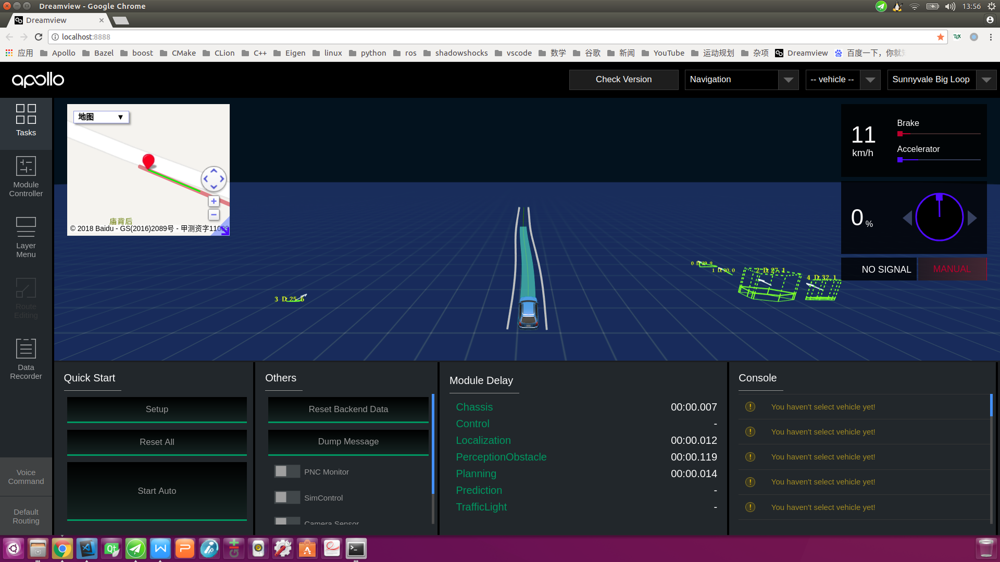 

下图是**实车调试情形下的**`Dreamview`接收到参考线后的界面，注意界面左上角已出现了百度地图界面，我们发送的参考线在百度地图中以红线方式、在主界面中以黄色车道线的方式展现。

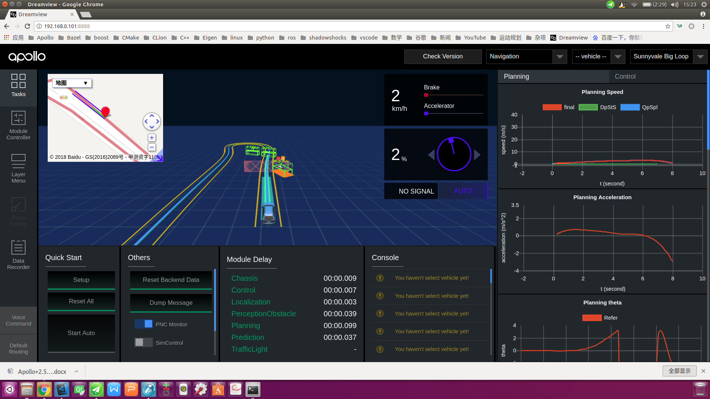 

需注意以下几点：

(1) 如果发送参考线数据后，`Dreamview`界面不能正确显示参考线，可能有以下方面的原因：一是参考线数据未正确发送，解决办法是再次执行发送命令；二是浏览器缓存不一致，解决办法是按`Ctrl + R`或`F5`键刷新显示，或者清理浏览器缓存；三是`Dreamview`后台服务程序运行异常，解决办法是在`Docker`内部重启`Dreamview`后台服务，命令如下：
``` bash
# 停止Dreamview后台服务
bash scripts/bootstrap.sh stop
# 重新启动Dreamview后台服务
bash scripts/bootstrap.sh 
```
(2) 每次车辆重新回到起点后，无论是线下模拟测试还是实车调试情形，**均需再次发送参考线数据**。