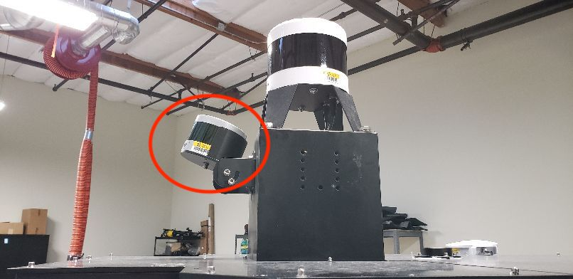
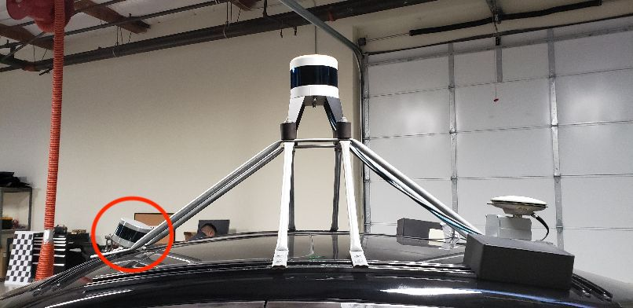
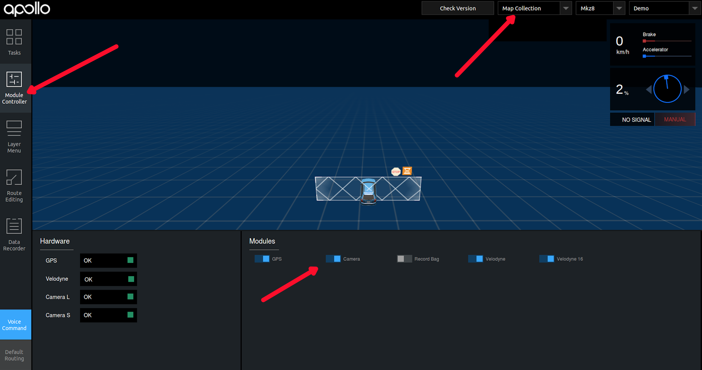
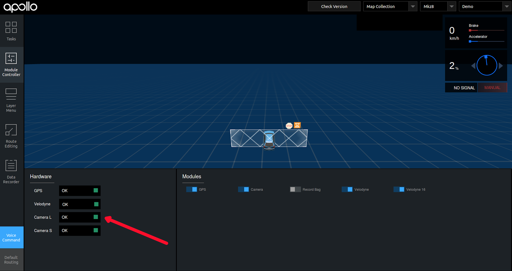
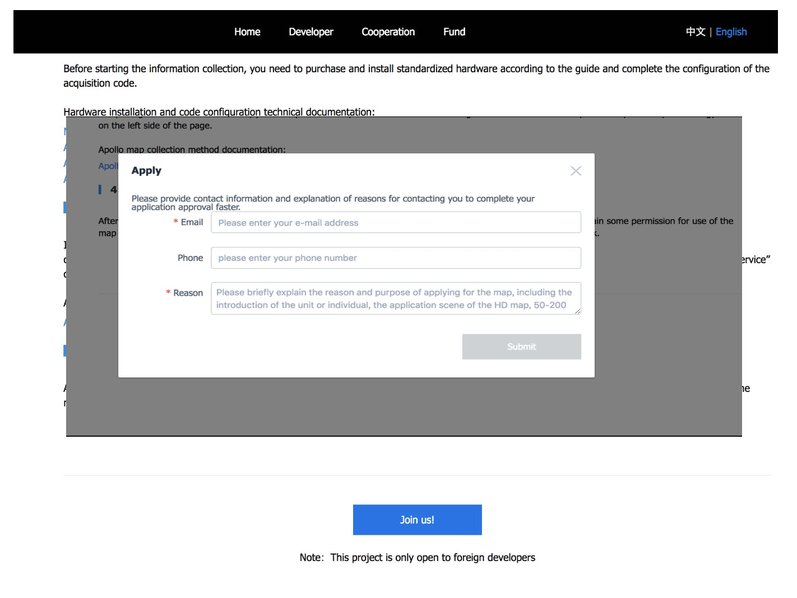
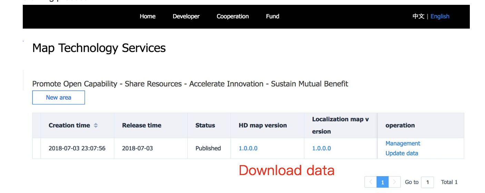

# Apollo 3.5 Map Collection Guide

This guide describes the process of map data collection for Apollo 3.5.

## Hardware and Software Requirement
Please refer to
[Apollo 3.5 Hardware and System Installation Guide](https://github.com/ApolloAuto/apollo/blob/master/docs/quickstart/apollo_3_5_hardware_system_installation_guide.md)
for the steps to install the hardware components. In order to proceed with Data collection, we need to use a single 16-Line LiDAR for traffic light detection placed on top of the car, tilted upwards as described below:

### Installation of VLP-16 lidar

1. In Apollo 2.5, map creation services became a part of Apollo Open Source project. To acquire the data necessary for map creation, one would need to install an additional VLP-16 LiDAR on the vehicle. The purpose of this LiDAR is to collect point cloud information for objects above the FOV of the HDL-64 S3 LiDAR, such as traffic lights and signs. It requires a customized rack to mount the VLP-16 Lidar on top of the vehicle. The figure below shows one of the possible configurations: 

    Another possible mounting is:

    


    In this specific configuration, the VLP-16 LiDAR is mounted with an upward tilt of **20±2°**. The power cable of the VLP-16 is connected to the DataSpeed power panel. The ethernet connection is connected to the IPC (possibly through an ethernet switch). Similar to HDL-64 S3 LiDAR, the VLP-16 GPRMC and PPS receive input from the GPS receiver. Ideally, additional hardware should be installed to duplicate the GPRMC and PPS signal from the GPS receiver sent to HDL-64 and VLP-16 respectively. However, a simple Y-split cable may also provide adequate signal for both LiDARs. To distinguish from the HDL-64 S3 LiDAR, please follow the VLP-16 manual and configure the IP of VLP-16 to **192.168.20.14**, the data port to **2369**, and the telemetry port to **8309**. The pinout for the signal input from GPS receiver can also be found in the manual if you need customized cable.


For additional reference, please visit: [http://velodynelidar.com/vlp-16.html](http://velodynelidar.com/vlp-16.htmll)


2. Please refer to
[Apollo Software Installation Guide](https://github.com/ApolloAuto/apollo/blob/master/docs/quickstart/apollo_software_installation_guide.md)
for steps to install system software.

3. Please refer to
[Apollo Sensor Calibration Guide](https://github.com/ApolloAuto/apollo/blob/master/docs/quickstart/multiple_lidar_gnss_calibration_guide.md)
for Sensor Calibration information.

4. **NVMe SSD Installation:** In order to avoid possible data loss caused by IO bottleneck, it is recommended to install NVME SSD hard disk in IPC.

5. **Satellite Base Station:** In order to get accurate mapping results, satellite base stations are needed to be set up to ensure the RTK can work properly.

## Good to know - Data Collection
1. **Weather condition:** Do not collect data when it is either raining or snowing. Please wait for the road to be as clean and dry as possible. You could collect data when there is a slight drizzle as the reflectance of the road would not change too much but it is still highly recommended to collect data in clear weather conditions.

2. Please make sure that the camera lens' are clean.

3. **Driving speed:** Try to keep you speed below 60 km/h (~ 37 mph). For roads with a higher speed limit, drive additional laps of the route (at least 2 or 3 more) to ensure accurate data collection.

4. Refer to the [best practices guide](apollo_3_5_map_data_collection_best_practices_guide.md) for information regarding setup and post collection steps


## Data Collection Steps
1. Make sure that necessary topics as mentioned below, for mapping are available after starting the system. Open a terminal and enter the docker dev container and execute:
   ```
   cyber_monitor
   ```
   
   Topic list for mapping: 
   ```
    /apollo/monitor/system_status
    /apollo/sensor/gnss/best_pose
    /apollo/sensor/gnss/gnss_status
    /apollo/sensor/gnss/imu
    /apollo/sensor/gnss/ins_stat
    /apollo/sensor/gnss/odometry
    /apollo/sensor/gnss/raw_data
    /tf
    /tf_static
    /apollo/sensor/camera/front_12mm/image/compressed
    /apollo/sensor/camera/front_6mm/image/compressed
    /apollo/sensor/lidar16/front/up/Scan
    /apollo/sensor/lidar16/front/up/compensator/PointCloud2
    /apollo/sensor/lidar128/Scan
    /apollo/sensor/lidar128/compensator/PointCloud2
    ```

2. Enter into the Map Collection Mode:
Please refer to
[Apollo 3.5 Quick Start](https://github.com/ApolloAuto/apollo/blob/master/docs/quickstart/apollo_3_5_quick_start.md)
for launching the Apollo 3.5 software and hardware stack on vehicle.

3. Choose [Module Controller] tab, select [Map Collection] mode, and switch on [GPS]、[Camera]、[Velodyne]、[Velodyne16].



Confirm whether the sensors are ready.



4. After all the sensors are ready, switch on [Record Bag] to start recording the map data.


```
Note:

1. Before beginning to collect map data, the vehicle needs to be stationary for up to five minutes, and then drives in a ribbon or figure 8 shaped route for another five minutes.
2. While collecting map date, we should ensure the same route can be covered more than five times in the speed under 60KM/h. Try to include as many lanes as possible while covering the route.
3. You do not need to stop at any intersections, you can pass it slowly. But remember that at the intersection, it is necessary to collect at least 50m of all the lanes that enter the intersection in all directions to ensure the traffic lights and lane lines in all directions are captured completely and clearly.
4. After the map collection process is complete, the car needs to drive in a ribbon or figure 8 shaped route for another five minutes, and then remain stationary for five minutes.
```

5. After the collection is finished, switch off [Record Bag] first, and then switch off [GPS], [Camera], [Velodyne] and [Velodyne16].


5. Data Upload

The collected map data is placed in the */apollo/data/bag/(start time of collection, e.g.,2018-04-14-21-20-24)* directory by default, package the data as tar.gz compressed file and upload them to the [Apollo Data Official Website](http://data.apollo.auto/hd_map_intro/?locale=en-us).

## Data Verification

If data is collected for the first time, or the extrinsic parameters between multiple-lidars and GNSS are changed or if a new vehicle is used to install Apollo 3.5 and data is being collected on this new vehicle, we would need to verify your map data. In order to verify your data, we would need you to collect the data of a small route and upload it as mentioned in the steps above.

```
Note:
Please follow the aforementioned data collection guide to acquire data for a small area and upload it to use for verification purposes.
```

## Map Production Service

1. **Permission Application**

Firstly, you would need to create a Baidu account, log into the account, and apply for permission to use map production service (you only need to apply once， skip this step if you have already applied).



2. **Map Technical Service**

Users can create new areas, create mapping tasks, manage map data, track the progress of cartography, and download map data on this page. 


3. **Data Management**

After clicking “Management”, users can open the data management page. On this page, you can view the description of data upload. After all the data is uploaded, the data can be submitted. Once the data is submitted, you will be unable to edit it as this initiates the drawing process.


4. **Data Download**

When the demand status is "Published", click "Download" to download the map data. If you need to update the map, please click "Update Data" to initiate the mapping process. You would need to re-upload the data and submit it to restart the drawing process.

