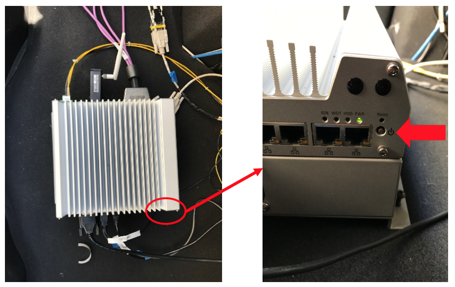
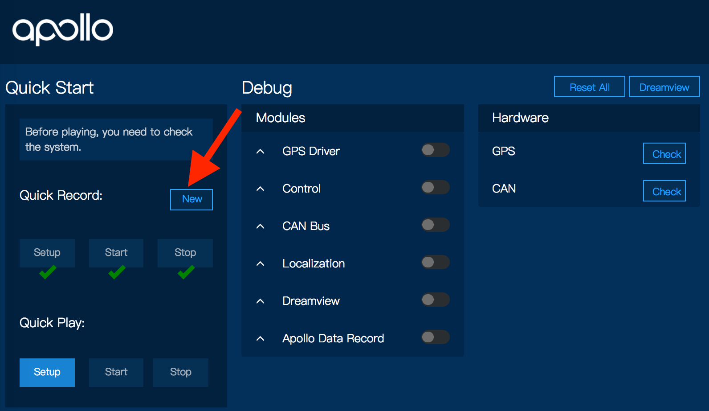
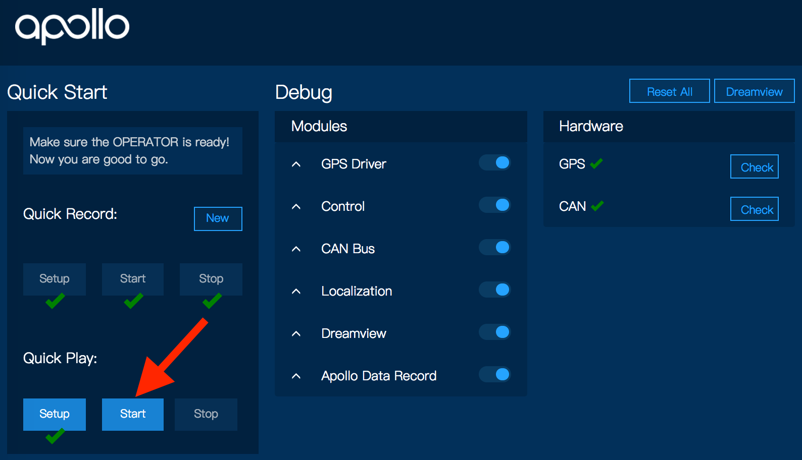

# Apollo 1.0 Quick Start Guide
## Contents
* [About This Guide](#about-this-guide)
    * [Document Conventions](#document-conventions)
* [Overview of Apollo](#overview-of-apollo)
* [Description of the Vehicle Environment](#description-of-the-vehicle-environment)
* [Hardware Installation](#hardware-installation)
* [Apollo Software Installation](#apollo-software-installation)
    * [Download Apollo Source](#download-apollo-source)
    * [Set up Docker Support](#set-up-docker-support)
    * [Set up Apollo Release Docker Image](#set-up-apollo-release-docker)
    * [Customize Your Release Container](#customize-your-release-container)
* [Run the Demo on Vehicle](#run-the-demo-on-vehicle)
    * [Launch the Local Release Docker Image](#launch-the-local-release-env-docker-image)
    * [Record the Driving Trajectory](#record-driving-trajectory)
    * [Perform Autonomous Driving](#perform-autonomous-driving)
    * [Shut Down](#shut-down)
* [Run Offline Demo](#run-offline-demo)

# About This Guide

The _Apollo 1.0 Quick Start Guide_ provides all of the basic instructions to understand, install, and build Apollo.

## Document Conventions

The following table lists the conventions that are used in this document:

| **Icon**                            | **Description**                          |
| ----------------------------------- | ---------------------------------------- |
| **Bold**                            | Emphasis                                 |
| `Mono-space font`                   | Code, typed data                         |
| _Italic_                            | Titles of documents, sections, and headings Terms used |
|        | **Info**  Contains information that might be useful.  Ignoring the Info icon has no negative consequences. |
|          | **Tip**. Includes helpful hints or a shortcut that might assist you in completing a task. |
|    | **Online**. Provides a link to a particular web site where you can get more information. |
|  | **Warning**. Contains information that must **not** be ignored or you risk failure when you perform a certain task or step. |

# Overview of Apollo

Apollo has been initiated to provide an open, comprehensive, and reliable software platform for its partners in the automotive and autonomous-driving industries. Partners can use the Apollo software platform and the reference hardware that Apollo has certified as a template to customize in the development of their own autonomous vehicles.

Apollo 1.0, also referred to as the _Automatic GPS Waypoint Following_, works in an enclosed venue such as a test track or parking lot. It accurately replays a trajectory and the speed of that trajectory that a human driver has traveled in an enclosed, flat area on solid ground.

At this stage of development, Apollo 1.0 **cannot** perceive obstacles in close proximity, drive on public roads, or drive in areas without GPS signals.

# Description of the Vehicle Environment

The Lincoln MKZ, enhanced by Autonomous Stuff, provides users with an accessible autonomous vehicle platform. The platform supplies users with a comprehensive stack of hardware and software solutions.

Users gain direct access to vehicle controls such as gear selection, speed, and indicator lights. Software interfaces have been created for steering, braking, acceleration, and gear selection to provide Developers with a workable user interface.

Additional features include:

- Power distributor terminals
- Integrated PC with ROS pre-installed and configured
- Emergency Stop using a drive-by-wire system
- Ethernet network and USB connections (to PC)

# Hardware Installation

Please refer to [Apollo 1.0 Hardware and System Installation Guide](https://github.com/ApolloAuto/apollo/blob/master/docs/quickstart/apollo_1_0_hardware_system_installation_guide.md)
for the steps to install the hardware components and the system software.

# Apollo Software Installation

This section includes:

- Download the Apollo Release Package
- Set up Docker Support
- Customize Your Release Container

Before getting started, please make sure you have installed the Ubuntu Linux 14.04.3 and the Apollo Kernel following the steps in the
[Apollo 1.0 Hardware and System Installation Guide](https://github.com/ApolloAuto/apollo/blob/master/docs/quickstart/apollo_1_0_hardware_system_installation_guide.md).

## Download Apollo Source

1. Download Apollo source code from the [github source](https://github.com/ApolloAuto/apollo/):

```
git clone git@github.com:ApolloAuto/apollo.git
cd apollo

```

2. Set up environment variable `APOLLO_HOME` by the following command:

```
echo "export APOLLO_HOME=$(pwd)" >> ~/.bashrc && source ~/.bashrc
```

3. Open a new terminal or run `source ~/.bashrc` in an existing terminal.


 In the following sections, it is assumed that the Apollo directory is located in  `$APOLLO_HOME`.

## Set up Docker Support

The Docker container is the simplest way to set up the build environment for Apollo.

For more information, see the detailed Docker tutorial [here](https://docs.docker.com/).

1. Run the following command to install Docker:


```
cd $APOLLO_HOME
bash docker/scripts/install_docker.sh
```

2. After the script completes, log out and then log back into the system to enable Docker.


3. (Optional) If you already have Docker installed (before you installed the Apollo Kernel), add the following line in `/etc/default/docker`:

```
DOCKER_OPTS = "-s overlay"
```

## Customize Your Release Container

1. Download and start the Apollo Release docker image by running the following commands:

```
cd $APOLLO_HOME
bash docker/scripts/release_start.sh
```

2. Login into the Apollo Release docker image by running the following commands:

```
bash docker/scripts/release_into.sh
```

3. Set up the zone number for the Global Navigation Satellite System (GNSS) Driver by modifying the following line in file `./ros/share/gnss_driver/launch/gnss_driver.launch`.

```
<arg name="proj4_text" default="+proj=utm +zone=10 +ellps=WGS84 +towgs84=0,0,0,0,0,0,0 +units=m +no_defs " />
```
You only have to modify the value `+zone=10` in the above line.
Please refer to the
[Apollo's Coordinate System](https://github.com/ApolloAuto/apollo/blob/master/docs/specs/coordination.pdf) to find your local zone number.
For example, if you are in Beijing, China, you have to set `+zone=50`.

5. Set up the Real Time Kinematic (RTK) Base Station for the GNSS Driver by modifying the file: `./ros/share/gnss_driver/conf/gnss_conf_mkz.txt`

   Refer to the following example for a typical RTK setup:

```
rtk_from {
	format: RTCM_V3
		ntrip {
		address: <provide your own value>
		port: <provide your own value>
		mount_point: <provide your own value>
		user: <provide your own username>
		password: <provide your own password>
		timeout_s: <provide your own value, e.g., 5>
	}
}
rtk_to {
	format: RTCM_V3
	serial {
		device: <provide your own value, e.g., "/dev/ttyUSB1">
		baud_rate: <provide your own value, e.g., 115200>
	}
}
```

The `rtk_from` is  used for RTK base station information.

The `rtk_to` is used to send the RTK differential data to the receiver.

6. Add ESD CAN Support

   Please refer to [ESD CAN README](https://github.com/ApolloAuto/apollo/blob/master/third_party/can_card_library/esd_can/README.md)
   to setup the ESD CAN library.

7. Follow these steps to persist your local changes:

```
# RUN OUT OF DOCKER ENV
# commit your docker local changes to local docker image.
exit # exit from docker environment
cd $APOLLO_HOME
bash docker/scripts/release_commit.sh
```

# Run Demo on Vehicle

This section provides the instructions to run the Apollo 1.0 Demo on Vehicle.
1. Set up the hardware:

- Power-on the platform vehicle.
- Power-on the Industrial PC (IPC).
    
- Power-on the modem by pressing and holding the power button until the lights turn on.
- Set up the network configuration for the IPC: static IP (for example, 192.168.10.6), subnet mask (for example, 255.255.255.0), and gateway (for example, 192.168.10.1)
   - Configurate your DNS server IP (for example, 8.8.8.8).
   - Use a tablet to access **Settings** and connect to MKZ wifi:

   

2. Start the HMI in Docker **using Chrome only**:

   **Warning:** Make sure that you are not starting HMI from two Docker containers concurrently.

## Launch the Local release env Docker Image

Run the following commands:
```
cd $APOLLO_HOME
bash docker/scripts/release_start.sh local_release
```
When Docker starts, it creates a port mapping, which maps the Docker internal port 8887 to the host port 8887. You can then visit the HMI web service in your host machine browser:

Open the Chrome browser and start the Apollo HMI by going to **192.168.10.6:8887**.
 

## Record the Driving Trajectory

Follow these steps to record the driving trajectory:

1. In the Apollo HMI, under Quick Record, click **Setup** to start all modules and perform the hardware health check.
   
2. If the hardware health check passes, click the **Start** button to start to record the driver trajectory.
   
3. After arriving at a destination, click the **Stop** button to stop recording.
   
4. If you want to record a *different* trajectory, click the **New** button to initiate recording again.
   

## Perform Autonomous Driving

Follow these steps to perform autonomous driving:

1. In the Apollo HMI, under Quick Play, click **Setup** to start all modules and perform a hardware health check.
   

2. If the vehicle successfully passes the Setup step, it is ready to enter the Autonomous mode. **MAKE SURE DRIVER IS READY!**  Click the **Start** button to start the autonomous driving.

   

3. After arriving at your destination,  click the **Stop** button to stop replaying the recorded trajectory.
   

## Shut Down

1. Shut down the system from a terminal:
    ```sudo shutdown now```

2. Power-off the IPC (locate the icon on the top right of the desktop to click **Shut Down**).

3. Turn off the modem by pressing and holding the power button until the lights turn off.

4. Turn off the car.

# Run Offline Demo
Refer to [Offline Demo Guide](https://github.com/ApolloAuto/apollo/blob/master/docs/demo_guide/README.md)
