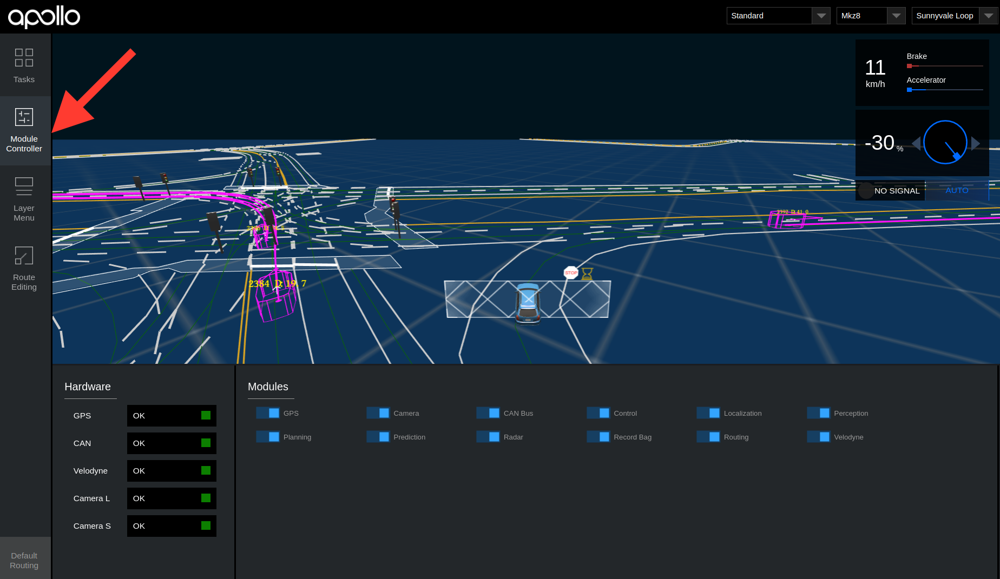

# Apollo 2.0 Quick Start Guide

This quick start focuses on Apollo 2.0 new features. For general Apollo
concepts, please refer to
[Apollo 1.0 Quick Start](https://github.com/ApolloAuto/apollo/blob/master/docs/quickstart/apollo_1_0_quick_start.md).

Before doing the following steps, make sure you have calibrated the extrinsic
parameters between the LiDAR and the GNSS/INS. For sensor calibration, please
refer to
[Apollo 1.5 LiDAR calibration guide](https://github.com/ApolloAuto/apollo/blob/master/docs/quickstart/apollo_1_5_lidar_calibration_guide.md).


## Launch release env Docker Image

Run the following commands:

```bash
cd $APOLLO_HOME
bash docker/scripts/release_start.sh
```

When Docker starts, it creates a port mapping, which maps the Docker internal
port 8888 to the host port 8888. You can then visit the Dreamview web service in
your host machine browser:

Open the Chrome browser and start the Apollo Dreamview by going to
**localhost:8888**.
 

You'll be required to setup profile before doing anything else. Click the
dropdown menu on top right to select your HDMap and vehicle in use. The list are
defined in
[HMI config file](https://raw.githubusercontent.com/ApolloAuto/apollo/master/modules/dreamview/conf/hmi.conf).

## (*New!*) Start Auto

In Apollo 2.0, we released the new feature, auto driving on simple urban road.

1. To make it work,  you need setup the system by clicking the "Setup" button.
   

2. Go to **Module Controller** tab, check if all modules and hardware are ready.
   

3. Make sure the vehicle is in a good state which is safe to enter auto mode.
   Click the "Start Auto" button, then it will drive you there!
   
