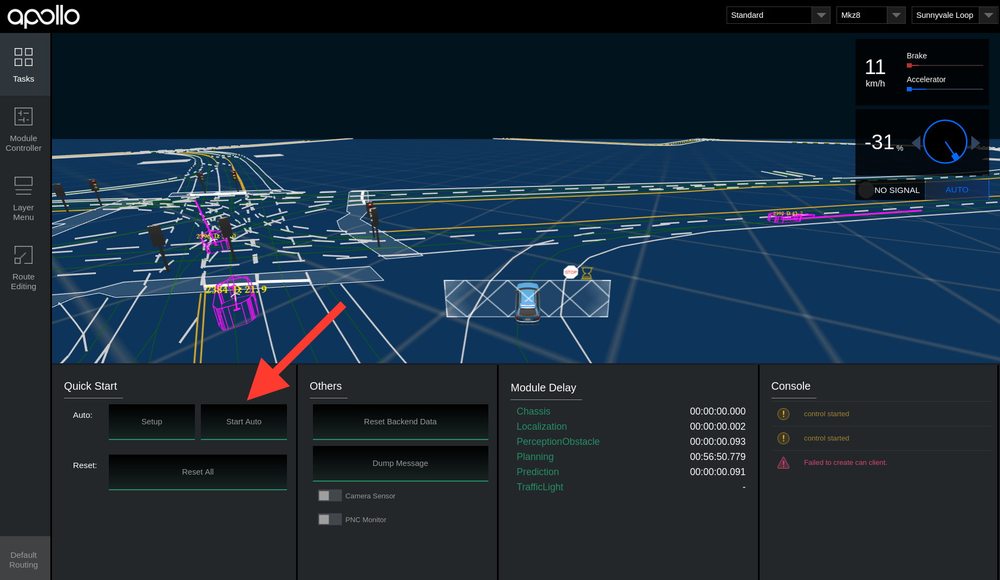

# Apollo 2.0 Quick Start Guide

This quick start focuses on Apollo 2.0 new features. For general Apollo
concepts, please refer to
[Apollo 1.0 Quick Start](https://github.com/ApolloAuto/apollo/blob/master/docs/quickstart/apollo_1_0_quick_start.md) and [Apollo Software Installation Guide](https://github.com/ApolloAuto/apollo/blob/master/docs/quickstart/apollo_software_installation_guide.md).

# Onboard Test

1. For vehicle onboard test make sure you have calibrated the all sensors. For sensor calibration, please refer to [Apollo 2.0 Sensor Calibration Guide](https://github.com/ApolloAuto/apollo/blob/master/docs/quickstart/apollo_2_0_sensor_calibration_guide.md) before you proceed.

2. Launch Docker Release Container

3. Launch DreamView

    Use your favorite browser to access HMI web service in your host machine browser with URL http://localhost:8888

    

4. Select Vehicle and Map
    
    You'll be required to setup profile before doing anything else. Click the dropdown menu to select your HDMap and vehicle in use. The list are defined in [HMI config file](https://raw.githubusercontent.com/ApolloAuto/apollo/master/modules/dreamview/conf/hmi.conf).

    *Note: It's also possible to change profile on the right panel of HMI, but just remember to click "Reset All" on the top-right corner to restart the system.*

5. Start Modules

    Click the "Setup" button.

    

    Go to **Module Controller** tab, check if all modules and hardware are ready. (Note: in your offline envionrment, the hardware modules such as GPS, CANBus, Velodyne, Camera and Radar cannot be brought up.)

    

6. Be Cautious When Starting Autonomous Driving

    Go back to **Tasks** tab. Make sure the vehicle is in a good state which is safe to enter auto mode. Click the "Start Auto" button, then it will drive you there!

    
