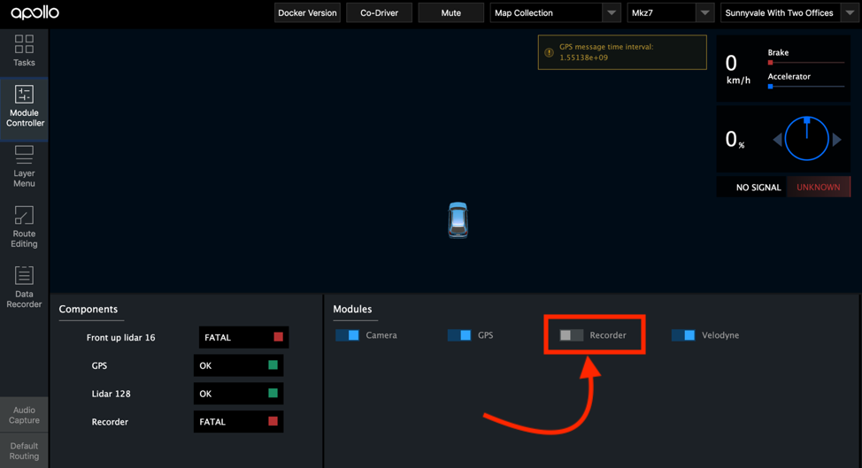

# Apollo 3.5 Map Data Collection Best Practices Guide

This guide can be used to guide you through the steps to collect map data for Apollo 3.5

## Prerequisites
- Apollo 3.5 installed without any errors - [How to Build Apollo](https://github.com/ApolloAuto/apollo/blob/master/docs/howto/how_to_build_and_release.md)
- Hardware installed as mentioned in this guide - [https://github.com/ApolloAuto/apollo/blob/master/docs/quickstart/apollo_3_5_hardware_system_installation_guide.md]
- Sensors calibrated correctly

## Data Collection Steps
Once all the prerequisites are met, follow the steps below:

1. Inside the Dreamview environment, go to **Module Control** and see if all the sensors are `Green` meaning they are all working and that all the topics are working. The only special case is that the additional front lidar 16 (which is facing upwards) which is installed for traffic lights, is not Green – this can be ignored when traffic light information is not being collected

    

2. Go into your terminal,
    - Enter `dev_docker` on your terminal and type `cyber_monitor` 
    - If all the topics are green, then they are working correctly
    - Once inspected, go to the next page, shortcut `fn + up/down arrow key`
    - Verify that all necessary topics are green

3. Sync Localization module with your GPS signal,
    -	Go outside the garage where the GPS signal is good, you can confirm that the strength of the GPS signal is good when it turns green in Dreamview as mentioned in Step 1.
    -	[Optional – alternate method to check if GPS is working] Once you see the topic `gnss/best_pose` in cyber_monitor, then you know GPS is working
    -	Inside the topic gnss/best_pose: click on it, if the `sol_type` specifies `narrow int` then it confirms that the signal is good enough to use
    -	After confirming GPS is working, you can start the data collection process, click on the `Recorder` button as seen in the image below

        

     
    - [IMPORTANT] Stay stationary for 3~5 minutes for the GPS signal to sync
    -	Then, drive your car around the parking lot a few times 
    -	Check for topic called `tf` in cyber_monitor to see if the Localization module is up and running
    -	Note, Localization takes time to warm up
    -	If the map in Dreamview has jiggly lines as seen in the image below, please restart dreamview or rebuild Apollo

          

4. Data collection,
    Once the localization module has warmed up and you see the topic `tf` in cyber_monitor, you are now ready for map data collection:
    - [This guide](https://github.com/ApolloAuto/apollo/blob/master/docs/quickstart/Apollo_3_5_map_collection_guide.md) can walk you through how data can be collected 
    -	Once the collection is done, go to an area where the GPS signal is good 
    -	[IMPORTANT] Stay stationary for 3~5 minutes 
    -	Shut down the `Recorder` button and close sensor types like Lidar, Camera, GPS 

## Data Verification

-	Check if the point cloud of VLS 128 covers all obstacles surrounding the vehicle like trees, other vehicles - `cyber_visualizer`
-	Check that the framerate of VLS 128 is at least 10Hz `cyber_monitor`
-	Check that the LiDAR’s generated noise is moderate (not to high) `cyber_visualizer`
-	Check whether the IMU coordinates are correct and not rotated on a different axis `cyber_monitor`

## FAQs

-	If localization doesn’t warm up and if the topic `tf` is not visible, then the best way to kickstart the module is by going to an area where you already have a map and start driving through it. 
Note: this will not work if you are collecting data for the first time. If you are collecting for the first time, keep driving in a loop in an area with good GPS signal
-	If the map has jiggly lines, restart Dreamview or rebuild Apollo

