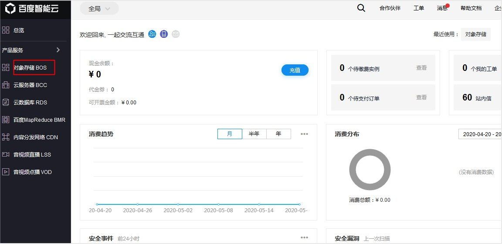
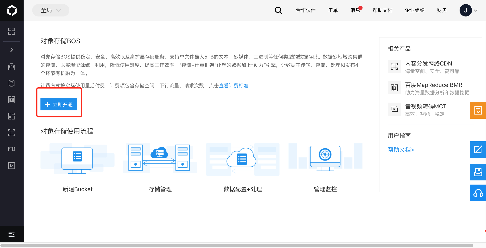
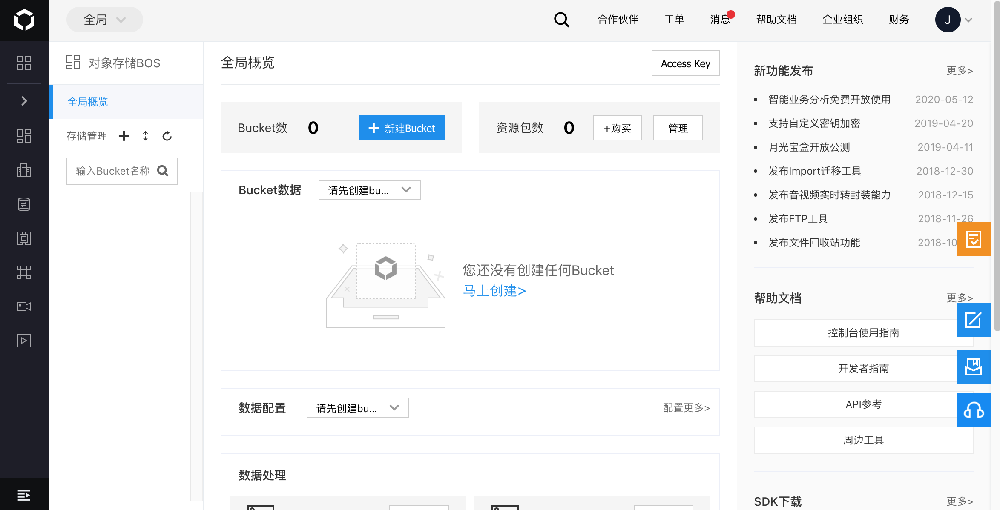
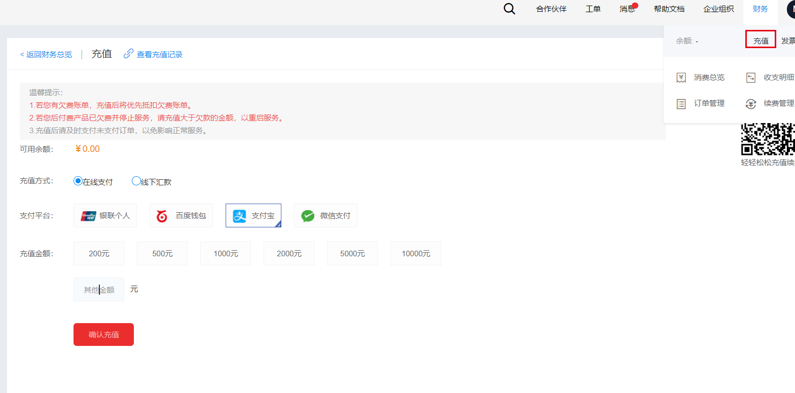
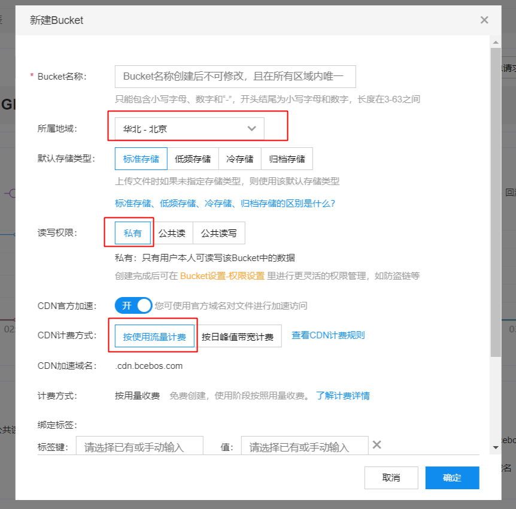
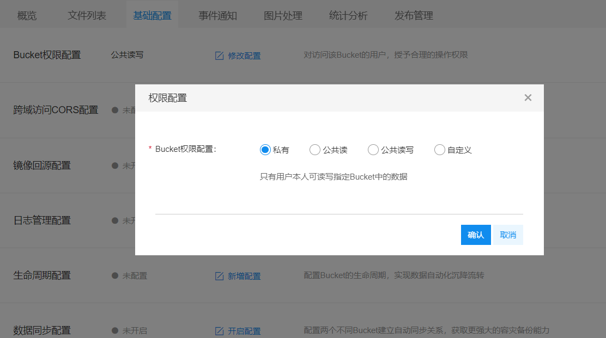
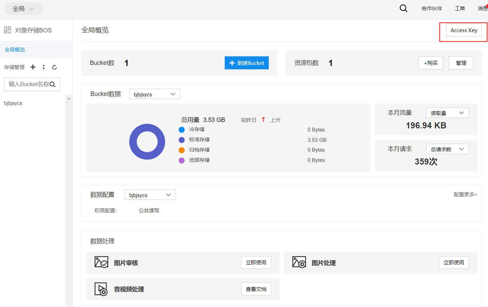
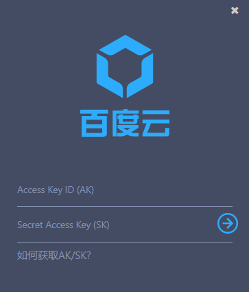
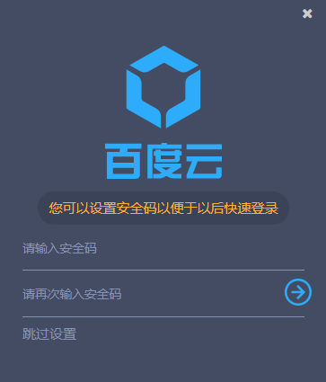
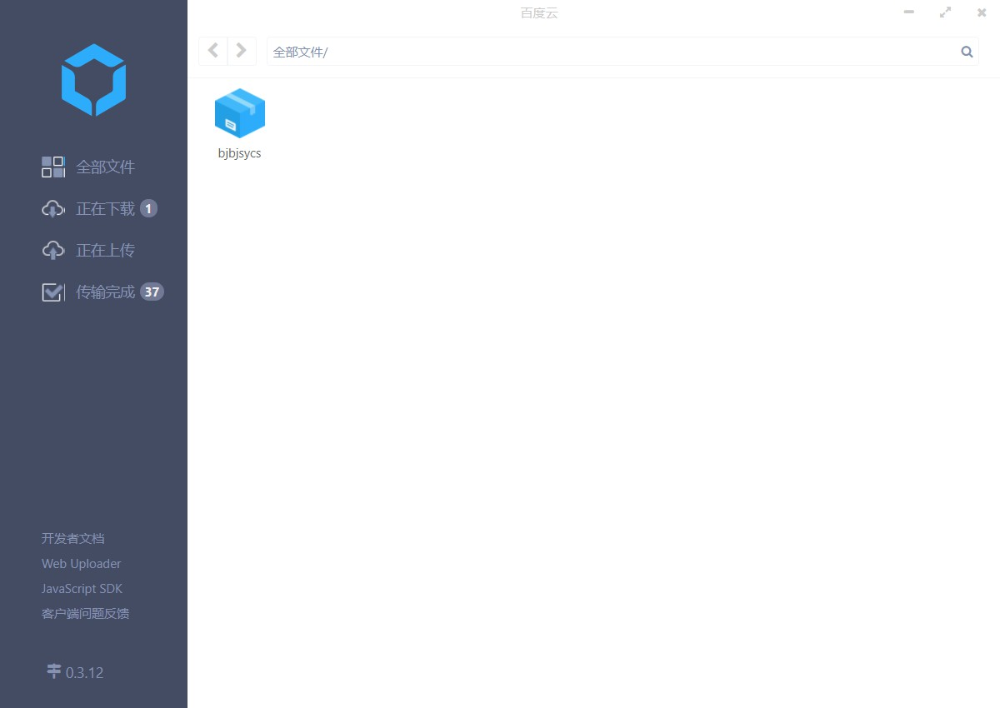

# 百度云对象存储BOS注册与基本使用向导
- [概览](#概览)
- [前提条件](#前提条件)
- [主要步骤](#主要步骤)      
  - [1. 登录开通BOS](#1、登录开通BOS)
  - [2. 创建bucket](#2、创建bucket)
  - [3. 使用BOS客户端](#3、使用BOS客户端)
## 概述
该用户手册旨在帮助用户完成注册百度云对象存储BOS购买服务，使用客户端登录BOS上传下载数据。
## 前提条件
注册一个百度账号，供后续使用。[登录注册网址](https://passport.baidu.com/)

## 主要步骤
### 1、登录开通BOS
打开[BOS主页](https://console.bce.baidu.com/)用百度账号登录，登录成功界面如下图所示：

 点击对象存储BOS，界面如下图所示：

点击立即开通按钮弹出界面如下：

在财务的位置点击充值按钮进行充值，弹出界面如下图所示：

充值是一种按使用标准存储空间的容量进行付费的模式，相对开发者套件云服务来说比较划算，余额还可以随时提取。

### 2、创建bucket
在上上图中点击新建bucket，弹出界面如下图所示：

注意在所属区域的地方选择自己的region，读写权限设置为私有，cdn计费方式选择按使用流量计费，这是一种后付费模式，使用多少，付费多少，比较划算。创建成功功后界面如下图所示：

权限设置修改如下图所示：

创建成功后AK、SK查看方法：

点击红框中的Access Key，弹出界面如下所示：

点击Secret Key显示按钮输入验证码即可查看SK。

### 3、使用BOS客户端
从[BOS桌面客户端](https://cloud.baidu.com/doc/BOS/s/lk4tnbkrm)上，下载桌面客户端软件，有Windows和Mac两种，下面以Windows为例来下载，安装成功后打开界面如下图所示：

填写上自己的AK、SK后，点击向右的箭头，如下图所示：

设置输入自己的安全码点击登录即可看到自己创建的bucket如下图所示：

然后上传下载单个文件或者整个文件夹数据即可。