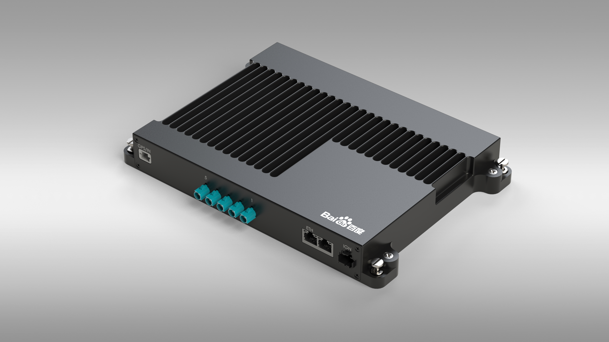

## Guide for Apollo Sensor Unit

Apollo Sensor Unit (ASU) is designed to work with Industrial PC (IPC) to implement sensor fusion, vehicle control and network access in Apollo's autonomous driving platform.

The ASU system provides sensor interfaces to collect data from various sensors, including cameras, Lidars, Radars, and Ultrasonic Sensors. The system also utilizes pulse per second (PPS) and GPRMC signals from GNSS receiver to implement data collection synchronization for the camera and LiDAR sensors. 

The communication between the ASU and the IPC is through PCI Express Interface. ASU collects sensor data and passes to IPC via PCI Express Interface, and the IPC uses the ASU to send out Vehicle Control commands in the Controller Area Network (CAN) protocol. 

In addition, the ASU system integrates Wi-Fi module and LTE module for LAN and WAN access. 

### System Connectors

#### Front Panel Connectors

1. External GPS PPS / GPRMC Input Port 
2. FAKRA Camera Data Input Port (5 ports)
3. 10/100/1000M Base-T Ethernet Port (2 Ports) 
4. KL-15 (AKA Car Ignite) Signal Input Port 

#### Rear Panel Connectors 

1. Micro USB to UART port (reserved for debug) 
2. Micro USB to UART port (ASU configuration port) 
3. Micro SIM card holder for built-in LTE module 
4. General purpose UART port(reserved) 
5. USB 3.0 type A port (2 Ports)
6. External PCI Express Port (Support X4 or X8)
7. GPS PPS / GPRMC Output Port ( 3 Ports)
8. Micro USB 2.0 OTG
9. Power and PPS/GPRMC Output Port for Stereo Camera
10. CAN Bus (4 Ports)
11. Main Power Input Connector 

### Purchase Channels

The Apollo Sensor Unit is currently only provided to our Partners and certain developers.