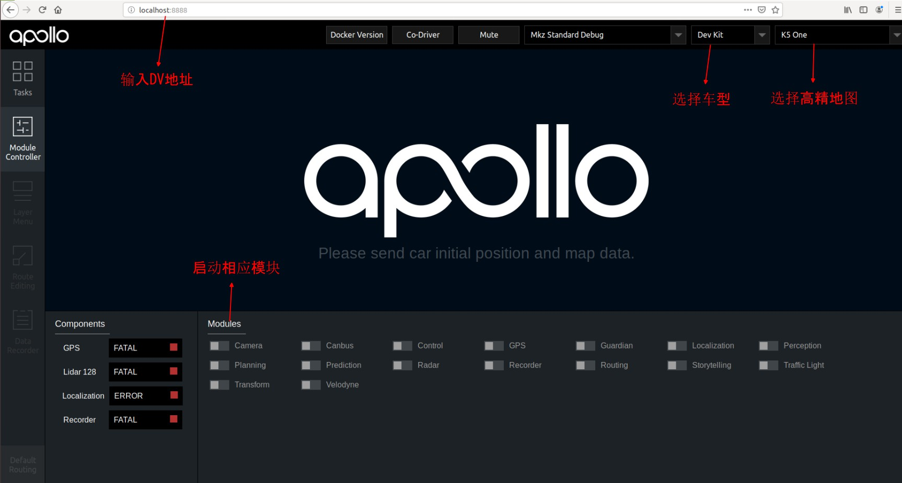

# 封闭园区自动驾驶搭建--摄像头感知适配

## 前提条件

 1. 正确完成了[寻迹自动驾驶演示](Waypoint_Following--Operation_And_Questions_cn.md)。

 2. 正确完成了[摄像头感知设备集成](Camera_Based_Auto_Driving--Sensor_Integration_cn.md)。
 
 3. 正确完成了[摄像头感知设备标定](Camera_Based_Auto_Driving--Sensor_Calibration_cn.md)。

## 配置文件的修改

|序号 | 待修改文件 | 修改内容 | 
|---|---|---|
|  1 | `modules/common/data/global_flagfile.txt` |  添加`--half_vehicle_width=0.43` |
|  2 | `modules/perception/production/launch/dev_kit_perception_camera.launch` |重命名为`perception_camera.launch ` 并替换原`perception_camera.launch`文件  |
|  3 | `modules/perception/production/conf/perception/camera/fusion_camera_detection_component.pb.txt` | 文件中`output_obstacles_channel_name`对应的内容修改为 `/apollo/perception/obstacles` |

## 感知开环验证及测试

把车辆开到户外，手动控制车辆，看感知是否有数据。

 1. 进入docker环境，用gpu编译项目，编译项目，启动DreamView。

    ```
    cd apollo
    bash docker/scripts/dev_start.sh
    bash docker/scripts/dev_into.sh
    bash apollo.sh build_gpu
    bash scripts/bootstrap.sh
    ```

 2. 在浏览器中打开(http://localhost:8888), 选择`dev_kit`并选择相应高精地图，在module Controller标签页启动gps、localization、Camera、Transform模块。
 


 3. 在docker中输入`cyber_monitor`命令并检查以下channel（使用`上下方向键`选择channel，使用`右方向键`查看channel详细信息）：
	
	| channel_name | 检查项目 | 
	|---|---|
	|`/apollo/localization/pose`| 确保能正常输出数据 | 
	|`/apollo/sensor/gnss/best_pose` | 确保能正常输出数据、`sol_type:` 选项显示为`NARROW_INT` |
	|`/apollo/sensor/camera/front_6mm/image` | 确保能正常输出数据，帧率稳定在15HZ左右 |
	|`/apollo/sensor/camera/front_12mm/image` | 确保能正常输出数据，帧率稳定在15HZ左右 |
	|`/tf`| 确保能正常输出数据 |
   |`/tf_static` | 确保能正常输出数据 |
        
 4.  使用如下命令启动perception模块，使用`cyber_monitor`查看`/apollo/perception/obstacles`是否正常输出，并在dreamview上查看障碍物信息：

```
budaoshi@in_dev_docker:/apollo$ cyber_launch start modules/perception/production/launch/perception_camera.launch
```
查看车前方运动的人或者自行车（自行车上要有人），在DreamView上查看障碍物颜色以及位置速度信息（自行车青蓝色，行人黄色，车辆绿色），如下图所示：


`/apollo/perception/obstacles`的数据如下图所示：


如果在dreamview上能看到障碍物并且`/apollo/perception/obstacles`有障碍物信息，则开环测试通过。