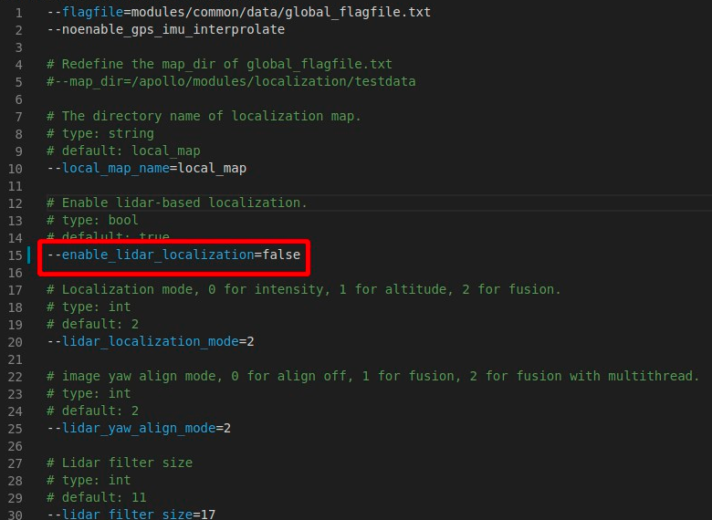
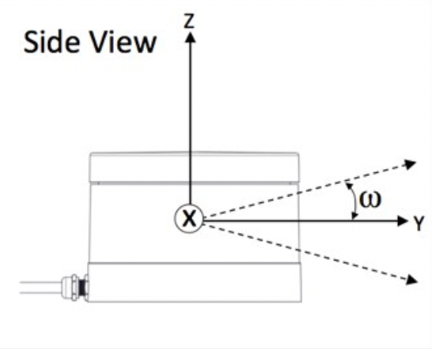
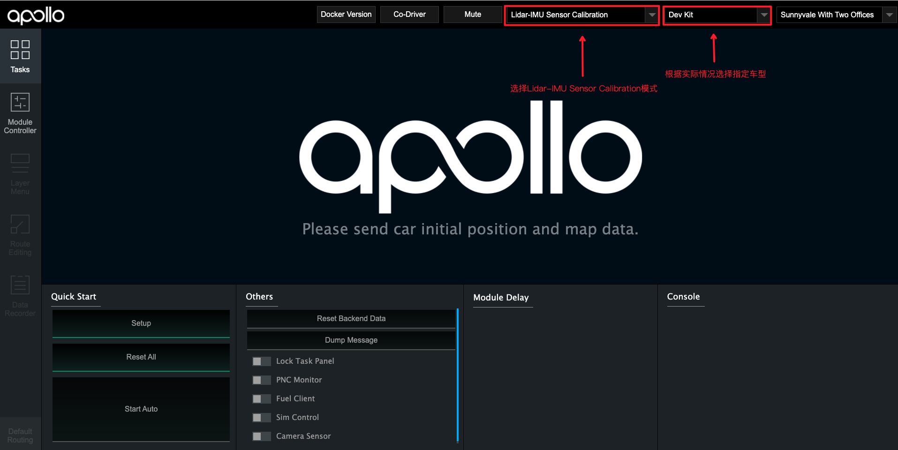
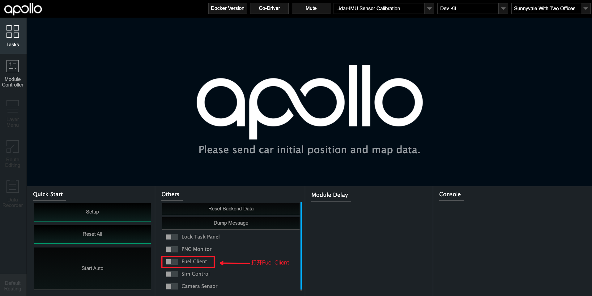
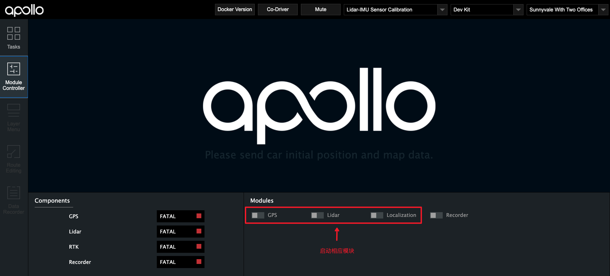
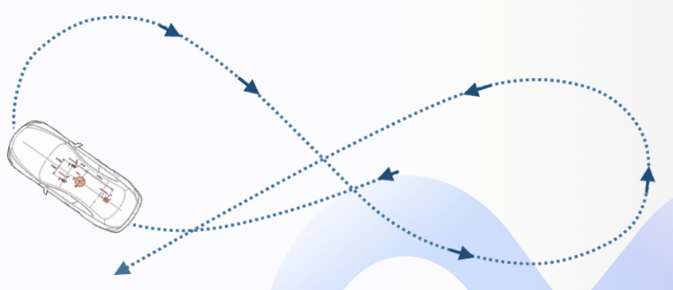
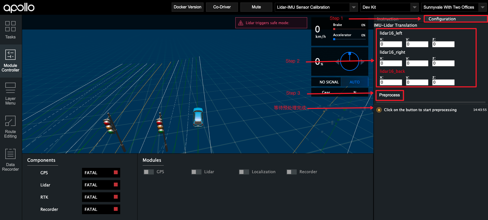

# 基于激光雷达的封闭园区自动驾驶搭建--感知设备标定
- [基于激光雷达的封闭园区自动驾驶搭建--感知设备标定](#基于激光雷达的封闭园区自动驾驶搭建--感知设备标定)
  - [概览](#概览)
  - [前提条件](#前提条件)
  - [修改配置文件](#修改配置文件)
  - [Lidar-GNSS标定初始外参测量](#lidar-gnss标定初始外参测量)
      - [1. IMU、Lidar的坐标系定义](#1-imulidar的坐标系定义)
      - [2. Lidar坐标系原点在传感器的位置](#2-lidar坐标系原点在传感器的位置)
      - [3. IMU坐标系原点在传感器的位置](#3-imu坐标系原点在传感器的位置)
      - [4. 手动测量Lidar-GNSS的初始化外参](#4-手动测量lidar-gnss的初始化外参)
  - [标定场地选择](#标定场地选择)
  - [使用Fuel-Client采集数据](#使用fuel-client采集数据)
      - [1. 选择正确的模式、车型](#1-选择正确的模式车型)
      - [2. 启动`Fuel Client`，并启动相应模块](#2-启动fuel-client并启动相应模块)
      - [3. 启动`Recorder`模块并开始采集](#3-启动recorder模块并开始采集)
  - [使用`Fuel Client`进行数据预处理](#使用fuel-client进行数据预处理)
  - [使用标定云服务生成外参文件](#使用标定云服务生成外参文件)
      - [1. 上传预处理后的数据至BOS](#1-上传预处理后的数据至bos)
      - [2. 提交云标定任务](#2-提交云标定任务)
      - [3. 获取标定结果验证及标定外参文件](#3-获取标定结果验证及标定外参文件)
  - [NEXT](#next)
  - [常见问题](#常见问题)
      - [1. 进行`Sensor Calibration`任务后，邮件显示任务失败](#1-进行sensor-calibration任务后邮件显示任务失败)
      - [2. 标定结果效果较差](#2-标定结果效果较差)

## 概览

该用户手册旨在帮助用户完成激光雷达的标定(Lidar-GNSS)

## 前提条件
 
 - 完成了[循迹搭建--车辆循迹演示](../Waypoint_Following/Start_Waypoint_Following_cn.md)
 
 - 完成了[基于激光雷达的封闭园区自动驾驶搭建--感知设备集成](Sensor_Integration_cn.md)

 - 完成了[开通云服务账号向导](../../Apollo_Fuel/apply_fuel_account_cn.md)

## 修改配置文件

|修改文件名称 | 修改内容 | 
|---|---|
| `modules/calibration/data/车型目录/localization_conf/localization.conf`|`enable_lidar_localization`设置为`false`|

**注意：** 上表中`车型目录`需要用户根据自身车型确认。lite用户为`dev_kit`，standard用户为`dev_kit_standard`，单激光雷达的advanced用户为`dev_kit_advanced_ne-s`，3激光雷达的advanced用户为`dev_kit_advanced_sne-r`




**注意：**所有传感器标定完成后，如果用户要使用msf定位，则需要再改为`true`。

## Lidar-GNSS标定初始外参测量

 各传感器坐标系的定义及初始化外参文件的配置

####  1. IMU、Lidar的坐标系定义

 

#### 2. Lidar坐标系原点在传感器的位置

Lidar坐标系原点位于Lidar底部向上37.7mm的平面所在的中心点，如下图所示。



#### 3. IMU坐标系原点在传感器的位置

IMU坐标系原点位于IMU的几何中心上(中心点在Z轴方向上的位置为IMU高度的一半，在XY轴上的位置已在IMU上标出，如下图所示)

 
 
#### 4. 手动测量Lidar-GNSS的初始化外参

这里默认用户按照感知设备集成文档的要求正确安装了传感器，即传感器坐标系的定义与上文中的定义相同，且安装误差满足文档中的要求。 

 - rotation:在传感器的安装满足上述安装要求的情况下，用户无需测量该值，可直接使用如下的默认值即可
 
	```
	  rotation:
	    w: 0.7071
	    x: 0.0
	    y: 0.0
	    z: 0.7071
	```

 - translation:用户需要手动测量以IMU坐标系为基坐标系，以Velodyne16坐标系为目标坐标系的位移变换，一个IMU-Velodyne16位移变换的示例如下所示：
 
	```
	  translation:
	    x: 0.0
	    y: 0.38
	    z: 1.33
	```
## 标定场地选择
标定场地会直接影响到标定效果。对标定场地有如下要求
- 标定场地中心8米范围内需要有轮廓清晰的静态参照物，如电线杆、建筑物、车辆，避免过多动态障碍物。如果静态障碍物距离较远，会严重影响标定效果
- 确保路面平坦
- 能确保GNSS信号良好，不要有过多的干扰

## 使用Fuel-Client采集数据

#### 1. 选择正确的模式、车型
- 选择`Lidar-GNSS Sensor Calibration`模式
- 根据实际情况选择正确的车型(lite用户选择`Dev Kit`车型，standard用户选择`Dev Kit Standard`，单雷达的advanced用户选择`Dev Kit Standard Ne-s`，3雷达的advanced用户选择`Dev Kit Standard Sne-r`)


#### 2. 启动`Fuel Client`，并启动相应模块

- 在dreamview的`Tasks`标签下，首先打开`Sim Control`，然后打开`Fuel Client`，`Fuel Client`打开后务必关闭`Sim Control`

  
- 在dreamview的`Module Controllers`标签下，启动`GPS`、`Lidar`、`Localization`模块，等待左侧状显示模块中的`GPS`、`Lidar`、`RTK`均为绿色时，代表模块启动成功(Localization启动后，需要等待1~2分钟才能正常输出数据)。


#### 3. 启动`Recorder`模块并开始采集

- 当左侧左侧状显示模块中的`GPS`、`Lidar`、`RTK`均为绿色时，打开Recorder模块，并开始采集数据，需要控制车辆以8字形轨迹缓慢行驶，并使转弯半径尽量小 ，包含2~3圈完整的8字轨迹数据。

- 数据采集完成后，关闭`Recorder`模块停止数据录制

## 使用`Fuel Client`进行数据预处理

- 点击右上角的`Configuration`进入预处理界面
- 填入测量的初始化外参
- 点击`Preprocess`进行预处理
- 等待预处理完成,提示`Data extraction is completed successfully!`代表预处理完成

**注意** 对于使用3激光雷达的advanced用户，需要填入3个雷达的初始化外参，其中红色的`lidar16_back`参数为main_sensor(主激光雷达)的外参


- 保存生成的预处理文件。切换到`apollo/output/sensor_calibration/lidar_to_gnss/extracted_data/`目录，保存该目录下的`lidar_to_gnss-xxx`文件(`xxx`为数据包录制的时间)，这里和下文以`lidar_to_gnss-2021-01-12-14-10`为例


## 使用标定云服务生成外参文件


#### 1. 上传预处理后的数据至BOS

**注意：** 必须使用开通过权限的 bucket，确认`Bucket名称`、`所属地域`和提交商务注册时的Bucket名称和所属区域保持一致。

将`lidar_to_gnss-2021-01-12-14-10`目录上传到BOS的根目录下，作为后续云标定服务读取数据的`输入数据路径`。

#### 2. 提交云标定任务

打开Apollo云服务页面，新建一个任务，如下图所示：


点击`新建任务`后，在下拉框中选择`感知标定`选项，根据实际情况填写输入`输入数据路径`，这里以`lidar_to_gnss-2021-01-12-14-10`为例，指定`输出数据路径`后，点击`提交任务`(Submit Job)按钮提交。

#### 3. 获取标定结果验证及标定外参文件

云标定任务完成后，将在注册的邮箱中收到一封标定结果邮件。如果标定任务成功，将包含标定外参文件。

**Lidar-GNSS标定结果验证**：

- BOS中用户指定的`输出文件路径`下包含了后缀名为.pcd的点云文件，使用点云查看工具检查pcd文件，如果点云文件中周围障碍物清晰、锐利，边缘整齐表示标定结果准确，否则请重新标定。


 
 - 在ubuntu系统下，可以使用`pcl-tools`工具查看点云文件
```bash
  sudo apt-get update
  sudo apt-get install pcl-tools
  pcl_viewer xxx.pcd
```

**Lidar-GNSS标定外参文件**：

确认得到的外参文件合理后，将获取的外参文件的`rotation`、`translation`的值替换掉`modules/calibration/data/车型目录/lidar_params/velodyne16_novatel_extrinsics.yaml`中对应的`rotation`、`translation`值。注意不要修改`frame_id`、不要直接替换文件。

## NEXT
现在，您已经完成激光雷达感知设备标定，接下来可以开始[封闭园区自动驾驶搭建--虚拟车道线制作](Virtual_Lane_Generation_cn.md)

## 常见问题
#### 1. 进行`Sensor Calibration`任务后，邮件显示任务失败
建议检查一下输入路径是否正确

#### 2. 标定结果效果较差
- 标定时，确保GNSS信号状态良好，周围有轮廓清晰的静态障碍物
- 保证传感器的安装精度，安装误差超过要求精度时，标定结果不容易收敛
- 标定时，不要距离有效静态障碍物太远
