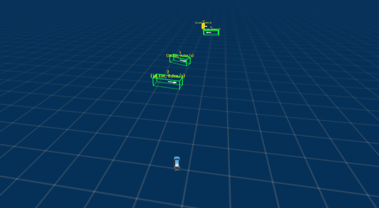
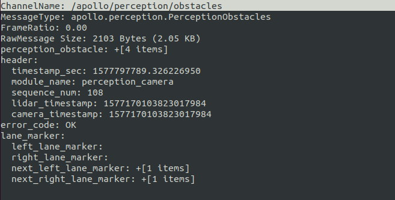
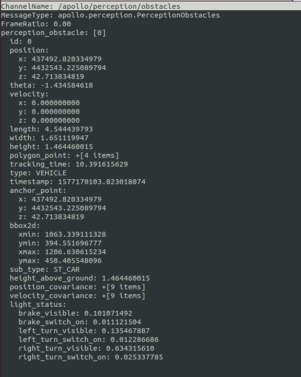

# 基于双目感知的封闭园区自动驾驶搭建--感知适配

## 前提条件

 1. 正确完成了[循迹搭建--车辆循迹演示](../Waypoint_Following/Start_Waypoint_Following_cn.md)。

 2. 正确完成了[基于双目感知的封闭园区自动驾驶搭建--设备集成](Sensor_Integration_cn.md)。

## 配置文件的修改

|序号 | 待修改文件 | 修改内容 | 
|---|---|---|
|  1 | `modules/common/data/global_flagfile.txt` |  添加`--half_vehicle_width=0.43` |

## 感知开环验证及测试

把车辆开到户外，手动控制车辆，看感知是否有数据。

 1. 进入docker环境，编译apollo，启动DreamView。

    ```
    cd /apollo  
    bash docker/scripts/dev_start.sh  
    bash docker/scripts/dev_into.sh  
    bash apollo.sh build_opt  
    bash scripts/bootstrap.sh  
    ```

 2. 在浏览器中打开(http://localhost:8888), 选择`Dev_Kit`并选择相应高精地图，在Module Controller标签页启动GPS、Localization、Camera、Transform模块。
 


 3. 在docker中输入`cyber_monitor`命令并检查以下channel（使用`上下方向键`选择channel，使用`右方向键`查看channel详细信息。关于cyber_monitor更详细使用，请参考[CyberRT_Developer_Tools](../../cyber/CyberRT_Developer_Tools.md)）：
	
	| channel_name | 检查项目 | 
	|---|---|
	|`/apollo/localization/pose`| 确保能正常输出数据 | 
	|`/apollo/sensor/gnss/best_pose` | 确保能正常输出数据，`sol_type:` 选项显示为`NARROW_INT` |
	|`/apollo/sensor/smartereye/image` | 确保能正常输出数据，帧率稳定在15HZ左右 |
	|`/apollo/sensor/smartereye/image/compressed` | 确保能正常输出数据，帧率稳定在15HZ左右 |
	|`/tf`| 确保能正常输出数据 |
	|`/tf_static` | 确保能正常输出数据 |
	
 4.  在`DreamView`的`Module Controller`界面点击`ThirdPartyPerception`按钮，使用`cyber_monitor`查看`/apollo/perception/obstacles`是否正常输出，并在`DreamView`上查看障碍物信息。查看车前方运动的人或者自行车（自行车上要有人），在DreamView上查看障碍物颜色以及位置速度信息（自行车青蓝色，行人黄色，车辆绿色），如下图所示：



`/apollo/perception/obstacles`的数据如下图所示：





如果在DreamView上能看到障碍物并且`/apollo/perception/obstacles`有障碍物信息，则开环测试通过。