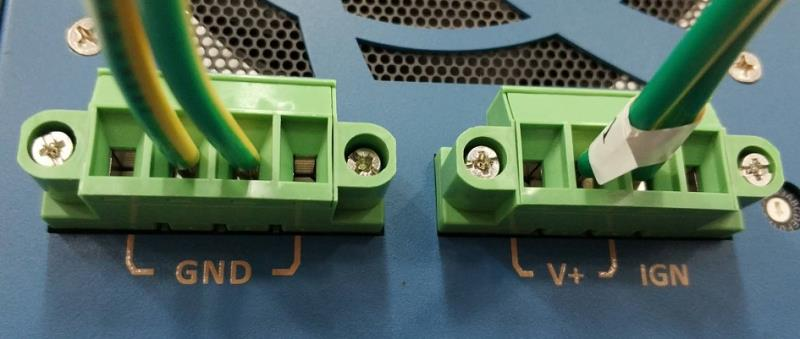
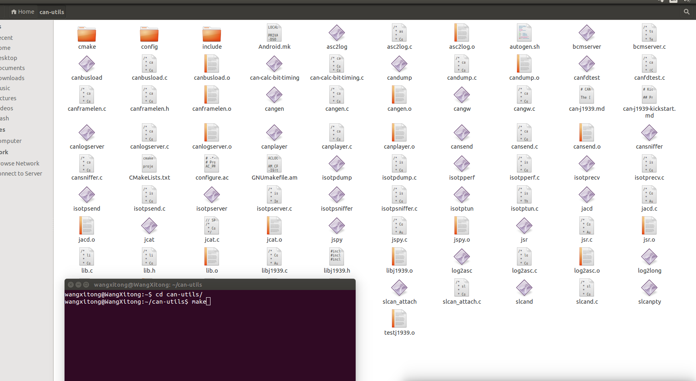
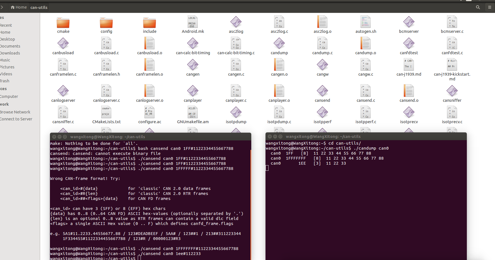

# 循迹搭建--Apollo系统安装
- [循迹搭建--Apollo系统安装](#循迹搭建--Apollo系统安装)
  - [概览](#概览)
  - [工控机系统安装](#工控机系统安装)
    - [工控机硬件安装](#工控机硬件安装)
      - [IPC配置](#IPC配置)
      - [准备IPC](#准备IPC)
        - [准备好CAN卡并进行安装](#准备好CAN卡并进行安装)
        - [配置IPC加电组件](#配置IPC加电组件)
        - [启动计算机](#启动计算机)
        - [连接电源](#连接电源)
    - [工控机软件系统安装](#工控机软件系统安装)
      - [安装Linux系统](#安装Linux系统)
        - [创建引导盘](#创建引导盘)
        - [安装Ubuntu](#安装Ubuntu)
        - [执行软件更新与安装](#执行软件更新与安装)
        - [安装并降级GCC和G++](#安装并降级GCC和G++)
      - [安装Apollo内核](#安装Apollo内核)
      - [安装网卡驱动](#安装网卡驱动)
        - [检查驱动](#检查驱动)
        - [安装驱动](#安装驱动)
      - [安装GPU驱动](#安装GPU驱动)
        - [安装驱动](#安装驱动)
        - [检查驱动](#检查驱动)
      - [安装Can驱动](#安装Can驱动)
        - [安装ESDCan驱动](#安装ESDCan驱动)
        - [检查ESDCan驱动](#检查ESDCan驱动)
        - [安装EmucCan驱动](#安装EmucCan驱动)
        - [检查EmucCan驱动](#检查EmucCan驱动)
      - [安装docker软件](#安装docker软件)
        - [安装docker](#安装docker)
        - [检查docker](#检查docker)
      - [下载Apollo源代码](#下载Apollo源代码)
      - [设置Apollo编译环境](#设置Apollo编译环境)
      - [编译Apollo源代码](#编译Apollo源代码)
      - [运行DreamView](#运行DreamView)
      - [NEXT](#NEXT)
      - [常见问题](#常见问题)

## 概览

该用户手册旨在帮助用户在开发套件上安装、配置软硬件，并启动使用Apollo自动驾驶平台。

## 工控机系统安装

在集成车辆之前，首先需要完成工控机的硬件安装，如CAN卡安装；之后需要完成工控机的软件安装，包括Ubuntu Linux安装、Apollo软件系统安装等。

### 工控机硬件安装

工控机硬件安装包括CAN卡的安装和相关线缆的连接，以及BIOS相关的设置。

#### IPC配置

参考下述IPC配置：

- Nuvo-6108GC-RTX2060s-E3-1275

- DDR4-32GB-ECC

- 三星 SSD 256G

- EMUC-B202 CAN

- PA-280W-OW

  
  
  或者：

- Nuvo-8108GC-RTX2070s-i9-9900k

- DDR4-32GB-ECC

- Seagate M.2 2280 NVMe SSD(PCIe Gen3x4)512G

- EMUC-B202 CAN

- 480W适配器

  

注意，在较早版本的8108工控机中，CAN口的标号为从右向左分别为CAN1、CAN2，文档中将统一按照上图所示，分别称为CAN0、CAN1，请使用较早版本8108的用户注意。新用户可以忽略。

#### 准备IPC

参考下述步骤：

##### 准备好CAN卡并进行安装

在IPC中，显卡被预先安装在一个PCI插槽中。如果我们收到的是EMUC-B202 CAN，它已被预装在IPC内，则CAN卡安装这一步，可以跳过。如果我们收到的是ESDCan，我们需要将CAN卡安装在另外一个PCI插槽中，步骤如下：

   a. 找到并拧下机器边上的8个螺丝（显示在棕色方框内或棕色箭头指向的区域）

   

   b. 移除机器盖板

   

   在机箱底部将能看到固定着的3个PCI插槽（其中一个已经被显卡占据）
   
  
  
   c. 设置CAN卡的终端跳线：将4个红色的跳线帽从原位置移除并放置在终端位置，如下图所示：

   

   **WARNING**：如果终端跳线没有被正确设置，CAN卡将不能正确工作。

   d. 将CAN卡插入到一个PCI插槽中

   

   e. 安装IPC的盖板
    
   

##### 配置IPC加电组件

   a. 将电源线接入到为IPC配置的电源连接器（接线板）
   
- 6108的电源线

   **WARNING**：确保电源线的正极（标记为 **R** 表示红色）和负极（标记为 **B** 表示黑色）接入到了IPC接线板的正确接口，如下图所示：

   
   
- 8108的电源线

8108的电源线是四跟，两正两负，正极的两根电源线是贴有`V+`的白色标签的，如下图所示：

   

将接有正极的两根电源线的端子插入`V+`接口，将接有负极的两根电源线的端子插入`GND`接口，如下图所示：

   

   b. 将显示器、以太网线、键盘和鼠标接入IPC
   
   
  
##### 启动计算机

如果系统接入了一个或多个外部插入卡，建议通过BIOS设置风扇的转速：

```
- 计算机启动时按F2进入BIOS设置菜单
- 进入 [Advanced] => [Smart Fan Setting]
- 设置 [Fan Max. Trip Temp] 为 50
- 设置 [Fan Start Trip Temp] 为 20
```

如果用户使用的是已经提前预装好显卡驱动及Apollo镜像的工控机版本，则使用HDMI线连接显示器与工控机的独立显卡的HDMI接口即可：


如果使用的是较早没有预装显卡驱动及Apollo镜像的工控机版本，则需使用DVI线或AGV线将显示器与工控机集成显卡接口相连，按照如下步骤将显示模式设置为AUTO，设置成功后，使用HMDI线连接显示器与工控机的HDMI接口，并重启工控机：

```
- 计算机启动时按F2进入BIOS设置菜单
- 进入 [Advanced]=>[System Agent (SA) Configuration]=>[Graphics Configuration]=>[Primary Display]=> 设置为 "AUTO"
```


建议设置IPC的运行状态为一直以最佳性能状态运行：

```
- 计算机启动时按F2进入BIOS设置菜单
- 进入 [Power] => [SKU POWER CONFIG] => 设置为 "MAX TDP"
```

##### 连接电源


### 工控机软件系统安装

 在本步骤中，工控机已经预装了Ubuntu18.04LTS操作系统和apollo运行所需的环境，我们只需要逐一对相关的模块做个检查，确认无误后就可以编译apollo开启我们的自动驾驶之旅了。若您是自己重装系统的话，请严格按照下面的步骤操作执行。

工控机软件系统安装包括计算机操作系统的安装，硬件驱动的安装，应用软件的安装和Apollo软件系统的安装。

#### 安装Linux系统

已经预装了Ubuntu18.04LTS操作系统的客户可以直接跳过这个步骤，需要自己安装操作系统的客户请参考此步骤。注：预装系统的IPC的用户名和密码均为apollo。

Apollo软件系统依赖于Linux操作系统而运行，而Linux操作系统种类繁多，且又分为服务器版本和桌面版本，这里我们选择当下比较流行的Ubuntu桌面操作系统的64位版本。安装Ubuntu Linux的操作系统的步骤如下：

##### 创建引导盘

创建一个可以引导启动的Ubuntu Linux USB闪存驱动器，下载Ubuntu，并按照在线说明创建可引导启动的USB闪存驱动器。

 推荐使用 **Ubuntu 18.04.3**.

开机按F2进入BIOS设置菜单，建议禁用BIOS中的快速启动和静默启动，以便捕捉引导启动过程中的问题。建议您在BIOS中禁用“快速启动”和“静默启动”，以便了解启动过程中遇到的问题。

获取更多Ubuntu信息，可访问: 
Ubuntu桌面站点:

[https://www.ubuntu.com/desktop](https://www.ubuntu.com/desktop)

##### 安装Ubuntu

a.将Ubuntu安装驱动器插入USB端口并启动IPC。

b.按照屏幕上的说明安装Linux。

##### 执行软件更新与安装

**WARNING**：在整个Apollo系统的安装和操作的过程中，全程禁用root账户，皆用普通账户进行操作，切记！

a.安装完成，重启进入Linux。已经预装了Ubuntu18.04LTS操作系统的客户请在引导界面出现时按向下方向键选择Ubuntu高级选项并按回车键进入该选项，请选择倒数第二项的apollo内核来引导系统。重新安装操作系统的客户请选用默认的内核进入系统即可。

b.在终端执行以下命令完成最新软件包的更新：

```
sudo apt update
```

IPC必须接入网络以便更新与安装软件，所以请确认网线插入并连接，如果连接网络没有使用动态分配（DHCP），需要更改网络配置。

##### 安装并降级GCC和G++

请先用以下命令检查gcc和g++的版本：
```
gcc --version
g++ --version
```

若输出的gcc和g++的版本是4.8版本的，则跳过此步骤；否则，请执行以下两条命令安装4.8版本的gcc和g++，命令如下：
```
sudo apt-get install g++-4.8 g++-4.8-multilib gcc-4.8 gcc-4.8-multilib
sudo /usr/bin/update-alternatives --install /usr/bin/gcc gcc /usr/bin/gcc-4.8 99 --slave /usr/bin/g++ g++ /usr/bin/g++-4.8
```
安装完成后，用以上命令检查gcc和g++的版本以确认安装成功；若安装未成功，请重新安装直到成功为止。

#### 安装Apollo内核

车上运行Apollo需要[Apollo Kernel](https://github.com/ApolloAuto/apollo-kernel)。
若是预装了Ubuntu18.04LTS操作系统的客户，请跳过此步骤；重新安装操作系统的客户，请依照如下步骤获取、安装预编译的内核：

a.从releases文件夹下载发布的包

```
https://github.com/ApolloAuto/apollo-kernel/releases
```
b.安装包下载完成后，解压后安装:

```
tar zxvf linux-4.4.32-apollo-1.5.5.tar.gz
cd install
sudo bash install_kernel.sh
```
c.在终端输入`sudo gedit /etc/default/grub`打开配置文件。把`grub_timeout_style=hidden`注释掉，把`grub timeout=0`中的0修改为10，把`grub_cmdline_linux_default=”quiet splash”`中的“quiet splash”修改为”text”，修改完成后保存退出。在终端中执行 `sudo update-grub`更新grub配置。 使用`reboot`命令重新启动计算机。

d.重启ubuntu系统进入grub引导界面，在引导界面选择高级选项，在高级选项里选择倒数第二项的apollo-kernel来引导系统。进入系统后，在终端中输入`uname -r`，若输出“4.4.32-apollo-2-RT”字样，则表示此时系统是以apollo-kernel引导的。 注意：从此以后，每次开机都需要以apollo-kernel来引导系统。

#### 安装网卡驱动

开发套件包含的IPC是有两个有线网卡的，若您是预装系统的用户请直接检查驱动，若您是自己安装系统的话，请先安装驱动，然后再检查驱动。

##### 检查驱动

直接将已经连通互联网的网线插入IPC的网卡的网口，打开IPC的浏览器，若浏览器能正常访问互联网，则这个网卡的驱动已经安装好了，检查通过。依次检查两个网口，直到全部通过检查为止。

##### 安装驱动

默认情况下，IPC的两个网卡中有一个网卡是没有安装驱动连接不了互联网的。请从以下地址下载驱动安装包[e1000e-3.8.4.tar.gz](https://downloadcenter.intel.com/zh-cn/download/15817?_ga=1.159975677.114505945.1484457019)，在打开的页面中点击下载按钮会弹出“英特尔软件许可协议”对话框，接着点击“我接受许可协议中的条款”就可以开始下载了。下载完成后进入驱动文件的下载目录，执行以下命令来安装驱动：

```
tar -zxvf e1000e-3.8.4.tar.gz
cd e1000e-3.8.4/src/
sudo make install
sudo modprobe e1000e
```

安装完成后，再按照上面的步骤检查驱动就可以了。

#### 安装GPU驱动

若是预装了Ubuntu18.04LTS系统的IPC，请直接检查驱动，检查通过则可跳过此步骤；若是自己安装系统，请先安装驱动，然后再检查驱动以确认驱动已装好。

##### 安装驱动

下载apollo-kernel官网上的脚本[install-nvidia.sh](https://github.com/ApolloAuto/apollo-kernel/blob/master/linux/install-nvidia.sh)至当前用户的`home`目录下，输入以下命令完成显卡驱动内核模块的安装：

```
cd ~    
sudo apt install make    
sudo bash install-nvidia.sh    
```

完成显卡驱动内核模块的安装后，在当前用户的`home`目录下会出现一个名为`NVIDIA-Linux-x86_64-430.50.run`的文件，执行以下命令完成显卡驱动用户库的安装：

```
cd ~    
sudo bash ./NVIDIA-Linux-x86_64-430.50.run --no-x-check -a -s --no-kernel-module    
```

完成显卡驱动用户库的安装后，重新启动工控机。    

##### 检查驱动

在终端中输入以下命令来检查显卡驱动内核模块是否安装成功：

```
cat /proc/driver/nvidia/version
```

若输出的内容中包含”430.50”字样，则表示显卡驱动内核模块安装成功；若不是，请重新安装显卡驱动内核模块。    
在终端中输入以下命令来检查显卡驱动用户库是否安装成功：

```
sudo dpkg --list | grep nvidia*
```

若输出的内容中显示显卡的用户库的版本是430.50的，则表示显卡驱动用户库安装成功；若不是，请重新安装显卡驱动用户库。    

在终端中输入`nvidia-smi`，能看到显卡的信息且最下面没有出现No running processes found的相关字样，输入`nvidia-settings`能调出显卡的配置界面，则表示显卡驱动安装成功。 

#### 安装Can驱动

若是灰色的6108的IPC，请执行安装ESDCan驱动和检查ESDCan驱动。若是蓝色的8108的IPC，预装了Ubuntu18.04LTS的客户请直接检查EmucCan驱动；自己安装系统的客户请先安装EmucCan驱动然后再检查EmucCan驱动。

##### 安装ESDCan驱动

在Nuvo-6108GC中，若系统搭配的是ESDCan卡，其驱动安装步骤如下所示：

a.从CAN卡供应商那里或者ESDCan卡的包装袋里拿到CAN卡的驱动安装包，名字形如esdcan-pcie4.2-linux-2.6.x-x86_64-3.10.3.tgz。

ｂ.解压此安装包，cd到解压后的文件夹里。

c.编译安装CAN卡驱动，在终端执行以下命令：
```
cd src/
make -C /lib/modules/`uname -r`/build M=`pwd`
sudo make -C /lib/modules/`uname -r`/build M=`pwd` modules_install
```
##### 检查ESDCan驱动

若CAN卡驱动esdcan-pcie402.ko可以在/lib/modules/4.4.32-apollo-2-RT/extra/文件夹下找到，则CAN卡驱动安装成功；否则，请重新安装。

##### 安装EmucCan驱动

在Nuvo-6108GC中，系统搭配的是EmucCan卡，其驱动安装步骤如下所示：

a.安装EmucCan并添加rules文件

在终端中输入以下命令来查看设备的端口号：
```
ls -l /sys/class/tty/ttyACM*
```
记下形如`1-10:1.0`的一串数字；在系统`/etc/udev/rules.d/`目录下执行`sudo touch 99-kernel-rename-emuc.rules`命令新建一个文件`99-kernel-rename-emuc.rules`,执行`sudo vim 99-kernel-rename-emuc.rules`命令添加文件内容：
 ACTION=="add",SUBSYSTEM=="tty",MODE=="0777",KERNELS=="1-10:1.0",SYMLINK+="ttyACM10"

其中的`1-10:1.0`就是上面记下的一串数字，根据实际情况进行替换即可；然后先按`ESC`键然后再按`:wq`保存文件内容退出，并重启系统。重启系统后执行`cd /dev`命令，用`ls -l ttyACM*`命令查看设备，要确保`ttyACM10`存在。

b.下载emuc-B202驱动包

下载地址[emuc-B202 Driver](https://www.innodisk.com/Download_file?D7856A02AF20333811EBF83A6E6FDFE31262BBEB35FDA8E63B4FCD36B5C237175D714D7286AF87B5)

将EMUC-B202文件下的Linux下的驱动安装包解压出来放到当前用户的home目录下并将文件夹重命名为SocketCan，将当前目录设置到这个文件夹下，并执行`make`命令：
```
cd SocketCan/
make
```
生成的文件如下图所示 ：


c.启动can卡

将`start.sh`中`sudo ./emucd_64 -s9 ttyACM0 can0 can1`修改为`sudo ./emucd_64 -s7 ttyACM10 can0 can1`，其中-s表示波特率，-s9表示为1k，-s7表示为500，apollo中采用500。在当前目录下执行`bash start.sh`命令，如下图所示：


##### 检查EmucCan驱动

a.测试can卡发送接收

将can卡can0和can1口用Can线连接起来。从 https://github.com/linux-can/can-utils 上下载测试代码到当前用户的home目录下，将当前目录设置到can-utils下并执行`make`，如下图所示

然后执行命令`./cansend can0 1FF#1122334455667788`，在另开一个终端执行以下命令：
```
cd can-utils/
./candump can0
```
循环发送cansend命令，能够在candump中收到发送的数据，如下图所示 ：

则表示Can驱动安装成功。

b.注意事项

在后续启动apollo的canbus模块时，需要先在docker外运行start.sh脚本。

#### 安装docker软件

预装了Ubuntu18.04LTS的客户请直接检查docker；自己安装的客户请先安装docker，然后再检查docker。

##### 安装docker

使用apollo官网上的[install_nvidia_docker.sh](https://github.com/ApolloAuto/apollo/blob/master/docker/setup_host/install_nvidia_docker.sh)来安装docker。工控机在联网情况下在终端中输入以下命令来完成安装：

```
sudo apt update
sudo apt install curl
sudo bash install_nvidia_docker.sh
```

##### 检查docker

在终端中输入以下命令来验证docker是否安装成功：

```
sudo docker run hello-world
```

若能看到helloworld的相关信息，则表示docker安装成功。


**WARNING**：在以下模块的操作中，如非本文档或操作系统要求，禁用一切`sudo`操作，切记！

#### 下载Apollo源代码

预装了Ubuntu18.04LTS的客户的当前home目录下已有apollo代码，可以跳过此步骤；自己安装的客户请参考以下操作来下载apollo源代码。

在终端中输入以下命令：

```
cd ~
sudo apt update
sudo apt install git -y
git init
git clone https://github.com/ApolloAuto/apollo.git
```

代码下载的时间视网速的快慢而有所区别，请耐心等待；
下载完成后的代码在~/apollo目录下，然后执行以下命令：

```
git checkout -b r5.5.0 origin/r5.5.0
```

将代码切换到我们所需要的工作分支r5.5.0上。用以下命令检查代码是否已经切换成功：

```
git branch
```

若输出的内容有`* r5.5.0`，则表示代码已经成功的切换到了r5.5.0分支上了。

#### 设置Apollo编译环境

a.设置环境变量，在终端输入以下命令：

```
cd ~
echo "export APOLLO_HOME=$(pwd)" >> ~/.bashrc && source ~/.bashrc
source ~/.bashrc
```

b.将当前账户加入docker账户组中并赋予其相应权限，在终端输入以下命令：

```
sudo gpasswd -a $USER docker  
sudo usermod -aG docker $USER  
sudo chmod 777 /var/run/docker.sock
```

命令执行完成后，重新启动一下计算机。

c.若是自己安装系统的客户，请直接跳过此步骤，开始编译Apollo源代码；若是预装了Ubuntu18.04LTS的客户，请输入以下命令加载docker的image镜像：

```
cd ~/images_r5.5.0
sudo bash LoadImages.sh
```

#### 编译Apollo源代码

a.启动并进入docker容器，在终端输入以下命令：

```
cd ~/apollo
bash docker/scripts/dev_start.sh
```

第一次进入docker时或者image镜像有更新时会自动下载apollo所需的image镜像文件，下载镜像文件的过程会很长，请耐心等待；如果你确信计算机本地有你需要的image镜像文件或者你不希望更新image镜像时，可以使用`bash docker/scripts/dev_start.sh -n`这个命令代替上面的命令，这样apollo就不会去github的官方网站比较本地image镜像和官方网站image镜像的区别了，这样可以省去二者比较的时间和避免因网络问题而导致的二者比较失败的现象，可以加快启动docker容器的速度。这个过程完成后，请输入以下命令以进入docker环境中：
```
bash docker/scripts/dev_into.sh
```

b.编译apollo，在终端输入以下命令，等待编译完成，整个编译过程大约耗时25分钟：

```
bash apollo.sh build_opt
```

#### 运行DreamView

a.若您已经在docker环境中，请忽略此步骤，否则请执行以下命令进入docker环境：

````
cd ~/apollo
bash docker/scripts/dev_start.sh
bash docker/scripts/dev_into.sh
````

b.启动apollo
在终端输入以下命令：

```
bash scripts/bootstrap.sh
```

如果启动成功，在终端会输出以下信息：

```
nohup: appending output to 'nohup.out'
Launched module monitor.
nohup: appending output to 'nohup.out'
Launched module dreamview.
Dreamview is running at http://localhost:8888
```

在浏览器中输入以下地址： 

```
http://localhost:8888
```

可以访问DreamView。

c.回放数据包
在终端输入以下命令下载数据包：

```
python docs/demo_guide/rosbag_helper.py demo_3.5.record
```

输入以下命令可以回放数据包，在浏览器DreamView中应该可以看到回放画面。

```
cyber_recorder play -l -f demo_3.5.record
```

如果成功在浏览器中看到回放画面，则表明您的apollo系统已经部署成功！

## NEXT

现在，您已经完成Apollo系统安装，接下来可以开始[循迹搭建--车辆集成](Vehicle_Integration_cn.md)

## 常见问题

a.显卡的驱动没有安装或者没有安装成功

请参考显卡的驱动安装的部分重新安装，注意需要在apollo内核中安装GPU的驱动并且安装后需要重新启动计算机。

b.docker进不去, no matching entries in passwd file

安装好ubuntu Linux，apollo-kernel，docker后，执行
 
 ```
 bash docker/scripts/dev_start.sh
 bash docker/scripts/dev_into.sh
 ```
 
 遇到报错如下：
 unable to find user xxx : no matching entries in passwd file.
 主要是由于用户权限没有加进docker去导致。执行如下两行命令：
 
 `sudo gpasswd -a $USER docker`
 `sudo usermod -aG docker $USER` 

 其中$USER是登陆用户名，执行成功后logout，然后重新登陆ubuntu。
 如果没有解决，那么有可能是/apollo/scripts/docker_adduser.sh没有权限，需要`sudo chmod a+rx /apollo/scripts/docker_adduser.sh`增加权限。（ 我们曾遇到一种情况就是/apollo/scripts/目录下有一个docker_adduser.sh~文件，导致报错，所以需要检查是否存在副本文件或者交换文件之类的，需要删除掉 ）。
如果还是不行，可以试试`sudo chmod 777 /var/run/docker.sock docker/scripts`。

c.编译的时候CAN警告

若您的CAN卡是EMUC-CAN卡，请直接忽略；若您的CAN卡是ESD-CAN卡，请接着往下看。    
编译的时候，刚开始就报出几行黄色的提示找不到ESD CAN的报错，原因是CAN驱动没有安装好，参见下图：


首先要下载ESD CAN安装包，按照<https://github.com/ApolloAuto/apollo-kernel/blob/master/linux/ESDCAN-README.md>进行CAN驱动安装。其次需要从安装包中拷贝头文件和库文件到指定目录。具体操作如下：
检查apollo/apollo.sh脚本中的check_esd_files()函数，我这里看到1.0.0版本会检查3个文件：
libntcan.so，
libntcan.so.4，
libntcan.so.4.0.1，
所以对应应该建立的软链接是：
```
ln -s libntcan.so.4.0.1 libntcan.so.4
ln -s libntcan.so.4.0.1 libntcan.so.4.0
```
请看apollo.sh的check_esd_files()函数：
```
function check_esd_files() {
  if [ -f ./third_party/can_card_library/esd_can/include/ntcan.h \
      -a -f ./third_party/can_card_library/esd_can/lib/libntcan.so \
      -a -f ./third_party/can_card_library/esd_can/lib/libntcan.so.4 \
      -a -f ./third_party/can_card_library/esd_can/lib/libntcan.so.4.0.1 ]; then
      USE_ESD_CAN=true
  else
      warning "${YELLOW}ESD CAN library supplied by ESD Electronics does not exit.${NO_COLOR}"
      warning "${YELLOW}If you need ESD CAN, please refer to third_party/can_card_library/esd_can/README.md${NO_COLOR}"
      USE_ESD_CAN=false
  fi
}
```
不同的apollo版本可能对检查的库文件名称的要求不同，可根据实际情况建立软连接。