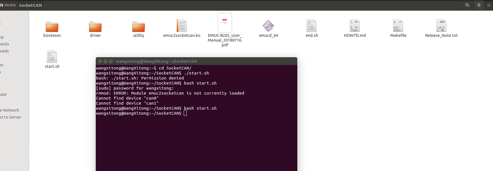

# 循迹搭建--Apollo系统重装
- [循迹搭建--Apollo系统重装](#循迹搭建--Apollo系统重装)
  - [概览](#概览)
  - [工控机系统重装](#工控机系统重装)
    - [工控机软件系统安装](#工控机软件系统安装)
      - [安装Linux系统](#安装Linux系统)
        - [创建引导盘](#创建引导盘)
        - [安装Ubuntu](#安装Ubuntu)
        - [执行软件更新与安装](#执行软件更新与安装)
        - [安装并降级GCC和G++](#安装并降级GCC和G++)
      - [安装Apollo内核](#安装Apollo内核)
      - [安装网卡驱动](#安装网卡驱动)
        - [检查驱动](#检查驱动)
        - [安装驱动](#安装驱动)
      - [安装GPU驱动](#安装GPU驱动)
        - [安装驱动](#安装驱动)
        - [检查驱动](#检查驱动)
      - [安装Can驱动](#安装Can驱动)
        - [安装ESDCan驱动](#安装ESDCan驱动)
        - [检查ESDCan驱动](#检查ESDCan驱动)
        - [安装EmucCan驱动](#安装EmucCan驱动)
        - [检查EmucCan驱动](#检查EmucCan驱动)
      - [安装docker软件](#安装docker软件)
        - [安装docker](#安装docker)
        - [检查docker](#检查docker)
      - [下载Apollo源代码](#下载Apollo源代码)
      - [设置Apollo编译环境](#设置Apollo编译环境)
      - [编译Apollo源代码](#编译Apollo源代码)
      - [运行DreamView](#运行DreamView)
      - [NEXT](#NEXT)
      - [常见问题](#常见问题)

## 概览

本手册旨在帮助用户在开发套件上重新安装Ubuntu操作系统、配置软件，并启动使用Apollo自动驾驶平台。

## 工控机系统安装

在本小结需要完成工控机的软件安装，包括Ubuntu Linux安装、Apollo软件系统安装等。

### 工控机软件系统重装

 在本小结中，工控机软件系统安装包括计算机操作系统的安装，硬件驱动的安装，应用软件的安装和Apollo软件系统的安装。

#### 安装Linux系统

Apollo软件系统依赖于Linux操作系统而运行，而Linux操作系统种类繁多，且又分为服务器版本和桌面版本，这里我们选择当下比较流行的Ubuntu桌面操作系统的64位版本。安装Ubuntu Linux的操作系统的步骤如下：

##### 创建引导盘

创建一个可以引导启动的Ubuntu Linux USB闪存驱动器，下载Ubuntu，并按照在线说明创建可引导启动的USB闪存驱动器。

 推荐使用 **Ubuntu 18.04.3**.

开机按F2进入BIOS设置菜单，建议禁用BIOS中的快速启动和静默启动，以便捕捉引导启动过程中的问题。建议您在BIOS中禁用“快速启动”和“静默启动”，以便了解启动过程中遇到的问题。

获取更多Ubuntu信息，可访问: 
Ubuntu桌面站点:

[https://www.ubuntu.com/desktop](https://www.ubuntu.com/desktop)

##### 安装Ubuntu

a.将Ubuntu安装驱动器插入USB端口并启动IPC。

b.按照屏幕上的说明安装Linux。

##### 执行软件更新与安装

**WARNING**：在整个Apollo系统的安装和操作的过程中，全程禁用root账户，皆用普通账户进行操作，切记！

a.安装完成，重启进入Linux，请选用默认的内核进入系统即可。

b.在终端执行以下命令完成最新软件包的更新：

```
sudo apt update
```

IPC必须接入网络以便更新与安装软件，所以请确认网线插入并连接，如果连接网络没有使用动态分配（DHCP），需要更改网络配置。

##### 安装并降级GCC和G++

请执行以下两条命令安装4.8版本的gcc和g++，命令如下：
```
sudo apt-get install g++-4.8 g++-4.8-multilib gcc-4.8 gcc-4.8-multilib
sudo /usr/bin/update-alternatives --install /usr/bin/gcc gcc /usr/bin/gcc-4.8 99 --slave /usr/bin/g++ g++ /usr/bin/g++-4.8
```
安装完成后，用以下命令检查gcc和g++的版本是否为4.8.5以确认安装成功；若安装未成功，请重新安装直到成功为止：
```
gcc --version
g++ --version
```

#### 安装Apollo内核

开发套件上运行Apollo需要[Apollo Kernel](https://github.com/ApolloAuto/apollo-kernel)，请按照如下步骤获取、安装预编译的内核：

a.从releases文件夹下载发布的包，请选择最新版本的Apollo内核下载，例如`linux-4.4.32-apollo-1.5.5.tar.gz`：

```
https://github.com/ApolloAuto/apollo-kernel/releases
```
b.安装包下载完成后，解压后安装:

```
tar zxvf linux-4.4.32-apollo-1.5.5.tar.gz
cd install
sudo bash install_kernel.sh
```
c.在终端输入`sudo gedit /etc/default/grub`打开配置文件。把`grub_timeout_style=hidden`注释掉，把`grub timeout=0`中的0修改为5，把`grub_cmdline_linux_default=”quiet splash”`中的“quiet splash”修改为”text”，修改完成后保存退出。在终端中执行 `sudo update-grub`更新grub配置。 使用`reboot`命令重新启动计算机。

d.重启ubuntu系统进入grub引导界面，在引导界面选择高级选项，在高级选项里选择倒数第二项的apollo-kernel来引导系统。进入系统后，在终端中输入`uname -r`，若输出“4.4.32-apollo-2-RT”字样，则表示此时系统是以apollo-kernel引导的。 注意：从此以后，每次开机都需要以apollo-kernel来引导系统。

#### 安装网卡驱动

开发套件包含的IPC是有两个有线网卡的，请先安装驱动，然后再检查驱动。

##### 安装驱动

默认情况下，IPC的两个网卡中有一个网卡是没有安装驱动连接不了互联网的。请从以下地址下载驱动安装包[e1000e-3.8.4.tar.gz](https://downloadcenter.intel.com/zh-cn/download/15817?_ga=1.159975677.114505945.1484457019)，在打开的页面中点击下载按钮会弹出“英特尔软件许可协议”对话框，接着点击“我接受许可协议中的条款”就可以开始下载了。下载完成后进入驱动文件的下载目录，执行以下命令来安装驱动：

```
tar -zxvf e1000e-3.8.4.tar.gz
cd e1000e-3.8.4/src/
sudo make install
sudo modprobe e1000e
```

安装完成后，再按照上面的步骤检查驱动就可以了。

##### 检查驱动

直接将已经连通互联网的网线插入IPC的网卡的网口，打开IPC的浏览器，若浏览器能正常访问互联网，则这个网卡的驱动已经安装好了，检查通过。依次检查两个网口，直到全部通过检查为止。

#### 安装GPU驱动

客户自己重新安装系统，请先安装驱动，然后再检查驱动以确认驱动已装好。

##### 安装驱动

下载apollo-kernel官网上的脚本[install-nvidia.sh](https://github.com/ApolloAuto/apollo-kernel/blob/master/linux/install-nvidia.sh)至当前用户的`home`目录下，输入以下命令完成显卡驱动内核模块的安装：

```
cd ~    
sudo apt install make    
sudo bash install-nvidia.sh    
```

完成显卡驱动内核模块的安装后，在当前用户的`home`目录下会出现一个名为`NVIDIA-Linux-x86_64-430.50.run`的文件，执行以下命令完成显卡驱动用户库的安装：

```
cd ~    
sudo bash ./NVIDIA-Linux-x86_64-430.50.run --no-x-check -a -s --no-kernel-module    
```

完成显卡驱动用户库的安装后，重新启动工控机。    

##### 检查驱动

在终端中输入以下命令来检查显卡驱动内核模块是否安装成功：

```
cat /proc/driver/nvidia/version
```

若输出的内容中包含”430.50”字样，则表示显卡驱动内核模块安装成功；若不是，请重新安装显卡驱动内核模块。    
在终端中输入以下命令来检查显卡驱动用户库是否安装成功：

```
sudo dpkg --list | grep nvidia*
```

若输出的内容中显示显卡的用户库的版本是430.50的，则表示显卡驱动用户库安装成功；若不是，请重新安装显卡驱动用户库。    

在终端中输入`nvidia-smi`，能看到显卡的信息且最下面没有出现No running processes found的相关字样，输入`nvidia-settings`能调出显卡的配置界面，则表示显卡驱动安装成功。 

#### 安装Can驱动

若是灰色的6108的IPC，请执行安装ESDCan驱动和检查ESDCan驱动。若是蓝色的8108的IPC，请先安装EmucCan驱动然后再检查EmucCan驱动。

##### 安装ESDCan驱动

在Nuvo-6108GC中，若系统搭配的是ESDCan卡，其驱动安装步骤如下所示：

a.从CAN卡供应商那里或者ESDCan卡的包装袋里拿到CAN卡的驱动安装包，名字形如esdcan-pcie4.2-linux-2.6.x-x86_64-3.10.3.tgz。

ｂ.解压此安装包，cd到解压后的文件夹里。

c.编译安装CAN卡驱动，在终端执行以下命令：
```
cd src/
make -C /lib/modules/`uname -r`/build M=`pwd`
sudo make -C /lib/modules/`uname -r`/build M=`pwd` modules_install
```
##### 检查ESDCan驱动

若CAN卡驱动esdcan-pcie402.ko可以在/lib/modules/4.4.32-apollo-2-RT/extra/文件夹下找到，则CAN卡驱动安装成功；否则，请重新安装。

##### 安装EmucCan驱动

在Nuvo-8108GC中，系统搭配的是EmucCan卡，其驱动安装步骤如下所示：

a.安装EmucCan并添加rules文件

在终端中输入以下命令来查看设备的端口号：
```
ls -l /sys/class/tty/ttyACM*
```
记下形如`1-10:1.0`的一串数字；在系统`/etc/udev/rules.d/`目录下执行`sudo touch 99-kernel-rename-emuc.rules`命令新建一个文件`99-kernel-rename-emuc.rules`,执行`sudo vim 99-kernel-rename-emuc.rules`命令添加文件内容：
 ACTION=="add",SUBSYSTEM=="tty",MODE=="0777",KERNELS=="1-10:1.0",SYMLINK+="ttyACM10"

其中的`1-10:1.0`就是上面记下的一串数字，根据实际情况进行替换即可；然后先按`ESC`键然后再按`:wq`保存文件内容退出，并重启系统。重启系统后执行`cd /dev`命令，用`ls -l ttyACM*`命令查看设备，要确保`ttyACM10`存在。

b.下载emuc-B202驱动包

下载地址[emuc-B202 Driver](https://www.innodisk.com/Download_file?D7856A02AF20333811EBF83A6E6FDFE31262BBEB35FDA8E63B4FCD36B5C237175D714D7286AF87B5)

将EMUC-B202文件下的Linux下的驱动安装包解压出来放到当前用户的home目录下并将文件夹重命名为SocketCan，将当前目录设置到这个文件夹下，并执行`make`命令：
```
cd SocketCan/
make
```
生成的文件如下图所示 ：


c.启动can卡

将`start.sh`中`sudo ./emucd_64 -s9 ttyACM0 can0 can1`修改为`sudo ./emucd_64 -s7 ttyACM10 can0 can1`，其中-s表示波特率，-s9表示为1k，-s7表示为500，apollo中采用500。在当前目录下执行`bash start.sh`命令，如下图所示：


##### 检查EmucCan驱动

a.测试can卡发送接收

将can卡can0和can1口用Can线连接起来。从 https://github.com/linux-can/can-utils 上下载测试代码到当前用户的home目录下，将当前目录设置到can-utils下并执行`make`，如下图所示

然后执行命令`./cansend can0 1FF#1122334455667788`，在另开一个终端执行以下命令：
```
cd can-utils/
./candump can0
```
循环发送cansend命令，能够在candump中收到发送的数据，如下图所示 ：

则表示Can驱动安装成功。

b.注意事项

在后续启动apollo的canbus模块时，需要先在docker外运行start.sh脚本。

#### 安装docker软件

重新安装操作系统的客户请先安装docker，然后再检查docker。

##### 安装docker

使用apollo官网上的[install_nvidia_docker.sh](https://github.com/ApolloAuto/apollo/blob/r5.5.0/docker/setup_host/install_nvidia_docker.sh)来安装docker。工控机在联网情况下在终端中输入以下命令来完成安装：

```
sudo apt update
sudo apt install curl
sudo bash install_nvidia_docker.sh
```

##### 检查docker

在终端中输入以下命令来验证docker是否安装成功：

```
sudo docker run hello-world
```

若能看到helloworld的相关信息，则表示docker安装成功。


**WARNING**：在以下模块的操作中，如非本文档或操作系统要求，禁用一切`sudo`操作，切记！

#### 下载Apollo源代码

a、请参考以下操作来下载Apollo源代码：

```
cd ~
sudo apt update
sudo apt install git -y
git init
git clone -b r5.5.0 https://gitee.com/ApolloAuto/apollo.git
```

代码下载的时间视网速的快慢而有所区别，请耐心等待；下载完成后的代码在~/apollo目录下，若您需要和Apollo代码保持完全同步，请接着执行以下命令：

```
git remote set-url origin https://github.com/ApolloAuto/apollo.git
git pull
```


#### 设置Apollo编译环境

a.设置环境变量，在终端输入以下命令：

```
cd ~
echo "export APOLLO_HOME=$(pwd)" >> ~/.bashrc && source ~/.bashrc
source ~/.bashrc
```

b.将当前账户加入docker账户组中并赋予其相应权限，在终端输入以下命令：

```
sudo gpasswd -a $USER docker  
sudo usermod -aG docker $USER  
sudo chmod 777 /var/run/docker.sock
```

命令执行完成后，重新启动一下计算机。

#### 编译Apollo源代码

a.启动并进入docker容器，在终端输入以下命令：

```
cd ~/apollo
bash docker/scripts/dev_start.sh
```

第一次进入docker时或者image镜像有更新时会自动下载apollo所需的image镜像文件，下载镜像文件的过程会很长，请耐心等待。这个过程完成后，请输入以下命令以进入docker环境中：
```
bash docker/scripts/dev_into.sh
```

b.编译apollo，在终端输入以下命令，等待编译完成，整个编译过程大约耗时25分钟：

```
bash apollo.sh build_opt_gpu
```

#### 运行DreamView

a.若您已经在docker环境中，请忽略此步骤，否则请执行以下命令进入docker环境：

````
cd ~/apollo
bash docker/scripts/dev_start.sh
bash docker/scripts/dev_into.sh
````

b.启动apollo
在终端输入以下命令：

```
bash scripts/bootstrap.sh
```

如果启动成功，在终端会输出以下信息：

```
nohup: appending output to 'nohup.out'
Launched module monitor.
nohup: appending output to 'nohup.out'
Launched module dreamview.
Dreamview is running at http://localhost:8888
```

在浏览器中输入以下地址： 

```
http://localhost:8888
```

可以访问DreamView。

c.回放数据包
在终端输入以下命令下载数据包：

```
python docs/demo_guide/rosbag_helper.py demo_3.5.record
```

输入以下命令可以回放数据包，在浏览器DreamView中应该可以看到回放画面。

```
cyber_recorder play -l -f demo_3.5.record
```

如果成功在浏览器中看到回放画面，则表明您的apollo系统已经部署成功！

## NEXT

现在，您已经完成Apollo系统安装，接下来可以开始[循迹搭建--车辆集成](Vehicle_Integration_cn.md)

## 常见问题

a.显卡的驱动没有安装或者没有安装成功

请参考显卡的驱动安装的部分重新安装，注意需要在apollo内核中安装GPU的驱动并且安装后需要重新启动计算机。

b.docker进不去, no matching entries in passwd file

安装好ubuntu Linux，apollo-kernel，docker后，执行
 
 ```
 bash docker/scripts/dev_start.sh
 bash docker/scripts/dev_into.sh
 ```
 
 遇到报错如下：
 unable to find user xxx : no matching entries in passwd file.
 主要是由于用户权限没有加进docker去导致。执行如下两行命令：
 
 `sudo gpasswd -a $USER docker`
 `sudo usermod -aG docker $USER` 

 其中$USER是登陆用户名，执行成功后logout，然后重新登陆ubuntu。
 如果没有解决，那么有可能是/apollo/scripts/docker_adduser.sh没有权限，需要`sudo chmod a+rx /apollo/scripts/docker_adduser.sh`增加权限。（ 我们曾遇到一种情况就是/apollo/scripts/目录下有一个docker_adduser.sh~文件，导致报错，所以需要检查是否存在副本文件或者交换文件之类的，需要删除掉 ）。
如果还是不行，可以试试`sudo chmod 777 /var/run/docker.sock docker/scripts`。

c.编译的时候CAN警告

若您的CAN卡是EMUC-CAN卡，请直接忽略；若您的CAN卡是ESD-CAN卡，请接着往下看。    
编译的时候，刚开始就报出几行黄色的提示找不到ESD CAN的报错，原因是CAN驱动没有安装好，参见下图：


首先要下载ESD CAN安装包，按照<https://github.com/ApolloAuto/apollo-kernel/blob/master/linux/ESDCAN-README.md>进行CAN驱动安装。其次需要从安装包中拷贝头文件和库文件到指定目录。具体操作如下：
检查apollo/apollo.sh脚本中的check_esd_files()函数，我这里看到1.0.0版本会检查3个文件：
libntcan.so，
libntcan.so.4，
libntcan.so.4.0.1，
所以对应应该建立的软链接是：
```
ln -s libntcan.so.4.0.1 libntcan.so.4
ln -s libntcan.so.4.0.1 libntcan.so.4.0
```
请看apollo.sh的check_esd_files()函数：
```
function check_esd_files() {
  if [ -f ./third_party/can_card_library/esd_can/include/ntcan.h \
      -a -f ./third_party/can_card_library/esd_can/lib/libntcan.so \
      -a -f ./third_party/can_card_library/esd_can/lib/libntcan.so.4 \
      -a -f ./third_party/can_card_library/esd_can/lib/libntcan.so.4.0.1 ]; then
      USE_ESD_CAN=true
  else
      warning "${YELLOW}ESD CAN library supplied by ESD Electronics does not exit.${NO_COLOR}"
      warning "${YELLOW}If you need ESD CAN, please refer to third_party/can_card_library/esd_can/README.md${NO_COLOR}"
      USE_ESD_CAN=false
  fi
}
```
不同的apollo版本可能对检查的库文件名称的要求不同，可根据实际情况建立软连接。

d.`apollo`代码没有`git remote -v`、`git branch -a`和`git log`等相关的`git`信息。

造成以上问题的原因是用户错误地使用了`git init`等相关的命令而导致的`apollo`代码的`git`信息丢失。依次输入以下命令即可恢复`apollo`代码的`git`信息，切记在操作之前备份自己的`apollo`代码。
```
cd ~/apollo
git init
git remote add origin https://gitee.com/ApolloAuto/apollo.git
git clean -fd
git pull origin master
git pull
git checkout -b r5.5.0 origin/r5.5.0
git branch -D master
```
