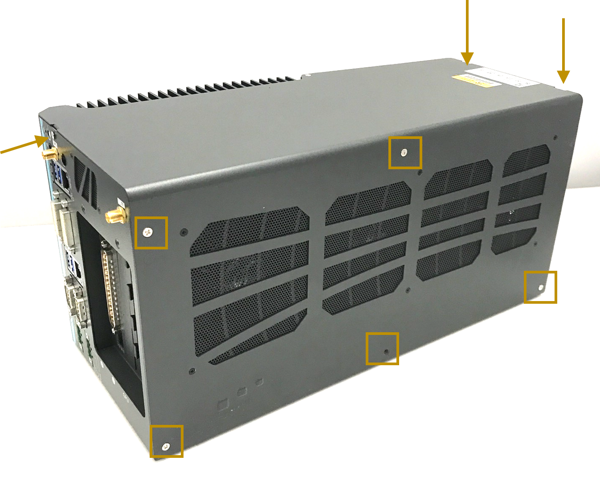

Apollo系统安装
===================

# 目录
      
 - [概览](#概览)
 - [工控机系统安装](#工控机系统安装)
     - [工控机硬件安装](#工控机硬件安装)
     - [工控机软件系统安装](#工控机软件系统安装)

# 概览

该用户手册旨在帮助用户在开发套件上安装、配置软硬件，并启动使用Apollo自动驾驶平台。

# 工控机系统安装

在集成车辆之前，首先需要完成工控机的硬件安装，如CAN卡安装；之后需要完成工控机的软件安装，包括Ubuntu Linux安装、Apollo软件系统安装等。

## 工控机硬件安装

工控机硬件安装包括CAN卡的安装和相关线缆的连接，以及BIOS相关的设置。

### IPC配置

参考下述IPC配置：

- Nuvo-6108GC-RTX2060s-E3-1275

- DDR4-32GB-ECC

- 三星 SSD 256G

- EMUC-B202 CAN

- PA-280W-OW

  
  
### 准备IPC

参考下述步骤：

#### 准备好CAN卡并进行安装
在Nuvo-6108GC中，RTX2060s显卡被预先安装在一个PCI插槽中。如果我们收到的是EMUC-B202 CAN，它已被预装在IPC内，则CAN卡安装这一步，可以跳过。如果我们收到的是ESDCan，我们需要将CAN卡安装在另外一个PCI插槽中，步骤如下：

   a. 找到并拧下机器边上的8个螺丝（显示在棕色方框内或棕色箭头指向的区域）

   

   b. 移除机器盖板

   

   在机箱底部将能看到固定着的3个PCI插槽（其中一个已经被显卡占据）
   
  
  
   c. 设置CAN卡的终端跳线：将4个红色的跳线帽从原位置移除并放置在终端位置，如下图所示：

   

   **WARNING**：如果终端跳线没有被正确设置，CAN卡将不能正确工作。

   d. 将CAN卡插入到一个PCI插槽中

   

   e. 安装IPC的盖板
    
   

#### 配置IPC加电组件

   a. 将电源线接入到为IPC配置的电源连接器（接线板）
   
   **WARNING**：确保电源线的正极（标记为 **R** 表示红色）和负极（标记为 **B** 表示黑色）接入到了IPC接线板的正确接口，如下图所示：

   
   
   b. 将显示器、以太网线、键盘和鼠标接入IPC
   
   
  
#### 启动计算机

如果系统接入了一个或多个外部插入卡，建议通过BIOS设置风扇的转速

```
- 计算机启动时按F2进入BIOS设置菜单
- 进入 [Advanced] => [Smart Fan Setting]
- 设置 [Fan Max. Trip Temp] 为 50
- 设置 [Fan Start Trip Temp] 为 20
```

建议使用者使用数字视频接口（DVI）连接器连接显卡和显示器。设置投影到主板的DVI接口，参考下述的设置步骤：

```
- 计算机启动时按F2进入BIOS设置菜单
- 进入 [Advanced]=>[System Agent (SA) Configuration]=>[Graphics Configuration]=>[Primary Display]=> 设置为 "PEG"
```

建议设置IPC的运行状态为一直以最佳性能状态运行：

```
- 计算机启动时按F2进入BIOS设置菜单
- 进入 [Power] => [SKU POWER CONFIG] => 设置为 "MAX TDP"
```

#### 连接电源


## 工控机软件系统安装

工控机软件系统安装包括计算机操作系统的安装，硬件驱动的安装，应用软件的安装和Apollo软件系统的安装。

### 安装Ubuntu Linux
Apollo软件系统依赖于Linux操作系统而运行，而Linux操作系统种类繁多，且又分为服务器版本和桌面版本，这里我们选择当下比较流行的Ubuntu桌面操作系统的64位版本。安装Ubuntu Linux的操作系统的步骤如下：
#### 创建引导盘
创建一个可以引导启动的Ubuntu Linux USB闪存驱动器，下载Ubuntu，并按照在线说明创建可引导启动的USB闪存驱动器。

 推荐使用 **Ubuntu 18.04.3**.

开机按F2进入BIOS设置菜单，建议禁用BIOS中的快速启动和静默启动，以便捕捉引导启动过程中的问题。建议您在BIOS中禁用“快速启动”和“静默启动”，以便了解启动过程中遇到的问题。

获取更多Ubuntu信息，可访问: 
Ubuntu桌面站点:

[https://www.ubuntu.com/desktop](https://www.ubuntu.com/desktop)

#### 安装 Ubuntu Linux

a.将Ubuntu安装驱动器插入USB端口并启动IPC。

b.按照屏幕上的说明安装Linux。

#### 执行软件更新与安装

**WARNING**：在整个Apollo系统的安装和操作的过程中，全程禁用root账户，皆用普通账户进行操作，切记！

a.安装完成，重启进入Linux。

b.在终端执行以下命令完成最新软件包的更新：

```
sudo apt-get update
```

IPC必须接入网络以便更新与安装软件，所以请确认网线插入并连接，如果连接网络没有使用动态分配（DHCP），需要更改网络配置。

#### 安装并降级GCC和G++

执行以下两条命令安装4.8.5版本的gcc和g++，命令如下：
```
sudo apt-get install g++-4.8 g++-4.8-multilib gcc-4.8 gcc-4.8-multilib
sudo /usr/bin/update-alternatives --install /usr/bin/gcc gcc /usr/bin/gcc-4.8 99 --slave /usr/bin/g++ g++ /usr/bin/g++-4.8
```
安装完成后，使用以下命令检查是否安装成功：
```
gcc --version
g++ --version
```

### 安装Apollo内核

车上运行Apollo需要[Apollo Kernel](https://github.com/ApolloAuto/apollo-kernel)。你可以依照如下步骤获取、安装预编译的内核：

a.从releases文件夹下载发布的包

```
https://github.com/ApolloAuto/apollo-kernel/releases
```
b.安装包下载完成后，解压后安装:

```
tar zxvf linux-4.4.32-apollo-1.5.5.tar.gz
cd install
sudo bash install_kernel.sh
```
c.在终端输入`sudo gedit /etc/default/grub`打开配置文件。把`grub_timeout_style=hidden`注释掉，把`grub timeout=0`中的0修改为10，把`grub_cmdline_linux_default=”quiet splash”中的”`quiet splash”修改为”text”，修改完成后保存退出。在终端中执行 `sudo update-grub`更新grub配置。 使用`reboot`命令重新启动计算机。

d.重启ubuntu系统进入grub引导界面，在引导界面选择高级选项，在高级选项里选择倒数第二项的apollo-kernel来引导系统。进入系统后，在终端中输入`uname -r`，若输出“4.4.32-apollo-2-RT”字样，则表示此时系统是以apollo-kernel引导的。 注意：从此以后，每次开机都需要以apollo-kernel来引导系统。

### 安装GPU驱动

下载并修改apollo-kernel官网上的脚本[install-nvidia.sh](https://github.com/ApolloAuto/apollo-kernel/blob/master/linux/install-nvidia.sh)，将`NV_FILE="NVIDIA-Linux-x86_64-375.39.run"`和`NV_URL="http://us.download.nvidia.com/XFree86/Linux-x86_64/375.39/${NV_FILE}"`中的显卡驱动由375.39改为430.50，将`NEED_TO_COMPILE_NV_KO=0`中的0改为1，用`sudo`执行这个脚本完成安装。然后在终端中依次输入以下三条命令：
```
sudo add-apt-repository ppa:graphics-drivers/ppa
sudo apt-get update
sudo apt-get install nvidia-driver-430
```
等待命令执行完成后重启工控机，在终端中输入`nvidia-smi`，能看到显卡的信息且最下面没有出现No running processes found的相关字样，输入`nvidia-settings`能调出显卡的配置界面，系统设置中可以修改屏幕的分辨率且系统信息中可以查看到独立显卡的信息时则表示显卡驱动安装成功。 

### 安装Can驱动
- 在Nuvo-6108GC中，若系统搭配的是ESDCan卡，其驱动安装步骤如下所示：

a.从CAN卡供应商那里或者ESDCan卡的包装袋里拿到CAN卡的驱动安装包，名字形如esdcan-pcie4.2-linux-2.6.x-x86_64-3.10.3.tgz。

ｂ.解压此安装包，cd到解压后的文件夹里。

c.编译安装CAN卡驱动，在终端执行以下命令：
```
cd src/
make -C /lib/modules/`uname -r`/build M=`pwd`
sudo make -C /lib/modules/`uname -r`/build M=`pwd` modules_install
```
d.CAN卡驱动esdcan-pcie402.ko可以在/lib/modules/4.4.32-apollo-2-RT/extra/文件夹下找到。

- 在Nuvo-6108GC中，系统搭配的是EmucCan卡，其驱动安装步骤如下所示：

a.安装EmucCan并添加rules文件

在终端中输入以下命令来查看设备的端口号：
```
ls -l /sys/class/tty/ttyACM*
```
记下形如`1-10:1.0`的一串数字；在系统`/etc/udev/rules.d/`目录下执行`sudo touch 99-kernel-rename-emuc.rules`命令新建一个文件`99-kernel-rename-emuc.rules`,执行`sudo vim 99-kernel-rename-emuc.rules`命令添加文件内容：
 ACTION=="add",SUBSYSTEM=="tty",MODE=="0777",KERNELS=="1-10:1.0",SYMLINK+="ttyACM10"

其中的`1-10:1.0`就是上面记下的一串数字，根据实际情况进行替换即可；然后先按`ESC`键然后再按`:wq`保存文件内容退出，并重启系统。重启系统后执行`cd /dev`命令，用`ls -l ttyACM*`命令查看设备，要确保`ttyACM10`存在。

b.下载emuc-B202驱动包

下载地址[emuc-B202 Driver](https://www.innodisk.com/Download_file?D7856A02AF20333811EBF83A6E6FDFE31262BBEB35FDA8E63B4FCD36B5C237175D714D7286AF87B5)

将EMUC-B202文件下的Linux下的驱动安装包解压出来放到当前用户的home目录下并将文件夹重命名为SocketCan，将当前目录设置到这个文件夹下，并执行`make`命令：
```
cd SocketCan/
make
```
生成的文件如下图所示 ：


c.启动can卡

将`start.sh`中`sudo ./emuc_64 -s9 ttyACM0 can0 can1`修改为`sudo ./emuc_64 -s7 ttyACM10 can0 can1`，其中-s表示波特率，-s9表示为1k，-s7表示为500，apollo中采用500。在当前目录下执行`bash start.sh`命令，如下图所示：


d.测试can卡发送接收

将can卡can1和can2口用Can线连接起来。从 https://github.com/linux-can/can-utils 上下载测试代码到home下，将当前目录设置到can-utils下并执行`make`，如下图所示

然后执行命令`./cansend can0 1FF#1122334455667788`，在另开一个终端执行以下命令：
```
cd can-utils/
./candump can0
```
循环发送cansend命令，能够在candump中收到发送的数据，如下图所示 ：

则表示Can驱动安装成功。
d.注意事项：
在后续启动apollo的canbus模块时，需要先在docker外运行start.sh脚本。

### 安装Docker

使用apollo官网上的[install_nvidia_docker.sh](https://github.com/ApolloAuto/apollo/blob/master/docker/setup_host/install_nvidia_docker.sh)来安装docker。工控机在联网情况下在终端中输入以下命令来完成安装：
```
sudo apt-get update
sudo apt-get install curl
sudo bash install_nvidia_docker.sh
```

完成安装后，在终端中输入以下命令来验证docker是否安装成功：
```
sudo docker run hello-world
```
若能看到helloworld的相关信息，则表示docker安装成功。


### 编译Apollo源代码

**WARNING**：在本模块及以下的操作中，如非本文档或操作系统要求，禁用一切`sudo`操作，切记！

a.获取Apollo源代码
可以在github上下载，在终端中输入以下命令：
```
cd ~
git clone https://github.com/ApolloAuto/apollo.git
```
代码下载的时间视网速的快慢而有所区别，请耐心等待，下载完成后的代码在～/apollo目录下。
b.设置环境变量，在终端输入以下命令：

```
cd ~
echo "export APOLLO_HOME=$(pwd)" >> ~/.bashrc && source ~/.bashrc
source ~/.bashrc
```

c.将当前账户加入docker账户组中并赋予其相应权限，在终端输入以下命令：

```
sudo gpasswd -a $USER docker  
sudo usermod -aG docker $USER  
sudo chmod 777 /var/run/docker.sock
```

命令执行完成后，重新启动一下计算机。

d.启动并进入docker容器，在终端输入以下命令：

```
cd ~/apollo
bash docker/scripts/dev_start.sh
```

第一次进入docker时或者image镜像有更新时会自动下载apollo所需的image镜像文件，下载镜像文件的过程会很长，请耐心等待；这个过程完成后，请输入以下命令以进入docker环境中：
```
bash docker/scripts/dev_into.sh
```

e.编译apollo，在终端输入以下命令，等待编译完成，整个编译过程大约耗时25分钟：

```
bash apollo.sh build
```

### 运行DreamView

a.启动apollo
在终端输入以下命令：

```
bash scripts/bootstrap.sh
```

如果启动成功，在终端会输出以下信息：

```
nohup: appending output to 'nohup.out'
Launched module monitor.
nohup: appending output to 'nohup.out'
Launched module dreamview.
Dreamview is running at http://localhost:8888
```

在浏览器中输入以下地址： 

```
http://localhost:8888
```

可以访问DreamView。

b.回放数据包
在终端输入以下命令下载数据包：

```
python docs/demo_guide/rosbag_helper.py demo_3.5.record
```

输入以下命令可以回放数据包，在浏览器DreamView中可以看到回放画面。

```
cyber_recorder play -l -f demo_3.5.record
```