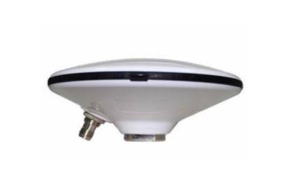
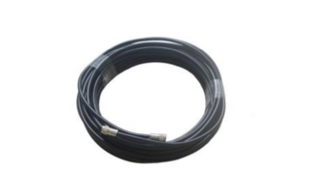

##星网宇达Newton-M2安装指南

星网宇达Newton-M2是一款支持静态双天线初始化的GPS导航设备，其在Apollo系统中的安装配置主要包括以下硬件设置和软件配置两个部分：

###安装主机和天线
本安装指南描述了挂载、连接和为主机与天线量取和设置杆臂值尺寸的步骤

####安装需要的组件：

- Newton-M2主机（1个）

- 卫星天线（2个）：测量型卫星天线，信号接口为TNC母口

- 射频连接线（2根）：射频线两端分别为TNC公头和SMA母头

- 数据/电源线缆（1根）：一端是和主机相连的接口，另一端含有一个串口母头，一根RJ-45网线母头，一根电源接口和一个USB接口

####挂载
使用者可以将主机安装在载体上的任何位置，但我们强烈建议使用者采用下述的建议方案：

- 将M2主机安装在载体的后轴的中心位置上，使主机铭牌上标示的坐标系XOY面尽量与载体坐标系平行并保持各轴向一致，建议将Y轴的正向保持与载体的前进方向一致，M2主机单元必须与被测载体固连。
- GNSS双天线应尽量与载体坐标系Y轴平行并且前天线（Secondary）应在Y轴正方向上，GNSS天线要尽可能的将其安置于测试载体的最高处以保证能够接收到良好的GNSS信号。

####配线
执行如下步骤将主机和天线连接到Apollo系统：

- 将两根射频线的TNC公头连接上卫星天线的TNC母口
- 将射频线的SMA母口连接上主机的SMA公口
- 将数据/电源线缆的公口和主机的母口连接
- 将数据/电源线缆的串口母头连接上IPC的串口公口
- 将数据/电源线缆的网线母头和有线网的水晶头相连接
- 将数据/电源线缆的USB接口连接上IPC的USB接口
- 将数据/电源线缆的电源线接口和载体的电源接口连接起来
请参考下述图片：


####量取杆臂值

参考下述步骤：

- 当主机和天线处在正确位置时量取天线到主机的距离。主机的中点和天线的中点标记在设备的外部。
- 距离被测量并记录为X轴偏移、Y轴偏移和Z轴偏移。坐标轴由主机的位置确定。偏移量的误差应该被控制在一厘米以内以获取高精度的定位信息。

###配置GPS和主机
下面展现了配置GPS和主机的方法。当设备正确接入系统后，在/dev/下面有名为ttyACM0的设备，即表示M2已经被正确的加载了。配置设备时，需要将设备的串口线连接上电脑的串口才可以对设备进行配置，也就是说，用来配置设备的电脑主机需要拥有串口。Windows下可以通过串口助手、串口猎人或者COMCenter等工具进行配置，Linux下可以通过Minicom、Cutecom等工具进行配置。

#####杆臂配置
车尾天线（后天线，通常是主天线，也就是Primary）杆臂配置：

`$cmd,set,leverarm,gnss,0,0.359,0.248*ff`

杆臂值请以自己使用的实际情况为主

#####GNSS航向配置
天线车头车尾前后安装

`$cmd,set,headoffset,0*ff`  

#####导航模式配置
```
$cmd,set,navmode,FineAlign,off*ff
$cmd,set,navmode,coarsealign,off*ff
$cmd,set,navmode,dynamicalign,on*ff
$cmd,set,navmode,gnss,double*ff
$cmd,set,navmode,carmode,on*ff
$cmd,set,navmode,zupt,on*ff
$cmd,set,navmode,firmwareindec,0*ff
```
#####USB接口输出设置
```
$cmd,output,usb0,rawimub,0.010*ff
$cmd,output,usb0,inspvab,0.010*ff
$cmd,through,usb0,bestposb,1.000*ff
$cmd,through,usb0,rangeb,1.000*ff
$cmd,through,usb0,gpsephemb,1.000*ff
$cmd,through,usb0,gloephemerisb,1.000*ff
$cmd,through,usb0,bdsephemerisb,1.000*ff
$cmd,through,usb0,headingb,1.000*ff
```
#####网口配置
```
$cmd,set,localip,192,168,1,2*ff
$cmd,set,localmask,255,255,255,0*ff
$cmd,set,localgate,192,168,1,1*ff
$cmd,set,netipport,111,112,113,114,8000*ff
$cmd,set,netuser,username:password*ff
$cmd,set,mountpoint,XMJL*ff
```
网络配置依据自己的实际情况自行更改为相应的配置。

#####PPS授时接口输出
```
ppscontrol enable positive 1.0 10000
log com3 gprmc ontime 1 0.25
```

通过\$cmd,get,navmode*ff指令可以获取设备当前的导航模式配置。将所有配置逐条或一起发送给设备，得到设备返回\$cmd,config,ok*ff字段，说明配置成功，配置成功后要进行配置保存，发送\$cmd,save,config*ff指令。根据设备安装情况，要进行设备坐标轴配置，可以发送：\$cmd,get,coordinate,x,y,z*ff指令获取当前坐标轴配置。坐标轴默认配置为\$cmd,set,coordinate,x,y,z*ff,即与设备外壳标注一致。杆臂是指后天线（Primary）的几何中心位置相对于主机几何中心在直角坐标系内x,y,z三方向的位置差。通过如下指令进行补偿设置：\$cmd,set,leverarm,gnss,x_offset,y_offset,z_offset*ff。
x_offset:X方向的杆臂误差，单位为米，以此类推。注：上述坐标XYZ为设备坐标轴配置后的实际坐标，一般应与载体坐标系一致，注意补偿的是后天线（Primary）杆臂值。当进行导航模式配置后必须对设备进行重新上电启动。

###Apollo代码配置
此适配过程是基于Apollo的v3.1_dev分支的代码进行的，将其clone至本地后编译通过即可。

####修改配置

- 修改/apollo/modules/drivers/gnss/proto文件夹下面的配置文件config.proto，将NEWTONM2_TEXT = 30;NEWTONM2_BINARY = 31;添加进message Stream的后面;
- 修改/apollo/modules/drivers/gnss/conf文件夹下面的配置文件gnss_conf.pb.txt，将gnss_conf_newton.pb.txt的内容全部拷贝覆盖gnss_conf.pb.txt的内容即可。

####关闭雷达
在apollo/modules/localization/conf/localization.conf文件中将：--enable_lidar_localization=true修改为：--enable_lidar_localization=false.

####修改定位模式
在apollo/modules/localization/conf/localization_config.pb.txt文件中把配置localization_type: RTK改为localization_type: MSF。

###$修改脚本
在apollo/scripts/docker_adduser.sh文件中将#setup GPS device下面添加如下代码
```
if [ -e /dev/ttyACM0 ]; then
  chmod a+rw /dev/ttyACM0
fi
```
####添加航向
在apollo/modules/localization/conf/msf_adapter.conf文件中添加如下内容：
```
config
{
    type: GNSS_HEADING
    mode: RECEIVE_ONLY
    message_history_limit: 10
}
```
###资料参考
获取更多关于Newton-M2的信息请登录新网宇达的官方网站进行查询：
http://www.starneto.com/

###免责声明
This device is Apollo Hardware Development Platform Supported

