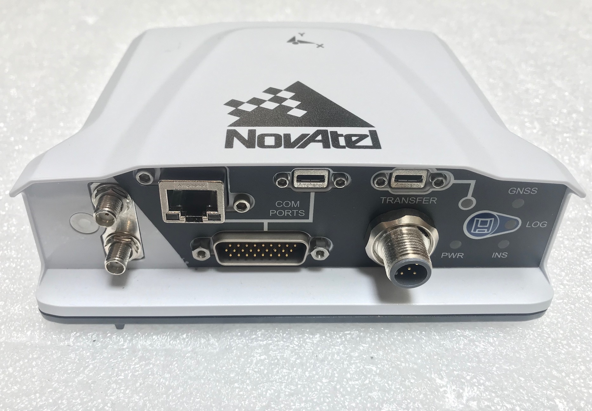

## Installation Guide of NovAtel PwrPak7

NovAtel PwrPak7 is an integrated INS receiver, which has GNSS receiver and IMU included in the device.



### Installing the GPS Receiver

The overview of Novatel PwrPak7 is shown as below.


To power on the receiver, connect +VIN_A and +VIN_B from power extension cable to power source (i.e., 12VDC) positive side, and connect both -VIN to negative side. Refer to link below about PwrPak7 power cable.

* [NovAtel ProPak7 Power Cable](https://docs.novatel.com/OEM7/Content/Technical_Specs_Receiver/PwrPak7_Power_Cable.htm)

The PwrPak7 receiver supports dual antenna, ANT1 is the port on top and considered as primary antenna, which is required by Apollo system. ANT2 is the port on bottom and considered as secondary antenna, and this is optional.

To send RTK correction and log data, similar as Novatel ProPak6, we can use a USB cable and connect to the MicroUSB port on PwrPak7, and the other side to the IPC on the vehicle.

The COM2 port and PPS signal are required to connect to Lidar system, which needs an extension cable of the 26-pin connector on PwrPak7. For detail information about the extension cable, refer to Novatel PwrPak All I/O Cable website below.

* [NovAtel ProPak7 All I/O Cable](https://docs.novatel.com/OEM7/Content/Technical_Specs_Receiver/PwrPak7_All_IO_Cable.htm?tocpath=Specifications%7CPwrPak7%20Technical%20Specifications%7C_____11)

You can place the PwrPak7 in most places in the vehicle, but it is suggested that you follow these recommendations:

- Place and secure the PwrPak7 inside the trunk with the Y-axis pointing forward.
- Use a magnetic adapter to tightly attach the antenna to the trunk lid.
- Install the antenna cable in the trunk by opening the trunk and placing the cable in the space between the trunk lid and the body of the car.

#### Taking the Lever Arm Measurement

Follow these steps:

* Before taking the measurement, turn on the IPC.
* When the PwrPak7 and the GPS Antenna are in position, the distance from the PwrPak7 to the GPS Antenna must be measured. The center of the PwrPak7 IMU and the center of the antenna are labeled on the exterior of the devices.
* The distance should be measured as: X offset, Y offset, and Z offset. The axis should be determined by the IMU. The error of offset must be within one centimeter to achieve high accuracy in positioning and localization. 

### Configuring the PwrPak7

Configure the GPS and IMU as shown below. This process can be done either by keying in the commands, or by loading batch configuraion file in NovAtel Connect.

For PwrPak7:

```
WIFICONFIG OFF
UNLOGALL THISPORT
INSCOMMAND ENABLE
SETIMUORIENTATION 5
ALIGNMENTMODE AUTOMATIC
VEHICLEBODYROTATION 0 0 0
SERIALCONFIG COM1 9600 N 8 1 N OFF
SERIALCONFIG COM2 9600 N 8 1 N OFF
INTERFACEMODE COM1 NOVATEL NOVATEL ON
INTERFACEMODE COM2 NOVATEL NOVATEL ON
INTERFACEMODE USB2 RTCMV3 NONE OFF
PPSCONTROL ENABLE POSITIVE 1.0 10000
MARKCONTROL MARK1 ENABLE POSITIVE
EVENTINCONTROL MARK1 ENABLE POSITIVE 0 2
RTKSOURCE AUTO ANY
PSRDIFFSOURCE AUTO ANY
SETINSTRANSLATION ANT1 0.00 1.10866 1.14165 0.05 0.05 0.08
SETINSTRANSLATION ANT2 0.00 1.10866 1.14165 0.05 0.05 0.08
SETINSTRANSLATION USER 0.00 0.00 0.00
EVENTOUTCONTROL MARK2 ENABLE POSITIVE 999999990 10
EVENTOUTCONTROL MARK1 ENABLE POSITIVE 500000000 500000000

LOG COM2 GPRMC ONTIME 1.0 0.25
LOG USB1 GPGGA ONTIME 1.0
LOG USB1 BESTGNSSPOSB ONTIME 1
LOG USB1 BESTGNSSVELB ONTIME 1
LOG USB1 BESTPOSB ONTIME 1
LOG USB1 INSPVAXB ONTIME 1
LOG USB1 INSPVASB ONTIME 0.01
LOG USB1 CORRIMUDATASB ONTIME 0.01
LOG USB1 RAWIMUSXB ONNEW 0 0
LOG USB1 MARK1PVAB ONNEW

LOG USB1 RANGEB ONTIME 1
LOG USB1 BDSEPHEMERISB ONTIME 15
LOG USB1 GPSEPHEMB ONTIME 15
LOG USB1 GLOEPHEMERISB ONTIME 15

LOG USB1 INSCONFIGB ONCE
LOG USB1 VEHICLEBODYROTATIONB ONCHANGED

SAVECONFIG

```

** WARNING:** Modify the **<u>SETINSTRANSLATION</u>T** line based on the actual measurement (of the antenna and the IMU offset). ANT1 is for primary antenna which is required, and ANT2 is for secondary antenna and it is optional.

For example:

```
SETINSTRANSLATION ANT1 -0.05 0.5 0.8 0.05 0.05 0.08
```

The first 3 numbers indicate the result of the lever arm distance measurement. The last 3 numbers are the uncertainty of the measurement. 

### References

For more information about the NovAtel PwrPak7, see:
* [NovAtel PwrPak7 Installation & Operation User Manual](https://docs.novatel.com/OEM7/Content/PDFs/PwrPak7_Install_Ops_Manual.pdf)
* [NovAtel PwrPak7 Installation Overview](https://docs.novatel.com/OEM7/Content/PwrPak_Install/PwrPak7_Install_Overview.htm?TocPath=Installation%7CPwrPak7%20Installation%7C_____4)

## Disclaimer

This device is `Apollo Platform Supported`
