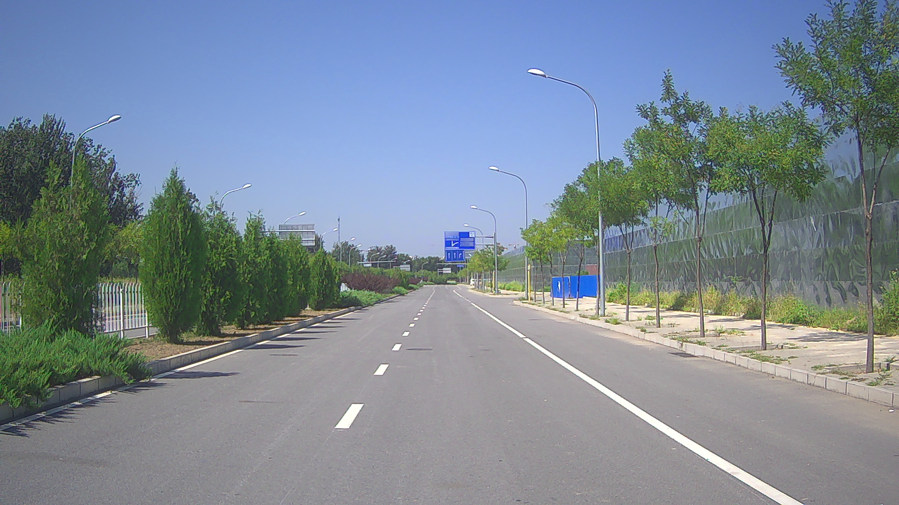
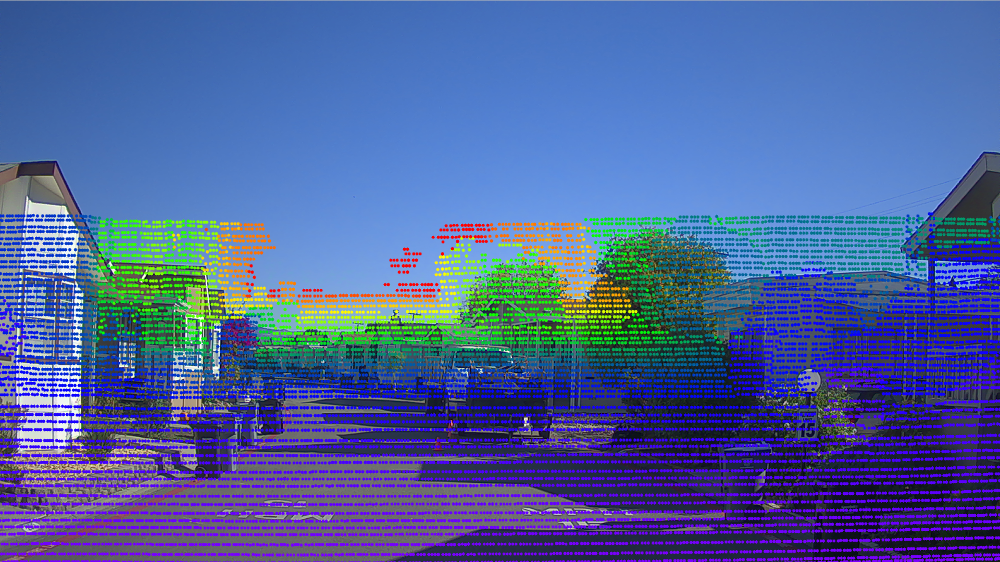
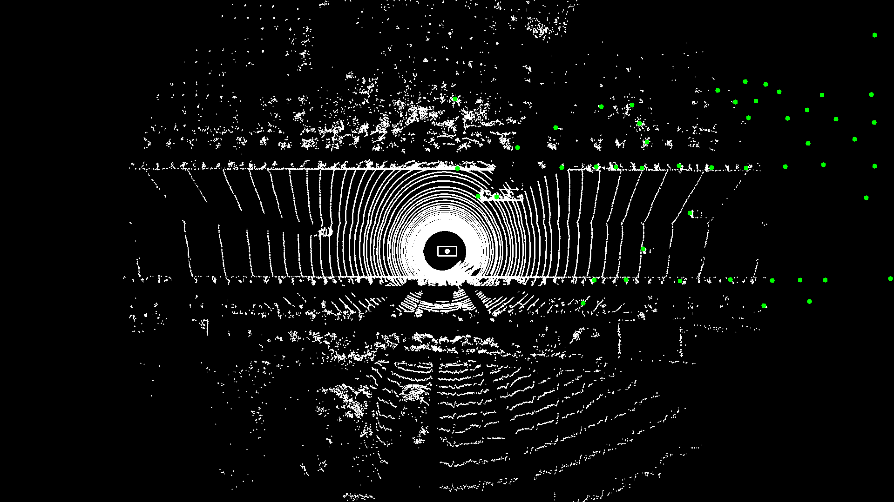
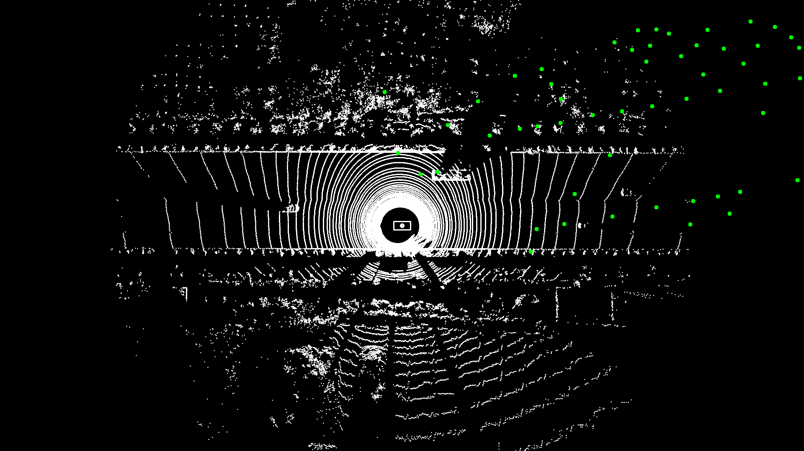

# Apollo 2.0 Sensor Calibration Guide

Welcome to use the Apollo sensor calibration service. This document describes the three new calibration tools which are provided in Apollo 2.0. They are: Camera-to-Camera calibration, Camera-to-LiDAR calibration, and Radar-to-Camera calibration.

## Catalog

* Overview
* Preparation
* Calibration Progress
* Obtaining Calibration Results
* Result Validation

## Overview

In Apollo 2.0, we add three new calibration functions: Camera-to-Camera calibration, Camera-to-LiDAR calibration, and Radar-to-Camera calibration. Unlike the LiDAR-to-IMU calibration in Apollo 1.5, all the new calibration methods are provided by the onboard executable program. The user only needs to start the corresponding calibration program, so the calibration work can be completed in real time and verify the results. The results are provided by `.yaml` format files.

## Preparation

1. Well Calibrated Intrinsics of Camera

  Intrinsic contains focus length, principal point, distortion coefficients and other information. They can be obtained from some other camera calibration tools, for example, [ROS Camera Calibration Tools](http://wiki.ros.org/camera_calibration/Tutorials/MonocularCalibration) and [Camera Calibration Toolbox for Matlab](http://www.vision.caltech.edu/bouguetj/calib_doc/). After the calibration is completed, the results need to be converted to a `.yaml` format file. Here is is an example of a camera intrinsic file:

```bash
    header: 
      seq: 0
      stamp: 
      secs: 0
        nsecs: 0
      frame_id: short_camera
    height: 1080
    width: 1920
    distortion_model: plumb_bob
    D: [-0.535253, 0.259291, 0.004276, -0.000503, 0.0]
    K: [1959.678185, 0.0, 1003.592207, 0.0, 1953.786100, 507.820634, 0.0, 0.0, 1.0]
    R: [1.0, 0.0, 0.0, 0.0, 1.0, 0.0, 0.0, 0.0, 1.0]
    P: [1665.387817, 0.0, 1018.703332, 0.0, 0.0, 1867.912842, 506.628623, 0.0, 0.0, 0.0, 1.0, 0.0]
    binning_x: 0
    binning_y: 0
    roi: 
      x_offset: 0
      y_offset: 0
      height: 0
      width: 0
      do_rectify: False
```

  We recommend that do the intrinsic calibration for every single camera, instead of using a unified intrinsic. This can improve the accuracy of the extrinsics calibration results.

2. Initial Extrinsic File

  The tools require the user to provide an initial extrinsic value as a reference. Here is an example of the initial extrinsic file of Camera-to-LiDAR, where translation is is the shift distance between camera and LiDAR. Rotation is the quaternion expression form of the rotation matrix.

```bash
    header:
      seq: 0
      stamp:
        secs: 0
        nsecs: 0
      frame_id: velodyne64
    child_frame_id: short_camera
    transform:
      rotation:
        y: 0.5
        x: -0.5
        w: 0.5
        z: -0.5
      translation:
        x: 0.0
        y: 1.5
        z: 2.0
```
	
  Attention: the calibration method of the Camera-to-LiDAR is more dependent on the initial extrinsics. A large deviation can lead to the failure of calibration. Therefore, please provide an accurate initial extrinsc as far as possible when the conditions are allowed.

3. Calibration Place

  Because our calibration method is based on nature sence, an ideal calibration place can significantly improve the precision. We recommend selecting a textured site such as trees, poles, street lights, traffic signs, stationary objects and clear traffic lines. A good calibraiton environment is shown below: 

  
  <a align="center"> Figure 1. A good calibraiton place </a>

4. Required Topics
	
  Confirm that all sensor topics required by program have output. See: [How to Check the Sensor Output?](https://github.com/ApolloAuto/apollo/blob/master/docs/FAQs/Calibration_FAQs.md)

  The topics required by the program are shown in the following Table 1 to Table 3:
	
  Table 1. The required topics of Camera-to-Camera calibration

  | Sensor       | Topic Name                                |Topic Feq. (Hz)  |
  | ------------ | ----------------------------------------- | --------------- |
  | Short_Camera | /apollo/sensor/camera/traffic/image_short | 9               |
  | Long_Camera  | /apollo/sensor/camera/traffic/image_long  | 9               |
  | INS          | /apollo/sensor/gnss/odometry              | 100             |
  | INS          | /apollo/sensor/gnss/ins_stat              | 2               |

  Table 2. The required topics of Camera-to-LiDAR calibration

  | Sensor       | Topic Name                                |Topic Feq. (Hz)  |
  | ------------ | ----------------------------------------- | --------------- |
  | Short_Camera | /apollo/sensor/camera/traffic/image_short | 9               |
  | Velodyne HDL64  | /apollo/sensor/velodyne64/compensator/PointCloud2  | 10               |
  | INS          | /apollo/sensor/gnss/odometry              | 100             |
  | INS          | /apollo/sensor/gnss/ins_stat              | 2               |
	
  Table 3. The required topics of Radar-to-Camera calibration

  | Sensor       | Topic Name                                |Topic Feq. (Hz)  |
  | ------------ | ----------------------------------------- | --------------- |
  | Short_Camera | /apollo/sensor/camera/traffic/image_short | 9               |
  | INS          | /apollo/sensor/gnss/odometry              | 100             |
  | INS          | /apollo/sensor/gnss/ins_stat              | 2               |

## Calibration Progress

Please confirm the localization status is 56, otherwise the calibration program will not collect data. Type the following command to check localization status:

	rostopic echo /apollo/sensor/gnss/ins_stat

### Camera-to-Camera Calibration

1. Run

  Type the following command to start calibraiton program: 
	
```bash
    cd /apollo/scripts
    bash sensor_calibration.sh lidar_camera
```

2. Data Collection

  * Due to the timestamps of two cameras can not be completely synchronized. Therefore, when recording data, the slow driving of vehicles can effectively alleviate the image mismatch caused by timestamps.
  * There should be a large enough overlapping regions of the two camera images, otherwise the tool will not be able to perform the extrinsic calibration operation.

3. Configurations

  The configuration file is saved in the path below. See Table 4 for details.

```bash
    /apollo/modules/calibration/camera_camera_calibrator/camera_camera_calibrtor.conf
```

  Table 4. Camera-to-Camera Calibration Configuration Description
	
  Configuration | Description
  --- | ---
  long_image_topic | telephoto camera image topic
  short_image_topic | wide-angle camera image topic
  odometry_topic | vehicle vodometry topic
  ins_stat_topic | vehicle locolization status topic
  long_camera_intrinsics_filename	| intrinsic file of telephoto camera
  short_camera_intrinsics_filename | intrinsic file of wide-angle camera
  init_extrinsics_filename | initial extrinsic file
  output_path	| calibration results output path
  max_speed_kmh | limitation of max vehicle speed, unit: km/h

4. Output

  * The calibrated extrinsic file, provided as `.yaml` format.
  * Validation images: It includes an image captured by the telephoto camera, an image captured by the wide-angle camera and a warp image blended with un-distortion wide-angle camera image and un-distortion telephoto camera image.

### Camera-to-LiDAR Calibration

1. Run

  Type the following command to start calibraiton program: 
	
```bash
    cd /apollo/scripts
    bash sensor_calibration.sh lidar_camera
```

2. Data Collection

  * Due to the timestamps of camera and LiDAR can not be completely synchronized. Therefore, when recording data, the slow driving of vehicles can effectively alleviate the image mismatch caused by timestamps.
	
  * There should be a certain number of projection points in camera image, otherwise the tool will not be able to perform the extrinsic calibration operation. In this reason, we recommand to use short focus lenth camera as the calibrate target.

3. Configurations

  The configuration file is saved in the path below. See Table 5 for details.
```bash
    /apollo/modules/calibration/lidar_camera_calibrator/camera_camera_calibrtor.conf
```

  Table 5. Camera-to-LiDAR Calibration Configuration Description
	
  Configuration | Description
  --- | ---
  camera_topic | wide-angle camera image topic
  lidar_topic | LiDAR point cloud topic
  odometry_topic | vehicle vodometry topic
  ins_stat_topic | vehicle locolization status topic
  camera_intrinsics_filename	| intrinsic file of camera
  init_extrinsics_filename | initial extrinsic file
  output_path	| calibration results output path
  calib_stop_count | required stops of capturing data
  max_speed_kmh | limitation of max vehicle speed, unit: km/h

4. Output
	
  * The calibrated extrinsic file, provided as `.yaml` format.
  * Validation images: It includes two images which project LiDAR point cloud into camera image. One of them is colored with depth, another one is colored with intensity.

### Radar-to-Camera Calibration

1. Run

  Type the following command to start calibraiton program: 
	
```bash
    cd /apollo/scripts
    bash sensor_calibration.sh radar_camera
```

2. Data Collection

  * please drive the vehicle in a low speed and straight line, and the calibration procedure will capture data only under this condition.

3. Configurations

  The configuration file is saved in the path below. See Table 6 for details.
	
```bash
    /apollo/modules/calibration/radar_camera_calibrator/conf/radar_camera_calibrtor.conf
```

  Table 6. Radar-to-Camera Calibration Configuration Description
	
  Configuration | Description
  --- | ---
  camera_topic | telephoto camera image topic
  odometry_topic | vehicle vodometry topic
  ins_stat_topic | vehicle locolization status topic
  camera_intrinsics_filename	| intrinsic file of camera
  init_extrinsics_filename | initial extrinsic file
  output_path	| calibration results output path
  max_speed_kmh | limitation of max vehicle speed, unit: km/h

4. Output
	
  * The calibrated extrinsic file, provided as `.yaml` format.
  * Validation images：the projection result from Radar to LiDAR, need to run `radar_lidar_visualizer` tool to generate image. See `Result Validation` for details。

## Obtaining Calibration Results

All calibration results are save under the path of `output` in configuration files, they are provided by `yaml` format. In addition, depending on the sensor, the calibration results are stored in different folders in the `output` directory as shown in Table 7: 

Table 7. Calibration Results Save Path

| Sensor       | Results Save Path      |
| ------------ | -----------------------|
| Short_Camera | [output]/camera_params |
| Long_Camera  | [output]/camera_params |
| Radar        | [output]/radar_params  |

## Result Validation

When the calibration is completed, the corresponding calibration result verification image will be generated in the `[output]/validation` directory. We will introduce the detail of validation theories and methods.

### Camera-to-Camera Calibration

* Methods: In the warp image, the green channel is from the wide-angle camera image, the red and blue channel is from the telephoto camera image. Users can compare the alignment result of warp image to validate the precision of calibrated extrinsic. In the fusion area of the warp image, judge the alignment of the scene 50 meters away from the vehicle. If the images are complete coincided, extrinsic is satisfied. While appear pink or green ghost (displacement), there is an error for the extrinsic. When the error is greater than a certain range (determined by the actual usage), we need to re-calibrate extrinsic (Under the general circumstances, due to the parallax, some dislocations may occur in the horizontal with close objects, but the vertical direction is not affected. This is a normal phenomenon.).

* Result Examples：As shown in the following figures, Figure 2 meets the precision requirements of the extrinsic, and Figure 3 is a phenomenon that does not meet the requirements of precision.
 

<a align="center"> Figure 2. The good camera-to-camera calibration validation result </a>
	

<a align="center"> Figure 3. The bad camera-to-camera calibration validation result </a>

### Camera-to-LiDAR Calibration

* Methods: In the point cloud projection images, users can objects and signs with obvious edges and compare the alignment. If the targets within 50 meters, its edge of point cloud can coincide with the edge of the image, the accuracy of the calibration results can be proved to be very high. On the other hand, if there is a misplacement, the calibration results have error. The extrinsic is not available when the error is greater than a certain range (depending on the actual usage).

* Result Examples: As shown in the following figures, Figure 4 meets the precision requirements of the extrinsic, and Figure 5 is a phenomenon that does not meet the requirements of precision.
 

<a align="center"> Figure 4. The good Camera-to-LiDAR calibration validation result </a>
	

<a align="center"> Figure 5. The bad Camera-to-LiDAR calibration validation result </a>

### Radar-to-Camera Calibration
	
* Methods: In order to verify the output extrinsic, we use the LiDAR in the system to be a medium. So we can get the extrinsic of the Radar relative to the LiDAR through the extrinsic of the Radar relative to the camera and the extrinsic of the camera relative to the LiDAR. Then we can draw a bird-view fusion image, which fuse the Radar data and the LiDAR date in the LiDAR coordinate system. Then we can use the alignment of the Radar date and the LiDAR date in the bird-view fusion image to judge the accuracy of the extrinsic. In the fusion image, the white point means the LiDAR point cloud, while the green solid circle means Radar objects. The alignment of the Radar object and the LiDAR date in the bird-view fusion image shows the accuracy of the extrinsic. If most of the targets can be coincident it is satisfied, otherwise, it is not satisfied and need to re-calibrate

* Result Examples: As shown in the following figures, figure 6 is to meet the precision requirements of the extrinsic, and figure 7 is a phenomenon that does not meet the requirements of precision.


<a align="center"> Figure 2. The good Camera-to-Radar calibration validation result </a>


<a align="center"> Figure 3. The bad Camera-to-Radar calibration validation result </a>

* Attentions：

  * In order to get the fusion image of the Radar date and the LiDAR point cloud, the calibration process will automatically or manually call another projection tool (`radar_lidar_visualizer`). The projection tool loads the extrinsic file of  the Radar-to-Camera and Camera-to-LiDAR. Therefore, before tool starts, we need to make sure these two extirnsics are well calibrated and exsist in the specific path.

  * Type the following command to start the `radar_lidar_visualizer` program: 
	
```bash
    cd /apollo/scripts
    bash sensor_calibration.sh visualizer
```

  * The configuration file of `radar_lidar_visualizer` is saved in the path below. See Table 8 for details.
	
```bash
    /apollo/modules/calibration/radar_lidar_visualizer/conf/radar_lidar_visualizer.conf
```
	
  Table 8. the Projection Tool of Radar-to-LiDAR Configuration Description

  Configuration | Description
  --- | ---
  radar_topic | Radar data topic
  lidar_topic | LiDAR point cloud topic
  radar_camera_extrinsics_filename | the calibrated extrinsic of Radar-to-Camera
  camera_lidar_extrinsics_filename | the calibrated extrinsic of Camera-to-LiDAR
  output_path | validation results output path

  * The validation image is save at `[output]/validation` as well.