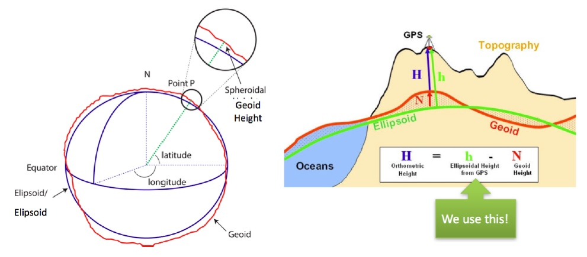
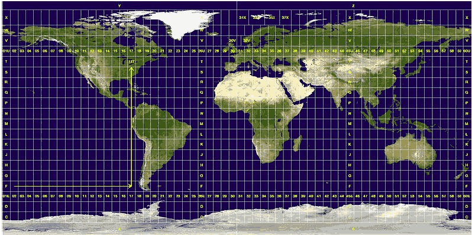

# Apollo坐标系统

我们欢迎每一位开发者加入Apollo开发平台。Apollo系统涉及到了多种坐标系。在本文档中，我们将讨论在Apollo系统中使用的各个坐标系的定义。

## 1. 全球地理坐标系统

在Apollo系统中，我们采用全球地理坐标系统来表示高清地图（HD Map）中各个元素的地理位置。全球地理坐标系统的通常用途是用来表示纬度、经度和海拔。Apollo采用的是WGS84（World Geodetic System 1984）作为标准坐标系来表示物体的纬度和经度。通过使用该标准坐标系统，我们可以使用2个数字：x坐标和y坐标来唯一的确定地球表面上除北极点之外的所有点，其中x坐标表示经度，y坐标表示纬度。WGS-84常用于GIS服务，例如地图绘制、定位和导航等。全球地理坐标系统的定义在下图中展示。

## 2. 局部坐标系 – 东-北-上（East-North-Up ENU）

在Apollo系统中，局部坐标系的定义为：

z轴 – 指向上方（和重力线成一条直线）

y轴 – 指向北面

x轴 – 指向东面

ENU局部坐标系依赖于在地球表面上建立的3D笛卡尔坐标系。
通用横轴墨卡托正形投影（Universal Transverse Mercator  UTM）使用2D的笛卡尔坐标系来给出地球表面点的位置。这不仅只是一次地图的映射。该坐标系统将地球划分为60个区域，每个区域表示为6度的经度带，并且在每个区域上使用割线横轴墨卡托投影。在Apollo系统中，UTM坐标系统在定位、Planning等模块中作为局部坐标系使用。

关于UTM坐标系统的使用，我们遵从国际标准规范。开发者可以参考下述网站获取更多细节：

[http://geokov.com/education/utm.aspx](http://geokov.com/education/utm.aspx)

[https://en.wikipedia.org/wiki/Universal_Transverse_Mercator_coordinate_system](https://en.wikipedia.org/wiki/Universal_Transverse_Mercator_coordinate_system)

## 3. 车辆坐标系 – 右-前-上（Right-Forward-Up RFU）

车辆坐标系的定义为：

z轴 – 通过车顶垂直于地面指向上方

y轴 – 在行驶的方向上指向车辆前方

x轴 – 面向前方时，指向车辆右侧

车辆坐标系的原点在车辆后轮轴的中心。

