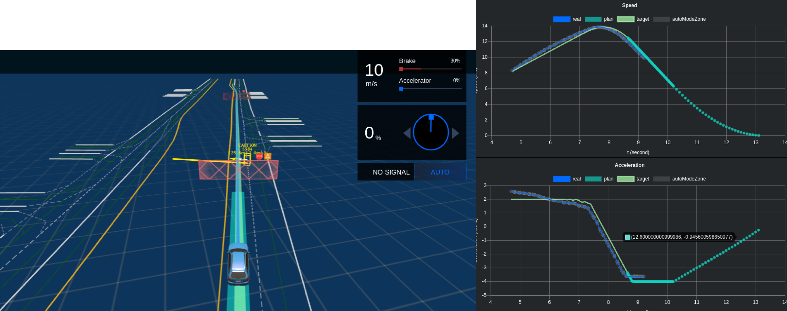
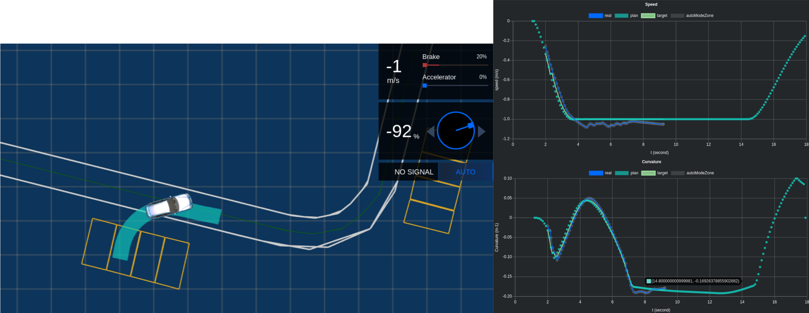

# Dynamic Model - Control-in-loop Simulation

## Introduction

Simulation is a vital part of autonomous driving especially in Apollo where most of the testing happens via our simulation platform. In order to have a more accurate approach to our testing environment, Apollo 5.0 introduces Dynamic model which is used to achieve Control-in-loop Simulation to represent the ego car's actual dynamic charateristics. It is possible to gauge the how the ego car would actually perform while driving in autonomous mode, but virtually using the Control-in-loop simulation making it secure and efficient. It can also accelerate your development cycle as you can maximize your testing and enhance your algorithms even before entering the vehicle.

The architecture diagram for how Dynamic model works is included below:


The Control module recieves input via planning and the vehicle and uses it effectively to generate the output path which is then fed into the Dynamic model. 

## Examples

The simulation platform (Dreamview) can be used to test various control parameters, three parameters are shown below:

```
Note:
The green lines in the graph below are the actual planning trajectories for those scenarios, and they blue lines are the computed results from Dynamic Model combined with output from the control module.
```

1. **Longitudinal Control**
A pedestrian walk across the road and the ego car needs to stop by applying the brake 



2. **Lateral Control**
The ego car has to make a wide-angle U-turn in this scenario. As seen in the image below, the steering turn is at 64%. You can also monitor the performance of the dynamic model on the right against the actual planned trajectory.

3. **Backward Behavior**
The ego car has to park itself in a designated spot. This scenario is complex as it requires a mixture of forward and backward (reverse) driving and requires a high level of accuracy from the control module. As you can see in the image below, the steering turn required is at `-92%`. Additional details on this example can be seen in the planning module's Park scenario.



## References

A paper has been written by our engineers on the Dynamic Model which will provide an in-depth explanation of the concepts mentioned above. This paper has already been approved and will be published in ArXiv soon. Please stay tuned!