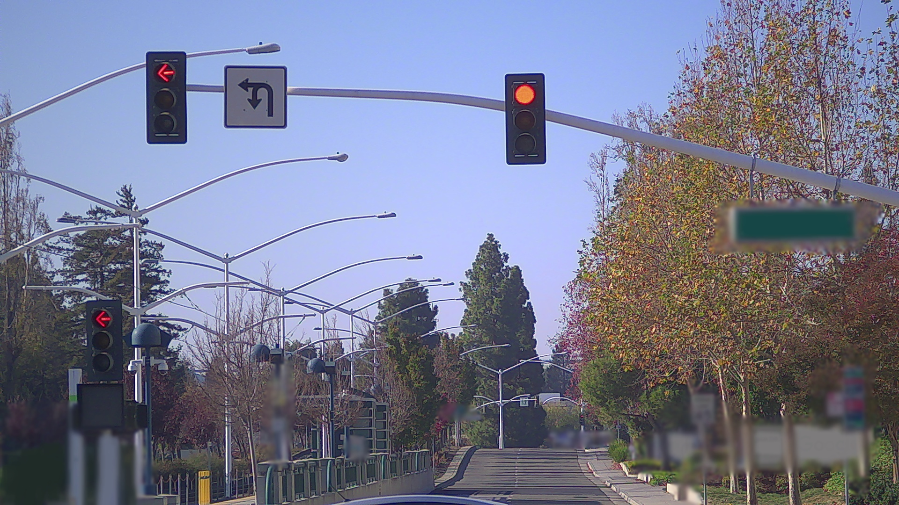
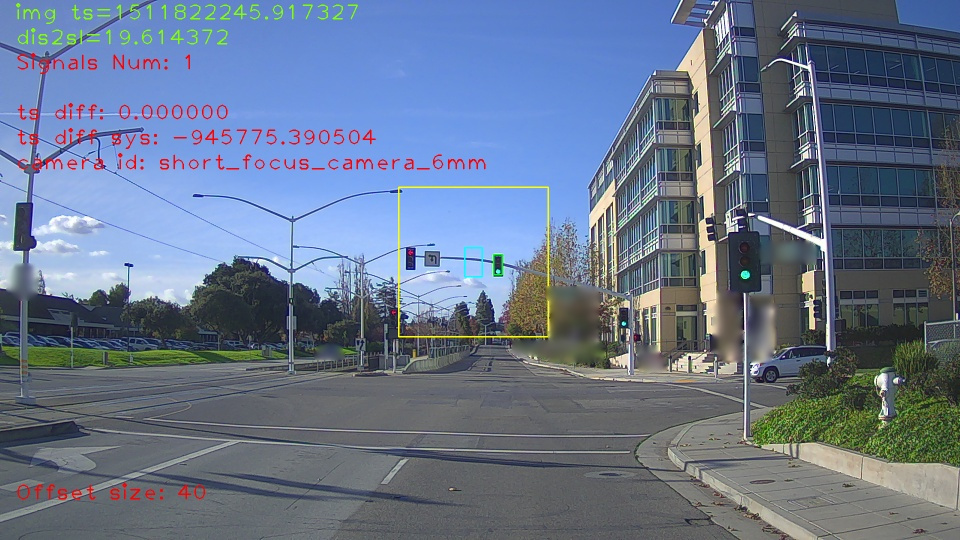

# Traffic Light Perception
This document describes the details of traffic light perception in Baidu Apollo program.
 
## 1. Introduction
The traffic light perception module is designed to provide accurate and robust traffic light status using cameras. Typically, the traffic light has three status, including red, yellow and green. Sometimes traffic light may keep black if not work or flashing. Occasionally, traffic light cannot be found in camera field of vision and our module failed to recognize its status. Hence, the traffic light perception module outputs five status in total, which are red, yellow ,green, black and unknown.
 
Our module query hd-map repeatedly to know whether there are lights in front. The traffic light is represented by the four points on its boundary, which can be obtained by querying hd-map given car's localization. The light will be projected from world coordinates to image coordinates if there is light in front.
 
Considering that perception range should be above 100 meters and the height of lights or the breadth of crossing vary widely, single camera, which has a constant field of vision, can't see traffic light everywhere. We adopt multi cameras to enlarge perception range. In apollo 2.0, a telephoto camera whose focus length is 25 mm, is installed to observe forward far traffic light. Traffic lights captured in telephoto camera are very large and easy to be detect. However, the field of vision of telephoto camera is quite limited so that lights are often out of image if the lane is not straight enough or the car is near the light. Thus, a wide angle camera whose focus length is 6 mm, is equipped to provide supplementary field of vision. The module will decide which camera to be used adaptively based on the light projection. Althrough there are only two cameras on Apollo car, our algorithm could handle multi-cameras.
 
  
 
The pipeline includes two main parts which are pre-process and process.
## 2. Pre-process
 There is no need to detect lights in every frame of image since the status of traffic light changes in low frequency and the computing resurces are limited. Normally images from different cameras would arrive nearly simultaneously and only one of them is fed to process part. Therefore, the selection and match is necessary.The traffic light is represented by the four points on its boundary, which can be obtained by querying hd-map given car's localization. A typical signal info is like below:
``` protobuf
signal info:
id {
  id: "xxx"
}
boundary {
  point { x: ...  y: ...  z: ...  }
  point { x: ...  y: ...  z: ...  }
  point { x: ...  y: ...  z: ...  }
  point { x: ...  y: ...  z: ...  }
}
```

### 2.1 Input/Output
Input：
- images from different cameras, acquired by subscribing:
    - **/apollo/sensor/camera/traffic/image_long**
    - **/apollo/sensor/camera/traffic/image_short**
- localization, acquired by scubscribing 
    - **/tf**
- hd-map
- calibration results
 
Output：
  - image from the selected camera.
  - traffic light bounding box projected from world coordinates to image coordinates

### 2.2 camera selection
 The boundary points are projected to the image coordinates of each camera while driving. In the same position, the longger focus, the larger projected area and the better for detecting. Hence the camera with longest focus that could see all the lights is selected. If lights fail to projected to all cameras, we simplly selected the telephoto camera just to go through all pipelines. The selected camera with timestamp is cached in queue, as described below:
 ``` C++
struct ImageLights {
  CarPose pose;
  CameraId camera_id;
  double timestamp;
  size_t num_signal;
  ... other ...
};
 ```
##### Attention
So far, all the information we need are localization, calibration results and hd-map. Waiting for image's arrival is not necessary since projection is independent of image content. Triggering the selection when images arrive is just for simplicity. To reduce consuming, selection is performed in a long interval.

### 2.3 image sync
Images arrive with it's timestamp and camera id. The pair of timestamp and camera id is used to find appropriate cached information. If a cached one has same camera id and the different of timestamp between cached and image is small enough, the image can be published to process. All inappropriate images are abandoned.
 
## 3. Process
We devide the process task into the following three steps.
### 3.1 Input/Output
Input：
- image from selected camera
- a set of bounding boxes
 
Output：
  - a set of bounding boxes with color labels.

### 3.2 rectifier
The projected position, which is affected by the calibration, localization and hd-map label, is not completely reliable. A larger region of interest (ROI) calculated using projected light's position is used to find the accurate boundingbox of traffic light. As is shown below, the blue rectangle means the projected light bounding box, which has large offset to real light. The big yellow rectangle is the ROI. 


The traffic light detection is implemented as a regular CNN detection task, which receive a image with ROI as input and output a serial bounding boxes. There may be more lights in ROI than that in input and we need to select the proper lights according to the detection score, input lights' position and shape. If the CNN network couldn't find any light in ROI, all input lights' status will be marked as unknown and the remain steps will be skipped.
 
### 3.3 recogniser
The traffic light recognization is implemented as a typical CNN classification task. The network receive a image with ROI and a list of bounding boxes as input. The output of network is a $4\times n$ vector, representing four probabilities for each box to be black,red,yellow and green. The class with max probability will be regard as the light's status if and only if the probability is large enough. Otherwise, the light's status will be set to black, means the status is not sure.
 
### 3.4 reviser
Since the light can be flashing or shaded and the recognizer is hard to be perfect, the current status may fail to represent real status. A reviser that could correct status is necessary. If receive a sure status,such as red or green, reviser will save and output the status directly. If received status is black or unknown , reviser will look up the saved map. When there are sure status for this light in some time, reviser output this saved status. Otherwise the black or unknown is outputed. Because of the time sequence, yellow only exists after green and before red. Any yellow after red will be reset to red for the sake of safety until green comes.
 
