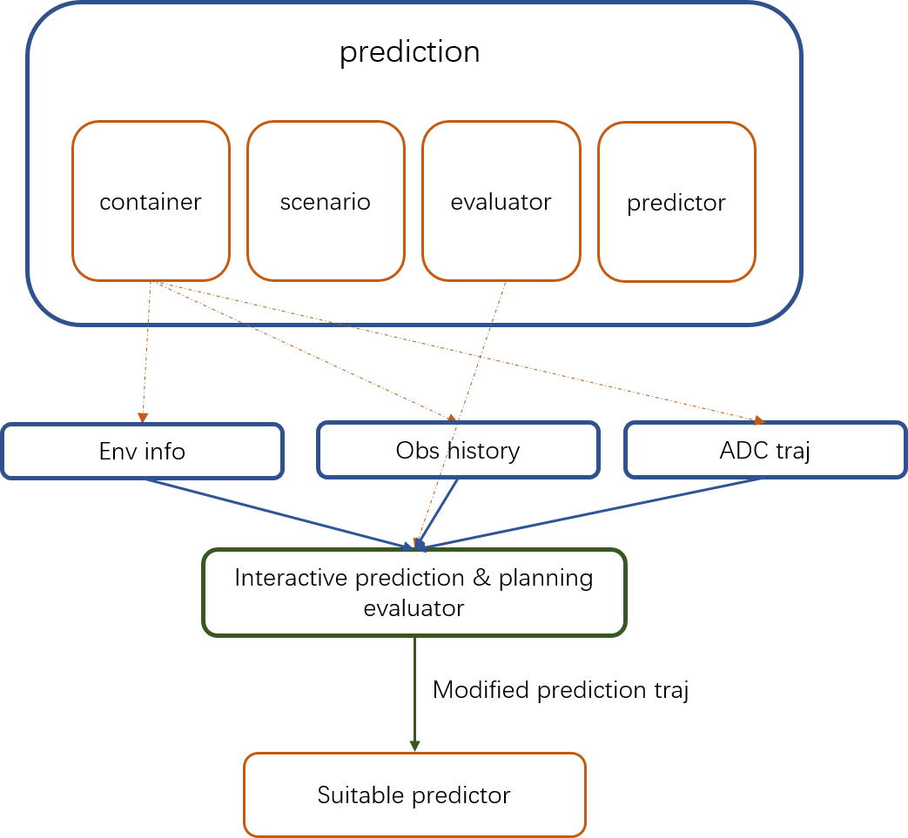

# JOINTLY PREDICTION PLANNING EVALUATOR

# Introduction

The prediction module comprises 4 main functionalities: Container, Scenario, Evaluator and Predictor. 

The Evaluator predicts path and speed separately for any given obstacle. An evaluator evaluates a path by outputting a probability for it (lane sequence) using the given model stored in prediction/data/.

Jointly prediction planning evaluator is used in the new Interactive Obstacle(vehicle-type) model to generate short term trajectory points which are calculated using Vectornet and LSTM. By considering ADC's trajectory info, the obstacle trajectory prediction can be more accurate under interaction scenario.



# Where is the code

Please refer [jointly prediction planning evaluator](https://github.com/ApolloAuto/apollo/tree/master/modules/prediction/evaluator/vehicle).

# Code Reading

## Interaction filter
Please refer [interaction filter](https://github.com/ApolloAuto/apollo/tree/master/modules/prediction/scenario/interaction_filter).
1. The interaction filter is a rule-based filter for selecting interactive obstacles.

2. Such interactive obstacles will be labeled.

    ```cpp 
    void AssignInteractiveTag();
    ```

## Model inference
1. The encoder of jointly prediction planning evaluator is Vectornet, before model inference, we need to process obstacle and map data into the correct format.