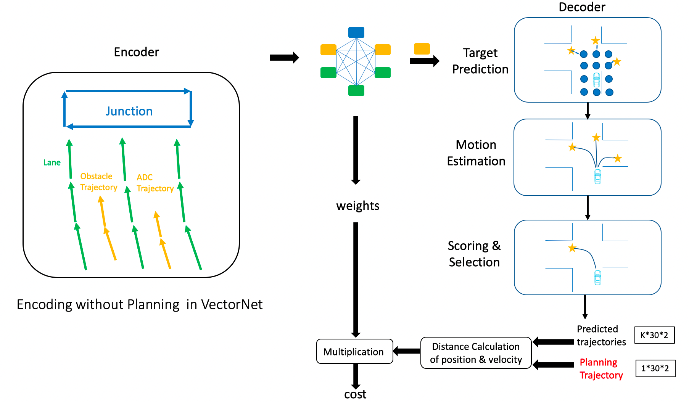

# Inter-TNT (Jointly VectorNet-TNT-Interaction) Evaluator

The prediction module comprises 4 main functionalities: Container, Scenario, Evaluator and Predictor.

An Evaluator predicts trajectories and speeds for surrounding obstacles of autonomous vehicle. An evaluator evaluates a path(lane sequence) with a probability by the given model stored in prediction/data/.

In Apollo 7.0, a new model named Inter-TNT is introduced to generate short-term trajectories. This model applies VectorNet as encoder and TNT as decoder, and latest planning trajectory of autonomous vehicle is used to interact with surrounding obstacles. Compared with the prediction model based on semantic map released in Apollo 6.0, the performance is increased by more than 20% in terms of minADE and minFDE, and the inference time is reduced from 15 ms to 10 ms. 


# Where is the code

Please refer [jointly prediction planning evaluator](https://github.com/ApolloAuto/apollo/tree/master/modules/prediction/evaluator/vehicle).

# Code Reading

## Interaction filter
Please refer [interaction filter](https://github.com/ApolloAuto/apollo/tree/master/modules/prediction/scenario/interaction_filter).
1. The interaction filter is a rule-based filter for selecting interactive obstacles.

2. Such interactive obstacles will be labeled.

    ```cpp
    void AssignInteractiveTag();
    ```

# Network Architecture
The network architecture of the proposed "Inter-TNT" is illustrated as below. The entire network is composed of three modules: an vectorized encoder, a target-driven decoder, and an interaction module. The vectorized trajectories of obstacles and autonomous vehicle (AV), along with HD maps, are first fed into the vectorized encoder to extract features. The target-driven decoder takes the extracted features as input and generate multi-modal trajectories for each obstacle. The main contribution of the proposed network is introducing an interaction mechanism which could measure the interaction between obstacles and autonomous vehicle by re-weighting confidences of multi-modal trajectories. 



## Encoder
Basically, the encoder is mainly using an [VectorNet](https://arxiv.org/abs/2005.04259). 

### Representation
The trajectories of AV all obstacles are represented as polylines in the form of sequential coordinate points. For each polyline, it contains start point, end point, obstacle length and some other attributes of vector. All points are transformed to the AV coordinate with North as the y-axis and (0, 0) as the position for ADC at time 0.

After that, map elements are extracted from HDMap files. As elements of lane/road/junction/crosswalk are depicted in points in HD map, they are conveniently processed as polylines. 

### VectorNet
The polyline features are first extracted from a subgraph network and further fed into a globalgraph network (GCN) to encode contextual information.

## Decoder
Our decoder implementation mainly follows the [TNT](https://arxiv.org/abs/2008.08294) paper. There are three steps in TNT. For more details, please refer to the original paper. 

### Target Prediction
For each obstacle, N points around the AV are uniformly sampled and M points are selected as target points. These target points are considered to be the potential final points of the predicted trajectories.

### Motion Estimation
After selecting the potential target points, M trajectories are generated for each obstacle with its corresponding feature from encoder as input. 

### Scoring and Selection
Finally, a scoring and selection module is performed to generate likelihood scores of the M trajectories for each obstacle, and select a final set of trajectory predictions by likelihood scores. 

## Interaction with Planning Trajectory
After TNT decoder, K predicted trajectories for each obstacle are generated. In order to measure the interaction between AV and obstacles, we calculate the position and velocity differences between the latest planning trajectory and predicted obstacle trajectories. Note that we can also calculate a cost between the ground truth obstacle trajectory and AV planning trajectory, thus producing the true costs. That's how the loss is calculated in this step.

# References
1. Gao, Jiyang, et al. "Vectornet: Encoding hd maps and agent dynamics from vectorized representation." Proceedings of the IEEE/CVF Conference on Computer Vision and Pattern Recognition. 2020.
2. Zhao, Hang, et al. "Tnt: Target-driven trajectory prediction." arXiv preprint arXiv:2008.08294 (2020).
