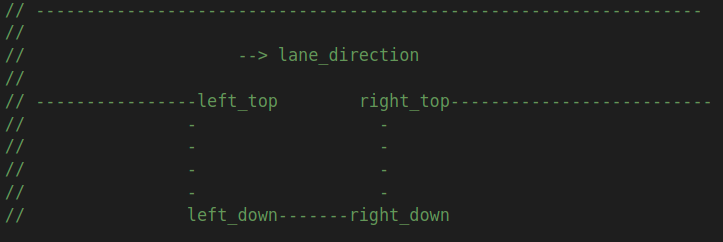
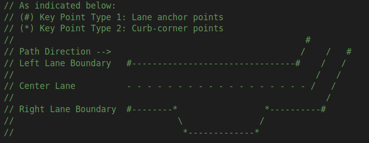

# OPEN SPACE DECIDER

_**Tip**: to read the equations in the document, you are recommended to use Chrome with [a plugin](https://chrome.google.com/webstore/detail/tex-all-the-things/cbimabofgmfdkicghcadidpemeenbffn) or copy the latex equation to [an online editor](http://www.hostmath.com/)_

# Introduction

Apollo planning is a scenario based planning method, each driving use case is treated as a different driving scenario.

open space decider is used to process related infomation and provide information for subsequent optimizers 

# Where is the code

Please refer [open space decider](https://github.com/ApolloAuto/apollo/modules/planning/tasks/deciders/open_space_decider/open_space_roi_decider.cc)

# Code Reading

## Open space roi decider

1. Input : obstacles info \ vehicle info \ road info \ parking space info

  - IN PARKING STAGE (roi_type == OpenSpaceRoiDeciderConfig::PARKING)

    1. Check parking space id and parking space boundary,then get parking spot;
    ```cpp
        bool GetParkingSpot(Frame *const frame,
                            std::array<common::math::Vec2d, 4> *vertices,
                            hdmap::Path *nearby_path);
    ```
    2. Search target parking spot on path and check whether the distance between ADC and target parking spot is appropriate;
    ```cpp
        void SearchTargetParkingSpotOnPath(
            const hdmap::Path &nearby_path,
            hdmap::ParkingSpaceInfoConstPtr *target_parking_spot);
    ``` 
    3. Set ADC origin state,include ADC position and heading;
    ```cpp
        void SetOrigin(Frame *const frame,
                        const std::array<common::math::Vec2d, 4> &vertices);
    ```

    4. Get parking spot(left top \ left down \ right down \ right top) points info, convert parking spot points coordinates to vehicle coorinates, according to the relative position and parking direction(inward or outward) to set parking end pose;

    ```cpp  
        void SetParkingSpotEndPose(
            Frame *const frame, const std::array<common::math::Vec2d, 4> &vertices);
    ```

       

    5. Get parking boundary: convert parking spot points coordinates to vehicle coorinates and get points' projections on reference line;
    
    ```cpp
        bool GetParkingBoundary(Frame *const frame,
                                const std::array<common::math::Vec2d, 4> &vertices,
                                const hdmap::Path &nearby_path,
                                std::vector<std::vector<common::math::Vec2d>>
                                *const roi_parking_boundary);
    ```
    6. Get road boundary: it starts from parking space center line(center_line_s) and extends a distance(roi longitudinal range) to both side along the s direction to get start_s and end_s; search key points(the point on the left/right lane boundary is close to a curb corner) and anchor points(a start/end point or the point on path with large curvatures) in this roi range; those key points, anchor points is called boundary points and the line segements between those points is called roi parking boundary; 
    
    ```cpp
        void GetRoadBoundary(
            const hdmap::Path &nearby_path, const double center_line_s,
            const common::math::Vec2d &origin_point, const double origin_heading,
            std::vector<common::math::Vec2d> *left_lane_boundary,
            std::vector<common::math::Vec2d> *right_lane_boundary,
            std::vector<common::math::Vec2d> *center_lane_boundary_left,
            std::vector<common::math::Vec2d> *center_lane_boundary_right,
            std::vector<double> *center_lane_s_left,
            std::vector<double> *center_lane_s_right,
            std::vector<double> *left_lane_road_width,
            std::vector<double> *right_lane_road_width);
    ```
    

    7. Fuse line segements: remove repeat points of roi parking boundary to meet the requirements of open space algorithm

    ```cpp
        bool FuseLineSegments(
            std::vector<std::vector<common::math::Vec2d>> *line_segments_vec);
    ```
  - IN PULL OVER STAGE (roi_type == OpenSpaceRoiDeciderConfig::PULL_OVER) 

    1. The main process is same as parking stage, get pull over spot -> set origin -> set pull over spot end pose -> get pull over boundary 

    ```cpp 
          void SetPullOverSpotEndPose(Frame *const frame);
    ```

    ```cpp
          bool GetPullOverBoundary(Frame *const frame,
                                    const std::array<common::math::Vec2d, 4> &vertices,
                                    const hdmap::Path &nearby_path,
                                    std::vector<std::vector<common::math::Vec2d>>
                                    *const roi_parking_boundary);  
    ```                                                   
  - IN PARK AND GO STAGE (roi_type == OpenSpaceRoiDeciderConfig::PARK_AND_GO)

    1. The main process is same as parking stage, set orgin from adc -> set park and go end pose -> get park and go boundary 

    ```cpp
          void SetOriginFromADC(Frame *const frame, const hdmap::Path &nearby_path);
    ```

    ```cpp
          void SetParkAndGoEndPose(Frame *const frame);
    ```

    ```cpp
          bool GetParkAndGoBoundary(Frame *const frame, const hdmap::Path &nearby_path,
                                std::vector<std::vector<common::math::Vec2d>>
                                *const roi_parking_boundary);
    ```
2. By calling formulateboundaryconstraints function to gather vertice needed by warm start and distance approach, then transform vertices into the form of Ax > b;

```cpp
    bool FormulateBoundaryConstraints(
        const std::vector<std::vector<common::math::Vec2d>> &roi_parking_boundary,
        Frame *const frame);
```
3. Return process status;

4. Output: open space roi boundary and boundary constraints 

## Open space pre stop decider

1. Input: obstacles info \ vehicle info \ road info \ parking space info

  - IN PARKING STAGE (OpenSpacePreStopDeciderConfig::PARKING)
    1. Check parking space info(parking spot id and parking spot points), fill those info into target_parking_spot_ptr; take the s info of parking space center line as target_s;

    ```cpp
        bool CheckParkingSpotPreStop(Frame* const frame,
                                    ReferenceLineInfo* const reference_line_info,
                                    double* target_s);
    ```
    2. Base on ADC position, stop distance to target parking space and obstacle positon to set stop fence
      
    ```cpp
        void SetParkingSpotStopFence(const double target_s, Frame* const frame,
                                    ReferenceLineInfo* const reference_line_info);
    ```
  - IN PULL OVER STAGE (OpenSpacePreStopDeciderConfig::PULL_OVER)
    1. Same with parking stage, check pull over pre stop -> set pull over stop fence

    ```cpp
        bool CheckPullOverPreStop(Frame* const frame,
                                  ReferenceLineInfo* const reference_line_info,
                                  double* target_s);
    ```

  ```cpp
        void SetPullOverStopFence(const double target_s, Frame* const frame,
                                ReferenceLineInfo* const reference_line_info);
  ```
2. Return process status

3. Output: pre stop fence for open space planner

## Open space fallback decider 
1. Input: obstacles info \ vehicle info \ road info \ parking space info

2. Based on the prdicted trajectory of obstacles, the bounding box info of obstacles in each time interval is obtained,then add into predicted_bounding_rectangles
```cpp
    void BuildPredictedEnvironment(const std::vector<const Obstacle*>& obstacles,
                                   std::vector<std::vector<common::math::Box2d>>&
                                   predicted_bounding_rectangles);
```
3. Calling IsCollisonFreeTrajectory function to determine whether it will intersect with obstacles;
```cpp
    bool IsCollisionFreeTrajectory(
        const TrajGearPair& trajectory_pb,
        const std::vector<std::vector<common::math::Box2d>>&
        predicted_bounding_rectangles,
        size_t* current_idx, size_t* first_collision_idx);
```
4. If ADC trajectroy is collision free, the chosen partitioned trajectory can be used directly, else a fallback trajectroy base on current partition trajectroy will be gererated;
The fallback trajectory leads ADC stop inside safety distance;

5. Return process status    

6. Output: fallback trajectory