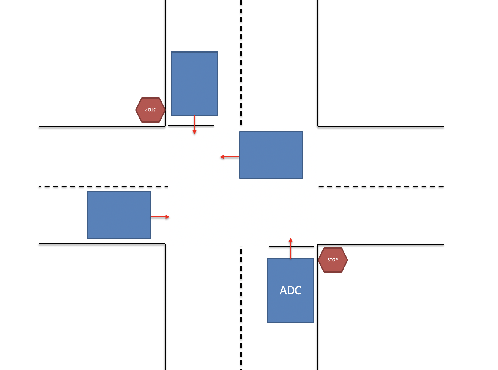

# Planning

## Introduction

The previous versions of Apollo, including Apollo 3.0 currently use the same configuration and parameters to plan different driving scenarios. This approach although linear and easy to implement, was not flexible or scenario specific. As Apollo matures and takes on different road conditions and driving use cases, we felt the need to move to a more modular, scenario specific and wholistic approach for planning its trajectory. In this approach, each driving use case is treated as a different driving scenario. This is useful because an issue now reported in a particular scenario can be fixed without affecting the working of other scenarios as opposed to the previous versions, wherein an issue fix affected other driving use cases as they were all treated as a single driving scenario.

## Driving Scenarios

There are 3 main driving scenarios that we will focus on, namely:

### Lane Follow - Default

As seen in the figure below, the lane-follow scenario, our default driving scenario, includes but is not limited to driving in a single lane (like cruising) or changing lane, following basic traffic convention or basic turning.

   

```
Note: Side Pass
While the functionality of side pass still exists, it has now been made universal rather than limiting it to a type of scenario. The side-pass feature is incorporated as part of the path-bounds decider task. You can choose to turn it on or off by properly configuring the path-lane-borrow decider task. For example, if you want the vehicle to be agile, then turn side-pass on for all scenarios; if you feel it not safe to side-pass in intersections, then turn it off for those related scenarios.
```

### Intersection 

#### STOP Sign

There are two separate driving scenarios for STOP signs:

- Unprotected: In this scenario, the car is expected to navigate through a crossroad having a two-way STOP. Our ADC therefore has to creep through and gauge the crossroad's traffic density before continuing onto its path.

     


- Protected: In this scenario, the car is expected to navigate through a crossroad having a four-way STOP. Our ADC will have to gauge the cars that come to a STOP before it and understand its position in the queue before moving.

    


In order to safely pass through a STOP sign, both protected and unprotected, the following steps are performed:

- Arriving at the STOP sign: Perceive all other cars or obstacles that are currently waiting at the other stop signs
- Come to a complete stop: Monitor to see if the cars that were previously stationary at other STOP signs have moved or not. It is essential that the cars that arrived before have all left
- Move forward slightly (Creep): Check to see if any other car is moving or in the case of unprotected stop, check to see if there are any oncoming vehicles on either side of the lane
- Safely move through the crossroad

```
Note: The team is working to add additional driving scenarios into our planner. One such example is handling Traffic Lights.
```

#### Traffic Light

In order to safely and smoothly through a traffic light, we created three scenarios  

- Protected
- Unprotected Left
- Unprotected Right

In a traffic light scenario, the following steps are performed:

- Stop/Approach: if a stop is required, ADV stops in front of traffic light stop line
- Move forward slightly (Creep): Check to see if any other car is moving or in the case of unprotected stop, check to see if there are any oncoming vehicles on either side of the lane
- Safely move through the intersection

#### Bare Intersection

Bare intersection is an scenario to handle intersection without traffic lights or stop sign. In this scenario, the following steps are performed:

- Approach: reach the intersection 
- Move forward slightly (Creep): Check to see if any other car is moving or in the case of unprotected stop, check to see if there are any oncoming vehicles on either side of the lane
- Safely move through the intersection

### Park

- Pull Over
- Valet

## Planning Module Architecture

The architecture of the planning module has changed in Apollo 3.5 to reflect our modular approach towards different driving scenarios.
As seen in the figure below, in the planner, are individual driving scenarios discussed above along with their handlers.
Each driving scenario has its set of driving parameters that are unique to that scenario making it safer, efficient, easier to customize and debug and more flexible. Each stage is also configurable as it is divided into tasks and each task can be moved or created by editing the `config` file of that scenario.

Some of the key features include:

- **Apollo FSM**: A finite state machine that determines the vehicle state given its location and routing together with HD Map.
- **Planning Dispatcher**: Call an appropriate planner given the vehicle's state and some other relevant information
- **Planner**: Obtain the required context data and other information, decide a corresponding vehicle intention, execute the required planning tasks for this intention and generate the planning trajectory. It will also update the context for future jobs.
- **Deciders & Optimizers**: A set of stateless libraries that implement decision tasks and various optimizations. Optimizers specifically optimize the vehicle's trajectory and speed. Deciders are rule-based decision makers that advise on when to change lane, when to stop, creep or when the creep is complete.
- **Yellow box**: These boxes are included for future scenarios and/or developers to contribute their own scenarios based on real-world driving use cases

```
Note:
If you wish to include your own driving scenarios, please refer to existing scenarios as a reference. We currently do not have a template for writing your own planning scenario.
```


